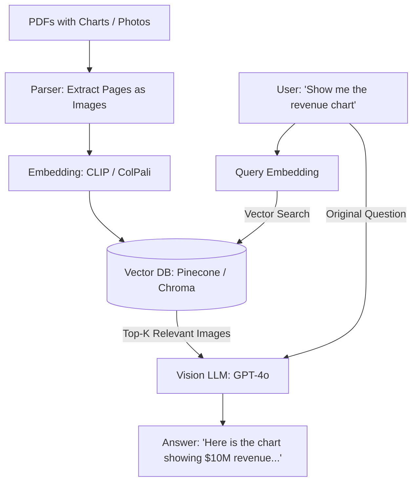

# 🔍 Multimodal RAG: Searching Beyond Text
> **Level:** Advanced | **Language:** Hinglish | **Goal:** Images, videos, aur PDFs ko include karne wale Retrieval-Augmented Generation ke architecture ko master karein, Multimodal Embeddings, Images ke liye Vector Search, aur 2026 mein "Visual Knowledge Bases" banane ki strategies ko explore karein.

---

## 🧭 1. Beginner-Friendly Hinglish Explanation
RAG ka matlab hota hai: "Pehle search karo, phir answer do." 

- **The Problem:** Purana RAG sirf "Text" files (.txt, .docx) mein search karta tha. Par asli duniya mein, knowledge **Images** (Charts, Screenshots) aur **Videos** (Meeting recordings) mein hoti hai.
- **Multimodal RAG** ka matlab hai ek aisa system jo:
  1. Aapke sawaal ko samjhe.
  2. Aapki purani **Photos** aur **PDFs** mein se sahi "Screenshot" ya "Page" dhoond kar laye.
  3. Us image ko "Dekh" kar aapko jawaab de.

*Example:* Aap puchte hain: *"Mera pichle mahine ka light bill kitna tha?"* 
AI aapki "Gallery" mein se light bill ki photo dhoondta hai, use read karta hai, aur bolta hai: *"Aapka bill ₹2500 tha."*

---

## 🧠 2. Deep Technical Explanation
Multimodal RAG ko **Multimodal Vector Databases** ka use karke implement kiya jata hai.

### 1. The Multi-Vector Approach:
- **Strategy A (Text Summaries):** Aap ek AI ka use karke apne database ki har ek image ko text mein "Describe" kar lete hain. Fir aap us text ko search karte hain. (Ye simple hai par isme visual details lose ho jati hain).
- **Strategy B (Multimodal Embeddings):** Aap **CLIP** ya **ColPali** ka use karke images ko directly vectors mein convert karte hain.
  - Jab user koi sawaal puchta hai, toh aap us *Question* ko vector mein convert karte hain aur shared space mein uske sabse "Closest" *Image* ko dhoondte hain.

### 2. PDF Parsing (The 2026 Standard):
- PDF se sirf text extract karne ke bajaye, hum har page ko ek **Image** ki tarah treat karte hain.
- Hum **ColPali** (jo ki ek naya model hai) ka use karte hain jo page ke "Visual Layout" ko index kar sakta hai. Ise pata hota hai ki top-right mein bana "Chart" important hai.

### 3. The Retrieval Flow:
1. **Indexing:** Images/PDFs/Video-frames ko vectors mein convert karna aur **Pinecone/Milvus/Chroma** jaise databases mein store karna.
2. **Retrieval:** Top-K sabse relevant images/chunks ko search karna.
3. **Reasoning (VLM):** Original question + retrieved images ko ek Multimodal LLM (jaise GPT-4o ya LLaVA) ko pass karna taaki final answer generate kiya ja sake.

---

## 🏗️ 3. Text RAG vs. Multimodal RAG
| Feature | Text-Only RAG | Multimodal RAG |
| :--- | :--- | :--- |
| **Data Source** | .pdf (text), .txt | .png, .jpg, .mp4, Charts |
| **Embedding Model**| `text-embedding-3-small` | **CLIP / ColPali / ImageBind** |
| **Retrieval Output** | Text snippets | **Image crops / Page snapshots** |
| **LLM Requirement** | Standard LLM (GPT-4) | **Vision-LLM (GPT-4o / LLaVA)** |
| **Complexity** | Moderate | **High** |

---

## 📐 4. Mathematical Intuition
- **The Cross-Modal Similarity:** 
  $$\text{Score} = \text{CosineSimilarity}(\text{QueryVector}, \text{ImageVector})$$
  Kyuki dono vectors same $D$-dimensional space (jaise CLIP ke liye 768 dims) mein hote hain, isliye math bilkul text-search ki tarah hi same hota hai. Sabse hard part model training ke dauran **Alignment** ka hota hai.

---

## 📊 5. Multimodal RAG Pipeline (Diagram)

```mermaid
graph TD
    Data[PDFs with Charts / Photos] --> Parse[Parser: Extract Pages as Images]
    Parse --> Embed[Embedding: CLIP / ColPali]
    Embed --> VDB[(Vector DB: Pinecone / Chroma)]
    
    User[User: 'Show me the revenue chart'] --> Q_Embed[Query Embedding]
    Q_Embed -- "Vector Search" --> VDB
    VDB -- "Top-K Relevant Images" --> VLM[Vision LLM: GPT-4o]
    
    User -- "Original Question" --> VLM
    VLM --> Answer[Answer: 'Here is the chart showing $10M revenue...']
```

---

## 💻 6. Production-Ready Examples (Implementing Multimodal Search with CLIP)
```python
# 2026 Pro-Tip: Store images and their embeddings in a vector database.

import clip
import torch
from PIL import Image

# 1. Load CLIP
model, preprocess = clip.load("ViT-B/32", device="cuda")

# 2. Indexing: Convert image to vector
image = preprocess(Image.open("product_catalog.jpg")).unsqueeze(0).to("cuda")
with torch.no_grad():
    image_features = model.encode_image(image)

# 3. Retrieval: Convert text query to vector
text = clip.tokenize(["a photo of a blue shirt"]).to("cuda")
with torch.no_grad():
    text_features = model.encode_text(text)

# 4. Search
# In a real app, you would use 'Pinecone' or 'Milvus' to find the closest image_features
similarity = torch.cosine_similarity(text_features, image_features)
print(f"Match Score: {similarity.item():.4f}")
```

---

## ❌ 7. Failure Cases
- **Small Text in Images:** CLIP kisi complex Excel screenshot ke andar ke small numbers ko nahi padh pata. **Fix: Visual RAG ke sath-sath 'OCR-based RAG' bhi use karein.**
- **Over-reliance on Text:** Agar aapke database mein "Sunset" ki 1 million images hain aur aap "Peace" search karte hain, toh model aapko sunset dikha sakta hai bhale hi aap "Quiet Library" chahte hon.
- **Context Window Limit:** Aap ek sath 20 high-res images ko VLM mein nahi bhej sakte. Ye crash ho jayega ya bahut slow ho jayega. **Fix: Best 3 ko filter karne ke liye 'Image Summaries' ka use karein.**

---

## 🛠️ 8. Debugging Guide
- **Symptom:** "Search irrelevant photos return kar raha hai."
- **Check:** **Embedding Model**. CLIP "General" photos ke liye toh badhiya hai par "Technical Schematics" ke liye kharab hai. Apne specific domain (jaise Medical images) par CLIP ko fine-tune karne par vichar karein.
- **Symptom:** "VLM retrieved image ke baare mein jhoothe facts (hallucinations) bol raha hai."
- **Check:** **Prompting**. Kya aap "Describe this image" puch rahe hain ya fir "Answer based ONLY on the text visible in this image"? Prompt mein strict rahein.

---

## ⚖️ 9. Tradeoffs
- **Full Image vs. Cropped Objects:** 
  - Poori image ko index karna sasta hota hai.
  - Image ke andar ke har ek object ko index karna (Segment-Anything ka use karke) zyada accurate hai par $100x$ zyada expensive hai.
- **Local vs. Cloud VDB:** Cloud par images ko move karne ki latency.

---

## 🛡️ 10. Security Concerns
- **Visual Data Leak:** Koi employee "Confidential Docs" search karta hai aur RAG system kisi secret project ka screenshot retrieve kar leta hai. **Iske liye apne Vector DB mein 'Access Control Lists' (ACLs) implement karein.**

---

## 📈 11. Scaling Challenges
- **Video RAG:** 1000 ghante ke video ko index karna. Aapko frames ko "Sample" karna padta hai (jaise 1 frame per second), jiska matlab hai ki aap koi 0.5s ka event miss kar sakte hain. **Solution: 'Event-based Sampling' ka use karein.**

---

## 💸 12. Cost Considerations
- **Vision-Token Bill:** Retrieved images ko GPT-4o par bhejne mein tokens consume hote hain. **Strategy: Expensive LLM par bhejne se pehle retrieved images ko (kisi saste local model ka use karke) 'Markdown tables' in convert kar lein.**

---

## ✅ 13. Best Practices
- **Hybrid Search:** **Text Embeddings + Visual Embeddings + Metadata (Date/Location)** ka ek sath use karke search karein.
- **Multimodal Chunking:** Fixed size text blocks ke bajaye, "Logical Sections" (jaise Page 1, Page 2, Chart 1) ke hisab se chunking karein.
- **Use 'ColPali':** 2026 ke hisab se, ye PDF RAG ke liye state-of-the-art hai kyuki ye layout ko samajhta hai.

---

## ⚠️ 14. Common Mistakes
- **Assuming 'Text Extraction' is enough:** Ye sochna ki `PyPDF` kisi aise PDF ko handle kar lega jo actual mein scanned images ka collection hai (jisme selectable text nahi hota). Hamesha ek **OCR** fallback rakhein.
- **Ignoring Image Quality:** Blurry ya low-resolution thumbnails ko index karna.

---

## 📝 15. Interview Questions
1. **"Multimodal RAG mein 'Multi-Vector' approach kya hoti hai?"**
2. **"ColPali standard CLIP-based retrieval se kaise different hai?"**
3. **"Ek 'Video Search' engine banane ki pipeline explain karein."**

---

## 🚀 16. Latest 2026 Industry Patterns
- **Audio-native RAG:** Natural language ka use karke "Podcasts" aur "Voice Memos" mein search karna.
- **AR RAG:** Smart glasses pehanna jo aapke samne ke objects ko "Recognize" karein aur real-time mein aapke private knowledge base se "Manuals" ya "Prices" retrieve karein.
- **Unified Embedding Models (ImageBind):** Text, Image, Audio, Depth, Thermal, aur IMU data ke liye ek hi single vector space.
