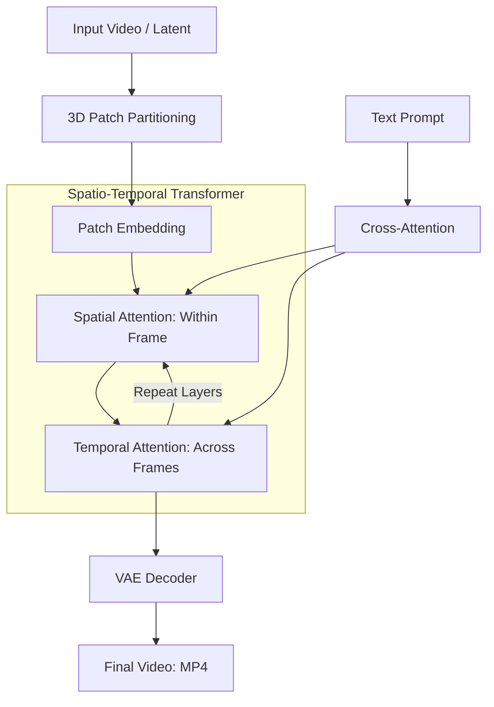

# 🎬 Video Generation: Sora & The Future of Cinema
> **Level:** Extreme Advanced | **Language:** Hinglish | **Goal:** Master the technology behind AI video, exploring Spatio-Temporal Transformers, Diffusion Transformers (DiT), Sora's architecture, and the 2026 strategies for building "Physics-Consistent" video generation.

---

## 🧭 1. Beginner-Friendly Hinglish Explanation
AI "Photo" banana toh seekh gaya, par "Video" banana 100x mushkil hai.

- **The Problem:** Video sirf images ka "Siddh" (Sequence) nahi hai. 
  - Agar ek image mein ek aadmi "Seb" (Apple) kha raha hai, toh agli image mein seb thoda "Chota" hona chahiye. 
  - Isse hum **Temporal Consistency** kehte hain—yani waqt ke saath cheezein logic ke hisaab se badalni chahiye.
- **Sora (by OpenAI)** aur naye models ne ye kaise solve kiya? 
  - Unhone video ko "Small Patches" (Tukdon) mein toda. 
  - Wo sirf pixels nahi samajhte, wo **"Physics"** samajhne ki koshish karte hain (e.g., paani niche hi girega, gravity kaam karegi).

2026 mein, hum pura "Movie Scene" sirf ek line likh kar bana sakte hain: *"Ek futuristic city mein baarish ho rahi hai aur neon lights sadak par chamak rahi hain."*

---

## 🧠 2. Deep Technical Explanation
Modern video generation has moved from simple UNets to **Diffusion Transformers (DiT).**

### 1. Spatio-Temporal Patches:
- Instead of 2D image patches, Sora uses **3D Patches** (Space + Time).
- A video is treated as a collection of "Spacetime Latent Patches." This allows the model to handle videos of any resolution, duration, or aspect ratio.

### 2. Diffusion Transformers (DiT):
- Combining the power of **Diffusion** (Noise removal) with **Transformers** (Scalability). 
- Transformers are better at handling long-range dependencies—meaning the model remembers what happened at the start of the video.

### 3. World Simulators:
- Video models are starting to act as "Physics Engines." They don't just "Draw" pixels; they simulate how light reflects off a wet surface or how a person walks.

### 4. Video-to-Video & Editing:
- Giving a "Reference Video" and asking the AI to:
  - Change the "Season" (Summer to Winter).
  - Change the "Character" (Human to Robot).
  - Extend the video (Video Outpainting).

---

## 🏗️ 3. Image vs. Video Generation
| Feature | Image Generation (SD) | Video Generation (Sora/Luma/Kling) |
| :--- | :--- | :--- |
| **Dimensions** | 2D (Height, Width) | **3D (Height, Width, Time)** |
| **Tokens** | ~500 Visual Tokens | **10,000+ Visual Tokens** |
| **Consistency** | Visual only | **Spatio-Temporal (Physics)** |
| **GPU Req.** | 1x Consumer GPU | **Multi-GPU Clusters (A100/H100)** |
| **Inference Time**| 1-5 seconds | **2-10 minutes** |

---

## 📐 4. Mathematical Intuition
- **The Attention Bottleneck:** 
  In a video, the attention complexity grows quadratically with the number of frames ($F$) and patches ($P$).
  $$\text{Complexity} = O((F \times P)^2)$$
  - This is why generating a 1-minute video is so expensive. 
  - **The 2026 Strategy:** Using **FlashAttention-3** and **Ring Attention** to spread the computation across multiple GPUs.

---

## 📊 5. Video Diffusion Transformer Architecture (Diagram)


---

## 💻 6. Production-Ready Examples (Using Video Generation API in 2026)
```python
# 2026 Pro-Tip: Video generation is usually 'Async'. You poll for the result.

import time
from ai_video_provider import VideoClient

client = VideoClient(api_key="your_key")

# 1. Start the video generation job
# prompt: The scene description
# duration: in seconds
# motion_bucket_id: How much movement do you want? (1-255)
job = client.generate_video(
    prompt="A drone shot of an ancient castle in the Himalayas, clouds moving fast",
    duration=5,
    resolution="1080p"
)

print(f"Job started: {job.id}")

# 2. Poll for completion
while job.status != "COMPLETED":
    print("Generating frames... 🎥")
    time.sleep(10)
    job = client.get_job_status(job.id)

# 3. Download
print(f"Video ready at: {job.video_url}")
```

---

## ❌ 7. Failure Cases
- **The 'Spaghetti' Problem:** Objects morphing into each other (e.g., a hand turning into a table).
- **Physics Violations:** A person walking through a wall or a ball bouncing upwards forever.
- **Temporal Flickering:** The colors or the background "Glitch" between frames.
- **Action Inconsistency:** A character starts running but suddenly "Teleports" to a different spot.

---

## 🛠️ 8. Debugging Guide
- **Symptom:** "Video is blurry and lacks detail."
- **Check:** **Encoding Resolution**. Many open-source models (like SVD) are trained at $512 \times 512$. Generating at $1024$ without a specific high-res model will cause blurriness.
- **Symptom:** "Objects are moving too fast/slow."
- **Check:** **Motion Bucket ID / FPS**. Ensure your frame rate matches the movement logic.

---

## ⚖️ 9. Tradeoffs
- **Realism vs. Creativity:** 
  - Sora is hyper-realistic. 
  - Stable Video Diffusion is more "Artistic" but less physically correct.
- **Autoregressive (Frame by Frame) vs. Non-autoregressive (All at once):** 
  - Frame-by-frame can be longer but loses consistency. 
  - All-at-once is consistent but limited to 5-10 seconds.

---

## 🛡️ 10. Security Concerns
- **Fake Evidence:** Creating videos of political leaders saying things they never said. **2026 Requirement: Mandatory 'C2PA Metadata' that proves the video is AI-generated.**

---

## 📈 11. Scaling Challenges
- **Data Scarcity:** To train Sora, you need millions of hours of **High-quality, Descriptive** video data. Most internet video is "Low quality" (TikToks/Vlogs). **Solution: Use 'Synthetic Video Data' from game engines like Unreal Engine 5.**

---

## 💸 12. Cost Considerations
- **The 'Expensive Token':** A 10-second video can cost **$\$1 - \$5$** to generate. This is not for "Casual Chatting"; it's for Professional Media Production.

---

## ✅ 13. Best Practices
- **Use 'Multi-stage' Generation:** 
  1. Generate a high-quality Image first. 
  2. Use that image as the "First Frame" (Image-to-Video). This is much more stable than pure Text-to-Video.
- **Negative Prompts for Video:** "Flickering, morphing, low resolution, shaky camera."
- **Sound Design:** Always add AI-generated Foley/Sound effects separately (using models like **AudioLDM**) to make the video feel "Real."

---

## ⚠️ 14. Common Mistakes
- **Expecting long-form movies in one shot:** AI is currently good for 5-10 second "Shots." You must "Edit" them together to make a movie.
- **Ignoring the 'Aspect Ratio':** Forcing a 16:9 prompt into a 9:16 vertical format.

---

## 📝 15. Interview Questions
1. **"What are 'Spacetime Patches' and why are they better than 2D patches for video?"**
2. **"How does a Diffusion Transformer (DiT) maintain temporal consistency?"**
3. **"Explain the challenges of 'Physics Simulation' in AI video models."**

---

## 🚀 15. Latest 2026 Industry Patterns
- **Interactive Cinema:** Video games where every "Frame" is generated by AI in real-time based on the player's choices.
- **Personalized Movies:** An AI that generates a movie where the "Main Character" looks exactly like you.
- **Infinite Zoom / Outpainting:** Videos that keep "Expanding" forever into a larger and larger world.
