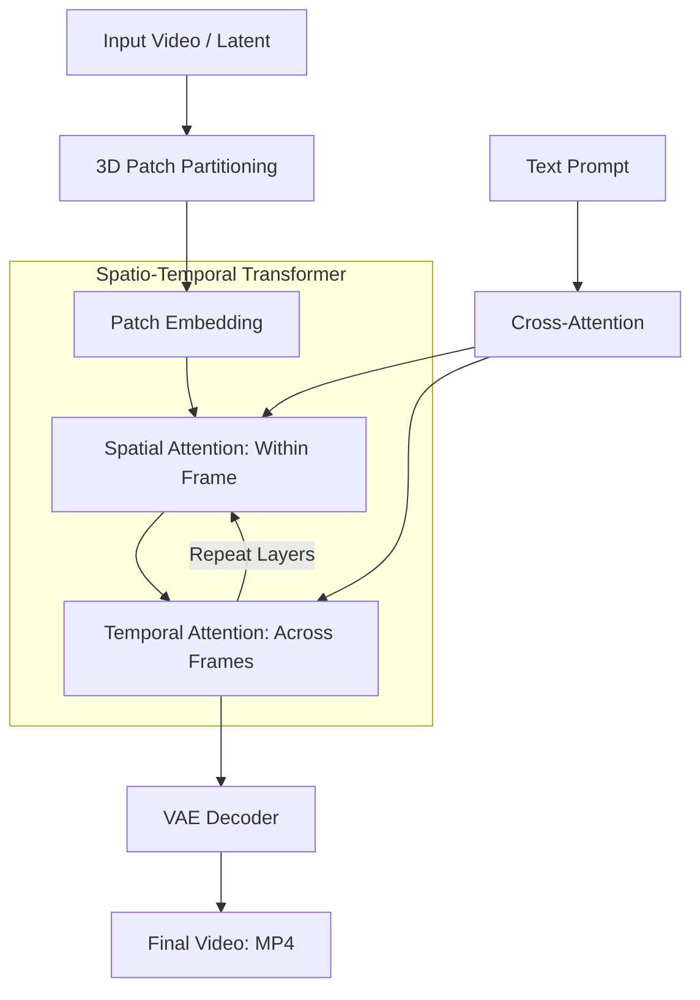

# 🎬 Video Generation: Sora & The Future of Cinema
> **Level:** Extreme Advanced | **Language:** Hinglish | **Goal:** AI video ke peeche ki technology ko master karein, Spatio-Temporal Transformers, Diffusion Transformers (DiT), Sora ke architecture, aur 2026 mein "Physics-Consistent" video generation banane ki strategies ko explore karein.

---

## 🧭 1. Beginner-Friendly Hinglish Explanation
AI "Photo" banana toh seekh gaya, par "Video" banana 100x mushkil hai.

- **The Problem:** Video sirf images ka "Siddh" (Sequence) nahi hai. 
  - Agar ek image mein ek aadmi "Seb" (Apple) kha raha hai, toh agli image mein seb thoda "Chota" hona chahiye. 
  - Isse hum **Temporal Consistency** kehte hain—yani waqt ke saath cheezein logic ke hisaab se badalni chahiye.
- **Sora (by OpenAI)** aur naye models ne ye kaise solve kiya? 
  - Unhone video ko "Small Patches" (Tukdon) mein toda. 
  - Wo sirf pixels nahi samajhte, wo **"Physics"** samajhne ki koshish karte hain (e.g., paani niche hi girega, gravity kaam karegi).

2026 mein, hum pura "Movie Scene" sirf ek line likh kar bana sakte hain: *"Ek futuristic city mein baarish ho rahi hai aur neon lights sadak par chamak rahi hain."*

---

## 🧠 2. Deep Technical Explanation
Modern video generation ab simple UNets se **Diffusion Transformers (DiT)** par shift ho gaya hai.

### 1. Spatio-Temporal Patches:
- 2D image patches ke bajaye, Sora **3D Patches** (Space + Time) ka use karta hai.
- Ek video ko "Spacetime Latent Patches" ke collection ke roop mein treat kiya jata hai. Isse model kisi bhi resolution, duration, ya aspect ratio ke videos ko handle kar pata hai.

### 2. Diffusion Transformers (DiT):
- **Diffusion** (Noise removal) ki power ko **Transformers** (Scalability) ke sath combine karna.
- Transformers long-range dependencies ko handle karne mein zyada behtar hote hain—iska matlab hai ki model ko yaad rehta hai ki video ke start mein kya hua tha.

### 3. World Simulators:
- Video models ab "Physics Engines" ki tarah act karne lage hain. Ye sirf pixels ko "Draw" nahi karte; ye simulate karte hain ki light kisi wet surface se kaise reflect hogi ya koi insaan kaise chalega.

### 4. Video-to-Video & Editing:
- Ek "Reference Video" dena aur AI se kahna ki:
  - "Season" change kare (Garmi se Sardi).
  - "Character" change kare (Insaan se Robot).
  - Video ko extend kare (Video Outpainting).

---

## 🏗️ 3. Image vs. Video Generation
| Feature | Image Generation (SD) | Video Generation (Sora/Luma/Kling) |
| :--- | :--- | :--- |
| **Dimensions** | 2D (Height, Width) | **3D (Height, Width, Time)** |
| **Tokens** | ~500 Visual Tokens | **10,000+ Visual Tokens** |
| **Consistency** | Visual only | **Spatio-Temporal (Physics)** |
| **GPU Req.** | 1x Consumer GPU | **Multi-GPU Clusters (A100/H100)** |
| **Inference Time**| 1-5 seconds | **2-10 minutes** |

---

## 📐 4. Mathematical Intuition
- **The Attention Bottleneck:** 
  Ek video mein, attention complexity frames ($F$) aur patches ($P$) ke number ke sath quadratically grow karti hai.
  $$\text{Complexity} = O((F \times P)^2)$$
  - Yahi wajah hai ki 1-minute ka video generate karna itna expensive hota hai.
  - **The 2026 Strategy:** Computation ko multiple GPUs par spread karne ke liye **FlashAttention-3** aur **Ring Attention** ka use karna.

---

## 📊 5. Video Diffusion Transformer Architecture (Diagram)

```mermaid
graph TD
    V[Input Video / Latent] --> P[3D Patch Partitioning]
    P --> E[Patch Embedding]
    
    subgraph "Spatio-Temporal Transformer"
    E --> SA[Spatial Attention: Within Frame]
    SA --> TA[Temporal Attention: Across Frames]
    TA -- "Repeat Layers" --> SA
    end
    
    Prompt[Text Prompt] --> Cross[Cross-Attention]
    Cross --> SA & TA
    
    TA --> Decoder[VAE Decoder]
    Decoder --> Final[Final Video: MP4]
```

---

## 💻 6. Production-Ready Examples (Using Video Generation API in 2026)
```python
# 2026 Pro-Tip: Video generation is usually 'Async'. You poll for the result.

import time
from ai_video_provider import VideoClient

client = VideoClient(api_key="your_key")

# 1. Start the video generation job
# prompt: The scene description
# duration: in seconds
# motion_bucket_id: How much movement do you want? (1-255)
job = client.generate_video(
    prompt="A drone shot of an ancient castle in the Himalayas, clouds moving fast",
    duration=5,
    resolution="1080p"
)

print(f"Job started: {job.id}")

# 2. Poll for completion
while job.status != "COMPLETED":
    print("Generating frames... 🎥")
    time.sleep(10)
    job = client.get_job_status(job.id)

# 3. Download
print(f"Video ready at: {job.video_url}")
```

---

## ❌ 7. Failure Cases
- **The 'Spaghetti' Problem:** Objects ka aapas mein morph (mix) ho jana (jaise ek haath ka table mein badal jana).
- **Physics Violations:** Kisi insaan ka wall ke aar-paar chalna ya kisi ball ka hamesha ke liye upar bounce hote rehna.
- **Temporal Flickering:** Frames ke beech colors ya background ka "Glitch" (flicker) hona.
- **Action Inconsistency:** Koi character bhaagna start karta hai par suddenly kisi doosri jagah "Teleport" ho jata hai.

---

## 🛠️ 8. Debugging Guide
- **Symptom:** "Video blurry hai aur usme details ki kami hai."
- **Check:** **Encoding Resolution**. Bahut sare open-source models (jaise SVD) $512 \times 512$ par trained hote hain. Bina kisi specific high-res model ke $1024$ par generate karne se blurriness aayegi.
- **Symptom:** "Objects bahut fast/slow move kar rahe hain."
- **Check:** **Motion Bucket ID / FPS**. Ensure karein ki aapka frame rate movement logic se match karta ho.

---

## ⚖️ 9. Tradeoffs
- **Realism vs. Creativity:** 
  - Sora hyper-realistic hai.
  - Stable Video Diffusion zyada "Artistic" hai par physically utna correct nahi hai.
- **Autoregressive (Frame by Frame) vs. Non-autoregressive (All at once):** 
  - Frame-by-frame se video lamba ho sakta hai par consistency lose ho sakti hai.
  - All-at-once consistent hota hai par sirf 5-10 seconds tak hi limited hota hai.

---

## 🛡️ 10. Security Concerns
- **Fake Evidence:** Political leaders ke aise videos banana jisme wo aisi baatein bol rahe hain jo unhone kabhi nahi kahin. **2026 Requirement: Mandatory 'C2PA Metadata' jo ye prove kare ki video AI-generated hai.**

---

## 📈 11. Scaling Challenges
- **Data Scarcity:** Sora ko train karne ke liye aapko millions of hours ke **High-quality, Descriptive** video data ki zaroorat hoti hai. Internet par zyada tar video data "Low quality" (TikToks/Vlogs) hota hai. **Solution: Unreal Engine 5 jaise game engines se 'Synthetic Video Data' ka use karein.**

---

## 💸 12. Cost Considerations
- **The 'Expensive Token':** Ek 10-second ka video generate karne mein **$\$1 - \$5$** tak ki cost aa sakti hai. Ye "Casual Chatting" ke liye nahi hai; ye Professional Media Production ke liye hai.

---

## ✅ 13. Best Practices
- **Use 'Multi-stage' Generation:** 
  1. Pehle ek high-quality Image generate karein.
  2. Us image ko "First Frame" (Image-to-Video) ki tarah use karein. Ye pure Text-to-Video ke mukable bahut zyada stable hota hai.
- **Negative Prompts for Video:** "Flickering, morphing, low resolution, shaky camera."
- **Sound Design:** Video ko "Real" feel dene ke liye AI-generated Foley/Sound effects ko alag se (jaise **AudioLDM** models ka use karke) add karein.

---

## ⚠️ 14. Common Mistakes
- **Expecting long-form movies in one shot:** AI abhi ke liye sirf 5-10 second ke "Shots" ke liye hi achha hai. Movie banane ke liye aapko unhe aapas mein "Edit" karna padega.
- **Ignoring the 'Aspect Ratio':** 16:9 prompt ko zabardasti 9:16 vertical format mein force karna.

---

## 📝 15. Interview Questions
1. **"What are 'Spacetime Patches' and why are they better than 2D patches for video?"**
2. **"Diffusion Transformer (DiT) temporal consistency ko kaise maintain karta hai?"**
3. **"AI video models mein 'Physics Simulation' ke challenges ko explain karein."**

---

## 🚀 16. Latest 2026 Industry Patterns
- **Interactive Cinema:** Aise video games jahan player ke choices ke basis par har ek "Frame" real-time mein AI dwara generate hota hai.
- **Personalized Movies:** Aisa AI jo ek movie generate karta hai jahan "Main Character" bilkul aapki tarah dikhta hai.
- **Infinite Zoom / Outpainting:** Aise videos jo bade se bade world mein hamesha ke liye "Expand" (zoom out) hote rehte hain.
