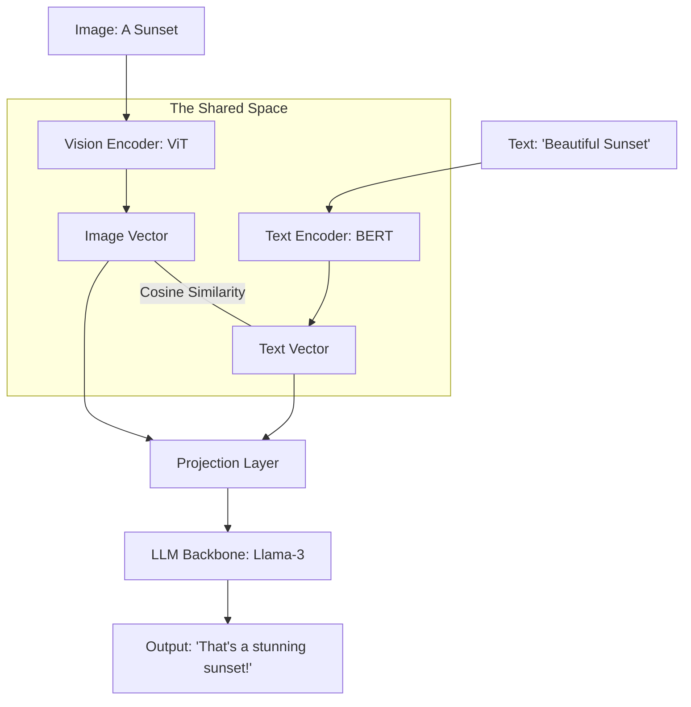

# 🌈 What is Multimodal AI? The Multi-Sensory Intelligence
> **Level:** Intermediate | **Language:** Hinglish | **Goal:** Master the concepts behind AI that can see, hear, and speak, exploring Joint Embeddings, Cross-modal attention, and the 2026 strategies for building "Universal" AI assistants.

---

## 🧭 1. Beginner-Friendly Hinglish Explanation
Insaano ke paas sirf "Text" nahi hota. Hum dekhte hain (Vision), sunte hain (Audio), aur mehsoos karte hain (Touch).

- **The Problem:** Purana AI sirf ek "Modal" (Zariya) samajhta tha. Ek model sirf "Photo" pehchanta tha, doosra sirf "Text" likhta tha.
- **Multimodal AI** ka matlab hai ek aisa single model jo sab kuch ek saath samajh sake.
  - Aap use ek **Photo** dikhate hain aur puchte hain: *"Is photo mein galti kya hai?"*
  - Wo photo ko "Dekhta" hai aur text mein "Answer" deta hai.

Ye bilkul ek **Chote Bache** ki tarah hai jo ek khilaune ko dekh kar bolta hai: *"Ye car hai."* 
2026 mein, AI sirf "Chatbot" nahi raha, wo ek "Observer" ban gaya hai jo duniya ko humari tarah samajhta hai.

---

## 🧠 2. Deep Technical Explanation
Multimodal AI works by mapping different types of data (Images, Text, Audio) into a **Shared Embedding Space.**

### 1. The Core Concept (Joint Embeddings):
- If I have a photo of a "Dog" and the word "Dog," the model must learn that these two different things represent the **Same Concept.**
- In the vector space, the Image-Vector and the Text-Vector for "Dog" will be very close to each other.

### 2. Modality Encoders:
- **Vision Encoder:** Usually a **ViT (Vision Transformer)** that breaks an image into patches.
- **Text Encoder:** A standard **Transformer** (like RoBERTa or GPT).
- **Audio Encoder:** Usually converts sound into a **Spectrogram** and then uses a CNN or Transformer.

### 3. Fusion Strategies:
- **Early Fusion:** Mixing the raw pixels and text tokens at the very beginning. (Hard to train).
- **Late Fusion:** Processing them separately and only mixing them at the final decision layer.
- **Cross-Attention:** The most popular 2026 method. While generating text, the model "Looks back" at specific parts of the image to find the answer.

---

## 🏗️ 3. Multimodal Tasks Comparison
| Task | Input | Output | Example |
| :--- | :--- | :--- | :--- |
| **Image Captioning** | Image | Text | "A cat sitting on a mat" |
| **VQA (Visual Q&A)** | Image + Text | Text | "What color is the car?" |
| **Text-to-Image** | Text | Image | **Stable Diffusion / Midjourney** |
| **Speech-to-Text** | Audio | Text | **OpenAI Whisper** |
| **Video Understanding**| Video + Text | Text | "Summarize this movie scene" |

---

## 📐 4. Mathematical Intuition
- **Contrastive Learning (The CLIP approach):** 
  We train the model using pairs of (Image, Text). 
  - **Goal:** Maximize the cosine similarity between "Matching" pairs and minimize it for "Non-matching" pairs.
  $$\mathcal{L} = -\sum \log \frac{\exp(\text{sim}(I_i, T_i) / \tau)}{\sum \exp(\text{sim}(I_i, T_j) / \tau)}$$
  - $\tau$: A temperature parameter.
  This simple math is the foundation of almost all Multimodal AI today.

---

## 📊 5. Multimodal Model Architecture (Diagram)


---

## 💻 6. Production-Ready Examples (Using a Multimodal Model in Python)
```python
# 2026 Pro-Tip: Use 'Llava' or 'GPT-4o' for multimodal tasks.

from transformers import pipeline
from PIL import Image

# 1. Load a Visual Question Answering (VQA) pipeline
vqa_pipeline = pipeline("visual-question-answering", model="llava-hf/llava-1.5-7b-hf")

# 2. Open an image
image = Image.open("hospital_bill.jpg")

# 3. Ask a question about the image
question = "What is the total amount due on this bill?"
result = vqa_pipeline(image, question, top_k=1)

print(f"AI Answer: {result[0]['answer']}")
# Result: '$450.00' (Extracted directly from the pixels!) 🚀
```

---

## ❌ 7. Failure Cases
- **Visual Hallucinations:** The AI "Sees" something that isn't there (e.g., saying there's a dog in a photo of a bush).
- **OCR Failure:** Model can't read small or stylized text in an image.
- **Temporal Failure:** In video, the model forgets what happened at the start of the video by the time it reaches the end.
- **Spatial Reasoning:** Model knows there's a "Cup" and a "Table" but can't tell if the cup is "On" the table or "Under" it.

---

## 🛠️ 8. Debugging Guide
- **Symptom:** "Model gives same answer for every image."
- **Check:** **Projector Layer**. The part that connects the Vision and Text encoders might not be trained correctly. It's "Ignoring" the visual input.
- **Symptom:** "Model is very slow for images."
- **Check:** **Image Resolution**. Are you sending $4K$ images? ViT models work best at $224 \times 224$ or $336 \times 336$. Resize before sending.

---

## ⚖️ 9. Tradeoffs
- **Frozen vs. Unfrozen Encoders:** 
  - Frozen: Faster training but less specialized. 
  - Unfrozen: Better accuracy but requires $10x$ more GPU memory.
- **Modality Weighting:** Does the model trust the "Text" more or the "Image" more when they contradict?

---

## 🛡️ 10. Security Concerns
- **Adversarial Images:** Adding a special "Pattern" to a photo that is invisible to humans but makes the AI think the photo is "NSFW" or "Violent," triggering a block.

---

## 📈 11. Scaling Challenges
- **The 'Token' Explosion:** One image can be represented as 576 "Visual Tokens." A 1-minute video can have 10,000+ tokens. This fills up the **Context Window** very fast.

---

## 💸 12. Cost Considerations
- **Vision-Token Pricing:** Most APIs (GPT-4o) charge more for an image than for a paragraph of text. **Optimization: Use 'Low-res' mode for simple tasks.**

---

## ✅ 13. Best Practices
- **Use 'Interleaved' Training:** Train the model on documents that have images AND text mixed together (like Wikipedia or News articles).
- **Prompt Engineering for Vision:** Be specific. Instead of "What's in this?", ask "List all the objects on the desk in this image."
- **Multimodal RAG:** Store both Image Embeddings and Text Embeddings in your Vector DB so you can search for "Photos of red cars" using text.

---

## ⚠️ 14. Common Mistakes
- **Ignoring Aspect Ratio:** Squashing a wide photo into a square, which makes objects look distorted and confuses the AI.
- **No 'Safety' filter for Vision:** Assuming that if the text is safe, the image is also safe.

---

## 📝 15. Interview Questions
1. **"What is the 'Shared Embedding Space' in Multimodal AI?"**
2. **"How does the Vision Transformer (ViT) break an image into tokens?"**
3. **"Explain the difference between Early Fusion and Late Fusion."**

---

## 🚀 15. Latest 2026 Industry Patterns
- **Any-to-Any Models:** Models like **GPT-4o** or **Gemini 1.5** that can take any combination (Text/Audio/Video) and output any combination.
- **Native Multimodality:** Models that aren't "Stitched together" from separate encoders but are trained from Day 1 on a mix of all modalities.
- **Real-time Video Understanding:** AI that can "Watch" a live security camera and narrate what is happening in real-time with $< 500ms$ latency.
