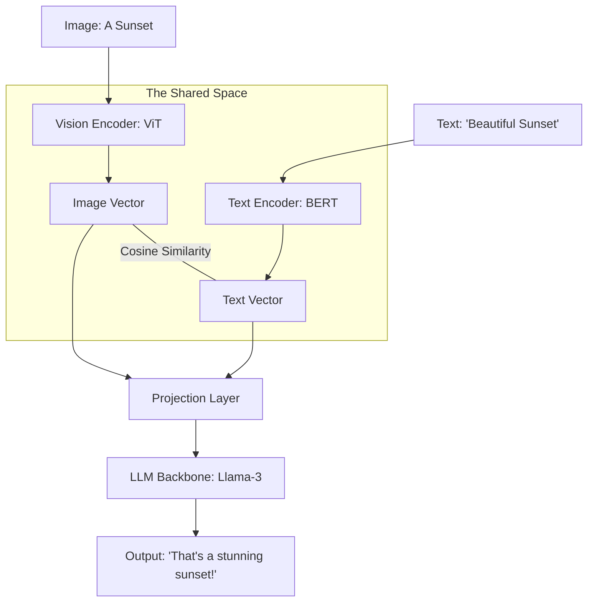

# 🌈 What is Multimodal AI? The Multi-Sensory Intelligence
> **Level:** Intermediate | **Language:** Hinglish | **Goal:** Dekhne, sunne aur bolne wale AI ke concepts ko master karein, Joint Embeddings, Cross-modal attention, aur 2026 mein "Universal" AI assistants banane ki strategies ko explore karein.

---

## 🧭 1. Beginner-Friendly Hinglish Explanation
Insaano ke paas sirf "Text" nahi hota. Hum dekhte hain (Vision), sunte hain (Audio), aur mehsoos karte hain (Touch).

- **The Problem:** Purana AI sirf ek "Modal" (Zariya) samajhta tha. Ek model sirf "Photo" pehchanta tha, doosra sirf "Text" likhta tha.
- **Multimodal AI** ka matlab hai ek aisa single model jo sab kuch ek saath samajh sake.
  - Aap use ek **Photo** dikhate hain aur puchte hain: *"Is photo mein galti kya hai?"*
  - Wo photo ko "Dekhta" hai aur text mein "Answer" deta hai.

Ye bilkul ek **Chote Bache** ki tarah hai jo ek khilaune ko dekh kar bolta hai: *"Ye car hai."* 
2026 mein, AI sirf "Chatbot" nahi raha, wo ek "Observer" ban gaya hai jo duniya ko humari tarah samajhta hai.

---

## 🧠 2. Deep Technical Explanation
Multimodal AI different data types (Images, Text, Audio) ko ek **Shared Embedding Space** mein map karke kaam karta hai.

### 1. The Core Concept (Joint Embeddings):
- Agar mere paas "Kutta" ki ek photo hai aur "Dog" shabd hai, toh model ko ye seekhna hoga ki ye do alag-alag cheezein **same concept** ko represent karti hain.
- Vector space mein, "Dog" ke liye Image-Vector aur Text-Vector ek doosre ke bahut close honge.

### 2. Modality Encoders:
- **Vision Encoder:** Mostly ek **ViT (Vision Transformer)** hota hai jo image ko small patches mein break karta hai.
- **Text Encoder:** Ek standard **Transformer** (jaise RoBERTa ya GPT).
- **Audio Encoder:** Ye sound ko pehle ek **Spectrogram** mein convert karta hai aur fir CNN ya Transformer ka use karta hai.

### 3. Fusion Strategies:
- **Early Fusion:** Raw pixels aur text tokens ko bilkul starting mein hi mix kar dena. (Ise train karna hard hota hai).
- **Late Fusion:** Dono ko alag-alag process karna aur sirf final decision layer par mix karna.
- **Cross-Attention:** 2026 ka sabse popular method. Text generate karte waqt, model answer dhoondne ke liye image ke specific parts ko dubara dekhta (cross-attention karta) hai.

---

## 🏗️ 3. Multimodal Tasks Comparison
| Task | Input | Output | Example |
| :--- | :--- | :--- | :--- |
| **Image Captioning** | Image | Text | "A cat sitting on a mat" |
| **VQA (Visual Q&A)** | Image + Text | Text | "What color is the car?" |
| **Text-to-Image** | Text | Image | **Stable Diffusion / Midjourney** |
| **Speech-to-Text** | Audio | Text | **OpenAI Whisper** |
| **Video Understanding**| Video + Text | Text | "Summarize this movie scene" |

---

## 📐 4. Mathematical Intuition
- **Contrastive Learning (The CLIP approach):** 
  Hum model ko (Image, Text) ke pairs ka use karke train karte hain.
  - **Goal:** "Matching" pairs ke beech cosine similarity ko maximize karna aur "Non-matching" pairs ke liye ise minimize karna.
  $$\mathcal{L} = -\sum \log \frac{\exp(\text{sim}(I_i, T_i) / \tau)}{\sum \exp(\text{sim}(I_i, T_j) / \tau)}$$
  - $\tau$: Ek temperature parameter.
  Ye simple math aaj ke lagbhag sabhi Multimodal AI ka foundation hai.

---

## 📊 5. Multimodal Model Architecture (Diagram)

```mermaid
graph TD
    Img[Image: A Sunset] --> V_Enc[Vision Encoder: ViT]
    Txt[Text: 'Beautiful Sunset'] --> T_Enc[Text Encoder: BERT]
    
    subgraph "The Shared Space"
    V_Enc --> V_Vec[Image Vector]
    T_Enc --> T_Vec[Text Vector]
    V_Vec -- "Cosine Similarity" --- T_Vec
    end
    
    V_Vec & T_Vec --> Projector[Projection Layer]
    Projector --> LLM[LLM Backbone: Llama-3]
    LLM --> Answer[Output: 'That's a stunning sunset!']
```

---

## 💻 6. Production-Ready Examples (Using a Multimodal Model in Python)
```python
# 2026 Pro-Tip: Use 'Llava' or 'GPT-4o' for multimodal tasks.

from transformers import pipeline
from PIL import Image

# 1. Load a Visual Question Answering (VQA) pipeline
vqa_pipeline = pipeline("visual-question-answering", model="llava-hf/llava-1.5-7b-hf")

# 2. Open an image
image = Image.open("hospital_bill.jpg")

# 3. Ask a question about the image
question = "What is the total amount due on this bill?"
result = vqa_pipeline(image, question, top_k=1)

print(f"AI Answer: {result[0]['answer']}")
# Result: '$450.00' (Extracted directly from the pixels!) 🚀
```

---

## ❌ 7. Failure Cases
- **Visual Hallucinations:** AI aisi cheezon ko "Dekhta" hai jo wahan hain hi nahi (jaise kisi jhaadi (bush) ki photo dekh kar bolna ki wahan dog hai).
- **OCR Failure:** Model image ke andar ke small ya stylized text ko nahi padh pata.
- **Temporal Failure:** Video mein, model end tak pahunchte-pahunchte bhool jata hai ki video ke start mein kya hua tha.
- **Spatial Reasoning:** Model ko ye toh pata hota hai ki wahan "Cup" aur "Table" hain, par ye nahi bata pata ki cup table ke "Upar" hai ya uske "Niche".

---

## 🛠️ 8. Debugging Guide
- **Symptom:** "Model har ek image ke liye same answer de raha hai."
- **Check:** **Projector Layer**. Wo part jo Vision aur Text encoders ko connect karta hai,  shayad correctly trained nahi hai. Ye visual input ko "Ignore" kar raha hai.
- **Symptom:** "Model images ke liye bahut slow hai."
- **Check:** **Image Resolution**. Kya aap $4K$ images bhej rahe hain? ViT models $224 \times 224$ ya $336 \times 336$ par sabse best work karte hain. Bhejne se pehle resize karein.

---

## ⚖️ 9. Tradeoffs
- **Frozen vs. Unfrozen Encoders:** 
  - Frozen: Fast training par kam specialized.
  - Unfrozen: Behtar accuracy par iske liye $10x$ zyada GPU memory ki zaroorat hoti hai.
- **Modality Weighting:** Jab text aur image aapas mein contradict karte hain, toh model kis par zyada trust kare—"Text" par ya "Image" par?

---

## 🛡️ 10. Security Concerns
- **Adversarial Images:** Photo mein ek aisa special "Pattern" add karna jo insaano ko toh na dikhe par AI ko ye sochne par majboor kar de ki photo "NSFW" ya "Violent" hai, jisse system block trigger ho jaye.

---

## 📈 11. Scaling Challenges
- **The 'Token' Explosion:** Ek single image ko 576 "Visual Tokens" ke roop mein represent kiya ja sakta hai. Ek 1-minute ke video mein 10,000+ tokens ho sakte hain. Ye **Context Window** ko bahut jaldi fill kar deta hai.

---

## 💸 12. Cost Considerations
- **Vision-Token Pricing:** Zyada tar APIs (jaise GPT-4o) ek paragraph text ke mukable image ke liye zyada charge karte hain. **Optimization: Simple tasks ke liye 'Low-res' mode ka use karein.**

---

## ✅ 13. Best Practices
- **Use 'Interleaved' Training:** Model ko aise documents par train karein jahan images aur text mixed hon (jaise Wikipedia ya News articles).
- **Prompt Engineering for Vision:** Specific banein. "What's in this?" puchne ke bajaye, "List all the objects on the desk in this image" puchein.
- **Multimodal RAG:** Apne Vector DB mein Image Embeddings aur Text Embeddings dono ko store karein taaki aap text ke zariye "Photos of red cars" search kar sakein.

---

## ⚠️ 14. Common Mistakes
- **Ignoring Aspect Ratio:** Kisi wide photo ko zabardasti square mein squash (chota) karna, jisse objects distorted dikhne lagte hain aur AI confuse ho jata.
- **No 'Safety' filter for Vision:** Ye assume kar lena ki agar text safe hai toh image bhi safe hi hogi.

---

## 📝 15. Interview Questions
1. **"Multimodal AI mein 'Shared Embedding Space' kya hota hai?"**
2. **"Vision Transformer (ViT) kisi image ko tokens mein kaise break karta hai?"**
3. **"Early Fusion aur Late Fusion ke beech ka difference explain karein."**

---

## 🚀 16. Latest 2026 Industry Patterns
- **Any-to-Any Models:** **GPT-4o** ya **Gemini 1.5** jaise models jo kisi bhi input combination (Text/Audio/Video) ko accept kar sakte hain aur kisi bhi output combination ko generate kar sakte hain.
- **Native Multimodality:** Aise models jo alag-alag encoders ko stitch (jod) karke nahi banaye gaye hain, balki unhe Day 1 se hi sabhi modalities ke mix par train kiya gaya hai.
- **Real-time Video Understanding:** Aisa AI jo live security camera ko "Watch" kar sake aur real-time mein $< 500ms$ ki latency ke sath describe kar sake ki wahan kya chal raha hai.
