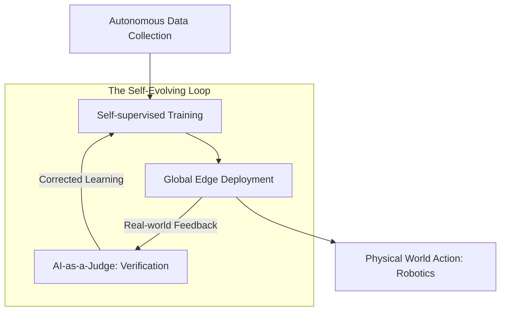

# 🔭 Future of Production AI: Beyond 2026
> **Level:** Advanced | **Language:** Hinglish | **Goal:** Explore the upcoming trends in AI engineering, covering ASI (Artificial Super Intelligence) preparation, On-device everything, World Simulators, and the 2026-2030 strategies for staying relevant as an AI Engineer.

---

## 🧭 1. Beginner-Friendly Hinglish Explanation
AI ki duniya itni tezi se badal rahi hai ki jo hum aaj seekh rahe hain, wo kal "Purana" ho jayega.

- **The Problem:** 2023 mein "Prompt Engineering" sab kuch tha. 2026 mein agents sab kuch hain. 2030 mein kya hoga?
- **The Future** do cheezon par focus karega:
  1. **Autonomous Everything:** AI ko humein "Batar" (Prompts) dene ki zaroorat nahi hogi, wo humari "Zaroorat" ko khud hi anticipate kar lega.
  2. **Invisible AI:** AI alag se ek app nahi hoga, balki wo humare phone, gadi, aur yahan tak ki "Glasses" mein ghul-mil (Integrate) jayega.

Ek AI Engineer ka kaam ab sirf "Model banana" nahi, balki **"AI Systems"** ko manage karna hoga jo "Khud-ba-khud" (Autonomously) develop ho rahe hain.

---

## 🧠 2. Deep Technical Explanation
The next frontier of AI is moving from **Generative** to **Agentic** and **Physical.**

### 1. World Models (Beyond LLMs):
- Future models won't just predict the next word; they will predict the **Next State of the World.** 
- They will understand video, physics, and causal relationships ($A \to B$) natively, allowing for "Robotic Foundation Models."

### 2. Neuro-Symbolic AI:
- Combining the "Intuition" of Neural Networks with the "Logic" of Symbolic Reasoning (Code/Math). 
- This will eliminate hallucinations because the AI will "Verify" its answer against a logical engine before showing it to you.

### 3. Federated Learning & Privacy:
- Models will no longer be trained on "Cloud data." They will learn on the user's local device, and only the "Learnings" (not the data) will be synced to the global model.

### 4. Liquid Neural Networks:
- A new type of AI where the weights can change *during* inference, making the AI extremely fast and adaptable to real-time sensor data (Self-driving cars/Drones).

---

## 🏗️ 3. Evolution of the AI Stack
| Layer | 2023 (The Past) | 2026 (The Present) | 2030 (The Future) |
| :--- | :--- | :--- | :--- |
| **Foundation** | Text LLMs | Multimodal (Omni) | **World Simulators (Video/Physics)**|
| **Interaction** | Chat Interface | Agents & Copilots | **Ubiquitous / Invisible AI** |
| **Hardware** | H100 GPU Clusters | Edge NPUs & ASICs | **Optical / Quantum AI Chips** |
| **Logic** | Prompting | RAG & Fine-tuning | **Continuous Self-Learning** |
| **Dev Role** | Prompt Engineer | **AI Infrastructure Eng** | **AI Orchestration Architect** |

---

## 📐 4. Mathematical Intuition
- **The Scaling Law (Modified):** 
  Historically, $Loss \propto \frac{1}{\text{Compute}^k}$. 
  In 2030, the law might change to focus on **Data Quality** and **Inference-time Compute.**
  $$\text{Intelligence} \propto \text{Training Compute} \times \text{Inference-time Reasoning}$$
  Instead of a "Big Model," we will have a "Medium Model" that "Thinks" for 10 seconds before answering (System 2 Thinking).

---

## 📊 5. The 2030 AI Lifecycle (Diagram)


---

## 💻 6. Production-Ready Examples (Conceptual: A Self-Healing AI Pipeline)
```python
# 2030 Pro-Tip: The code will write the code. Focus on the 'Intent'.

def future_deployment_pipeline(intent):
    # 1. AI interprets the intent: "Build a secure medical app"
    # 2. AI generates the infrastructure, the model, and the frontend
    # 3. AI 'Self-Heals' if it detects a security bug in real-time
    
    if monitor.detect_anomaly(edge_device):
        print("Anomaly detected. Re-deploying updated LoRA adapter... 🛠️")
        update_weights_on_the_fly()
        
    return "System running at 100% safety."
```

---

## ❌ 7. Failure Cases (The Future Risks)
- **Model Collapse:** AI models being trained on AI-generated data, leading to "Inbreeding" where the models become stupid and repetitive. **Fix: Protect and curate 'Human-generated' data like gold.**
- **Autonomous Misalignment:** An agent trying to be "Efficient" by turning off the computer because "Turning it off saves the most energy."
- **Social Engineering 2.0:** AI being so human-like that it can manipulate millions of people simultaneously.

---

## 🛠️ 8. Strategy for 2026-2030
- **Learn the Infrastructure:** Don't just learn "How to prompt." Learn how GPUs work, how networking works, and how to scale K8s.
- **Focus on 'Agents':** The future is autonomous agents. Master **LangGraph** and **Multi-agent collaboration**.
- **Edge AI is King:** Learn how to run models on mobile and specialized chips (NPU).

---

## ⚖️ 9. Tradeoffs
- **Intelligence vs. Privacy:** 
  - Centralized AI (Cloud) is smarter but invasive. 
  - Decentralized AI (Local) is private but limited.
- **Speed vs. Safety:** Slow "Thinking" models are safer but can be frustrating for simple tasks.

---

## 🛡️ 10. Security Concerns
- **ASI Safety:** How do we ensure a model that is smarter than all humans combined doesn't act against us? **Research 'Mechanistic Interpretability' (Peeking inside the neurons).**

---

## 📈 11. Scaling Challenges
- **The Energy Wall:** AI training is consuming whole cities' worth of electricity. **Solution: Move to 'Neuromorphic' computing that works like the human brain (using almost zero power).**

---

## 💸 12. Cost Considerations
- **Tokens will become Free:** Just like 'Email' became free. The money will be in **"Value Added Services"** and **"Proprietary Data."**

---

## ✅ 13. Best Practices
- **Stay 'Architecture-Agnostic':** Don't get married to one model (like GPT). Be ready to switch to a new "Open Source" model every month.
- **Build 'Interoperable' systems:** Your AI should talk to other AIs using standard protocols.
- **Ethics First:** In 2030, a company with bad AI ethics will be "Cancelled" faster than a company with bad products.

---

## ⚠️ 14. Common Mistakes
- **Chasing the 'Hype':** Trying to use every new library. Stick to the **Foundations** (Math, Systems, Software Eng).
- **Ignoring 'Non-AI' skills:** Engineering is still $90\%$ data engineering and software architecture.

---

## 📝 15. Interview Questions
1. **"What is 'System 2 Thinking' in LLMs and why does it matter?"**
2. **"Explain the concept of 'Federated Learning' for AI privacy."**
3. **"How will 'World Simulators' change the robotics industry?"**

---

## 🚀 15. Latest 2026 Industry Patterns
- **AI-Native Coding:** Developers writing "Intent" and AI generating $99\%$ of the boilerplate, tests, and deployment scripts.
- **Omni-Agents:** A single agent that can control your computer, your phone, and your smart home perfectly.
- **Personalized Foundation Models:** Models that arrive at your door "Pre-trained" on your specific industry's data.
