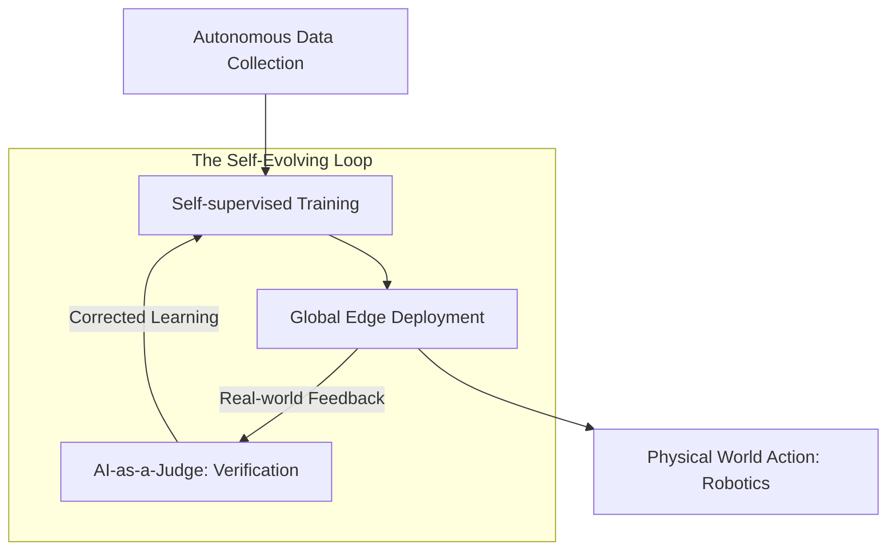

# 🔭 Future of Production AI: Beyond 2026
> **Level:** Advanced | **Language:** Hinglish | **Goal:** AI engineering ke upcoming trends ko explore karein, jisme ASI (Artificial Super Intelligence) ki preparation, On-device everything, World Simulators, aur 2026-2030 ke dauran ek AI Engineer ke roop mein relevant bane rehne ki strategies shamil hain.

---

## 🧭 1. Beginner-Friendly Hinglish Explanation
AI ki duniya itni tezi se badal rahi hai ki jo hum aaj seekh rahe hain, wo kal "Purana" ho jayega.

- **The Problem:** 2023 mein "Prompt Engineering" sab kuch tha. 2026 mein agents sab kuch hain. 2030 mein kya hoga?
- **The Future** do cheezon par focus karega:
  1. **Autonomous Everything:** AI ko humein "Batar" (Prompts) dene ki zaroorat nahi hogi, wo humari "Zaroorat" ko khud hi anticipate kar lega.
  2. **Invisible AI:** AI alag se ek app nahi hoga, balki wo humare phone, gadi, aur yahan tak ki "Glasses" mein ghul-mil (Integrate) jayega.

Ek AI Engineer ka kaam ab sirf "Model banana" nahi, balki **"AI Systems"** ko manage karna hoga jo "Khud-ba-khud" (Autonomously) develop ho rahe hain.

---

## 🧠 2. Deep Technical Explanation
AI ki next frontier ab **Generative** se **Agentic** aur **Physical** par shift ho rahi hai.

### 1. World Models (Beyond LLMs):
- Future models sirf next word ko predict nahi karenge; ye **duniya ke agle state (Next State of the World)** ko predict karenge.
- Ye natively video, physics aur causal relationships ($A \to B$) ko samjhenge, jisse "Robotic Foundation Models" banana possible hoga.

### 2. Neuro-Symbolic AI:
- Neural Networks ki "Intuition" ko Symbolic Reasoning (Code/Math) ki "Logic" ke sath combine karna.
- Ye hallucinations ko khatam kar dega kyuki AI user ko answer dikhane se pehle use ek logical engine ke against "Verify" karega.

### 3. Federated Learning & Privacy:
- Models ab "Cloud data" par train nahi honge. Ye user ke local device par hi seekhenge, aur global model ke sath sirf "Learnings" (data nahi, balki weights ka diff) sync hongi.

### 4. Liquid Neural Networks:
- Ek naye type ka AI jahan weights inference ke *dauran* bhi change ho sakte hain, jisse AI extremely fast aur real-time sensor data (Self-driving cars/Drones) ke liye adaptable ban jata hai.

---

## 🏗️ 3. Evolution of the AI Stack
| Layer | 2023 (The Past) | 2026 (The Present) | 2030 (The Future) |
| :--- | :--- | :--- | :--- |
| **Foundation** | Text LLMs | Multimodal (Omni) | **World Simulators (Video/Physics)**|
| **Interaction** | Chat Interface | Agents & Copilots | **Ubiquitous / Invisible AI** |
| **Hardware** | H100 GPU Clusters | Edge NPUs & ASICs | **Optical / Quantum AI Chips** |
| **Logic** | Prompting | RAG & Fine-tuning | **Continuous Self-Learning** |
| **Dev Role** | Prompt Engineer | **AI Infrastructure Eng** | **AI Orchestration Architect** |

---

## 📐 4. Mathematical Intuition
- **The Scaling Law (Modified):** 
  Historically, $Loss \propto \frac{1}{\text{Compute}^k}$. 
  2030 mein, ye law change hokar **Data Quality** aur **Inference-time Compute** par focus karega.
  $$\text{Intelligence} \propto \text{Training Compute} \times \text{Inference-time Reasoning}$$
  Kisi "Big Model" ke bajaye, humare paas ek "Medium Model" hoga jo answer dene se pehle 10 seconds tak "Think" (soch vichar) karega (System 2 Thinking).

---

## 📊 5. The 2030 AI Lifecycle (Diagram)

```mermaid
graph TD
    Data[Autonomous Data Collection] --> Train[Self-supervised Training]
    Train --> Deploy[Global Edge Deployment]
    
    subgraph "The Self-Evolving Loop"
    Deploy -- "Real-world Feedback" --> Verify[AI-as-a-Judge: Verification]
    Verify -- "Corrected Learning" --> Train
    end
    
    Deploy --> Action[Physical World Action: Robotics]
```

---

## 💻 6. Production-Ready Examples (Conceptual: A Self-Healing AI Pipeline)
```python
# 2030 Pro-Tip: The code will write the code. Focus on the 'Intent'.

def future_deployment_pipeline(intent):
    # 1. AI interprets the intent: "Build a secure medical app"
    # 2. AI generates the infrastructure, the model, and the frontend
    # 3. AI 'Self-Heals' if it detects a security bug in real-time
    
    if monitor.detect_anomaly(edge_device):
        print("Anomaly detected. Re-deploying updated LoRA adapter... 🛠️")
        update_weights_on_the_fly()
        
    return "System running at 100% safety."
```

---

## ❌ 7. Failure Cases (The Future Risks)
- **Model Collapse:** AI models ka AI-generated data par hi train hona, jisse "Inbreeding" (apne hi data par seekhna) hoga aur models stupid aur repetitive ban jayenge. **Fix: 'Human-generated' data ko sone (gold) ki tarah protect aur curate karein.**
- **Autonomous Misalignment:** Kisi agent ka "Efficient" banne ke chakkar mein computer ko hi off kar dena kyuki "Turning it off saves the most energy."
- **Social Engineering 2.0:** AI ka itna human-like hona ki wo ek sath millions of people ko manipulate kar sake.

---

## 🛠️ 8. Strategy for 2026-2030
- **Learn the Infrastructure:** Sirf "How to prompt" mat seekhein. Sikhein ki GPUs kaise work karte hain, networking kaise hoti hai aur K8s ko kaise scale kiya jata hai.
- **Focus on 'Agents':** Future autonomous agents ka hi hai. **LangGraph** aur **Multi-agent collaboration** ko master karein.
- **Edge AI is King:** Mobile aur specialized chips (NPU) par models ko run karna seekhein.

---

## ⚖️ 9. Tradeoffs
- **Intelligence vs. Privacy:** 
  - Centralized AI (Cloud) zyada smart hai par privacy ke liye invasive hai.
  - Decentralized AI (Local) private hai par limited hai.
- **Speed vs. Safety:** Slow "Thinking" models zyada safe hote hain par simple tasks ke liye frustrating ho sakte hain.

---

## 🛡️ 10. Security Concerns
- **ASI Safety:** Hum kaise ensure karein ki ek aisa model jo sabhi humans se zyada smart hai, wo humare against kaam na kare? **Iske liye 'Mechanistic Interpretability' (neurons ke andar dekhna) par research karein.**

---

## 📈 11. Scaling Challenges
- **The Energy Wall:** AI training pure shehron ke barabar electricity consume kar rahi hai. **Solution: 'Neuromorphic' computing par shift hona jo human brain ki tarah kaam karti hai (jo lagbhag zero power use karti hai).**

---

## 💸 12. Cost Considerations
- **Tokens will become Free:** Bilkul waise hi jaise 'Email' free ho gaya tha. Paisa ab **"Value Added Services"** aur **"Proprietary Data"** mein hoga.

---

## ✅ 13. Best Practices
- **Stay 'Architecture-Agnostic':** Don't get married to one model (like GPT). Be ready to switch to a new "Open Source" model every month.
- **Build 'Interoperable' systems:** Your AI should talk to other AIs using standard protocols.
- **Ethics First:** In 2030, a company with bad AI ethics will be "Cancelled" faster than a company with bad products.

---

## ⚠️ 14. Common Mistakes
- **Chasing the 'Hype':** Har nayi library ko use karne ke piche mat bhaagein. **Foundations** (Math, Systems, Software Eng) par tike rahein.
- **Ignoring 'Non-AI' skills:** Engineering abhi bhi $90\%$ data engineering aur software architecture hi hai.

---

## 📝 15. Interview Questions
1. **"LLMs mein 'System 2 Thinking' kya hai aur ye kyun matter karti hai?"**
2. **"AI privacy ke liye 'Federated Learning' ke concept ko explain karein."**
3. **"World Simulators robotics industry ko kaise change karenge?"**

---

## 🚀 16. Latest 2026 Industry Patterns
- **AI-Native Coding:** Developers ka sirf "Intent" likhna aur AI ka $99\%$ boilerplate, tests aur deployment scripts khud generate karna.
- **Omni-Agents:** Ek single agent jo aapke computer, phone aur smart home ko perfectly control kar sake.
- **Personalized Foundation Models:** Aise models jo aapke specific industry ke data par "Pre-trained" hokar aapke door par pahunchein.
