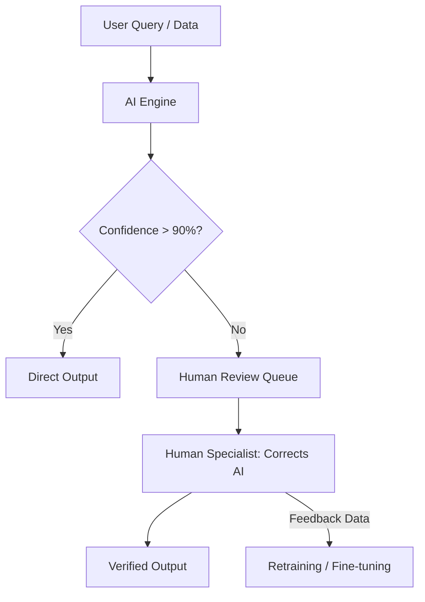

# 🤝 Human-in-the-Loop (HITL) Systems: AI-Human Collaboration
> **Level:** Intermediate | **Language:** Hinglish | **Goal:** Master the integration of human judgment into AI workflows, exploring Active Learning, Approval Gates, Correction Loops, and the 2026 strategies for building "Trustworthy" AI.

---

## 🧭 1. Beginner-Friendly Hinglish Explanation
AI model hamesha $100\%$ sahi nahi hota. 

- **The Problem:** Agar aap ek AI use kar rahe hain "Bank Loans" approve karne ke liye ya "Cancer" detect karne ke liye, toh $1\%$ galti bhi bahut bhari pad sakti hai.
- **Human-in-the-loop (HITL)** ka matlab hai ek aisa system jahan AI aur Insaan milkar kaam karte hain.
  1. AI apna "Draft" ya "Suggestion" deta hai.
  2. Ek Insaan use "Review" karta hai.
  3. Insaan ya toh use **Approve** karta hai, ya **Correct** karta hai.
- **The Bonus:** Jab insaan AI ki galti theek karta hai, toh AI us galti se "Seekhta" hai (Learning from mistakes).

2026 mein, high-stakes jobs mein AI ko "Akele" kaam karne ki ijazat nahi hai. Wo sirf ek **"Executive Assistant"** hai, asli faisla insaan hi leta hai.

---

## 🧠 2. Deep Technical Explanation
HITL is a design pattern where human intervention is used to improve model performance and ensure safety.

### 1. Active Learning (The Efficiency Loop):
- The model identifies the data points it is "Unsure" about (Low confidence).
- It asks a human to label ONLY those points.
- This reduces the amount of human labeling needed by **$90\%$** compared to random labeling.

### 2. Approval Gates (The Safety Loop):
- In agentic workflows, some actions are "High-impact" (e.g., Deleting a database, sending a payment).
- The system pauses and waits for a `human_approval` signal before executing the tool.

### 3. Reinforcement Learning from Human Feedback (RLHF):
- Humans rank multiple AI responses from "Best" to "Worst."
- A "Reward Model" is trained on these rankings.
- The AI is then fine-tuned to maximize the reward. This is how ChatGPT became so "Helpful."

### 4. Interactive Correction:
- Instead of "Regenerate," the user can say: *"Change the second paragraph to be more professional."* The AI updates only that part.

---

## 🏗️ 3. Fully Autonomous vs. HITL AI
| Feature | Fully Autonomous AI | Human-in-the-Loop (HITL) |
| :--- | :--- | :--- |
| **Speed** | **Instant (Scale of 1M/sec)** | Limited by human speed |
| **Reliability** | Variable (Hallucination risk) | **Very High (Verified)** |
| **Cost** | Low (Compute only) | **High (Human labor)** |
| **Best For** | Spam filters / Recommendations| **Medicine / Law / Finance** |
| **User Trust** | Moderate | **High** |

---

## 📐 4. Mathematical Intuition
- **Confidence Thresholds:** 
  The system decides whether to involve a human based on a threshold $\tau$.
  $$\text{Action} = \begin{cases} \text{Execute AI Response} & \text{if } P(\text{correct}) > \tau \\ \text{Request Human Review} & \text{if } P(\text{correct}) \leq \tau \end{cases}$$
  - For a **Twitter Bot**, $\tau$ might be $0.5$.
  - For a **Medical Diagnosis**, $\tau$ might be $0.99$.

---

## 📊 5. HITL Workflow in Production (Diagram)


---

## 💻 6. Production-Ready Examples (Implementing an Approval Gate in Python)
```python
# 2026 Pro-Tip: Always pause for human confirmation before destructive actions.

def execute_agent_action(action, params):
    # 1. Identify high-risk actions
    risky_actions = ["send_money", "delete_user", "publish_tweet"]
    
    if action in risky_actions:
        print(f"⚠️ Action Required: AI wants to {action} with params {params}.")
        
        # 2. Wait for human input (This could be a Slack button or a UI toggle)
        user_choice = input("Approve? (y/n): ")
        
        if user_choice.lower() != 'y':
            print("❌ Action rejected by human.")
            return "Action Cancelled"
            
    # 3. Proceed if safe or approved
    print(f"✅ Executing {action}...")
    return f"Success: {action}"

# This simple gate prevents 99% of 'AI Gone Rogue' incidents.
```

---

## ❌ 7. Failure Cases
- **Human Fatigue:** If a human has to review 10,000 AI logs a day, they will start "Auto-approving" without looking. **Fix: Use 'Spot Checks' and 'Redundancy' (two humans for one log).**
- **Slower Latency:** User waits 1 hour for a "Human Review." **Fix: Use 'Hybrid'—give an instant 'Draft' answer, but mark it as 'Unverified'.**
- **Bias Injection:** If the human reviewer is biased, the AI will learn and amplify that bias.
- **Cost Explosion:** Hiring 100 people to review AI outputs makes the product more expensive than just hiring 100 people to do the job without AI.

---

## 🛠️ 8. Debugging Guide
- **Symptom:** "AI is making the same mistake even after 100 corrections."
- **Check:** **Fine-tuning pipeline**. Are you actually "Training" on the human corrections, or just storing them in a database? Ensure the feedback loop is closed.
- **Symptom:** "Reviewers are disagreeing with each other."
- **Check:** **Labeling Guidelines**. Your instructions to humans are vague. Create a strict "Gold Standard" document.

---

## ⚖️ 9. Tradeoffs
- **Scale vs. Quality:** More human review = Better quality but slower scale.
- **In-process vs. Post-process:** 
  - In-process: Human reviews *before* user sees (Slow). 
  - Post-process: User sees first, human reviews later for "Learning" (Risky but Fast).

---

## 🛡️ 10. Security Concerns
- **Insider Threat:** A human reviewer purposefully "Teaching" the AI to be toxic or to leak secrets. **Monitor the reviewers using another AI! (AI-as-a-Judge).**

---

## 📈 11. Scaling Challenges
- **Crowdsourcing Management:** Using 10,000 workers on Amazon Mechanical Turk. You need a system to detect "Low-quality" workers automatically.

---

## 💸 12. Cost Considerations
- **Dynamic Thresholding:** When the budget is low, decrease $\tau$ (let more AI through). When quality is critical, increase $\tau$.

---

## ✅ 13. Best Practices
- **Provide 'Context' to Humans:** Don't just show the AI's answer. Show the "Reasoning" and the "Sources" so the human can decide quickly.
- **Gamify the Review:** Give badges or rewards to humans who find critical AI mistakes.
- **Measure 'Human Agreement':** If 3 humans give 3 different answers, the data point is too complex for AI to learn from.

---

## ⚠️ 14. Common Mistakes
- **Ignoring the User as a Reviewer:** Your customers are your best HITL workers! Use their "Thumbs up/down" as a free labeling signal.
- **No 'Undo' button:** Assuming a human approval is $100\%$ permanent.

---

## 📝 15. Interview Questions
1. **"What is Active Learning and how does it save costs?"**
2. **"Explain RLHF and its role in modern LLMs."**
3. **"How do you prevent 'Labeler Fatigue' in high-volume HITL systems?"**

---

## 🚀 15. Latest 2026 Industry Patterns
- **AI-in-the-Loop for Humans:** The reverse—humans doing the work, and a small AI "Checking" for mistakes in real-time.
- **Distributed Labeling (Web3):** Using blockchain to pay thousands of people globally to verify AI outputs anonymously.
- **Multimodal Feedback:** Humans "Pointing" at parts of an image or video to tell the AI exactly where it made a mistake.
