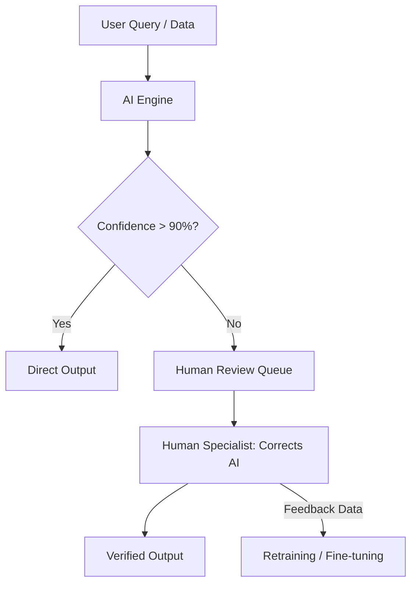

# 🤝 Human-in-the-Loop (HITL) Systems: AI-Human Collaboration
> **Level:** Intermediate | **Language:** Hinglish | **Goal:** Human judgment ko AI workflows mein integrate karne ko master karein, Active Learning, Approval Gates, Correction Loops, aur 2026 mein "Trustworthy" AI banane ki strategies ko explore karein.

---

## 🧭 1. Beginner-Friendly Hinglish Explanation
AI model hamesha $100\%$ sahi nahi hota. 

- **The Problem:** Agar aap ek AI use kar rahe hain "Bank Loans" approve karne ke liye ya "Cancer" detect karne ke liye, toh $1\%$ galti bhi bahut bhari pad sakti hai.
- **Human-in-the-loop (HITL)** ka matlab hai ek aisa system jahan AI aur Insaan milkar kaam karte hain.
  1. AI apna "Draft" ya "Suggestion" deta hai.
  2. Ek Insaan use "Review" karta hai.
  3. Insaan ya toh use **Approve** karta hai, ya **Correct** karta hai.
- **The Bonus:** Jab insaan AI ki galti theek karta hai, toh AI us galti se "Seekhta" hai (Learning from mistakes).

2026 mein, high-stakes jobs mein AI ko "Akele" kaam karne ki ijazat nahi hai. Wo sirf ek **"Executive Assistant"** hai, asli faisla insaan hi leta hai.

---

## 🧠 2. Deep Technical Explanation
HITL ek design pattern hai jahan human intervention (insani interference) ka use model performance ko improve karne aur safety ko ensure karne ke liye kiya jata hai.

### 1. Active Learning (The Efficiency Loop):
- Model un data points ko identify karta hai jinke baare mein wo "Unsure" (Low confidence) hota hai.
- Ye ek insaan (human) ko ONLY un points ko label karne ke liye bolta hai.
- Ye random labeling ke mukable human labeling ki zaroorat ko **$90\%$** tak reduce kar deta hai.

### 2. Approval Gates (The Safety Loop):
- Agentic workflows mein, kuch actions "High-impact" hote hain (jaise database delete karna, payment send karna).
- System pause ho jata hai aur tool execute karne se pehle `human_approval` signal ka wait karta hai.

### 3. Reinforcement Learning from Human Feedback (RLHF):
- Humans multiple AI responses ko "Best" se "Worst" ki ranking dete hain.
- In rankings par ek "Reward Model" ko train kiya jata hai.
- Uske baad reward ko maximize karne ke liye AI ko fine-tune kiya jata hai. Is tarah se ChatGPT itna "Helpful" bana hai.

### 4. Interactive Correction:
- "Regenerate" karne ke bajaye, user bol sakta hai: *"Change the second paragraph to be more professional."* AI sirf us part ko update kar deta hai.

---

## 🏗️ 3. Fully Autonomous vs. HITL AI
| Feature | Fully Autonomous AI | Human-in-the-Loop (HITL) |
| :--- | :--- | :--- |
| **Speed** | **Instant (1M/sec ki scale par)** | Human speed par dependent |
| **Reliability** | Variable (Hallucination ka risk) | **Very High (Verified)** |
| **Cost** | Low (Sirf compute cost) | **High (Human labor cost)** |
| **Best For** | Spam filters / Recommendations| **Medicine / Law / Finance** |
| **User Trust** | Moderate | **High** |

---

## 📐 4. Mathematical Intuition
- **Confidence Thresholds:** 
  System threshold $\tau$ ke basis par decide karta hai ki insaan ko involve karna hai ya nahi.
  $$\text{Action} = \begin{cases} \text{Execute AI Response} & \text{if } P(\text{correct}) > \tau \\ \text{Request Human Review} & \text{if } P(\text{correct}) \leq \tau \end{cases}$$
  - Ek **Twitter Bot** ke liye, $\tau$ shayad $0.5$ ho sakta hai.
  - Ek **Medical Diagnosis** ke liye, $\tau$ shayad $0.99$ ho sakta hai.

---

## 📊 5. HITL Workflow in Production (Diagram)

```mermaid
graph TD
    Input[User Query / Data] --> AI[AI Engine]
    AI --> Confidence{Confidence > 90%?}
    
    Confidence -- "Yes" --> Output[Direct Output]
    Confidence -- "No" --> Queue[Human Review Queue]
    
    Queue --> Human[Human Specialist: Corrects AI]
    Human --> Final[Verified Output]
    
    Human -- "Feedback Data" --> Retrain[Retraining / Fine-tuning]
```

---

## 💻 6. Production-Ready Examples (Implementing an Approval Gate in Python)
```python
# 2026 Pro-Tip: Always pause for human confirmation before destructive actions.

def execute_agent_action(action, params):
    # 1. Identify high-risk actions
    risky_actions = ["send_money", "delete_user", "publish_tweet"]
    
    if action in risky_actions:
        print(f"⚠️ Action Required: AI wants to {action} with params {params}.")
        
        # 2. Wait for human input (This could be a Slack button or a UI toggle)
        user_choice = input("Approve? (y/n): ")
        
        if user_choice.lower() != 'y':
            print("❌ Action rejected by human.")
            return "Action Cancelled"
            
    # 3. Proceed if safe or approved
    print(f"✅ Executing {action}...")
    return f"Success: {action}"

# This simple gate prevents 99% of 'AI Gone Rogue' incidents.
```

---

## ❌ 7. Failure Cases
- **Human Fatigue:** Agar kisi insaan ko ek din mein 10,000 AI logs ko review karna pade, toh wo bina dekhe hi "Auto-approve" karna start kar dega. **Fix: 'Spot Checks' aur 'Redundancy' (ek hi log ke liye do humans) ka use karein.**
- **Slower Latency:** User ko "Human Review" ke liye 1 ghanta wait karna padta hai. **Fix: 'Hybrid' approach use karein—user ko instantly 'Draft' answer dikhayein par use 'Unverified' mark kar dein.**
- **Bias Injection:** Agar human reviewer biased hai, toh AI bhi wahi seekhega aur us bias ko multiply kar dega.
- **Cost Explosion:** AI outputs ko review karne ke liye 100 logo ko hire karna product ko aur bhi expensive bana deta hai, isse accha toh bina AI ke hi un 100 logo se kaam karwa liya jaye.

---

## 🛠️ 8. Debugging Guide
- **Symptom:** "AI 100 corrections ke baad bhi wahi same mistake kar raha hai."
- **Check:** **Fine-tuning pipeline**. Are you actually "Training" on the human corrections, or just storing them in a database? Ensure the feedback loop is closed.
- **Symptom:** "Reviewers aphas mein disagree kar rahe hain."
- **Check:** **Labeling Guidelines**. Aapke instructions humans ke liye clear nahi hain. Ek strict "Gold Standard" document create karein.

---

## ⚖️ 9. Tradeoffs
- **Scale vs. Quality:** Zyada human review = Behtar quality par slow scale.
- **In-process vs. Post-process:** 
  - In-process: Human reviews *before* user sees (Slow). 
  - Post-process: User sees first, human reviews later for "Learning" (Risky but Fast).

---

## 🛡️ 10. Security Concerns
- **Insider Threat:** Koi human reviewer jaanbujhkar AI ko toxic hona ya secrets leak karna "sikhaye." **Reviewers ko monitor karne ke liye doosre AI ka use karein! (AI-as-a-Judge).**

---

## 📈 11. Scaling Challenges
- **Crowdsourcing Management:** Using 10,000 workers on Amazon Mechanical Turk. You need a system to detect "Low-quality" workers automatically.

---

## 💸 12. Cost Considerations
- **Dynamic Thresholding:** When the budget is low, decrease $\tau$ (let more AI through). When quality is critical, increase $\tau$.

---

## ✅ 13. Best Practices
- **Provide 'Context' to Humans:** Humans ko sirf AI ka answer mat dikhayein. Unhe "Reasoning" aur "Sources" bhi dikhayein taaki wo jaldi decision le sakein.
- **Gamify the Review:** Aise humans ko badges ya rewards dein jo critical AI mistakes ko find karte hain.
- **Measure 'Human Agreement':** If 3 humans give 3 different answers, the data point is too complex for AI to learn from.

---

## ⚠️ 14. Common Mistakes
- **Ignoring the User as a Reviewer:** Customers are your best HITL workers! Use their "Thumbs up/down" as a free labeling signal.
- **No 'Undo' button:** Assuming a human approval is $100\%$ permanent.

---

## 📝 15. Interview Questions
1. **"Active Learning kya hai aur ye costs ko kaise save karti hai?"**
2. **"RLHF ko explain karein aur modern LLMs mein iske role ko batayein."**
3. **"High-volume HITL systems mein aap 'Labeler Fatigue' ko kaise prevent karte hain?"**

---

## 🚀 16. Latest 2026 Industry Patterns
- **AI-in-the-Loop for Humans:** The reverse—humans doing the work, and a small AI "Checking" for mistakes in real-time.
- **Distributed Labeling (Web3):** Using blockchain to pay thousands of people globally to verify AI outputs anonymously.
- **Multimodal Feedback:** Humans "Pointing" at parts of an image or video to tell the AI exactly where it made a mistake.
