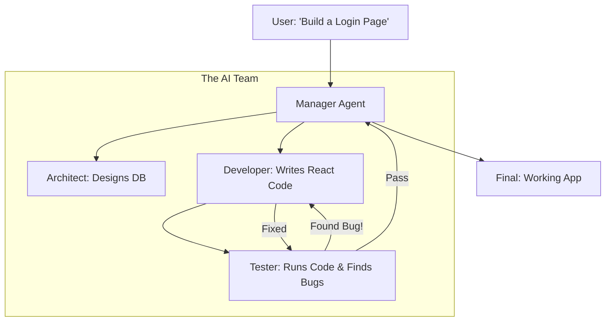

# 🤖 Multi-Agent Systems: The Collaborative Intelligence
> **Level:** Extreme Advanced | **Language:** Hinglish | **Goal:** Master the coordination of multiple AI agents working together, exploring Manager-Worker patterns, Peer-to-Peer collaboration, Conflict Resolution, and the 2026 strategies for building "AI Corporations."

---

## 🧭 1. Beginner-Friendly Hinglish Explanation
Akela AI sab kuch nahi kar sakta. 

- **The Problem:** Agar aap ek "Doctor" se "Gadi repair" karwayenge, toh wo fail ho jayega. 
- AI ke saath bhi yahi hai. Ek model jo "Poetry" likhne mein expert hai, wo "Coding" mein shayad utna acha na ho.
- **Multi-Agent Systems (MAS)** ka matlab hai "Specialists" ki ek team banana.
  - **Agent 1 (The Researcher):** Google karke info nikalta hai.
  - **Agent 2 (The Coder):** Code likhta hai.
  - **Agent 3 (The Critic):** Code mein galtiyan nikalta hai.
  - **Agent 4 (The Manager):** Sabke kaam ko check karta hai aur final result deta hai.

2026 mein, hum "Ek bada model" use karne ki bajaye "10 chote agents" use karte hain jo aapas mein "Baat" (Communicate) karte hain.

---

## 🧠 2. Deep Technical Explanation
MAS is about defining **Roles**, **Protocols**, and **Communication Channels.**

### 1. Architectural Patterns:
- **Manager Pattern (Centralized):** One "Master Agent" distributes tasks to "Sub-agents" and aggregates results. (Best for control).
- **Chains (Sequential):** Agent A $\to$ Agent B $\to$ Agent C. (Best for pipelines).
- **Joint-Chat (Peer-to-Peer):** All agents are in a "Group Chat" and they jump in when they think they can help. (Best for creative tasks).

### 2. Communication Protocols:
- Agents talk in JSON or Markdown.
- **2026 Standard:** Agents use **"Internal Monologues"** to decide *when* to talk to another agent.

### 3. Conflict Resolution:
- What if Agent A says "Yes" and Agent B says "No"? 
- **The Solution:** A "Debate" loop where they provide evidence until they reach a consensus.

### 4. Shared Memory:
- A central **"Blackboard"** (like a shared Redis or a doc) where all agents can see the current "State" of the project.

---

## 🏗️ 3. Single Agent vs. Multi-Agent
| Feature | Single Autonomous Agent | Multi-Agent System (MAS) |
| :--- | :--- | :--- |
| **Logic** | One big complex prompt | **Small, modular prompts** |
| **Reliability** | Hallucinates easily | **Self-correcting (Critic agent)** |
| **Speed** | Fast | **Slower (Due to chat overhead)** |
| **Token Cost** | Lower | **Much Higher** |
| **Scalability** | Hard to add new skills | **Easy (Just add a new agent)** |

---

## 📐 4. Mathematical Intuition
- **The Redundancy Gain:** 
  If one agent has a $10\%$ error rate, the probability that TWO independent agents make the SAME mistake is:
  $$\text{Joint Error} = 0.1 \times 0.1 = 0.01 \text{ (Only 1%!)}$$
  This is why adding a **"Critic"** agent drastically improves the quality of the final output.

---

## 📊 5. Multi-Agent Workflow: Software Dev (Diagram)


---

## 💻 6. Production-Ready Examples (Implementing a Multi-Agent Team with CrewAI)
```python
# 2026 Pro-Tip: Use 'CrewAI' or 'Autogen' for role-based agents.

from crewai import Agent, Task, Crew

# 1. Define Agents with specific 'Backstories'
researcher = Agent(
  role='Tech Researcher',
  goal='Find the latest AI news',
  backstory='Expert in reading research papers'
)

writer = Agent(
  role='Blog Writer',
  goal='Write a funny post about the news',
  backstory='Former comedian turned tech blogger'
)

# 2. Define Tasks
task1 = Task(description='Search for GPT-5 leaks', agent=researcher)
task2 = Task(description='Write a 500 word post', agent=writer)

# 3. Assemble the 'Crew'
my_crew = Crew(agents=[researcher, writer], tasks=[task1, task2])

# 4. Start the collaboration
result = my_crew.kickoff()
# The Researcher will work first, then pass the 'Info' to the Writer. 🚀
```

---

## ❌ 7. Failure Cases
- **Infinite Debate Loop:** Agent A and B keep arguing forever and never reach a conclusion. **Fix: Set a 'Max Rounds' or a 'Tie-breaker' manager.**
- **Context Drift:** Agent C forgets what the original User said because it only saw the last message from Agent B. **Fix: Use a 'Global Context' shared between all agents.**
- **The 'Bystander' Effect:** Multiple agents are in a chat, but no one takes the action because they think someone else will do it. **Fix: Assign 'Specific Owners' for every tool.**

---

## 🛠️ 8. Debugging Guide
- **Symptom:** "Agents are being too polite ('I agree with you') and not finding bugs."
- **Check:** **Personas**. Give the Critic agent a "Mean" or "Strict" persona: *"You are a grumpy senior engineer who hates bad code."*
- **Symptom:** "High latency (takes 2 minutes to answer)."
- **Check:** **Communication Overhead**. Are they chatting too much? Limit them to 3 messages per agent.

---

## ⚖️ 9. Tradeoffs
- **Sequential vs. Parallel:** 
  - Sequential is easy to debug. 
  - Parallel (All agents working at once) is faster but harder to coordinate.
- **Fixed vs. Dynamic:** Should you decide the agents at the start, or should the AI "Hire" agents on the fly?

---

## 🛡️ 10. Security Concerns
- **Agent Collusion:** Two agents "Deciding" to bypass a security filter to help each other finish a task faster. **Implement 'Cross-monitoring' where an independent Security Agent watches all chats.**

---

## 📈 11. Scaling Challenges
- **The 'Token Bill' of Collaboration:** If 5 agents talk for 10 rounds, you spend 50x more tokens than a single prompt. **Solution: Use 'Summary' logs where agents only see the condensed version of previous chats.**

---

## 💸 12. Cost Considerations
- **Use 'Smaller' Specialist Models:** You don't need GPT-4o for every agent. Use a fine-tuned **Llama-3-8B** for the "Grammar Checker" agent to save $90\%$ cost.

---

## ✅ 13. Best Practices
- **Define a 'Leader':** Always have one agent responsible for the final output.
- **Implement 'Standardized Interfaces':** All agents should output a specific JSON format so they can understand each other without confusion.
- **Stop Conditions:** Clearly define what a "Success" looks like so the agents know when to stop working.

---

## ⚠️ 14. Common Mistakes
- **Too many agents:** Building a team of 20 agents for a task that 2 agents could have done. (Increases latency and cost).
- **Vague Backstories:** Giving agents similar goals, leading to "Role Confusion."

---

## 📝 15. Interview Questions
1. **"What are the benefits of a Multi-Agent system over a single large model?"**
2. **"Explain the 'Blackboard' architecture for agent communication."**
3. **"How do you resolve conflicts between two autonomous agents?"**

---

## 🚀 15. Latest 2026 Industry Patterns
- **AI-Human-Agent Teams:** Slack channels where 3 humans and 5 AI agents work together on a project.
- **Hierarchical Swarms:** A manager agent controlling 10 "Supervisor" agents, each controlling 100 "Worker" agents.
- **Universal Agent Protocol (UAP):** A new standard that allows a "Google Agent" to talk to a "Microsoft Agent" to book a trip seamlessly.
