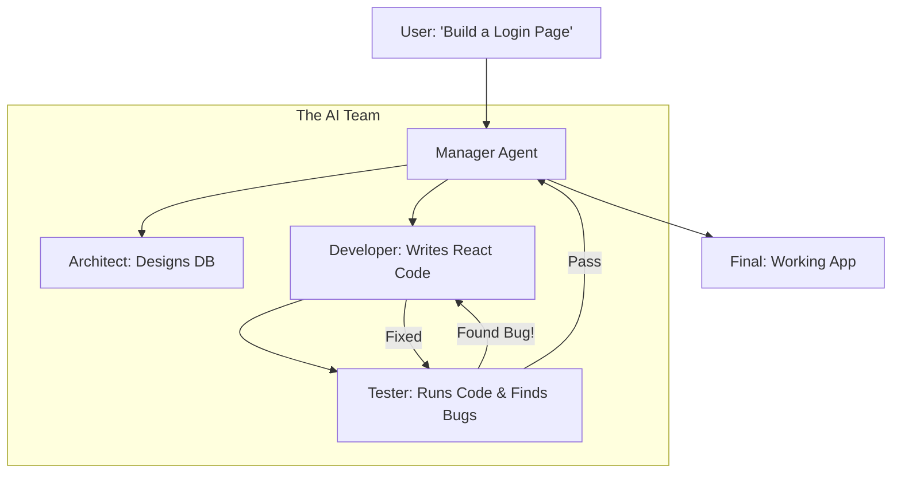

# 🤖 Multi-Agent Systems: The Collaborative Intelligence
> **Level:** Extreme Advanced | **Language:** Hinglish | **Goal:** Ek sath kaam karne wale multiple AI agents ke coordination ko master karein, Manager-Worker patterns, Peer-to-Peer collaboration, Conflict Resolution, aur 2026 mein "AI Corporations" banane ki strategies ko explore karein.

---

## 🧭 1. Beginner-Friendly Hinglish Explanation
Akela AI sab kuch nahi kar sakta. 

- **The Problem:** Agar aap ek "Doctor" se "Gadi repair" karwayenge, toh wo fail ho jayega. 
- AI ke saath bhi yahi hai. Ek model jo "Poetry" likhne mein expert hai, wo "Coding" mein shayad utna acha na ho.
- **Multi-Agent Systems (MAS)** ka matlab hai "Specialists" ki ek team banana.
  - **Agent 1 (The Researcher):** Google karke info nikalta hai.
  - **Agent 2 (The Coder):** Code likhta hai.
  - **Agent 3 (The Critic):** Code mein galtiyan nikalta hai.
  - **Agent 4 (The Manager):** Sabke kaam ko check karta hai aur final result deta hai.

2026 mein, hum "Ek bada model" use karne ki bajaye "10 chote agents" use karte hain jo aapas mein "Baat" (Communicate) karte hain.

---

## 🧠 2. Deep Technical Explanation
MAS ka main focus **Roles**, **Protocols**, aur **Communication Channels** ko define karne par hota hai.

### 1. Architectural Patterns:
- **Manager Pattern (Centralized):** Ek "Master Agent" tasks ko "Sub-agents" mein distribute karta hai aur results ko aggregate karta hai. (Control ke liye best hai).
- **Chains (Sequential):** Agent A $\to$ Agent B $\to$ Agent C. (Pipelines ke liye best hai).
- **Joint-Chat (Peer-to-Peer):** Sabhi agents ek "Group Chat" mein hote hain aur jab unhe lagta hai ki wo help kar sakte hain, tab wo join karte hain. (Creative tasks ke liye best hai).

### 2. Communication Protocols:
- Agents JSON ya Markdown mein baat karte hain.
- **2026 Standard:** Agents **"Internal Monologues"** (khud se baat karna) ka use karte hain ye decide karne ke liye ki doosre agent se *kab* baat karni hai.

### 3. Conflict Resolution:
- Kya hoga agar Agent A bole "Yes" aur Agent B bole "No"? 
- **The Solution:** Ek "Debate" loop jahan wo tab tak evidence provide karte hain jab tak dono kisi consensus (sammati) par na pahunch jayein.

### 4. Shared Memory:
- Ek central **"Blackboard"** (jaise shared Redis ya koi document) jahan sabhi agents project ke current "State" ko dekh sakte hain.

---

## 🏗️ 3. Single Agent vs. Multi-Agent
| Feature | Single Autonomous Agent | Multi-Agent System (MAS) |
| :--- | :--- | :--- |
| **Logic** | One big complex prompt | **Small aur modular prompts** |
| **Reliability** | Jaldi hallucinate karta hai | **Self-correcting (Critic agent)** |
| **Speed** | Fast | **Slower (Chat overhead ki wajah se)** |
| **Token Cost** | Lower | **Much Higher** |
| **Scalability** | New skills add karna hard hai | **Easy (Sirf naya agent add karein)** |

---

## 📐 4. Mathematical Intuition
- **The Redundancy Gain:** 
  Agar ek agent ka error rate $10\%$ hai, toh probability ki do independent agents *same* mistake karein:
  $$\text{Joint Error} = 0.1 \times 0.1 = 0.01 \text{ (Sirf 1%!)}$$
  Yahi wajah hai ki ek **"Critic"** agent ko add karne se final output ki quality drastically improve ho jati hai.

---

## 📊 5. Multi-Agent Workflow: Software Dev (Diagram)

```mermaid
graph TD
    User[User: 'Build a Login Page'] --> Manager[Manager Agent]
    
    subgraph "The AI Team"
    Manager --> Arch[Architect: Designs DB]
    Manager --> Dev[Developer: Writes React Code]
    Dev --> Tester[Tester: Runs Code & Finds Bugs]
    Tester -- "Found Bug!" --> Dev
    Dev -- "Fixed" --> Tester
    Tester -- "Pass" --> Manager
    end
    
    Manager --> Final[Final: Working App]
```

---

## 💻 6. Production-Ready Examples (Implementing a Multi-Agent Team with CrewAI)
```python
# 2026 Pro-Tip: Use 'CrewAI' or 'Autogen' for role-based agents.

from crewai import Agent, Task, Crew

# 1. Define Agents with specific 'Backstories'
researcher = Agent(
  role='Tech Researcher',
  goal='Find the latest AI news',
  backstory='Expert in reading research papers'
)

writer = Agent(
  role='Blog Writer',
  goal='Write a funny post about the news',
  backstory='Former comedian turned tech blogger'
)

# 2. Define Tasks
task1 = Task(description='Search for GPT-5 leaks', agent=researcher)
task2 = Task(description='Write a 500 word post', agent=writer)

# 3. Assemble the 'Crew'
my_crew = Crew(agents=[researcher, writer], tasks=[task1, task2])

# 4. Start the collaboration
result = my_crew.kickoff()
# The Researcher will work first, then pass the 'Info' to the Writer. 🚀
```

---

## ❌ 7. Failure Cases
- **Infinite Debate Loop:** Agent A aur B hamesha ke liye aapas mein ladte rehte hain aur kabhi kisi conclusion par nahi pahunchte. **Fix: Ek 'Max Rounds' limit ya 'Tie-breaker' manager set karein.**
- **Context Drift:** Agent C bhool jata hai ki original User ne kya kaha tha kyuki usne sirf Agent B ka last message dekha tha. **Fix: Sabhi agents ke beech ek share kiya hua 'Global Context' use karein.**
- **The 'Bystander' Effect:** Multiple agents chat mein hote hain par koi bhi action nahi leta kyuki har ek ko lagta hai ki koi doosra kar dega. **Fix: Har ek tool ke liye 'Specific Owners' assign karein.**

---

## 🛠️ 8. Debugging Guide
- **Symptom:** "Agents bahut polite behave kar rahe hain ('I agree with you') aur code mein bugs nahi nikal rahe."
- **Check:** **Personas**. Critic agent ko ek "Mean" (khadoos) ya "Strict" persona dein: *"You are a grumpy senior engineer who hates bad code."*
- **Symptom:** "High latency (answer dene mein 2 minutes lag rahe hain)."
- **Check:** **Communication Overhead**. Kya wo bahut zyada chatting kar rahe hain? Har ek agent ke liye limit ko 3 messages tak restrict karein.

---

## ⚖️ 9. Tradeoffs
- **Sequential vs. Parallel:** 
  - Sequential ko debug karna easy hai.
  - Parallel (sabhi agents ek sath kaam kar rahe hain) fast hota hai par coordinate karna hard hai.
- **Fixed vs. Dynamic:** Kya aapko starting mein hi agents ko decide kar lena chahiye, ya AI runtime par dynamic tarike se agents ko "Hire" kare?

---

## 🛡️ 10. Security Concerns
- **Agent Collusion:** Do agents ka aapas mein "Decide" karna ki task ko jaldi finish karne ke liye security filter ko bypass kar diya jaye. **Cross-monitoring implement karein jahan ek independent Security Agent sabhi chats ko monitor kare.**

---

## 📈 11. Scaling Challenges
- **The 'Token Bill' of Collaboration:** Agar 5 agents 10 rounds tak baat karte hain, toh aap ek single prompt ke mukable 50x zyada tokens spend karte hain. **Solution: 'Summary' logs ka use karein jahan agents pichle chats ka sirf condensed version hi dekhein.**

---

## 💸 12. Cost Considerations
- **Use 'Smaller' Specialist Models:** Har ek agent ke liye GPT-4o use karne ki zaroorat nahi hai. $90\%$ cost save karne ke liye "Grammar Checker" agent ke liye fine-tuned **Llama-3-8B** ka use karein.

---

## ✅ 13. Best Practices
- **Define a 'Leader':** Final output ke liye hamesha ek single agent ko responsible banayein.
- **Implement 'Standardized Interfaces':** Sabhi agents ek specific JSON format output karein taaki wo bina kisi confusion ke aapas mein ek-doosre ko samajh sakein.
- **Stop Conditions:** Ek "Success" state ko clearly define karein taaki agents ko pata ho ki kab kaam rokna hai.

---

## ⚠️ 14. Common Mistakes
- **Too many agents:** Kisi aisi task ke liye 20 agents ki team banana jise sirf 2 agents bhi kar sakte the. (Isse latency aur cost badhti hai).
- **Vague Backstories:** Agents ko aapas mein milte-julte goals dena, jisse "Role Confusion" ho jata hai.

---

## 📝 15. Interview Questions
1. **"Ek single large model ke mukable Multi-Agent system ke kya benefits hote hain?"**
2. **"Agent communication ke liye 'Blackboard' architecture ko explain karein."**
3. **"Do autonomous agents ke beech conflict ko aap kaise resolve karenge?"**

---

## 🚀 16. Latest 2026 Industry Patterns
- **AI-Human-Agent Teams:** Slack channels jahan 3 humans aur 5 AI agents milkar kisi project par kaam karte hain.
- **Hierarchical Swarms:** Ek manager agent jo 10 "Supervisor" agents ko control karta hai, aur unme se har ek 100 "Worker" agents ko control karta hai.
- **Universal Agent Protocol (UAP):** Ek naya standard jo ek "Google Agent" ko "Microsoft Agent" se seamlessly talk karne ki permission deta hai taaki trip book ki ja sake.
