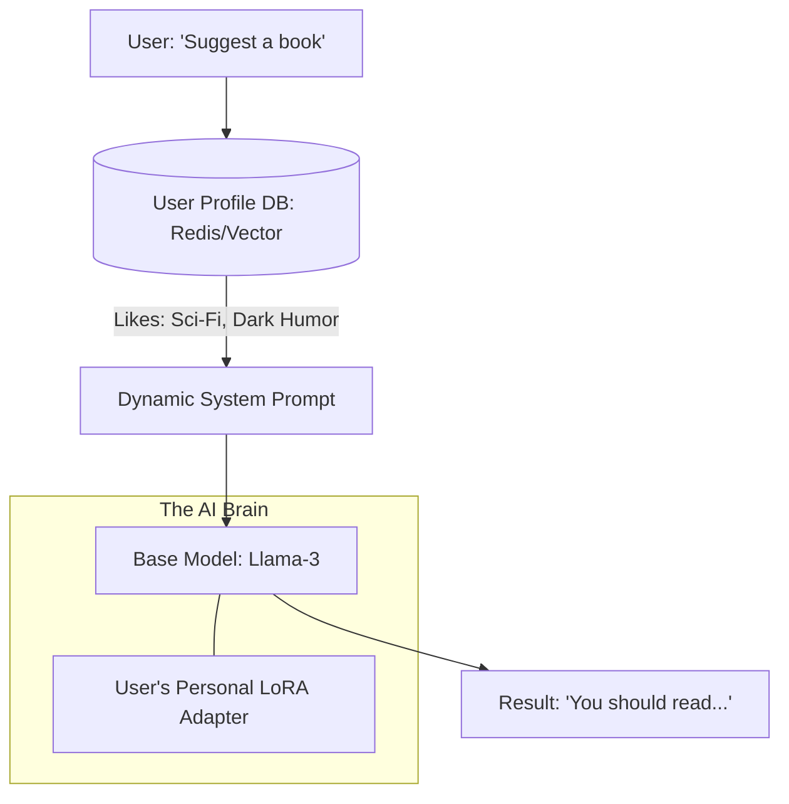

# 👤 Personalization & Fine-Tuning: AI for You
> **Level:** Advanced | **Language:** Hinglish | **Goal:** Master the techniques for making AI models adapt to specific users and domains, exploring LoRA, RAG-based personalization, Continual Learning, and the 2026 strategies for building "Hyper-Personalized" AI.

---

## 🧭 1. Beginner-Friendly Hinglish Explanation
Ek "General" AI (Jaise GPT-4) sab kuch jaanta hai, par wo "Aapko" nahi jaanta.

- **The Problem:** Agar main AI se puchun: *"Mera favourite khaana kya hai?"*, toh use nahi pata hoga. 
- AI ko "Personalize" karne ke do tareeke hain:
  1. **RAG (The Memory):** AI ke database mein aapki info save karna (e.g., aapki pichli chat, aapki profile). Jab aap kuch puchte hain, wo pehle aapki info "Read" karta hai. (Asaan aur fast).
  2. **Fine-Tuning (The Brain Change):** AI ke dimaag ko "Train" karna aapke specific data par (e.g., aapki likhne ki style). (Mushkil par "Deep" personalization).

2026 mein, hum **"LoRA Adapters"** use karte hain—ye chote chote "Brains" hote hain jo main model ke upar "Plug" ho jate hain. Har user ka apna ek personal LoRA ho sakta hai!

---

## 🧠 2. Deep Technical Explanation
Personalization is achieved by balancing **General Knowledge** with **Specific Context.**

### 1. In-Context Personalization (RAG):
- **User Profiles:** Storing user preferences, history, and style in a Vector DB.
- **Dynamic Prompting:** Injecting the top-K relevant facts about the user into the system prompt.
- **Pros:** No training cost, instant updates.

### 2. Fine-Tuning (LoRA / QLoRA):
- **LoRA (Low-Rank Adaptation):** Instead of updating 70 billion parameters, we only update about **$0.1\%$** of the weights in a separate small matrix.
- **Domain-Specific Fine-tuning:** Training on your company's internal Slack logs, Emails, and Code to make the AI "Think" like your team.

### 3. Continual Learning:
- The model updates its weights "On the fly" as it interacts with the user. (Very hard to do without "Catastrophic Forgetting").

### 4. P-Tuning & Prompt Tuning:
- Learning a special "Continuous Vector" (Soft Prompt) that represents the user's personality. It's like a "Magic Password" that tells the AI: *"Talk like Sameer Malik."*

---

## 🏗️ 3. RAG vs. Fine-Tuning for Personalization
| Feature | RAG-based Personalization | Fine-Tuning (LoRA) |
| :--- | :--- | :--- |
| **New Knowledge** | **Instant (Just add to DB)** | Requires Retraining |
| **Tone & Style** | Moderate | **Excellent (Native mimicry)** |
| **Cost** | Low (Vector DB) | High (GPU Training) |
| **Scalability** | Easy (Billions of users) | Hard (Managing 1M LoRAs) |
| **Update Frequency** | Every query | Weekly/Monthly |

---

## 📐 4. Mathematical Intuition
- **The LoRA Equation:** 
  In normal training, we change the weight matrix $W$. In LoRA, we keep $W$ frozen and add a low-rank decomposition $A \times B$.
  $$W_{new} = W_{frozen} + (A \times B)$$
  - If $W$ is $4096 \times 4096$, it has $16$ Million parameters.
  - If we use a rank $r=8$ for $A$ and $B$, they only have $4096 \times 8 \times 2 \approx 65,000$ parameters.
  - **Result:** $250x$ less memory needed!

---

## 📊 5. Personalized AI Architecture (Diagram)


---

## 💻 6. Production-Ready Examples (Switching LoRA Adapters for Users)
```python
# 2026 Pro-Tip: Use 'Peft' and 'vLLM' to serve 1000s of adapters on 1 GPU.

from peft import PeftModel, PeftConfig
from transformers import AutoModelForCausalLM

# 1. Load the base model (Once)
base_model = AutoModelForCausalLM.from_pretrained("meta-llama/Llama-3-8B")

# 2. When 'User-A' logs in, load their 50MB adapter
# This takes < 1 second!
user_a_model = PeftModel.from_pretrained(base_model, "adapters/user_a_style")

# 3. Generate personalized response
response = user_a_model.generate("What should we do today?")
# The AI now speaks in User-A's slang and style.
```

---

## ❌ 7. Failure Cases
- **Catastrophic Forgetting:** You fine-tune the model to learn about "Medicine," but it "Forgets" how to do basic math or how to speak politely. **Fix: Use 'Regularization' or 'Weight Locking'.**
- **The 'Echo Chamber' Effect:** The AI becomes so personalized that it only tells the user what they want to hear, reinforcing their biases.
- **Privacy Leak:** Training an AI on User-A's data, and then User-B accidentally seeing User-A's secrets because they share the same model. **Fix: Use 'Strict Isolation' of adapters.**

---

## 🛠️ 8. Debugging Guide
- **Symptom:** "Fine-tuning made the model 'Dumb' (repeating words)."
- **Check:** **Learning Rate**. Your learning rate is too high. You "Fried" the weights. Reduce it by $10x$.
- **Symptom:** "Model doesn't seem to have 'Learned' the new style."
- **Check:** **Rank (r)**. Your LoRA rank might be too low (e.g., $r=4$). Increase to $r=16$ or $r=32$.

---

## ⚖️ 9. Tradeoffs
- **One Model per User vs. One Model per Segment:** 
  - Per User: Ultimate experience but management nightmare. 
  - Per Segment (e.g., "Medical Doctors," "Gamers"): More stable and easier to serve.

---

## 🛡️ 10. Security Concerns
- **Poisoning Personalization:** A user purposefully giving "Bad Feedback" to their personal AI to make it say toxic things (to screenshot and sue the company). **Implement 'Output Guardrails' even on personalized models.**

---

## 📈 11. Scaling Challenges
- **The 'Adapter Switching' Bottleneck:** If 1000 users are hitting your server at once, and they all have different LoRAs, your GPU will spend all its time "Swapping" adapters instead of "Generating" tokens. **Solution: Use 'Multi-LoRA' kernels (like S-LoRA).**

---

## 💸 12. Cost Considerations
- **Training Cost:** Fine-tuning a 70B model costs about **$\$500 - \$2000$** per run. Do it only when RAG isn't enough.

---

## ✅ 13. Best Practices
- **Hybrid Personalization:** Use RAG for "Facts" (Memory) and Fine-tuning for "Tone" (Personality).
- **Evaluation is Key:** Before deploying a fine-tuned model, test it on a "General Benchmarks" (like MMLU) to ensure it hasn't become "Dumb."
- **Collect 'Natural' Data:** The best data for personalization is the user's own sent emails or chat logs (with permission).

---

## ⚠️ 14. Common Mistakes
- **Fine-tuning for 'Knowledge':** Trying to teach a model the "Price of Gold" via fine-tuning. (Use RAG for this! Prices change every minute).
- **Too much data:** Fine-tuning on 10 years of logs when only the last 6 months are relevant.

---

## 📝 15. Interview Questions
1. **"What is the difference between RAG and Fine-Tuning for personalization?"**
2. **"Explain how LoRA allows for efficient fine-tuning."**
3. **"What is 'Catastrophic Forgetting' and how do you prevent it?"**

---

## 🚀 15. Latest 2026 Industry Patterns
- **Edge Fine-Tuning:** Your phone fine-tunes a local model while you sleep, based on your day's activity. Your data never leaves your phone.
- **Emotional Adapters:** AI that switches its "Tone" (Adapter) based on the user's current mood (Detected via voice/text).
- **Universal Adapters:** A LoRA adapter that you can "Carry" from one app to another (e.g., your "Personality" in ChatGPT is the same as in your AI Mail app).
