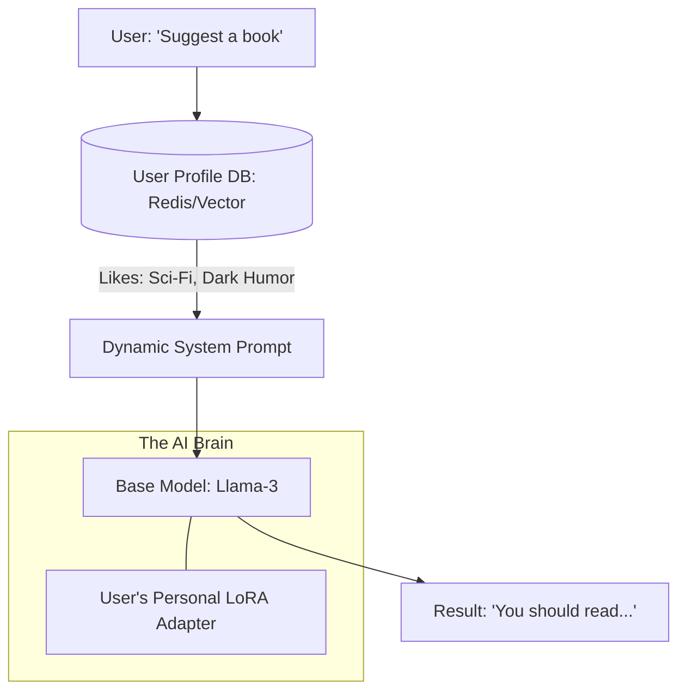

# 👤 Personalization & Fine-Tuning: AI for You
> **Level:** Advanced | **Language:** Hinglish | **Goal:** AI models ko specific users aur domains ke according adapt karne ki techniques ko master karein, LoRA, RAG-based personalization, Continual Learning, aur 2026 mein "Hyper-Personalized" AI banane ki strategies ko explore karein.

---

## 🧭 1. Beginner-Friendly Hinglish Explanation
Ek "General" AI (Jaise GPT-4) sab kuch jaanta hai, par wo "Aapko" nahi jaanta.

- **The Problem:** Agar main AI se puchun: *"Mera favourite khaana kya hai?"*, toh use nahi pata hoga. 
- AI ko "Personalize" karne ke do tareeke hain:
  1. **RAG (The Memory):** AI ke database mein aapki info save karna (e.g., aapki pichli chat, aapki profile). Jab aap kuch puchte hain, wo pehle aapki info "Read" karta hai. (Asaan aur fast).
  2. **Fine-Tuning (The Brain Change):** AI ke dimaag ko "Train" karna aapke specific data par (e.g., aapki likhne ki style). (Mushkil par "Deep" personalization).

2026 mein, hum **"LoRA Adapters"** use karte hain—ye chote chote "Brains" hote hain jo main model ke upar "Plug" ho jate hain. Har user ka apna ek personal LoRA ho sakta hai!

---

## 🧠 2. Deep Technical Explanation
Personalization ko **General Knowledge** aur **Specific Context** ke beech balance banakar achieve kiya jata hai.

### 1. In-Context Personalization (RAG):
- **User Profiles:** User preferences, history, aur style ko ek Vector DB mein store karna.
- **Dynamic Prompting:** System prompt mein user ke baare mein top-K relevant facts inject karna.
- **Pros:** Zero training cost, aur instant updates.

### 2. Fine-Tuning (LoRA / QLoRA):
- **LoRA (Low-Rank Adaptation):** 70 billion parameters ko update karne ke bajaye, hum ek alag small matrix mein sirf lagbhag **$0.1\%$** weights ko hi update karte hain.
- **Domain-Specific Fine-tuning:** Apni company ke internal Slack logs, Emails, aur Code par train karna taaki AI aapki team ki tarah "Think" (soch) sake.

### 3. Continual Learning:
- Model user ke sath interact karte waqt "On the fly" apne weights ko update karta rehta hai. (Ise bina "Catastrophic Forgetting" ke karna bahut hard hai).

### 4. P-Tuning & Prompt Tuning:
- Ek special "Continuous Vector" (Soft Prompt) ko seekhna jo user ki personality ko represent karta hai. Ye ek "Magic Password" ki tarah hai jo AI ko batata hai: *"Sameer Malik ki tarah baat karo."*

---

## 🏗️ 3. RAG vs. Fine-Tuning for Personalization
| Feature | RAG-based Personalization | Fine-Tuning (LoRA) |
| :--- | :--- | :--- |
| **New Knowledge** | **Instant (Bas DB mein add karein)** | Requires Retraining |
| **Tone & Style** | Moderate | **Excellent (Native mimicry)** |
| **Cost** | Low (Vector DB) | High (GPU Training) |
| **Scalability** | Easy (Billions of users) | Hard (1M LoRAs manage karna) |
| **Update Frequency** | Every query | Weekly/Monthly |

---

## 📐 4. Mathematical Intuition
- **The LoRA Equation:** 
  Normal training mein, hum weight matrix $W$ ko change karte hain. LoRA mein, hum $W$ ko frozen rakhte hain aur ek low-rank decomposition $A \times B$ add karte hain.
  $$W_{new} = W_{frozen} + (A \times B)$$
  - Agar $W$ matrix $4096 \times 4096$ hai, toh isme $16$ Million parameters hote hain.
  - Agar hum $A$ aur $B$ ke liye rank $r=8$ use karein, toh unme sirf $4096 \times 8 \times 2 \approx 65,000$ parameters hi honge.
  - **Result:** Isse $250x$ kam memory ki zaroorat hoti hai!

---

## 📊 5. Personalized AI Architecture (Diagram)

```mermaid
graph TD
    User[User: 'Suggest a book'] --> Profile[(User Profile DB: Redis/Vector)]
    Profile -- "Likes: Sci-Fi, Dark Humor" --> Prompt[Dynamic System Prompt]
    
    subgraph "The AI Brain"
    Base[Base Model: Llama-3]
    Adapter[User's Personal LoRA Adapter]
    Base --- Adapter
    end
    
    Prompt --> Base
    Base --> Result[Result: 'You should read...']
```

---

## 💻 6. Production-Ready Examples (Switching LoRA Adapters for Users)
```python
# 2026 Pro-Tip: Use 'Peft' and 'vLLM' to serve 1000s of adapters on 1 GPU.

from peft import PeftModel, PeftConfig
from transformers import AutoModelForCausalLM

# 1. Load the base model (Once)
base_model = AutoModelForCausalLM.from_pretrained("meta-llama/Llama-3-8B")

# 2. When 'User-A' logs in, load their 50MB adapter
# This takes < 1 second!
user_a_model = PeftModel.from_pretrained(base_model, "adapters/user_a_style")

# 3. Generate personalized response
response = user_a_model.generate("What should we do today?")
# The AI now speaks in User-A's slang and style.
```

---

## ❌ 7. Failure Cases
- **Catastrophic Forgetting:** Aap model ko "Medicine" ke baare mein seekhne ke liye fine-tune karte hain, par wo basic math karna ya polite baat karna "Forget" (bhool) jata hai. **Fix: 'Regularization' ya 'Weight Locking' ka use karein.**
- **The 'Echo Chamber' Effect:** AI itna zyada personalized ho jata hai ki wo user ko wahi batata hai jo wo sunna chahta hai, jisse uske biases aur strong ho jate hain.
- **Privacy Leak:** Model ko User-A ke data par train karna, aur fir User-B ko accidentally User-A ke secrets dikhna kyuki dono same model share kar rahe hain. **Fix: Adapters ke liye 'Strict Isolation' use karein.**

---

## 🛠️ 8. Debugging Guide
- **Symptom:** "Fine-tuning ki wajah se model 'Dumb' ho gaya hai (same words repeat kar raha hai)."
- **Check:** **Learning Rate**. Aapki learning rate bahut high hai. Aapne weights ko "Fry" kar diya hai. Ise $10x$ tak kam karein.
- **Symptom:** "Aisa lagta hai ki model ne naye style ko 'Learn' hi nahi kiya hai."
- **Check:** **Rank (r)**. Aapka LoRA rank shayad bahut low hai (jaise $r=4$). Ise badhakar $r=16$ ya $r=32$ karein.

---

## ⚖️ 9. Tradeoffs
- **One Model per User vs. One Model per Segment:** 
  - Per User: Ultimate experience par use manage karna ek nightmare ban jata hai.
  - Per Segment (jaise "Medical Doctors," "Gamers"): Zyada stable aur serve karne mein easy hota hai.

---

## 🛡️ 10. Security Concerns
- **Poisoning Personalization:** Kisi user ka jaanbujhkar apne personal AI ko "Bad Feedback" dena taaki wo toxic cheezein bole (taaki screenshot lekar company par case kiya ja sake). **Personalized models par bhi 'Output Guardrails' implement karein.**

---

## 📈 11. Scaling Challenges
- **The 'Adapter Switching' Bottleneck:** Agar ek sath 1000 users server ko hit kar rahe hain, aur un sabhi ke paas different LoRAs hain, toh aapka GPU tokens "Generate" karne ke bajaye apna saara time adapters ko "Swap" (change) karne mein hi nikal dega. **Solution: Multi-LoRA kernels (jaise S-LoRA) ka use karein.**

---

## 💸 12. Cost Considerations
- **Training Cost:** Ek 70B model ko fine-tune karne ki cost lagbhag **$\$500 - \$2000$** per run hoti hai. Ise tabhi karein jab RAG kaafi na ho.

---

## ✅ 13. Best Practices
- **Hybrid Personalization:** "Facts" (Memory) ke liye RAG aur "Tone" (Personality) ke liye Fine-tuning dono ka mix use karein.
- **Evaluation is Key:** Fine-tuned model ko deploy karne se pehle, use "General Benchmarks" (jaise MMLU) par test karein taaki ensure ho sake ki wo "Dumb" nahi hua hai.
- **Collect 'Natural' Data:** Personalization ke liye sabse best data user ke khud ke sent emails ya chat logs hote hain (permission ke sath).

---

## ⚠️ 14. Common Mistakes
- **Fine-tuning for 'Knowledge':** Fine-tuning ke zariye model ko "Price of Gold" sikhane ki koshish karna. (Iske liye RAG ka use karein! Prices har minute change hoti hain).
- **Too much data:** 10 saal purane logs par fine-tune karna jabki sirf pichle 6 mahine ka data hi relevant hai.

---

## 📝 15. Interview Questions
1. **"Personalization ke liye RAG aur Fine-Tuning ke beech kya difference hai?"**
2. **"Explain karein ki LoRA efficient fine-tuning kaise allow karta hai."**
3. **"Catastrophic Forgetting kya hai aur aap ise kaise prevent karte hain?"**

---

## 🚀 16. Latest 2026 Industry Patterns
- **Edge Fine-Tuning:** Aapka phone aapke sone ke dauran, aapke din bhar ki activity ke basis par ek local model ko fine-tune karta hai. Aapka data phone se kabhi bahar nahi jata.
- **Emotional Adapters:** AI jo user ke current mood (jo voice/text se detect hota hai) ke basis par apna "Tone" (Adapter) switch kar leta hai.
- **Universal Adapters:** Ek aisa LoRA adapter jise aap ek app se doosre app mein "Carry" (le ja) sakte hain (jaise ChatGPT mein aapki jo personality hai, wahi aapke AI Mail app mein bhi ho).
