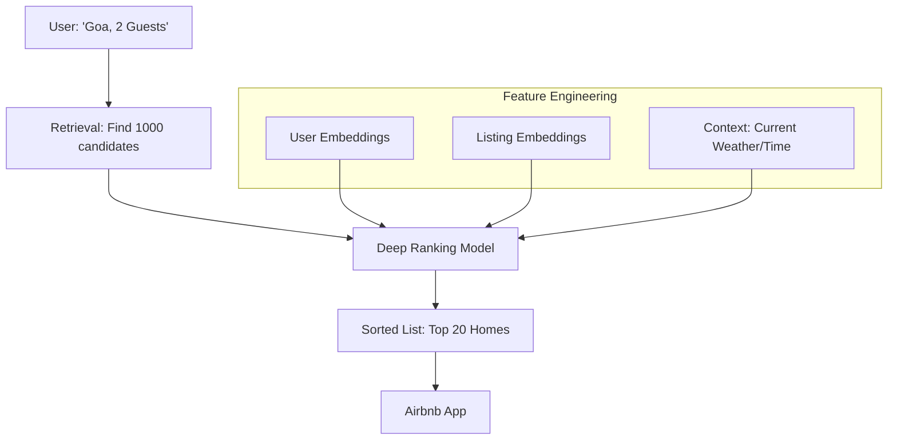

# 🏠 Airbnb Search Ranking: The Science of Hospitality
> **Level:** Advanced | **Language:** Hinglish | **Goal:** Analyze the AI architecture that determines which homes you see first on Airbnb, exploring Two-tower models, Embedding-based search, LTR (Learning to Rank), and the 2026 strategies for "Category-based" discovery.

---

## 🧭 1. Beginner-Friendly Hinglish Explanation
Maan lo aap "Goa" mein ek sasta aur acha ghar dhoond rahe hain. 

- **The Problem:** Goa mein 10,000+ homes hain. Aap sirf pehle 10-20 dekhte hain. Airbnb ko ye kaise pata ki aapko "Kon sa" ghar sabse zyada pasand aayega?
- **The Solution:** Airbnb ek "Matchmaker" hai jo do cheezon ko dekhta hai:
  1. **User (Aap):** Aapne pehle kahan stay kiya? Aapka budget kya hai? Aapko "Swimming Pool" chahiye ya "WiFi"?
  2. **Listing (Ghar):** Wo ghar kitna popular hai? Host kitni jaldi reply karta hai? Ghar ki photos kitni achi hain?
- **The Ranking:** AI har ghar ko ek "Score" deta hai aur sabse high score wale ghar ko sabse upar dikhata hai.

2026 mein, Airbnb sirf "Search" nahi karta, wo aapke "Mood" aur "Category" (e.g., *Amazing Pools, Treehouses*) ke hisaab se puri browsing experience change kar deta hai.

---

## 🧠 2. Deep Technical Explanation
Airbnb's search is a **Multi-stage Ranking Pipeline.**

### 1. Stage 1: Retrieval (Candidate Generation):
- Out of millions of listings, find the top 1000 that match the basic criteria (Location, Date, Guests).
- **Technique:** **Embedding-based Retrieval.** Both User and Listing are converted into vectors. We find the listings that are "Nearest Neighbors" to the user vector.

### 2. Stage 2: Ranking (The Deep Model):
- Taking those 1000 listings and calculating a precise "Probability of Booking."
- **Model:** **LambdaGBDT** (Gradient Boosted Decision Trees) or **Deep Neural Networks (DNN).**
- **Features:**
  - **Listing Features:** Price, Review score, Location score.
  - **User Features:** Past bookings, Search history.
  - **Context Features:** Day of the week, Season, Device.

### 3. Personalization with Listings Embeddings:
- Airbnb learned that if a user clicks on a "Modern Studio," they will probably like other "Modern Studios." 
- They use **Word2Vec** logic (called **Listing2Vec**) to learn which homes are "Similar" based on user click sequences.

### 4. Categorical Discovery (The 2026 Shift):
- Moving away from "Search Bar" to "Categories."
- Using **Vision Models** (CLIP) to automatically categorize homes based on their photos (e.g., *"This photo has a grand piano, put it in 'Creative Spaces'"*).

---

## 🏗️ 3. Search Ranking Evolution
| Era | Technology | Key Metric |
| :--- | :--- | :--- |
| **2010 (Simple)** | Boolean Search (Price < X) | None |
| **2015 (ML)** | GBDT (XGBoost) | Click-through Rate (CTR) |
| **2020 (Deep)** | Neural Networks + Embeddings | **Booking Probability** |
| **2026 (Vision)** | **Multimodal Vision + LLM** | **Guest Satisfaction (5-star)** |

---

## 📐 4. Mathematical Intuition
- **Learning to Rank (LTR):** 
  We don't just predict a score; we predict the **Order.**
  $$\text{Loss} = \sum \log(1 + \exp(-(\text{Score}_{clicked} - \text{Score}_{not\_clicked})))$$
  This formula (RankNet) ensures that the home the user actually booked has a HIGHER score than all the other homes they looked at but didn't book.

---

## 📊 5. Airbnb Search Architecture (Diagram)


---

## 💻 6. Production-Ready Examples (Conceptual: Calculating Similarity with Listing2Vec)
```python
# 2026 Pro-Tip: Use 'Embeddings' to find similar homes without tags.

from sklearn.metrics.pairwise import cosine_similarity

# 1. Suppose we have the 'Vector' for the home the user just clicked
current_home_vec = [0.1, -0.5, 0.8, ...] # 128 dimensions

# 2. Compare with all other homes in the city
# home_vectors is a matrix of (N_homes, 128)
similarities = cosine_similarity([current_home_vec], home_vectors)

# 3. Recommend the top 3 most similar homes
top_indices = np.argsort(similarities[0])[-4:-1]
print(f"People also liked these homes: {top_indices}")
```

---

## ❌ 7. Failure Cases
- **The 'Price' Trap:** The AI always shows the "Cheapest" homes, making the platform look "Low quality." **Fix: Use 'Value-for-money' features.**
- **New Listing Problem:** A new host joins. They have 0 reviews, so the AI puts them at the bottom. The host gets 0 bookings and leaves. **Fix: Use 'Exploration' - give new listings a temporary "Boost" in rank.**
- **Over-personalization:** Showing only "Cabins" because the user stayed in one 5 years ago.

---

## 🛠️ 8. Debugging Guide
- **Symptom:** "Conversion rate (Bookings) is dropping."
- **Check:** **Market Balance**. Is the AI recommending homes that are already "Fully Booked"? Ensure real-time "Availability" is a hard filter in the ranking model.
- **Symptom:** "Search is very slow (2 seconds)."
- **Check:** **Embedding Retrieval**. Are you using a slow linear search? Use an **ANN (Approximate Nearest Neighbor)** index like **HNSW** for sub-10ms search.

---

## ⚖️ 9. Tradeoffs
- **Guest vs. Host:** 
  - Guests want low prices. 
  - Hosts want high prices. 
  - **Airbnb's Goal:** Maximize the "Probability of a successful match" where both are happy.
- **Latency vs. Sophistication:** A 100-layer neural network is smart but too slow for 100 million users.

---

## 🛡️ 10. Security Concerns
- **Fraudulent Listings:** AI detecting "Fake photos" or "Scam descriptions" before the listing even goes live. **Use 'Vision-Language' consistency checks.**

---

## 📈 11. Scaling Challenges
- **Real-time Ranking:** When a host changes their price, the search ranking for the whole city might need to change instantly. **Solution: Use 'Asynchronous Feature Updates'.**

---

## 💸 12. Cost Considerations
- **Vector DB Cost:** Storing and searching millions of high-dimensional embeddings. **Strategy: Use 'Product Quantization' to compress vectors by $10x$.**

---

## ✅ 13. Best Practices
- **Use 'Multi-modal' Features:** Don't just look at the price. Use the "Aesthetics score" of the cover photo.
- **Implement 'Negative Sampling':** Train the model on homes the user "Skipped" (scrolled past) to understand what they DON'T like.
- **Context is King:** A user searching on a "Phone" in a "Airport" probably wants a "Last-minute booking" near them.

---

## ⚠️ 14. Common Mistakes
- **Ignoring 'Seasonality':** Recommending "Ski Resorts" in July.
- **Focusing on Clicks:** Clicking is easy, paying is hard. Always optimize for the **Financial Transaction**, not just the click.

---

## 📝 15. Interview Questions
1. **"What is 'Listing2Vec' and how does it help in personalization?"**
2. **"Explain the two-stage architecture of a modern search engine (Retrieval + Ranking)."**
3. **"How does Airbnb handle 'New Listings' that have no historical data?"**

---

## 🚀 15. Latest 2026 Industry Patterns
- **LLM-Powered Search:** Instead of "Goa," you type: *"A quiet place in Goa with a workspace and a kitchen, suitable for a dog."* The LLM translates this into complex filters and visual preferences.
- **Augmented Reality Previews:** Using the vision model to "Visualize" yourself in the home before booking.
- **Dynamic Pricing for Hosts:** An AI that tells the host: *"If you lower your price by $5, your booking probability will increase by 40%."*
