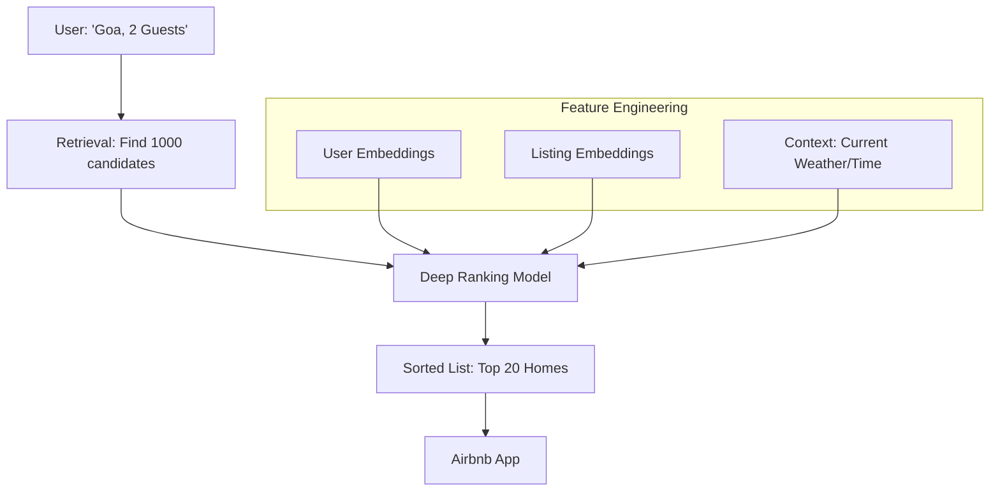

# 🏠 Airbnb Search Ranking: The Science of Hospitality
> **Level:** Advanced | **Language:** Hinglish | **Goal:** Airbnb par aapko kaunse ghar pehle dikhte hain ye decide karne wale AI architecture ko analyze karein, Two-tower models, Embedding-based search, LTR (Learning to Rank), aur 2026 mein "Category-based" discovery ki strategies ko explore karein.

---

## 🧭 1. Beginner-Friendly Hinglish Explanation
Maan lo aap "Goa" mein ek sasta aur acha ghar dhoond rahe hain. 

- **The Problem:** Goa mein 10,000+ homes hain. Aap sirf pehle 10-20 dekhte hain. Airbnb ko ye kaise pata ki aapko "Kon sa" ghar sabse zyada pasand aayega?
- **The Solution:** Airbnb ek "Matchmaker" hai jo do cheezon ko dekhta hai:
  1. **User (Aap):** Aapne pehle kahan stay kiya? Aapka budget kya hai? Aapko "Swimming Pool" chahiye ya "WiFi"?
  2. **Listing (Ghar):** Wo ghar kitna popular hai? Host kitni jaldi reply karta hai? Ghar ki photos kitni achi hain?
- **The Ranking:** AI har ghar ko ek "Score" deta hai aur sabse high score wale ghar ko sabse upar dikhata hai.

2026 mein, Airbnb sirf "Search" nahi karta, wo aapke "Mood" aur "Category" (e.g., *Amazing Pools, Treehouses*) ke hisaab se puri browsing experience change kar deta hai.

---

## 🧠 2. Deep Technical Explanation
Airbnb ka search ek **Multi-stage Ranking Pipeline** hai.

### 1. Stage 1: Retrieval (Candidate Generation):
- Millions of listings mein se, basic criteria (Location, Date, Guests) se match karne wali top 1000 listings ko dhoondna.
- **Technique:** **Embedding-based Retrieval.** User aur Listing dono ko vectors mein convert kiya jata hai. Hum un listings ko find karte hain jo user vector ke sabse "Nearest Neighbors" hoti hain.

### 2. Stage 2: Ranking (The Deep Model):
- Un 1000 listings ko lekar unki ek precise "Probability of Booking" (booking hone ki probability) calculate karna.
- **Model:** **LambdaGBDT** (Gradient Boosted Decision Trees) ya **Deep Neural Networks (DNN).**
- **Features:**
  - **Listing Features:** Price, Review score, Location score.
  - **User Features:** Past bookings, Search history.
  - **Context Features:** Day of the week, Season, Device.

### 3. Personalization with Listings Embeddings:
- Airbnb ne seekha ki agar koi user kisi "Modern Studio" par click karta hai, toh use doosre "Modern Studios" bhi pasand aane ke high chances hote hain.
- Wo **Word2Vec** logic (jise **Listing2Vec** kehte hain) ka use karte hain ye seekhne ke liye ki user ke click sequences ke basis par kaunse ghar "Similar" hain.

### 4. Categorical Discovery (The 2026 Shift):
- "Search Bar" se shift hokar "Categories" ki taraf badhna.
- Photos ke basis par gharon ko automatically categorize karne ke liye **Vision Models** (CLIP) ka use karna (jaise *"Is photo mein grand piano hai, toh ise 'Creative Spaces' mein daal do"*).

---

## 🏗️ 3. Search Ranking Evolution
| Era | Technology | Key Metric |
| :--- | :--- | :--- |
| **2010 (Simple)** | Boolean Search (Price < X) | None |
| **2015 (ML)** | GBDT (XGBoost) | Click-through Rate (CTR) |
| **2020 (Deep)** | Neural Networks + Embeddings | **Booking Probability** |
| **2026 (Vision)** | **Multimodal Vision + LLM** | **Guest Satisfaction (5-star)** |

---

## 📐 4. Mathematical Intuition
- **Learning to Rank (LTR):** 
  Hum sirf score predict nahi karte; hum **Order** (sequence) ko predict karte hain.
  $$\text{Loss} = \sum \log(1 + \exp(-(\text{Score}_{clicked} - \text{Score}_{not\_clicked})))$$
  Ye formula (RankNet) ye ensure karta hai ki user ne actual mein jis ghar ko book kiya hai uska score baki un gharon se HIGHER ho jinhe user ne dekha toh tha par book nahi kiya.

---

## 📊 5. Airbnb Search Architecture (Diagram)

```mermaid
graph TD
    User[User: 'Goa, 2 Guests'] --> Retrieval[Retrieval: Find 1000 candidates]
    
    subgraph "Feature Engineering"
    U_Embed[User Embeddings]
    L_Embed[Listing Embeddings]
    Ctx[Context: Current Weather/Time]
    end
    
    Retrieval --> Ranker[Deep Ranking Model]
    U_Embed & L_Embed & Ctx --> Ranker
    
    Ranker --> Sort[Sorted List: Top 20 Homes]
    Sort --> UI[Airbnb App]
```

---

## 💻 6. Production-Ready Examples (Conceptual: Calculating Similarity with Listing2Vec)
```python
# 2026 Pro-Tip: Use 'Embeddings' to find similar homes without tags.

from sklearn.metrics.pairwise import cosine_similarity

# 1. Suppose we have the 'Vector' for the home the user just clicked
current_home_vec = [0.1, -0.5, 0.8, ...] # 128 dimensions

# 2. Compare with all other homes in the city
# home_vectors is a matrix of (N_homes, 128)
similarities = cosine_similarity([current_home_vec], home_vectors)

# 3. Recommend the top 3 most similar homes
top_indices = np.argsort(similarities[0])[-4:-1]
print(f"People also liked these homes: {top_indices}")
```

---

## ❌ 7. Failure Cases
- **The 'Price' Trap:** AI hamesha "Cheapest" (sabse saste) ghar dikhata hai, jisse platform "Low quality" dikhne lagta hai. **Fix: 'Value-for-money' features ka use karein.**
- **New Listing Problem:** Koi naya host join karta hai. Unke paas 0 reviews hote hain, isliye AI unhe sabse niche daal deta hai. Host ko 0 bookings milti hain aur wo platform chhod deta hai. **Fix: 'Exploration' ka use karein - new listings ko rank mein temporary "Boost" dein.**
- **Over-personalization:** Sirf "Cabins" hi dikhana kyuki user 5 saal pehle kisi cabin mein ruka tha.

---

## 🛠️ 8. Debugging Guide
- **Symptom:** "Conversion rate (Bookings) drop ho raha hai."
- **Check:** **Market Balance**. Kya AI aise gharon ko recommend kar raha hai jo pehle se hi "Fully Booked" hain? Ensure karein ki real-time "Availability" ranking model mein ek hard filter ho.
- **Symptom:** "Search bahut slow hai (2 seconds lag rahe hain)."
- **Check:** **Embedding Retrieval**. Kya aap slow linear search use kar rahe hain? Sub-10ms search ke liye **HNSW** jaise **ANN (Approximate Nearest Neighbor)** index ka use karein.

---

## ⚖️ 9. Tradeoffs
- **Guest vs. Host:** 
  - Guests sasti prices chahte hain.
  - Hosts high prices chahte hain.
  - **Airbnb's Goal:** Aisi "Probability of a successful match" ko maximize karna jahan dono hi khush hon.
- **Latency vs. Sophistication:** Ek 100-layer neural network smart toh hota hai par 100 million users ke liye bahut slow ho jata hai.

---

## 🛡️ 10. Security Concerns
- **Fraudulent Listings:** Listing ke live hone se pehle hi "Fake photos" ya "Scam descriptions" ko detect karna. **Iske liye 'Vision-Language' consistency checks ka use karein.**

---

## 📈 11. Scaling Challenges
- **Real-time Ranking:** Jab koi host apni price change karta hai, toh pure city ke search ranking ko instantly change hone ki zaroorat pad sakti hai. **Solution: 'Asynchronous Feature Updates' ka use karein.**

---

## 💸 12. Cost Considerations
- **Vector DB Cost:** Millions of high-dimensional embeddings ko store aur search karna. **Strategy: Vectors ko $10x$ compress karne ke liye 'Product Quantization' ka use karein.**

---

## ✅ 13. Best Practices
- **Use 'Multi-modal' Features:** Sirf price par dhyan na dein. Cover photo ke "Aesthetics score" ka bhi use karein.
- **Implement 'Negative Sampling':** Model ko un gharon par train karein jinhe user ne "Skip" (scroll past) kiya hai taaki samjha ja sake ki unhe kya pasand NAHI hai.
- **Context is King:** Agar koi user "Airport" par apne "Phone" se search kar raha hai, toh use probably apna paas hi "Last-minute booking" chahiye.

---

## ⚠️ 14. Common Mistakes
- **Ignoring 'Seasonality':** July ke mahine mein "Ski Resorts" recommend karna.
- **Focusing on Clicks:** Click karna easy hai par pay karna hard hai. Hamesha click ke bajaye **Financial Transaction** ke liye optimize karein.

---

## 📝 15. Interview Questions
1. **"Listing2Vec kya hai aur ye personalization mein kaise help karta hai?"**
2. **"Ek modern search engine ke two-stage architecture (Retrieval + Ranking) ko explain karein."**
3. **"Airbnb un 'New Listings' ko kaise handle karta hai jinka koi historical data nahi hota?"**

---

## 🚀 16. Latest 2026 Industry Patterns
- **LLM-Powered Search:** "Goa" likhne ke bajaye, aap type karte hain: *"A quiet place in Goa with a workspace and a kitchen, suitable for a dog."* LLM ise complex filters aur visual preferences mein translate kar deta hai.
- **Augmented Reality Previews:** Booking karne se pehle home mein khud ko "Visualize" karne ke liye vision model ka use karna.
- **Dynamic Pricing for Hosts:** Aisa AI jo host ko bataye: *"If you lower your price by $5, your booking probability will increase by 40%."*
