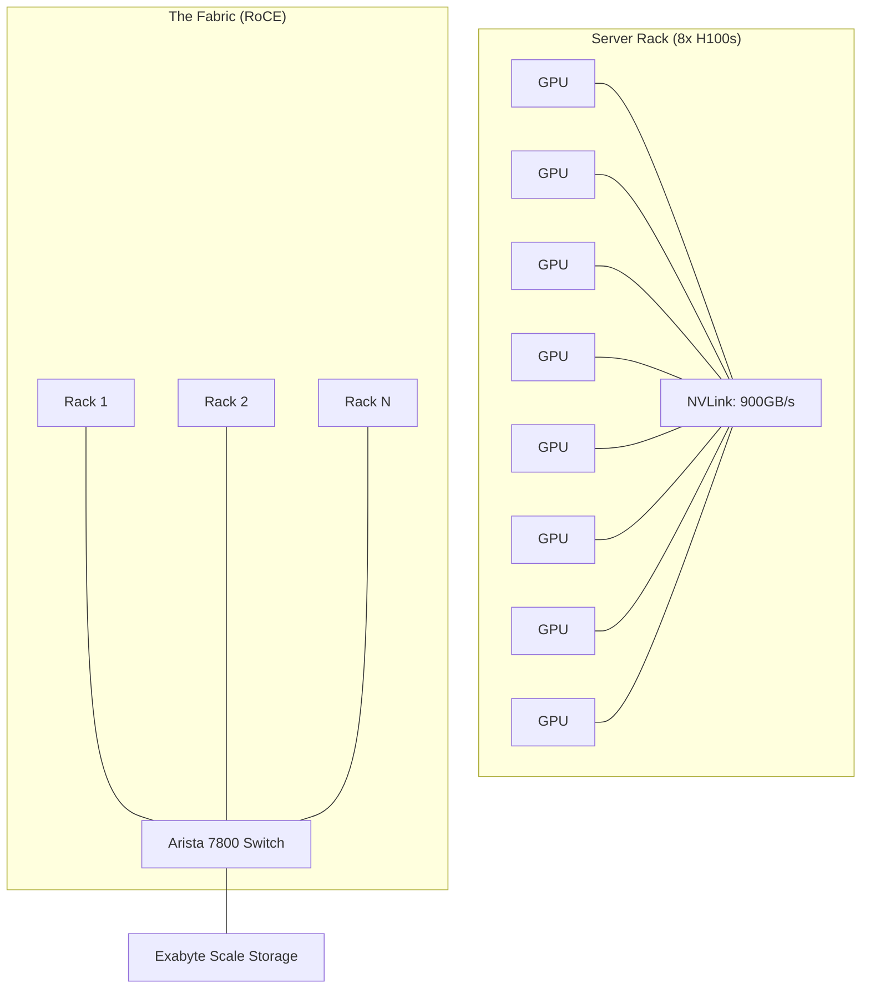

# 🦙 Meta Llama 3 Training Infrastructure: The Giant's Forge
> **Level:** Extreme Advanced | **Language:** Hinglish | **Goal:** Analyze the massive hardware and software setup used by Meta to train the world's most powerful open-source LLM, exploring 24,000 H100 clusters, RoCE networking, and the 2026 strategies for "Billion-scale" training.

---

## 🧭 1. Beginner-Friendly Hinglish Explanation
Llama-3 jaise model "Laptop" par nahi bante. Inhe banane ke liye ek "Chota Shaher" (Small City) jitni bijli aur hazaron computers chahiye.

- **The Problem:** 70 Billion parameters ko train karne ke liye 15 Trillion tokens (Words) ko model se "Guzarna" (Pass) padta hai. 
- **The Scale:** Meta ne **24,000 NVIDIA H100 GPUs** ko ek saath connect kiya. 
  - Ye GPUs ek dusre se itni fast baat karte hain ki wo pura "Cluster" ek giant supercomputer ban jata hai.
- **The Data:** Unhone 15 Trillion tokens use kiye (Internet ka lagbhag saara acha data).

2026 mein, Llama-3 ki infrastructure ek "BluePrint" ban gayi hai har us company ke liye jo apna khud ka "Sovereign AI" (Desi AI) banana chahti hai.

---

## 🧠 2. Deep Technical Explanation
Llama-3 was trained on two custom clusters, each featuring **24,576 NVIDIA H100 GPUs.**

### 1. Networking (RoCE vs. InfiniBand):
- Unlike most supercomputers that use InfiniBand, Meta used **RoCE (RDMA over Converged Ethernet).**
- **Why?** They already have massive expertise in Ethernet. 
- They built **Arista 7800** switches and optimized them to have "Zero Packet Loss," making Ethernet as fast as InfiniBand for AI.

### 2. Parallelism Strategies:
- **Tensor Parallelism:** Splitting a single layer across GPUs.
- **Pipeline Parallelism:** Splitting different layers across GPUs.
- **Data Parallelism (FSDP):** Every GPU has a copy of the model, but they only store a "Shard" (Piece) of the weights to save memory.

### 3. Checkpointing & Reliability:
- Training a 70B model takes months. If one GPU dies (and they do, every day!), the whole training crashes.
- Meta optimized **Checkpointing** to save the "State" of all 24k GPUs in under **1 minute.** This way, if a crash happens, they only lose 10-15 minutes of work.

### 4. Software Stack (PyTorch 2.0+):
- Everything is built on **PyTorch.** Meta uses **TorchFabrics** and **FlashAttention-2** to get the maximum TFLOPS out of the H100s.

---

## 🏗️ 3. Llama-2 vs. Llama-3 Infrastructure
| Feature | Llama-2 (2023) | Llama-3 (2024-2026) |
| :--- | :--- | :--- |
| **GPU Count** | 2,000 A100s | **24,576 H100s** |
| **Tokens** | 2 Trillion | **15 Trillion** |
| **Network** | InfiniBand | **RoCE (Ethernet)** |
| **Power Consumption**| ~5 MW | **~20+ MW (Small city scale)** |
| **Checkpointing** | Slow (Minutes) | **Ultra-fast (Seconds)** |

---

## 📐 4. Mathematical Intuition
- **The Training Efficiency (MFU):** 
  **Model Flops Utilization (MFU)** measures how much of the GPU's theoretical power is actually being used for "Math" vs. "Waiting for data."
  $$\text{MFU} = \frac{\text{Actual FLOPs per Second}}{\text{Peak Theoretical FLOPs}}$$
  - A bad setup has $20\%$ MFU (Gpu is idle $80\%$ of the time).
  - Meta achieved **$40-50\%$ MFU** on Llama-3, which is incredible at 24k GPU scale.

---

## 📊 5. Meta AI Cluster Architecture (Diagram)


---

## 💻 6. Production-Ready Examples (Conceptual: Calculating Model Memory)
```python
# 2026 Pro-Tip: Always calculate your VRAM budget before starting a cluster.

def calculate_llama3_vram(params_billion, precision_bytes=2):
    # 1. Weights memory
    weight_mem = params_billion * precision_bytes # e.g., 70B * 2 bytes = 140 GB
    
    # 2. Optimizer States (Adam uses 3x more)
    # 1 copy of weights, 1 copy of gradients, 2 copies of moments
    optimizer_mem = weight_mem * 4 
    
    # 3. Total
    total_mem = weight_mem + optimizer_mem
    
    return total_mem

# Llama-3-70B needs ~700GB VRAM just for the model!
# This is why you need AT LEAST 10x A100 (80GB) just to 'Load' the model.
```

---

## ❌ 7. Failure Cases (Training Nightmares)
- **The 'Silent' Hardware Error:** A GPU is doing math wrong (e.g., $2+2=5.00001$). This "Poison" spreads through the whole model and ruins 1 month of training. **Fix: Run 'Diagnostic Tests' every hour.**
- **Network Congestion:** A single "Slow" cable in the 24k cluster makes ALL 24,000 GPUs wait. **Fix: Use 'Topology-Aware' scheduling.**
- **Power Outage:** The local electricity grid can't handle the sudden "Spike" when 24,000 GPUs start a "Backward Pass."

---

## 🛠️ 8. Debugging Guide
- **Symptom:** "Loss is not decreasing (Model is not learning)."
- **Check:** **Learning Rate Warmup**. If you start with a high learning rate, the 24k GPUs will "Explode" the model weights. Start slow.
- **Symptom:** "Frequent 'Connection Timeout' errors."
- **Check:** **RoCE PFC (Priority Flow Control)**. Ensure the switches are configured to be "Lossless."

---

## ⚖️ 9. Tradeoffs
- **Buy vs. Rent:** Meta owns the GPUs. Most startups rent them. 
  - Buying is **$3x$ cheaper** per hour but requires **$\$1$ Billion** upfront.
- **Open Source vs. Proprietary:** Meta gives the weights for free, but they keep the "Training Code" and "Infrastructure details" as their secret advantage.

---

## 🛡️ 10. Security Concerns
- **Model Theft:** Someone trying to download the 140GB "Weights" file from the internal Meta server before release. **Use 'Air-gapped' training clusters.**

---

## 📈 11. Scaling Challenges
- **The 100k GPU goal:** Meta is already building a 350,000 H100 cluster for Llama-4. The challenge is "Cooling" and "Global Routing" of data.

---

## 💸 12. Cost Considerations
- **Electricity Bill:** Running 24,000 GPUs costs about **$\$1,000,000$ PER DAY** in electricity and cooling.

---

## ✅ 13. Best Practices
- **Use FSDP (Fully Sharded Data Parallelism):** The #1 way to train large models on PyTorch in 2026.
- **Automated Checkpointing:** Save weights to a fast "In-memory" storage (like Redis) before moving to a slow disk.
- **Continuous Monitoring:** Have a dashboard for **GPU Temperature**, **Power Usage**, and **Network Latency** for all 24k nodes.

---

## ⚠️ 14. Common Mistakes
- **Underestimating Networking:** Thinking that "Standard 10G Ethernet" is enough for AI training. (You need 400G+).
- **Ignoring Data Quality:** Training on 15 Trillion "Junk" tokens is worse than training on 1 Trillion "High Quality" tokens.

---

## 📝 15. Interview Questions
1. **"Why did Meta choose RoCE (Ethernet) over InfiniBand for Llama-3?"**
2. **"Explain FSDP and how it saves VRAM during training."**
3. **"What are the three main types of parallelism used in LLM training?"**

---

## 🚀 15. Latest 2026 Industry Patterns
- **Sovereign AI Clusters:** Countries like India building "Air-conditioned Data Centers" in cold regions to train Llama-3 class models.
- **AI for Infrastructure:** Using a small AI to "Tune" the network switches of the big AI cluster to reduce congestion.
- **Green AI:** Building training clusters next to **Hydro-electric dams** or **Solar farms** to reduce the carbon footprint.
