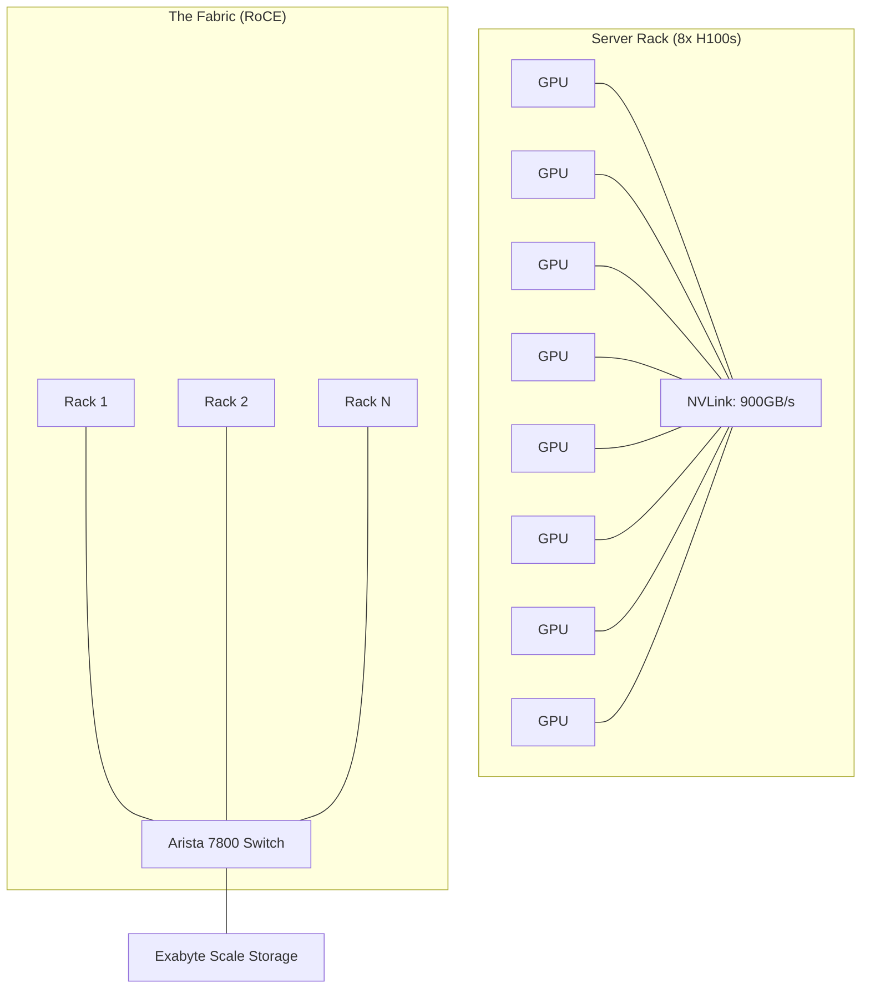

# 🦙 Meta Llama 3 Training Infrastructure: The Giant's Forge
> **Level:** Extreme Advanced | **Language:** Hinglish | **Goal:** Meta dwara duniya ka sabse powerful open-source LLM train karne ke liye use kiye gaye massive hardware aur software setup ko analyze karein, jisme 24,000 H100 clusters, RoCE networking, aur 2026 mein "Billion-scale" training ki strategies shamil hain.

---

## 🧭 1. Beginner-Friendly Hinglish Explanation
Llama-3 jaise model "Laptop" par nahi bante. Inhe banane ke liye ek "Chota Shaher" (Small City) jitni bijli aur hazaron computers chahiye.

- **The Problem:** 70 Billion parameters ko train karne ke liye 15 Trillion tokens (Words) ko model se "Guzarna" (Pass) padta hai. 
- **The Scale:** Meta ne **24,000 NVIDIA H100 GPUs** ko ek saath connect kiya. 
  - Ye GPUs ek dusre se itni fast baat karte hain ki wo pura "Cluster" ek giant supercomputer ban jata hai.
- **The Data:** Unhone 15 Trillion tokens use kiye (Internet ka lagbhag saara acha data).

2026 mein, Llama-3 ki infrastructure ek "BluePrint" ban gayi hai har us company ke liye jo apna khud ka "Sovereign AI" (Desi AI) banana chahti hai.

---

## 🧠 2. Deep Technical Explanation
Llama-3 ko do custom clusters par train kiya gaya tha, jisme se har ek mein **24,576 NVIDIA H100 GPUs** lagaye gaye the.

### 1. Networking (RoCE vs. InfiniBand):
- Zyada tar supercomputers jo InfiniBand use karte hain, unke opposite Meta ne **RoCE (RDMA over Converged Ethernet)** ka use kiya.
- **Kyun?** Kyuki unke paas Ethernet mein pehle se hi massive expertise thi.
- Unhone **Arista 7800** switches build kiye aur unhe "Zero Packet Loss" ke liye optimize kiya, jisse Ethernet AI ke liye InfiniBand jitna hi fast ho gaya.

### 2. Parallelism Strategies:
- **Tensor Parallelism:** Ek single layer ko multiple GPUs par split karna.
- **Pipeline Parallelism:** Different layers ko multiple GPUs par split karna.
- **Data Parallelism (FSDP):** Har ek GPU ke paas model ki copy hoti hai, par memory save karne ke liye wo weights ke sirf ek "Shard" (tukde) ko hi store karte hain.

### 3. Checkpointing & Reliability:
- Ek 70B model ko train karne mein mahino (months) lagte hain. Agar ek GPU bhi die (kharab) ho jata hai (jo ki har din hota hai!), toh poori training crash ho jati hai.
- Meta ne **Checkpointing** ko optimize kiya taaki sabhi 24k GPUs ke "State" ko **1 minute** se bhi kam time mein save kiya ja sake. Is tarah se, agar crash hota bhi hai, toh unka sirf 10-15 minutes ka kaam hi waste hota hai.

### 4. Software Stack (PyTorch 2.0+):
- Sab kuch **PyTorch** par built hai. Meta H100 GPUs se maximum TFLOPS nikalne ke liye **TorchFabrics** aur **FlashAttention-2** ka use karta hai.

---

## 🏗️ 3. Llama-2 vs. Llama-3 Infrastructure
| Feature | Llama-2 (2023) | Llama-3 (2024-2026) |
| :--- | :--- | :--- |
| **GPU Count** | 2,000 A100s | **24,576 H100s** |
| **Tokens** | 2 Trillion | **15 Trillion** |
| **Network** | InfiniBand | **RoCE (Ethernet)** |
| **Power Consumption**| ~5 MW | **~20+ MW (Ek chote sheher ke barabar)** |
| **Checkpointing** | Slow (Minutes) | **Ultra-fast (Seconds)** |

---

## 📐 4. Mathematical Intuition
- **The Training Efficiency (MFU):** 
  **Model Flops Utilization (MFU)** ye measure karta hai ki GPU ki theoretical power ka kitna percent actual mein "Math" ke liye use ho raha hai aur kitna percent wo "data ka wait" karne mein waste kar raha hai.
  $$\text{MFU} = \frac{\text{Actual FLOPs per Second}}{\text{Peak Theoretical FLOPs}}$$
  - Ek bad setup mein $20\%$ MFU hota hai (GPU $80\%$ time idle baitha rehta hai).
  - Meta ne Llama-3 par 24k GPU scale par **$40-50\%$ MFU** achieve kiya, jo ki sach mein incredible hai.

---

## 📊 5. Meta AI Cluster Architecture (Diagram)

```mermaid
graph TD
    subgraph "Server Rack (8x H100s)"
    G1[GPU] & G2[GPU] & G3[GPU] & G4[GPU] --- NV[NVLink: 900GB/s]
    G5[GPU] & G6[GPU] & G7[GPU] & G8[GPU] --- NV
    end
    
    subgraph "The Fabric (RoCE)"
    Rack1[Rack 1] --- Switch[Arista 7800 Switch]
    Rack2[Rack 2] --- Switch
    RackN[Rack N] --- Switch
    end
    
    Switch --- Storage[Exabyte Scale Storage]
```

---

## 💻 6. Production-Ready Examples (Conceptual: Calculating Model Memory)
```python
# 2026 Pro-Tip: Always calculate your VRAM budget before starting a cluster.

def calculate_llama3_vram(params_billion, precision_bytes=2):
    # 1. Weights memory
    weight_mem = params_billion * precision_bytes # e.g., 70B * 2 bytes = 140 GB
    
    # 2. Optimizer States (Adam uses 3x more)
    # 1 copy of weights, 1 copy of gradients, 2 copies of moments
    optimizer_mem = weight_mem * 4 
    
    # 3. Total
    total_mem = weight_mem + optimizer_mem
    
    return total_mem

# Llama-3-70B needs ~700GB VRAM just for the model!
# This is why you need AT LEAST 10x A100 (80GB) just to 'Load' the model.
```

---

## ❌ 7. Failure Cases (Training Nightmares)
- **The 'Silent' Hardware Error:** Ek GPU mathematical calculation galat kar raha hai (jaise $2+2=5.00001$). Ye "Poison" (zehar) poore model mein phail jata hai aur 1 mahine ki training ko ruin (kharab) kar deta hai. **Fix: Har ghante 'Diagnostic Tests' run karein.**
- **Network Congestion:** 24k cluster mein ek single "Slow" cable ki wajah se saare 24,000 GPUs ko wait karna padta hai. **Fix: 'Topology-Aware' scheduling ka use karein.**
- **Power Outage:** Jab 24,000 GPUs ek sath "Backward Pass" start karte hain, toh local electricity grid sudden "Spike" ko handle nahi kar pata.

---

## 🛠️ 8. Debugging Guide
- **Symptom:** "Loss decrease nahi ho raha hai (Model learn nahi kar raha)."
- **Check:** **Learning Rate Warmup**. Agar aap high learning rate se start karenge, toh 24k GPUs model weights ko "Explode" kar denge. Dheere-dheere start karein.
- **Symptom:** "Baar-baar 'Connection Timeout' errors aa rahe hain."
- **Check:** **RoCE PFC (Priority Flow Control)**. Ensure karein ki switches "Lossless" configure kiye gaye hon.

---

## ⚖️ 9. Tradeoffs
- **Buy vs. Rent:** Meta ke paas khud ke GPUs hain. Zyada tar startups unhe rent par lete hain.
  - Buy karna per hour ke hisab se **$3x$ sasta** padta hai par iske liye upfront **$\$1$ Billion** ki zaroorat hoti hai.
- **Open Source vs. Proprietary:** Meta model weights toh free mein de deta hai, par wo "Training Code" aur "Infrastructure details" ko apne secret advantage ke roop mein chupakar rakhta hai.

---

## 🛡️ 10. Security Concerns
- **Model Theft:** Release se pehle Meta ke internal server se 140GB ki "Weights" file ko download karne ki koshish karna. **Iske liye 'Air-gapped' training clusters ka use karein.**

---

## 📈 11. Scaling Challenges
- **The 100k GPU goal:** Meta Llama-4 ke liye pehle se hi ek 350,000 H100 GPU cluster build kar raha hai. Sabse bada challenge data ki "Cooling" aur "Global Routing" ka hai.

---

## 💸 12. Cost Considerations
- **Electricity Bill:** 24,000 GPUs ko run karne mein electricity aur cooling ka kharch lagbhag **$\$1,000,000$ PER DAY** aata hai.

---

## ✅ 13. Best Practices
- **Use FSDP (Fully Sharded Data Parallelism):** 2026 mein PyTorch par large models train karne ka ye #1 tareeka hai.
- **Automated Checkpointing:** Slow disk par move karne se pehle weights ko fast "In-memory" storage (jaise Redis) mein save karein.
- **Continuous Monitoring:** Sabhi 24k nodes ke liye **GPU Temperature**, **Power Usage**, aur **Network Latency** ka ek monitor dashboard rakhein.

---

## ⚠️ 14. Common Mistakes
- **Underestimating Networking:** Ye sochna ki AI training ke liye "Standard 10G Ethernet" kaafi hai. (Aapko 400G+ ki zaroorat hoti hai).
- **Ignoring Data Quality:** 15 Trillion "Junk" (kachra) tokens par train karna 1 Trillion "High Quality" tokens par train karne se badtar hai.

---

## 📝 15. Interview Questions
1. **"Meta ne Llama-3 ke liye InfiniBand ke bajaye RoCE (Ethernet) ko kyun chuna?"**
2. **"FSDP kya hai aur ye training ke dauran VRAM kaise bachata hai?"**
3. **"LLM training mein use hone wale teen main types ke parallelism kaunse hain?"**

---

## 🚀 16. Latest 2026 Industry Patterns
- **Sovereign AI Clusters:** India jaise desh Llama-3 class models ko train karne ke liye thande regions mein "Air-conditioned Data Centers" bana rahe hain.
- **AI for Infrastructure:** Congestion ko reduce karne ke liye big AI cluster ke network switches ko "Tune" karne ke liye ek chote AI ka use karna.
- **Green AI:** Carbon footprint ko kam karne ke liye training clusters ko **Hydro-electric dams** (panbijli baandh) ya **Solar farms** ke paas banana.
