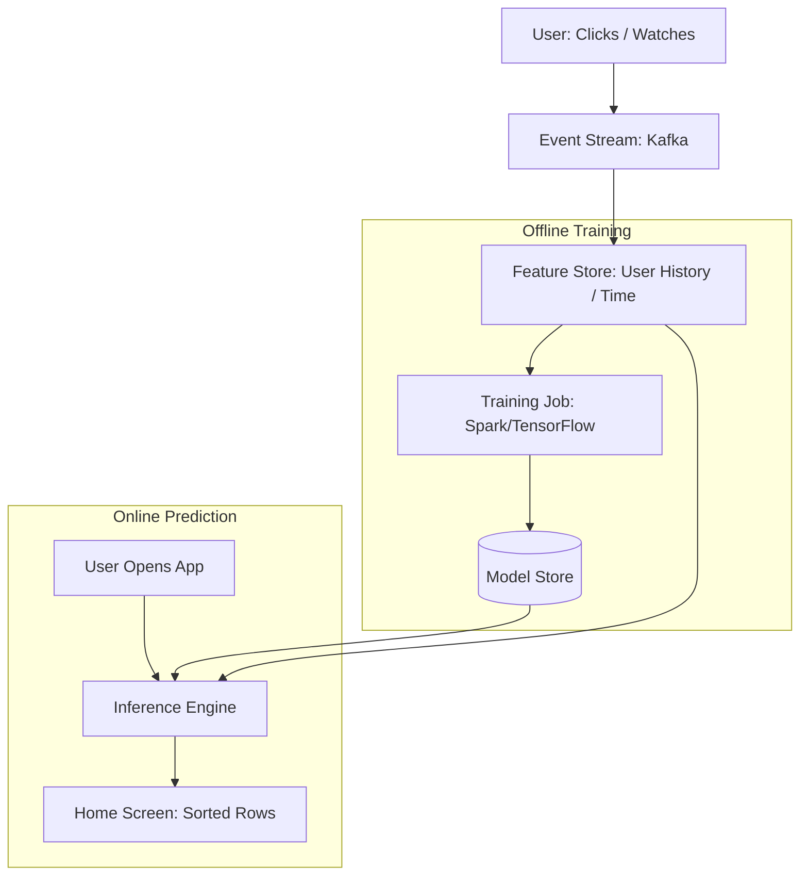

# 🎬 Netflix Recommender System: The Art of Personalization
> **Level:** Advanced | **Language:** Hinglish | **Goal:** Analyze the world's most famous recommender system, exploring Collaborative Filtering, Bandit Algorithms, Personalization at Scale, and the 2026 strategies for building "Discovery" engines.

---

## 🧭 1. Beginner-Friendly Hinglish Explanation
Aapne kabhi socha hai ki Netflix par sabki "Home Screen" alag kyun hoti hai? 

- **The Problem:** Netflix ke paas hazaron movies hain. Agar wo sabko wahi purani "Popular" movies dikhayega, toh log bor ho jayenge. 
- **The Solution:** Netflix ek "Matchmaker" ki tarah kaam karta hai. 
  1. Wo dekhta hai aapne kya dekha (History).
  2. Wo dekhta hai ki aapne "Kab" dekha (Subah ya Raat?).
  3. Wo dekhta hai aapke jaise dusre log kya dekh rahe hain.
- **The Result:** Aapko wahi dikhayi deta hai jo aap "Next" dekhna chahte hain, aksar aapke dhoondne se pehle hi!

Netflix ke liye unka algorithm "Business" hai. Agar recommendation achi hai, toh log subscription "Cancel" nahi karenge.

---

## 🧠 2. Deep Technical Explanation
Netflix uses a **Hybrid Recommender System** combining Content-based and Collaborative filtering.

### 1. The Core Algorithms:
- **Collaborative Filtering (Matrix Factorization):** "Users who liked Movie A also liked Movie B." It creates a giant matrix of Users vs. Movies and fills in the "Gaps."
- **Deep Learning (Autoencoders):** Learning the non-linear relationship between user behaviors.
- **Contextual Bandits:** Testing new movies. Instead of just showing "Best" movies, it sometimes shows a "Random" new movie to see if you like it (Exploration vs. Exploitation).

### 2. Page Generation (The 'Slates'):
- Netflix doesn't just recommend "One" movie. It recommends "Rows" (Genres).
- **Personalized Row Ranking:** The order of rows (e.g., "Trending Now" vs. "Comedy") is also personalized for you.

### 3. Artwork Personalization:
- Even the **Thumbnail** image of a movie is different for everyone. 
  - If you like "Romance," you might see a romantic scene as the thumbnail. 
  - If you like "Action," you might see an explosion scene for the SAME movie.

### 4. Infrastructure (Meson & Metaflow):
- Netflix built its own tools to manage thousands of ML experiments running simultaneously.

---

## 🏗️ 3. Recommendation Evolution
| Era | Technology | Focus |
| :--- | :--- | :--- |
| **2006 (Netflix Prize)**| Matrix Factorization | Improving RMSE (Accuracy) |
| **2015 (Deep Learning)**| Neural Networks | Handling "Implicit" feedback (Clicks)|
| **2020 (Contextual)** | Reinforcement Learning | Personalizing the "Time" and "Device"|
| **2026 (Generative)** | **LLM-based Search** | **Natural Language Discovery** |

---

## 📐 4. Mathematical Intuition
- **The Objective Function (Ranking):** 
  Netflix doesn't just predict "If" you will watch, but "How Much" you will like it.
  $$\text{Loss} = \sum (\text{Actual Rating} - \text{Predicted Rating})^2 + \lambda \|\text{Model Weights}\|^2$$
  They also use **NDCG (Normalized Discounted Cumulative Gain)** to ensure that the "Best" recommendations are at the TOP of the screen.

---

## 📊 5. Netflix AI Architecture (Diagram)


---

## 💻 6. Production-Ready Examples (Conceptual: Building a Mini-Recommender with LightFM)
```python
# 2026 Pro-Tip: Use Hybrid models that combine 'Identity' and 'Features'.

from lightfm import LightFM
from lightfm.datasets import fetch_movielens

# 1. Load sample data
data = fetch_movielens(min_rating=4.0)

# 2. Build a Hybrid Model
# 'warp' loss is great for ranking (top of the list)
model = LightFM(loss='warp')

# 3. Train
model.fit(data['train'], epochs=30, num_threads=2)

# 4. Predict for a specific user
scores = model.predict(user_id, np.arange(n_items))
top_items = labels[np.argsort(-scores)]

print(f"Recommended for you: {top_items[:5]}")
```

---

## ❌ 7. Failure Cases
- **The 'Shared Account' Problem:** A husband, wife, and kid using the same profile. The AI gets confused and recommends "Barbie" next to "John Wick." **Fix: Encourage 'Separate Profiles'.**
- **Filter Bubbles:** The AI only shows you "Horror" movies because you watched one, and you never see "Documentaries" again. **Fix: Use 'Diversity' constraints in the ranking algorithm.**
- **Cold Start:** A new movie arrives. No one has seen it, so the AI doesn't know who to recommend it to. **Fix: Use 'Content-based' features (Genre, Actors).**

---

## 🛠️ 8. Debugging Guide
- **Symptom:** "Users are scrolling for 10 minutes without clicking."
- **Check:** **Relevance vs. Novelty**. You are showing "Safe" bets that they've already seen. You need to show "Fresh" content.
- **Symptom:** "Recommended movies are already in the 'Continue Watching' list."
- **Check:** **Deduplication logic**. Ensure the recommender "Filters out" what the user is currently watching.

---

## ⚖️ 9. Tradeoffs
- **Accuracy vs. Diversity:** Do you show the "Most likely" match or a "Variety" of matches?
- **Online vs. Offline:** 
  - Offline (Batch) is cheap but doesn't react to what you watched 1 minute ago. 
  - Online (Real-time) is expensive but reacts instantly.

---

## 🛡️ 10. Security Concerns
- **Data Poisoning:** A group of people coordinatedly "Watching" a bad movie to trick the algorithm into making it "Trending."

---

## 📈 11. Scaling Challenges
- **The '200 Million User' Matrix:** You can't fit a matrix of 200M users and 50k movies in memory. **Solution: Use 'Distributed Matrix Factorization' and 'Approximate Nearest Neighbors' (ANN).**

---

## 💸 12. Cost Considerations
- **Training Frequency:** Training a 200M user model every day costs millions. **Strategy: Use 'Incremental Updates' where you only update the weights for the users who were active today.**

---

## ✅ 13. Best Practices
- **Personalize everything:** Not just movies, but rows, notifications, and artwork.
- **A/B Test everything:** Never trust your "Intuition." Trust the data from real users.
- **Handle 'Explicit' (Ratings) and 'Implicit' (Clicks/Watch time) data separately.**

---

## ⚠️ 14. Common Mistakes
- **Optimizing for 'Clicks' only:** People click on "Clickbait" but don't watch it. This leads to low satisfaction. **Optimize for 'Watch Time' or 'Long-term retention'.**
- **Ignoring the 'Long Tail':** Only recommending blockbusters and ignoring great indie movies.

---

## 📝 15. Interview Questions
1. **"How does Netflix handle the 'Cold Start' problem for new movies?"**
2. **"Explain the difference between Collaborative Filtering and Content-based Filtering."**
3. **"Why does Netflix personalize the movie thumbnails (Artwork)?"**

---

## 🚀 15. Latest 2026 Industry Patterns
- **Conversational Discovery:** Instead of scrolling, you say: *"Show me something like 'Inception' but a bit more relaxing."*
- **Multimodal Feature Extraction:** Using AI to "Watch" a movie and automatically tag it with "Dark," "Vibrant," "Slow-paced" without a human doing it.
- **Graph-based Recommendations:** Using a "Knowledge Graph" to understand that the "Director of Movie A" is the "Cousin of Actor B," creating deeper connections.
