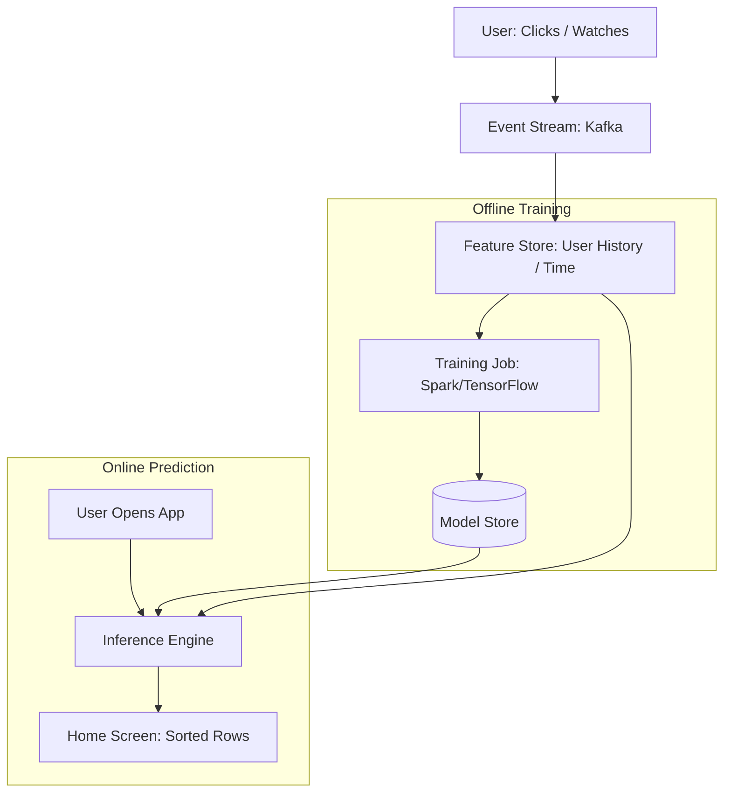

# 🎬 Netflix Recommender System: The Art of Personalization
> **Level:** Advanced | **Language:** Hinglish | **Goal:** Duniya ke sabse famous recommender system ko analyze karein, Collaborative Filtering, Bandit Algorithms, Personalization at Scale, aur 2026 mein "Discovery" engines banane ki strategies ko explore karein.

---

## 🧭 1. Beginner-Friendly Hinglish Explanation
Aapne kabhi socha hai ki Netflix par sabki "Home Screen" alag kyun hoti hai? 

- **The Problem:** Netflix ke paas hazaron movies hain. Agar wo sabko wahi purani "Popular" movies dikhayega, toh log bor ho jayenge. 
- **The Solution:** Netflix ek "Matchmaker" ki tarah kaam karta hai. 
  1. Wo dekhta hai aapne kya dekha (History).
  2. Wo dekhta hai ki aapne "Kab" dekha (Subah ya Raat?).
  3. Wo dekhta hai aapke jaise dusre log kya dekh rahe hain.
- **The Result:** Aapko wahi dikhayi deta hai jo aap "Next" dekhna chahte hain, aksar aapke dhoondne se pehle hi!

Netflix ke liye unka algorithm "Business" hai. Agar recommendation achi hai, toh log subscription "Cancel" nahi karenge.

---

## 🧠 2. Deep Technical Explanation
Netflix ek **Hybrid Recommender System** ka use karta hai jo Content-based aur Collaborative filtering dono ko combine karta hai.

### 1. The Core Algorithms:
- **Collaborative Filtering (Matrix Factorization):** "Jin users ko Movie A pasand aayi, unhe Movie B bhi pasand aayi." Ye Users vs. Movies ka ek giant matrix create karta hai aur "Gaps" (khaali jagahon) ko fill karta hai.
- **Deep Learning (Autoencoders):** User behaviors ke beech ke non-linear relationships ko seekhna.
- **Contextual Bandits:** Nayi movies ko test karna. Sirf "Best" movies dikhane ke bajaye, ye kabhi-kabhi ek "Random" nayi movie dikhata hai taaki check kar sake ki aapko pasand aati hai ya nahi (Exploration vs. Exploitation).

### 2. Page Generation (The 'Slates'):
- Netflix sirf "Ek" movie recommend nahi karta. Ye "Rows" (Genres) recommend karta hai.
- **Personalized Row Ranking:** Rows ka sequence (jaise "Trending Now" vs. "Comedy") bhi aapke liye personalized hota hai.

### 3. Artwork Personalization:
- Yahan tak ki kisi movie ka **Thumbnail** image bhi sabke liye alag hota hai.
  - Agar aapko "Romance" pasand hai, toh aapko thumbnail mein ek romantic scene dikh sakta hai.
  - Agar aapko "Action" pasand hai, toh aapko us *same* movie ke liye ek explosion (dhamaka) scene dikh sakta hai.

### 4. Infrastructure (Meson & Metaflow):
- Netflix ne ek sath chalne wale hazaron ML experiments ko manage karne ke liye apne khud ke tools build kiye hain.

---

## 🏗️ 3. Recommendation Evolution
| Era | Technology | Focus |
| :--- | :--- | :--- |
| **2006 (Netflix Prize)**| Matrix Factorization | RMSE (Accuracy) ko improve karna |
| **2015 (Deep Learning)**| Neural Networks | "Implicit" feedback (Clicks) ko handle karna|
| **2020 (Contextual)** | Reinforcement Learning | "Time" aur "Device" ko personalize karna|
| **2026 (Generative)** | **LLM-based Search** | **Natural Language Discovery** |

---

## 📐 4. Mathematical Intuition
- **The Objective Function (Ranking):** 
  Netflix sirf ye predict nahi karta ki aap dekhenge ya nahi ("If" you will watch), balki ye predict karta hai ki aap use kitna pasand karenge ("How Much" you will like it).
  $$\text{Loss} = \sum (\text{Actual Rating} - \text{Predicted Rating})^2 + \lambda \|\text{Model Weights}\|^2$$
  Wo **NDCG (Normalized Discounted Cumulative Gain)** ka use karte hain ye ensure karne ke liye ki sabse best recommendations screen ke TOP par hon.

---

## 📊 5. Netflix AI Architecture (Diagram)

```mermaid
graph TD
    User[User: Clicks / Watches] --> Events[Event Stream: Kafka]
    Events --> Features[Feature Store: User History / Time]
    
    subgraph "Offline Training"
    Features --> Train[Training Job: Spark/TensorFlow]
    Train --> Model[(Model Store)]
    end
    
    subgraph "Online Prediction"
    Request[User Opens App] --> Predict[Inference Engine]
    Model --> Predict
    Features --> Predict
    Predict --> UI[Home Screen: Sorted Rows]
    end
```

---

## 💻 6. Production-Ready Examples (Conceptual: Building a Mini-Recommender with LightFM)
```python
# 2026 Pro-Tip: Use Hybrid models that combine 'Identity' and 'Features'.

from lightfm import LightFM
from lightfm.datasets import fetch_movielens

# 1. Load sample data
data = fetch_movielens(min_rating=4.0)

# 2. Build a Hybrid Model
# 'warp' loss is great for ranking (top of the list)
model = LightFM(loss='warp')

# 3. Train
model.fit(data['train'], epochs=30, num_threads=2)

# 4. Predict for a specific user
scores = model.predict(user_id, np.arange(n_items))
top_items = labels[np.argsort(-scores)]

print(f"Recommended for you: {top_items[:5]}")
```

---

## ❌ 7. Failure Cases
- **The 'Shared Account' Problem:** Ek hi profile ko husband, wife aur baccha sabhi use kar rahe hon. AI confuse ho jata hai aur "John Wick" ke sath "Barbie" recommend karne lagta hai. **Fix: Users ko 'Separate Profiles' use karne ke liye encourage karein.**
- **Filter Bubbles:** AI aapko sirf "Horror" movies dikhata hai kyuki aapne ek horror movie dekhi thi, aur uske baad aapko kabhi "Documentaries" dikhata hi nahi. **Fix: Ranking algorithm mein 'Diversity' constraints ka use karein.**
- **Cold Start:** Ek nayi movie aati hai. Kisi ne use abhi tak nahi dekha hai, isliye AI ko nahi pata ki ise kise recommend karna chahiye. **Fix: 'Content-based' features (Genre, Actors) ka use karein.**

---

## 🛠️ 8. Debugging Guide
- **Symptom:** "Users bina kisi click ke 10 minutes tak scroll karte rehte hain."
- **Check:** **Relevance vs. Novelty**. Aap unhe wahi "Safe" content dikha rahe hain jo wo pehle bhi dekh chuke hain. Aapko unhe "Fresh" content dikhana hoga.
- **Symptom:** "Recommended movies pehle se hi 'Continue Watching' list mein hain."
- **Check:** **Deduplication logic**. Ensure karein ki recommender un movies ko "Filter out" (hata) de jinhe user abhi dekh raha hai.

---

## ⚖️ 9. Tradeoffs
- **Accuracy vs. Diversity:** Kya aap "Most likely" match dikhayenge ya matches ki ek "Variety" dikhayenge?
- **Online vs. Offline:** 
  - Offline (Batch) sasta padta hai par ye is baat par react nahi karta ki aapne 1 minute pehle kya dekha tha.
  - Online (Real-time) expensive hota hai par instantly react karta hai.

---

## 🛡️ 10. Security Concerns
- **Data Poisoning:** Logo ka ek group coordinated tarike se kisi kharab movie ko "Watch" karta hai taaki algorithm ko trick kiya ja sake aur use "Trending" banaya ja sake.

---

## 📈 11. Scaling Challenges
- **The '200 Million User' Matrix:** Aap 200M users aur 50k movies ke matrix ko memory mein fit nahi kar sakte. **Solution: 'Distributed Matrix Factorization' aur 'Approximate Nearest Neighbors' (ANN) ka use karein.**

---

## 💸 12. Cost Considerations
- **Training Frequency:** Har din 200M users ke model ko train karne mein millions ki cost aati hai. **Strategy: 'Incremental Updates' ka use karein jahan aap sirf un users ke weights ko update karte hain jo aaj active the.**

---

## ✅ 13. Best Practices
- **Personalize everything:** Sirf movies hi nahi, balki rows, notifications aur artwork sabhi ko personalize karein.
- **A/B Test everything:** Apni "Intuition" par kabhi trust na karein. Real users se aane wale data par trust karein.
- **Explicit (Ratings) aur Implicit (Clicks/Watch time) data ko alag-alag handle karein.**

---

## ⚠️ 14. Common Mistakes
- **Optimizing for 'Clicks' only:** Log "Clickbait" par click toh kar dete hain par use dekhte nahi hain. Isse guest satisfaction low ho jata hai. **Hamesha 'Watch Time' ya 'Long-term retention' ke liye optimize karein.**
- **Ignoring the 'Long Tail':** Sirf blockbusters recommend karna aur achhi indie movies ko ignore kar dena.

---

## 📝 15. Interview Questions
1. **"Netflix nayi movies ke liye 'Cold Start' problem ko kaise handle karta hai?"**
2. **"Collaborative Filtering aur Content-based Filtering ke beech ka difference explain karein."**
3. **"Netflix movie thumbnails (Artwork) ko kyun personalize karta hai?"**

---

## 🚀 16. Latest 2026 Industry Patterns
- **Conversational Discovery:** Scroll karne ke bajaye, aap bolte hain: *"Mujhe 'Inception' jaisa kuch dikhao par thoda relaxing ho."*
- **Multimodal Feature Extraction:** AI ka use karke movie ko "Watch" karna aur automatically use "Dark," "Vibrant," "Slow-paced" jaise tags dena bina kisi human effort ke.
- **Graph-based Recommendations:** "Knowledge Graph" ka use karke ye samajhna ki "Movie A ka Director" "Actor B ka Cousin" hai, jisse gehre connections banaye ja sakein.
