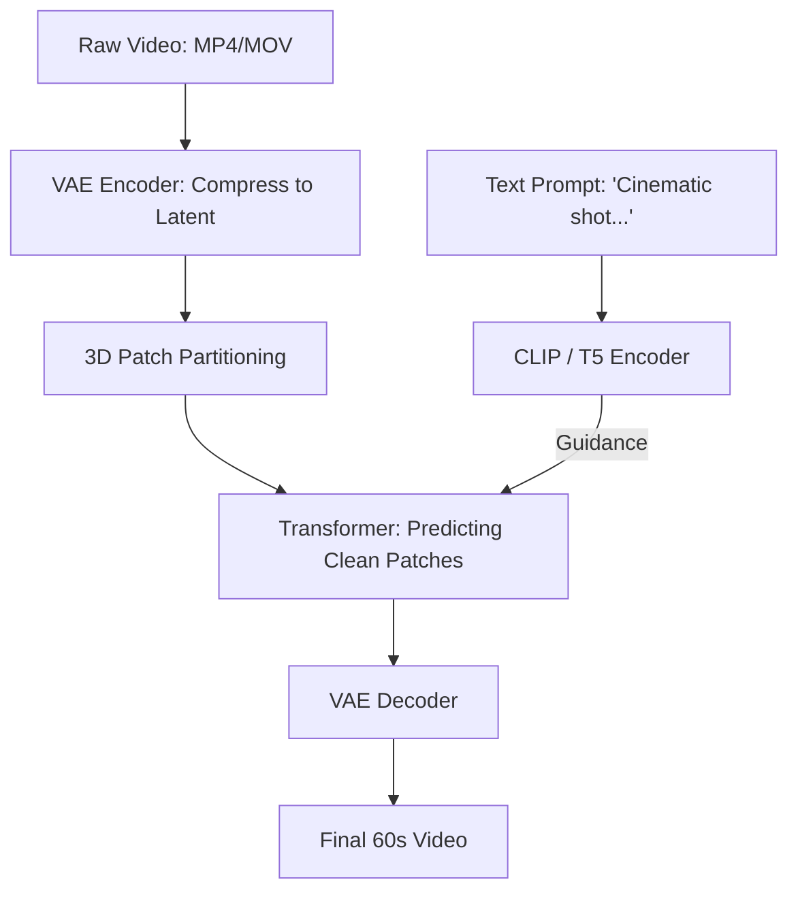

# 🎬 OpenAI Sora: An Architecture Review
> **Level:** Extreme Advanced | **Language:** Hinglish | **Goal:** Deep-dive into the technical foundations of the world's most advanced video generation model, exploring Spacetime Patches, Diffusion Transformers (DiT), and the 2026 strategies for building "World Simulators."

---

## 🧭 1. Beginner-Friendly Hinglish Explanation
Sora ko dekh kar lagta hai ki AI ne "Camera" aur "Director" dono ko replace kar diya hai.

- **The Problem:** Video banana mushkil hai kyunki har frame pichle frame ke saath "Logic" mein hona chahiye. 
- **The Breakthrough:** Sora ne video ko pixels ki tarah nahi, balki **"3D Blocks"** (Spacetime Patches) ki tarah treat kiya.
  - Maan lo aap ek cake ko chote square pieces mein kaat rahe hain.
  - Sora in pieces ko "Shuffle" karta hai aur phir se sahi jagah par "Predict" karta hai.
- **The Result:** Sora ko ye pata hai ki agar ek gadi "Pahar" (Mountain) ke peeche gayi, toh wo doosri taraf se wapis aayegi. Isse hum **Object Permanence** kehte hain.

2026 mein, Sora sirf ek "Video Maker" nahi hai, wo ek **"Physics Engine"** hai jo bina kisi manual math ke duniya ke rules samajhta hai.

---

## 🧠 2. Deep Technical Explanation
Sora's architecture is built on three pillars: **Visual Patches**, **Transformers**, and **Diffusion.**

### 1. Unified Representation of Visual Data (Patches):
- LLMs have "Tokens" (Text chunks). Sora has **"Patches"** (3D Visual chunks).
- **Process:** Video $\to$ Compressed Latent Representation $\to$ Spacetime Patches.
- This allows Sora to handle any resolution (1080p, Vertical, Square) and any duration without "Stretching" the image.

### 2. Diffusion Transformers (DiT):
- Traditional video models used "UNet" (Convolutional). Sora uses a **Transformer.**
- **Why Transformers?** They scale better with compute. Just as GPT-4 became smarter with more data, Sora's "Physics understanding" improves as the model grows.
- The Transformer predicts the "Clean" patches from "Noisy" ones, conditioned on a text prompt.

### 3. Recaptioning (DALL-E 3 method):
- Sora was trained on a dataset where the captions were **AI-generated.**
- Instead of using bad human captions (e.g., *"Cool video"*), they used a highly descriptive VLM to write: *"A woman in a red dress walking through a Tokyo street with neon signs..."*
- This high-quality text-to-image alignment is why Sora follows prompts so perfectly.

### 4. Simulation Capabilities:
- Sora can "Extend" videos (Forward/Backward in time).
- It can "Merge" two completely different videos into one smooth transition.

---

## 🏗️ 3. Sora vs. Previous Models (SVD / Gen-2)
| Feature | Previous Models (2023) | OpenAI Sora (2024-2026) |
| :--- | :--- | :--- |
| **Duration** | 4-10 seconds | **Up to 60+ seconds** |
| **Architecture** | UNet-based | **Transformer-based (DiT)** |
| **Resolution** | Fixed (e.g., 512x512) | **Variable (Flexible Aspect Ratio)**|
| **Consistency** | High flickering | **Near-perfect temporal stability**|
| **Physics** | Random movement | **Causal World Simulation** |

---

## 📐 4. Mathematical Intuition
- **The Scaling Law for Video:** 
  The intelligence of Sora ($I$) is a function of its parameters ($P$) and the training compute ($C$).
  $$I \propto f(P, C)$$
  OpenAI found that by increasing the "Patch Density" and the "Number of Layers" in the Transformer, the model stopped being just a "Painter" and started becoming a **"Simulator."**

---

## 📊 5. Sora's Technical Pipeline (Diagram)


---

## 💻 6. Production-Ready Examples (Conceptual: Calculating Patch Count)
```python
# 2026 Pro-Tip: Patch count determines the 'Cost' and 'Memory' of video generation.

def calculate_sora_tokens(width, height, frames, patch_size=16):
    # 1. Spatial patches
    spatial_patches = (width // patch_size) * (height // patch_size)
    
    # 2. Total 3D Patches (assuming no temporal compression)
    total_patches = spatial_patches * frames
    
    return total_patches

# For 1080p, 60fps, 1 second:
# (1920/16) * (1080/16) * 60 = 120 * 67 * 60 = 482,400 Patches!
# This is why Sora needs 1000s of H100s to train. 💸
```

---

## ❌ 7. Failure Cases (Sora's Limits)
- **Glass Breaking:** Sora sometimes struggles to simulate "Complex physical changes" like a glass shattering or a liquid spilling realistically.
- **Left-Right Confusion:** It might get "Directional" instructions wrong (e.g., a person walking "Left" when you said "Right").
- **Object Interaction:** A person "Eating" a cookie, but the cookie doesn't show a "Bite mark" after the person bites it. (Consistency error).

---

## 🛠️ 8. Debugging Guide
- **Symptom:** "Objects are morphing into each other in the video."
- **Check:** **Transformer Depth**. The model might need more "Layers" to maintain the structural integrity of objects across time.
- **Symptom:** "Video looks like a 3D game, not real life."
- **Check:** **Training Data**. The model might have been trained on too much "Synthetic" data (Unreal Engine) and not enough "Real" movie footage.

---

## ⚖️ 9. Tradeoffs
- **Resolution vs. Length:** In 2026, we still have to choose between a "1-minute 720p" video or a "10-second 4K" video due to GPU memory limits.
- **Creative Freedom vs. Physics:** Sometimes "Realistic Physics" makes the video boring. Sora allows for "Cinematic" exaggerated physics too.

---

## 🛡️ 10. Security Concerns
- **Visual Misinformation:** Creating a video of a "Fake Disaster" to crash the stock market. **OpenAI uses 'Safety Classifiers' that refuse to generate violence or famous people.**

---

## 📈 11. Scaling Challenges
- **The 'Memory Wall':** Storing the "KV-Cache" for 500,000 visual patches. Sora requires a technique called **Ring Attention** to spread the memory across 64+ GPUs.

---

## 💸 12. Cost Considerations
- **Subscription Model:** Generating a Sora video is so expensive that it won't be "Free" like ChatGPT. It will likely cost **$\$1-5$ per video.**

---

## ✅ 13. Best Practices
- **Use 'Highly Descriptive' Prompts:** Don't just say "A car." Say "A vintage red Ferrari driving on a coastal road in Amalfi at sunset, cinematic lighting, 35mm lens."
- **Prompt Chaining:** Use an LLM (like GPT-4o) to "Expand" your simple prompt into a "Sora-optimized" prompt.

---

## ⚠️ 14. Common Mistakes
- **Expecting 'Perfect' Continuity:** AI video is still probabilistic. There will always be small "Glitches" if you look closely.
- **Short Prompts:** Sora is a large model; it needs "Information" to create a world. One-word prompts will result in "Generic" outputs.

---

## 📝 15. Interview Questions
1. **"What is the significance of the 'Diffusion Transformer' (DiT) in Sora's design?"**
2. **"How does Sora handle variable aspect ratios and resolutions?"**
3. **"Explain 'Object Permanence' in the context of AI video generation."**

---

## 🚀 15. Latest 2026 Industry Patterns
- **Sora-for-VR:** Generating 360-degree videos in real-time for VR headsets.
- **AI-Native Post-production:** Instead of filming with cameras, directors use Sora to "Generate" the whole movie, and only the "Actors' faces" are filmed in a studio (Face-swap).
- **World-Simulator-as-a-Service:** Using Sora to simulate "Autonomous Driving" accidents so Tesla/Waymo can learn without real-world crashes.
