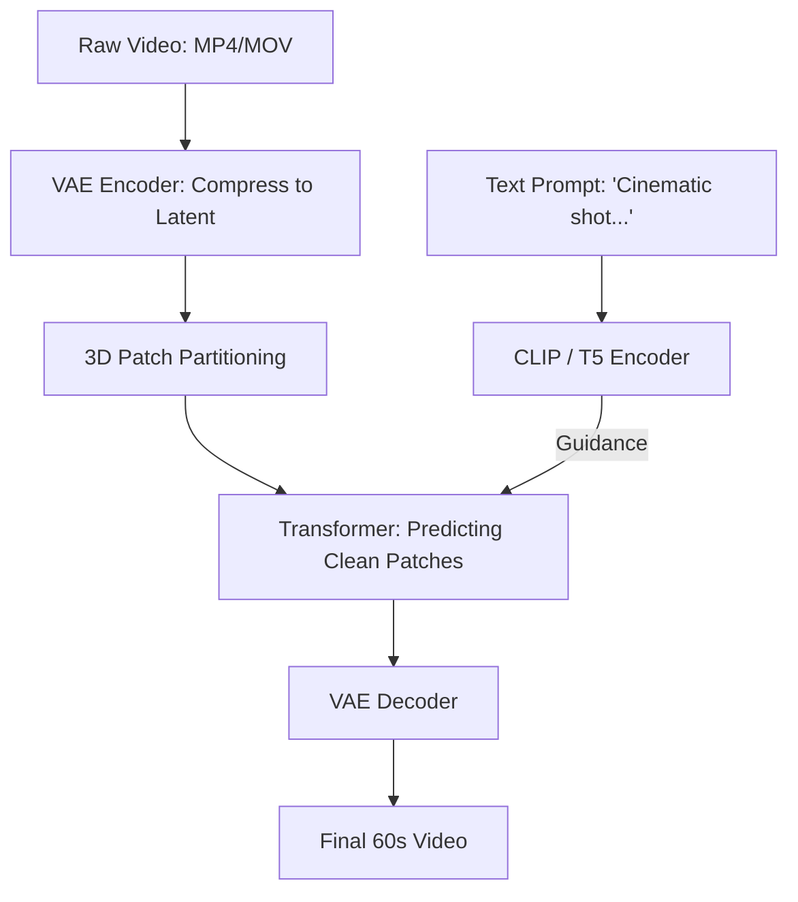

# 🎬 OpenAI Sora: An Architecture Review
> **Level:** Extreme Advanced | **Language:** Hinglish | **Goal:** Duniya ke sabse advanced video generation model ke technical foundations mein deep-dive karein, Spacetime Patches, Diffusion Transformers (DiT), aur 2026 mein "World Simulators" banane ki strategies ko explore karein.

---

## 🧭 1. Beginner-Friendly Hinglish Explanation
Sora ko dekh kar lagta hai ki AI ne "Camera" aur "Director" dono ko replace kar diya hai.

- **The Problem:** Video banana mushkil hai kyunki har frame pichle frame ke saath "Logic" mein hona chahiye. 
- **The Breakthrough:** Sora ne video ko pixels ki tarah nahi, balki **"3D Blocks"** (Spacetime Patches) ki tarah treat kiya.
  - Maan lo aap ek cake ko chote square pieces mein kaat rahe hain.
  - Sora in pieces ko "Shuffle" karta hai aur phir se sahi jagah par "Predict" karta hai.
- **The Result:** Sora ko ye pata hai ki agar ek gadi "Pahar" (Mountain) ke peeche gayi, toh wo doosri taraf se wapis aayegi. Isse hum **Object Permanence** kehte hain.

2026 mein, Sora sirf ek "Video Maker" nahi hai, wo ek **"Physics Engine"** hai jo bina kisi manual math ke duniya ke rules samajhta hai.

---

## 🧠 2. Deep Technical Explanation
Sora ka architecture teen pillars par built hai: **Visual Patches**, **Transformers**, aur **Diffusion.**

### 1. Unified Representation of Visual Data (Patches):
- LLMs mein "Tokens" (Text chunks) hote hain. Sora mein **"Patches"** (3D Visual chunks) hote hain.
- **Process:** Video $\to$ Compressed Latent Representation $\to$ Spacetime Patches.
- Isse Sora kisi bhi resolution (1080p, Vertical, Square) aur kisi bhi duration ko bina image ko "Stretch" (kheeche) kiye handle kar pata hai.

### 2. Diffusion Transformers (DiT):
- Traditional video models "UNet" (Convolutional) ka use karte the. Sora ek **Transformer** ka use karta hai.
- **Transformers Kyun?** Kyuki ye compute ke sath behtar scale hote hain. Jaise-jaise GPT-4 zyada data ke sath smart hota gaya, waise hi model bada hone par Sora ki "Physics understanding" bhi improve hoti jati hai.
- Transformer ek text prompt ke status par "Noisy" patches se "Clean" patches ko predict karta hai.

### 3. Recaptioning (DALL-E 3 method):
- Sora ko ek aise dataset par train kiya gaya tha jahan captions **AI-generated** the.
- Kharab human captions (jaise *"Cool video"*) ke bajaye, unhone ek highly descriptive VLM ka use kiya ye likhne ke liye: *"A woman in a red dress walking through a Tokyo street with neon signs..."*
- Yahi high-quality text-to-image alignment wajah hai ki Sora prompts ko itni perfectly follow karta hai.

### 4. Simulation Capabilities:
- Sora videos ko "Extend" (time mein aage ya peeche) kar sakta hai.
- Ye do bilkul different videos ko ek smooth transition ke sath "Merge" kar sakta hai.

---

## 🏗️ 3. Sora vs. Previous Models (SVD / Gen-2)
| Feature | Previous Models (2023) | OpenAI Sora (2024-2026) |
| :--- | :--- | :--- |
| **Duration** | 4-10 seconds | **60+ seconds tak** |
| **Architecture** | UNet-based | **Transformer-based (DiT)** |
| **Resolution** | Fixed (e.g., 512x512) | **Variable (Flexible Aspect Ratio)**|
| **Consistency** | Zyada flickering hoti hai | **Lagbhag perfect temporal stability**|
| **Physics** | Random movement | **Causal World Simulation** |

---

## 📐 4. Mathematical Intuition
- **The Scaling Law for Video:** 
  Sora ki intelligence ($I$) uske parameters ($P$) aur training compute ($C$) ka ek function hai.
  $$I \propto f(P, C)$$
  OpenAI ne find kiya ki Transformer mein "Patch Density" aur "Number of Layers" ko badhakar, model sirf ek "Painter" nahi raha balki ek **"Simulator"** banne laga.

---

## 📊 5. Sora's Technical Pipeline (Diagram)

```mermaid
graph TD
    Raw[Raw Video: MP4/MOV] --> VAE[VAE Encoder: Compress to Latent]
    VAE --> Patch[3D Patch Partitioning]
    Patch --> T_Embed[Transformer: Predicting Clean Patches]
    
    Prompt[Text Prompt: 'Cinematic shot...'] --> CLIP[CLIP / T5 Encoder]
    CLIP -- "Guidance" --> T_Embed
    
    T_Embed --> V_Decoder[VAE Decoder]
    V_Decoder --> Final[Final 60s Video]
```

---

## 💻 6. Production-Ready Examples (Conceptual: Calculating Patch Count)
```python
# 2026 Pro-Tip: Patch count determines the 'Cost' and 'Memory' of video generation.

def calculate_sora_tokens(width, height, frames, patch_size=16):
    # 1. Spatial patches
    spatial_patches = (width // patch_size) * (height // patch_size)
    
    # 2. Total 3D Patches (assuming no temporal compression)
    total_patches = spatial_patches * frames
    
    return total_patches

# For 1080p, 60fps, 1 second:
# (1920/16) * (1080/16) * 60 = 120 * 67 * 60 = 482,400 Patches!
# This is why Sora needs 1000s of H100s to train. 💸
```

---

## ❌ 7. Failure Cases (Sora's Limits)
- **Glass Breaking:** Sora kabhi-kabhi "Complex physical changes" ko realistically simulate karne mein struggle karta hai, jaise kanch ka tootna ya liquid ka girna.
- **Left-Right Confusion:** Ye "Directional" (disha) instructions ko galat samajh sakta hai (jaise user ne "Right" kaha par koi person "Left" chalne laga).
- **Object Interaction:** Koi insaan cookie "Eat" (kha) raha hai, par uske bite lene ke baad cookie par koi "Bite mark" (kate hue ka nishan) nahi dikhta. (Consistency error).

---

## 🛠️ 8. Debugging Guide
- **Symptom:** "Video mein objects ek-doosre ke andar morph (mix) ho rahe hain."
- **Check:** **Transformer Depth**. Model ko time ke sath objects ki structural integrity ko maintain karne ke liye aur zyada "Layers" ki zaroorat ho sakti hai.
- **Symptom:** "Video real life ki tarah nahi balki ek 3D game ki tarah dikhta hai."
- **Check:** **Training Data**. Model ko shayad bahut zyada "Synthetic" data (Unreal Engine) par train kiya gaya hai aur "Real" movie footage par kam.

---

## ⚖️ 9. Tradeoffs
- **Resolution vs. Length:** 2026 mein bhi, GPU memory limits ki wajah se humein "1-minute 720p" ya "10-second 4K" video mein se kisi ek ko hi choose karna padta hai.
- **Creative Freedom vs. Physics:** Kabhi-kabhi "Realistic Physics" video ko boring bana deti hai. Sora "Cinematic" exaggerated physics ki bhi permission deta hai.

---

## 🛡️ 10. Security Concerns
- **Visual Misinformation:** Stock market ko crash karne ke liye kisi "Fake Disaster" (jhoothi tabahi) ka video banana. **OpenAI 'Safety Classifiers' ka use karta hai jo violence ya famous logo ke images/videos generate karne se mana kar dete hain.**

---

## 📈 11. Scaling Challenges
- **The 'Memory Wall':** 500,000 visual patches ke liye "KV-Cache" ko store karna. Sora ko memory ko 64+ GPUs par spread karne ke liye **Ring Attention** naam ki technique ki zaroorat padti hai.

---

## 💸 12. Cost Considerations
- **Subscription Model:** Sora video generate karna itna expensive hai ki ye ChatGPT ki tarah "Free" nahi hoga. Iski cost lagbhag **$\$1-5$ per video** ho sakti hai.

---

## ✅ 13. Best Practices
- **Use 'Highly Descriptive' Prompts:** Don't just say "A car." Say "A vintage red Ferrari driving on a coastal road in Amalfi at sunset, cinematic lighting, 35mm lens."
- **Prompt Chaining:** Apne simple prompt ko "Sora-optimized" prompt mein "Expand" karne ke liye ek LLM (jaise GPT-4o) ka use karein.

---

## ⚠️ 14. Common Mistakes
- **Expecting 'Perfect' Continuity:** AI video abhi bhi probabilistic. Agar aap dhyan se dekhenge toh hamesha chote-chote "Glitches" dikhenge.
- **Short Prompts:** Sora ek bada model hai; ise world create karne ke liye "Information" chahiye. One-word prompts se "Generic" (sadharan) outputs hi milenge.

---

## 📝 15. Interview Questions
1. **"Sora ke design mein 'Diffusion Transformer' (DiT) ki kya significance hai?"**
2. **"Sora variable aspect ratios aur resolutions ko kaise handle karta hai?"**
3. **"AI video generation ke context mein 'Object Permanence' ko explain karein."**

---

## 🚀 16. Latest 2026 Industry Patterns
- **Sora-for-VR:** VR headsets ke liye real-time mein 360-degree videos generate karna.
- **AI-Native Post-production:** Cameras ke sath film karne ke bajaye, directors poori movie ko "Generate" karne ke liye Sora ka use karte hain, aur studio mein sirf actors ke faces ko hi film kiya jata hai (Face-swap).
- **World-Simulator-as-a-Service:** Autonomous driving accidents ko simulate karne ke liye Sora ka use karna taaki Tesla/Waymo bina kisi real crash ke seekh sakein.
