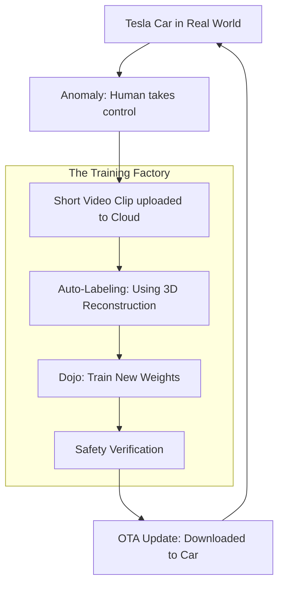

# 🚗 Tesla Autopilot Infrastructure: The AI on Wheels
> **Level:** Extreme Advanced | **Language:** Hinglish | **Goal:** Analyze the hardware and software architecture of Tesla's self-driving system, exploring HydraNets, Occupancy Networks, Dojo Supercomputer, and the 2026 strategies for "End-to-End" AI driving.

---

## 🧭 1. Beginner-Friendly Hinglish Explanation
Tesla ki gadi sirf "Gadi" nahi hai, wo ek "Chalta-phirta AI Robot" hai.

- **The Problem:** Ek gadi ko ye batana ki "Kab break lagana hai" aur "Kab modna hai" bahut mushkil hai kyunki road par kuch bhi ho sakta hai. 
- **Tesla's Strategy:** 
  1. Tesla "Lidar" (Laser) use nahi karta, wo sirf **"Cameras"** use karta hai (Jaise humari aankhein).
  2. Gadi mein 8 cameras hote hain jo charo taraf dekhte hain.
  3. Ye cameras data ko ek "Supercomputer" (Gadi ke andar) bhejte hain jo 1 second mein lakho faisle leta hai.
- **The Data Engine:** Jab aap Tesla chalate hain aur koi galti hoti hai, toh wo "Data" Tesla ke server par jata hai. Wahan ek giant "Dojo" supercomputer usse seekhta hai aur "Update" saari gadiyon ko bhej deta hai.

2026 mein, Tesla ka "FSD" (Full Self-Driving) "Neural Networks" par chalta hai—yani gadi "Logic" se nahi, balki "Intuition" se chalti hai jaise hum chalate hain.

---

## 🧠 2. Deep Technical Explanation
Tesla's AI architecture has evolved from simple 2D image processing to **4D Spatio-Temporal Networks.**

### 1. The HydraNet:
- A single "Backbone" (ResNet/RegNet) that processes all 8 camera feeds.
- Multiple "Heads" branch off to perform different tasks:
  - **Head 1:** Detect Traffic Lights.
  - **Head 2:** Detect Pedestrians.
  - **Head 3:** Detect Lane Lines.
- **Benefit:** Shared features make it $10x$ faster than running 8 separate models.

### 2. Occupancy Networks (The 3D World):
- Converting 2D pixels into a 3D "Voxel" map. 
- The AI doesn't need to know what an object is (Is it a box? A dog?). It just needs to know: *"Is this space occupied or empty?"* This is how it avoids "Unseen" obstacles.

### 3. The Dojo Supercomputer:
- Tesla's custom AI training hardware. 
- Designed for **High-bandwidth communication** between chips. It is optimized for training on "Video" data rather than just "Images."

### 4. End-to-End (v12+):
- Moving away from "If-Else" code. 
- **Input:** Video pixels. 
- **Output:** Steering angle, Accelerator, and Brake. 
- The whole driving logic is inside a giant neural network.

---

## 🏗️ 3. Tesla vs. Waymo (The Great Debate)
| Feature | Tesla (Vision-Only) | Waymo (Lidar-based) |
| :--- | :--- | :--- |
| **Hardware** | Cameras only | Cameras + Lidar + Radar |
| **Cost** | **Low (Cheap to build)** | High ($$$ sensors) |
| **Mapping** | **General (Anywhere)** | HD-Mapped (Specific cities) |
| **Data Source** | **Millions of customer cars** | Small fleet of test cars |
| **Philosophy** | "AI should see like a human" | "AI should have 'Super' sensors"|

---

## 📐 4. Mathematical Intuition
- **Vector Space Alignment:** 
  The 8 cameras have "Overlap." A car moving from the 'Front-Left' camera to the 'Left' camera must be tracked as the **Same Object.**
  Tesla uses a **Transformer-based Fusion** that projects all camera features into a single "Top-Down" (Bird's Eye View) coordinate system.
  $$\text{BEV Space} = \text{Transformer}(\text{Cam}_1, \text{Cam}_2, \dots, \text{Cam}_8)$$

---

## 📊 5. Tesla Data Engine Loop (Diagram)


---

## 💻 6. Production-Ready Examples (Conceptual: A Simple 'Occupancy Grid' logic)
```python
# 2026 Pro-Tip: Self-driving is about 'Probability' of space being occupied.

import numpy as np

def update_occupancy_grid(sensor_data):
    # 1. Create a 3D grid of 0s (Empty)
    grid = np.zeros((100, 100, 20)) 
    
    # 2. For every pixel in the camera, project it into 3D space
    for pixel in sensor_data:
        x, y, z = camera_to_world(pixel)
        grid[x, y, z] = 1 # Occupied
        
    # 3. Path Planner: Find a path where grid[x,y,z] == 0
    return plan_path(grid)

# Real Tesla code uses 'Transformers' to do this instantly at 36 FPS.
```

---

## ❌ 7. Failure Cases
- **Phantom Braking:** The AI sees a "Shadow" or a "Reflection" and thinks it's a wall, slamming the brakes. **Fix: Use 'Temporal Context' (If the shadow is moving with the car, it's not a wall).**
- **Edge Cases:** A person wearing a "Stop Sign" t-shirt.
- **Occlusion:** A kid running from behind a parked van. The AI must "Predict" that a kid *could* be there even if it can't see them.

---

## 🛠️ 8. Debugging Guide
- **Symptom:** "Car is hugging the left side of the lane too much."
- **Check:** **Training Bias**. Did the training data contain too many "Highway" drives where cars naturally stay left?
- **Symptom:** "Delayed reaction to traffic lights."
- **Check:** **Inference Latency**. If the HydraNet takes $200ms$ to run, at 100 km/h, the car has moved 5 meters before the AI "Saw" the light.

---

## ⚖️ 9. Tradeoffs
- **On-board Compute vs. Model Size:** 
  - You can't put a 175B GPT model in a car. 
  - You need small, hyper-efficient C++ kernels that use $100\%$ of the custom Tesla FSD chip.

---

## 🛡️ 10. Security Concerns
- **Adversarial Stickers:** Putting a small sticker on a "Speed Limit 35" sign to make it look like "85" to the AI. **Fix: Use 'Multi-sensor' cross-verification.**

---

## 📈 11. Scaling Challenges
- **The 'Shadow Mode':** Running a new AI version in the background of 1 million cars without letting it "Control" the car, just to see if its decisions would have been better than the current AI.

---

## 💸 12. Cost Considerations
- **Data Ingress:** The cost of 1 million cars uploading 1GB of video clips every day. **Strategy: Only upload clips where the AI was 'Uncertain' or the Human 'Intervened'.**

---

## ✅ 13. Best Practices
- **Fleet Learning:** Treat your customers as your labeling team.
- **Redundancy:** Even with 'Vision-only', use the **Ultrasonic sensors** and **GPS** as secondary checks.
- **Simulation First:** Run every AI update through 1 billion miles of "Virtual" driving (Tesla Simulation) before putting it in a real car.

---

## ⚠️ 14. Common Mistakes
- **Hard-coding rules:** Writing `if (red_light) stop();`. In the real world, you might need to "Slowly creep forward" to see better. Use **End-to-End learning** instead.
- **Ignoring Rain/Snow:** Only training in "Sunny California."

---

## 📝 15. Interview Questions
1. **"What is a HydraNet and why is it used in Tesla's architecture?"**
2. **"Explain the 'Data Engine' loop in Tesla's AI development."**
3. **"Why did Tesla move away from Radar and Lidar?"**

---

## 🚀 15. Latest 2026 Industry Patterns
- **Full Foundation Driving Models:** Models that have been trained on ALL dashcam videos on YouTube to understand "Common Sense" driving.
- **V2X (Vehicle-to-Everything):** Tesla cars talking to "Smart Traffic Lights" to know when they will turn green before the camera even sees them.
- **Robotaxi Orchestration:** A central AI that manages 100,000 driverless Teslas, telling them where to go to pick up passengers most efficiently.
