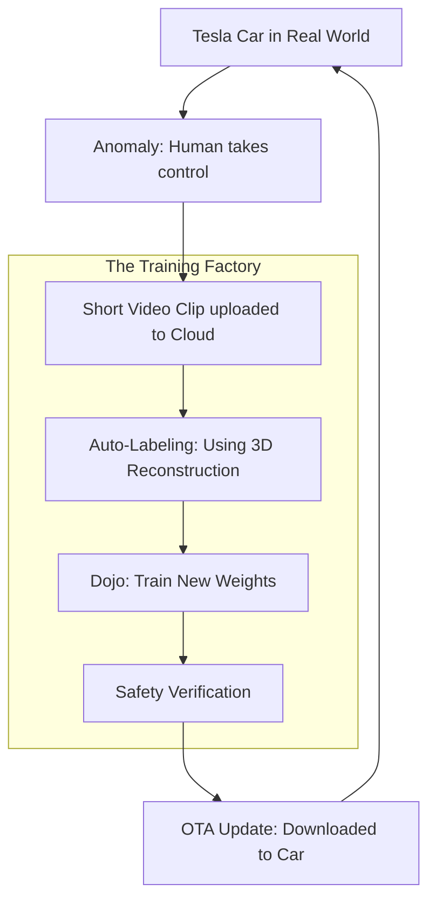

# 🚗 Tesla Autopilot Infrastructure: The AI on Wheels
> **Level:** Extreme Advanced | **Language:** Hinglish | **Goal:** Tesla ke self-driving system ke hardware aur software architecture ko analyze karein, HydraNets, Occupancy Networks, Dojo Supercomputer, aur 2026 mein "End-to-End" AI driving ki strategies ko explore karein.

---

## 🧭 1. Beginner-Friendly Hinglish Explanation
Tesla ki gadi sirf "Gadi" nahi hai, wo ek "Chalta-phirta AI Robot" hai.

- **The Problem:** Ek gadi ko ye batana ki "Kab break lagana hai" aur "Kab modna hai" bahut mushkil hai kyunki road par kuch bhi ho sakta hai. 
- **Tesla's Strategy:** 
  1. Tesla "Lidar" (Laser) use nahi karta, wo sirf **"Cameras"** use karta hai (Jaise humari aankhein).
  2. Gadi mein 8 cameras hote hain jo charo taraf dekhte hain.
  3. Ye cameras data ko ek "Supercomputer" (Gadi ke andar) bhejte hain jo 1 second mein lakho faisle leta hai.
- **The Data Engine:** Jab aap Tesla chalate hain aur koi galti hoti hai, toh wo "Data" Tesla ke server par jata hai. Wahan ek giant "Dojo" supercomputer usse seekhta hai aur "Update" saari gadiyon ko bhej deta hai.

2026 mein, Tesla ka "FSD" (Full Self-Driving) "Neural Networks" par chalta hai—yani gadi "Logic" se nahi, balki "Intuition" se chalti hai jaise hum chalate hain.

---

## 🧠 2. Deep Technical Explanation
Tesla ka AI architecture ab simple 2D image processing se **4D Spatio-Temporal Networks** par evolve ho chuka hai.

### 1. The HydraNet:
- Ek single "Backbone" (ResNet/RegNet) jo sabhi 8 camera feeds ko process karta hai.
- Multiple "Heads" is backbone se branch-out hote hain different tasks perform karne ke liye:
  - **Head 1:** Traffic Lights ko detect karna.
  - **Head 2:** Pedestrians (paidal chalne walo) ko detect karna.
  - **Head 3:** Lane Lines ko detect karna.
- **Benefit:** Shared features ki wajah se ye 8 alag models chalane ke mukable $10x$ fast hota hai.

### 2. Occupancy Networks (The 3D World):
- 2D pixels ko 3D "Voxel" map mein convert karna.
- AI ko ye janne ki zaroorat nahi hai ki koi object kya hai (Kya ye box hai? Kutta hai?). Ise bas ye janne ki zaroorat hai: *"Kya ye space occupied hai ya empty (khali) hai?"* Is tarah se ye "Unseen" (na dekhe gaye) obstacles se bachta hai.

### 3. The Dojo Supercomputer:
- Tesla ka custom AI training hardware.
- Chips ke beech **High-bandwidth communication** ke liye design kiya gaya hai. Ye sirf "Images" ke bajaye "Video" data par train karne ke liye optimized hai.

### 4. End-to-End (v12+):
- "If-Else" code se aage badhna.
- **Input:** Video pixels.
- **Output:** Steering angle, Accelerator, aur Brake.
- Poori driving logic ek giant neural network ke andar hi hoti hai.

---

## 🏗️ 3. Tesla vs. Waymo (The Great Debate)
| Feature | Tesla (Vision-Only) | Waymo (Lidar-based) |
| :--- | :--- | :--- |
| **Hardware** | Sirf cameras | Cameras + Lidar + Radar |
| **Cost** | **Low (Banana sasta hai)** | High (Expensive sensors) |
| **Mapping** | **General (Kahin bhi)** | HD-Mapped (Specific cities) |
| **Data Source** | **Customers ki millions of cars** | Test cars ka chota fleet |
| **Philosophy** | "AI ko insaan ki tarah dekhna chahiye" | "AI ke paas 'Super' sensors hone chahiye"|

---

## 📐 4. Mathematical Intuition
- **Vector Space Alignment:** 
  8 cameras mein "Overlap" hota hai. 'Front-Left' camera se 'Left' camera ki taraf move hone wali car ko **Same Object** ke roop mein track kiya jana chahiye.
  Tesla ek **Transformer-based Fusion** ka use karta hai jo sabhi camera features ko ek single "Top-Down" (Bird's Eye View - BEV) coordinate system mein project karta hai.
  $$\text{BEV Space} = \text{Transformer}(\text{Cam}_1, \text{Cam}_2, \dots, \text{Cam}_8)$$

---

## 📊 5. Tesla Data Engine Loop (Diagram)

```mermaid
graph TD
    Car[Tesla Car in Real World] --> Trigger[Anomaly: Human takes control]
    Trigger --> Upload[Short Video Clip uploaded to Cloud]
    
    subgraph "The Training Factory"
    Upload --> Label[Auto-Labeling: Using 3D Reconstruction]
    Label --> Dojo[Dojo: Train New Weights]
    Dojo --> Eval[Safety Verification]
    end
    
    Eval --> Update[OTA Update: Downloaded to Car]
    Update --> Car
```

---

## 💻 6. Production-Ready Examples (Conceptual: A Simple 'Occupancy Grid' logic)
```python
# 2026 Pro-Tip: Self-driving is about 'Probability' of space being occupied.

import numpy as np

def update_occupancy_grid(sensor_data):
    # 1. Create a 3D grid of 0s (Empty)
    grid = np.zeros((100, 100, 20)) 
    
    # 2. For every pixel in the camera, project it into 3D space
    for pixel in sensor_data:
        x, y, z = camera_to_world(pixel)
        grid[x, y, z] = 1 # Occupied
        
    # 3. Path Planner: Find a path where grid[x,y,z] == 0
    return plan_path(grid)

# Real Tesla code uses 'Transformers' to do this instantly at 36 FPS.
```

---

## ❌ 7. Failure Cases
- **Phantom Braking:** AI kisi "Shadow" (parchhai) ya "Reflection" ko wall samajh leta hai aur slam break laga deta hai. **Fix: 'Temporal Context' ka use karein (Agar shadow car ke sath move ho raha hai, toh wo wall nahi hai).**
- **Edge Cases:** Aisa person jisne "Stop Sign" print wali t-shirt pehni ho.
- **Occlusion:** Parked van ke peeche se kisi bacche ka bhaag kar aana. AI ko ye "Predict" karna hoga ki wahan koi baccha *ho* sakta hai bhale hi wo camera ko dikh na raha ho.

---

## 🛠️ 8. Debugging Guide
- **Symptom:** "Car lane ke left side ko bahut zyada hug (stay near) kar rahi hai."
- **Check:** **Training Bias**. Kya training data mein bahut zyada "Highway" drives shamil thi jahan cars naturally left mein rehti hain?
- **Symptom:** "Traffic lights par delayed (late) reaction de rahi hai."
- **Check:** **Inference Latency**. Agar HydraNet chalne mein $200ms$ bhaagta hai, toh 100 km/h ki speed par car 5 meters aage chali jayegi isse pehle ki AI light ko "Dekh" paaye.

---

## ⚖️ 9. Tradeoffs
- **On-board Compute vs. Model Size:** 
  - Aap kisi car ke andar 175B parameters wala GPT model nahi rakh sakte.
  - Aapko chote, hyper-efficient C++ kernels ki zaroorat hoti hai jo custom Tesla FSD chip ka $100\%$ use kar sakein.

---

## 🛡️ 10. Security Concerns
- **Adversarial Stickers:** "Speed Limit 35" sign par ek chota sticker laga dena taaki wo AI ko "85" dikhe. **Fix: 'Multi-sensor' cross-verification ka use karein.**

---

## 📈 11. Scaling Challenges
- **The 'Shadow Mode':** 1 million cars ke background mein naye AI version ko run karna (bina use car ka "Control" diye) taaki check kiya ja sake ki kya uske decisions current AI se behtar hote.

---

## 💸 12. Cost Considerations
- **Data Ingress:** 1 million cars ka har din 1GB video clips upload karne ka cost. **Strategy: Sirf un clips ko upload karein jahan AI 'Uncertain' tha ya Human ne control liya tha.**

---

## ✅ 13. Best Practices
- **Fleet Learning:** Apne customers ko labeling team ki tarah treat karein.
- **Redundancy:** 'Vision-only' hone ke bawajood, secondary checks ke roop mein **Ultrasonic sensors** aur **GPS** ka use karein.
- **Simulation First:** Kisi bhi AI update ko real car mein daalne se pehle use 1 billion miles ki "Virtual" driving (Tesla Simulation) se guzarein.

---

## ⚠️ 14. Common Mistakes
- **Hard-coding rules:** `if (red_light) stop();` jaise rules hard-code karna. Real world mein, aapko behtar dekhne ke liye "Slowly creep forward" (dheere se aage khisakna) pad sakta hai. Iske bajaye **End-to-End learning** ka use karein.
- **Ignoring Rain/Snow:** Sirf "Sunny California" ke climate par train karna.

---

## 📝 15. Interview Questions
1. **"HydraNet kya hai aur Tesla ke architecture mein ise kyun use kiya jata hai?"**
2. **"Tesla ke AI development mein 'Data Engine' loop ko explain karein."**
3. **"Tesla Radar aur Lidar se piche kyun hat gaya?"**

---

## 🚀 16. Latest 2026 Industry Patterns
- **Full Foundation Driving Models:** Aise models jinhe YouTube ke sabhi dashcam videos par train kiya gaya hai taaki wo "Common Sense" driving ko samajh sakein.
- **V2X (Vehicle-to-Everything):** Tesla cars ka "Smart Traffic Lights" se baat karna taaki camera ke dekhne se pehle hi pata chal sake ki light kab green hogi.
- **Robotaxi Orchestration:** Ek central AI jo 100,000 driverless Teslas ko manage karta hai, unhe batata hai ki passengers ko pick karne ke liye kahan jana sabse efficient hoga.
