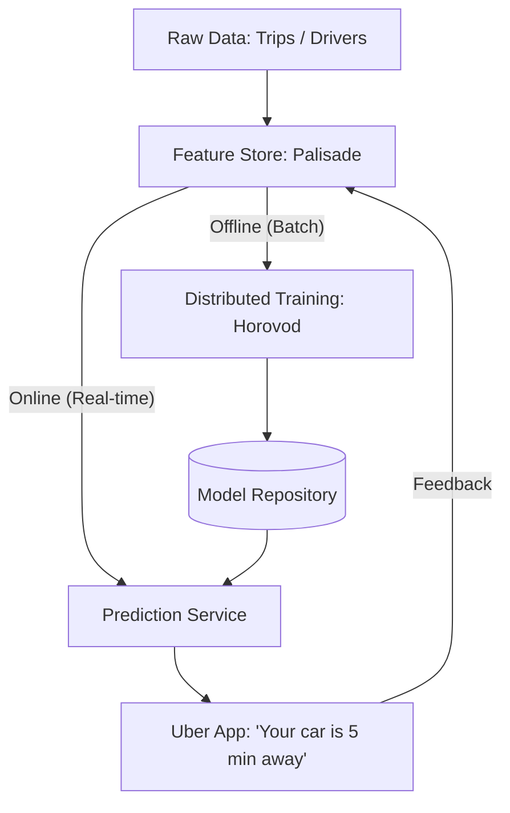

# 🏎️ Uber Michelangelo: The MLOps Gold Standard
> **Level:** Advanced | **Language:** Hinglish | **Goal:** Analyze the world's most robust ML Platform, exploring Feature Stores, Model Lifecycle Management, Scale, and the 2026 strategies for "Zero-to-One" ML production.

---

## 🧭 1. Beginner-Friendly Hinglish Explanation
Uber sirf ek "App" nahi hai, wo ek "Badi Prediction Machine" hai.

- **The Problem:** Jab aap Uber open karte hain, toh 100 cheezein AI handle karta hai:
  1. Gadi kitni der mein aayegi? (ETA)
  2. Trip ka "Price" kya hoga?
  3. Aapko kis "Driver" ke saath match karna hai?
- **Uber Michelangelo** wo "Karkhana" (Factory) hai jahan ye saare models banaye, deploy aur manage kiye jaate hain.

Pehle Uber ke har team apna alag AI banati thi (Bahut mehnat!). Michelangelo ne ek "Common System" bana diya jisme koi bhi engineer 2-3 clicks mein apna AI model deploy kar sakta hai.

2026 mein, har badi company (Zomato, Swiggy, Amazon) Michelangelo jaise hi system use karti hai taaki unka AI "Scale" ho sake.

---

## 🧠 2. Deep Technical Explanation
Michelangelo is an **End-to-End ML Platform** built on the **"Pylon"** philosophy (Standardization).

### 1. The Feature Store (Palisade):
- The most critical part of Michelangelo. 
- **The Problem:** "Training" mein data alag hai, "Production" mein alag. (Training-Serving Skew).
- **The Solution:** A central "Bank" of features. An engineer calculates the "Driver Rating" once and stores it. Now, any model (ETA or Pricing) can pull that same "Rating" vector.
- It supports **Batch features** (calculated daily) and **Streaming features** (calculated in real-time using Flink).

### 2. Model Lifecycle:
- **Manage:** Versioning models like code.
- **Train:** Distributed training on Spark/TensorFlow.
- **Evaluate:** Comparing the "New" model with the "Current" one automatically.
- **Deploy:** One-click deployment to a high-scale prediction service.

### 3. Horovod (Distributed Training):
- Uber created **Horovod**, which allows training a single model across 100s of GPUs by making them talk to each other extremely fast. (Standard for 2026).

### 4. PyML:
- A layer that allows Python engineers (who love PyTorch/Scikit-learn) to deploy their models into Uber's high-performance **Java-based** infrastructure seamlessly.

---

## 🏗️ 3. Michelangelo Architecture Stack
| Layer | Technology | Role |
| :--- | :--- | :--- |
| **Data** | HDFS / Hive | Raw Data Storage |
| **Features** | **Palisade (Feature Store)** | Centralized, reusable data |
| **Training** | Spark / Horovod / GPU | High-scale model creation |
| **Serving** | Java / RPC / Docker | High-speed, low-latency API |
| **Monitoring** | Michelangelo Monitor | Checking for 'Drift' in production |

---

## 📐 4. Mathematical Intuition
- **The ETA Correction:** 
  The raw physics-based ETA is often wrong (due to traffic/weather). Uber uses a "Correction Model."
  $$\text{Final ETA} = \text{Physics ETA} + \text{AI Correction}(\text{Weather, Traffic, Driver History})$$
  Michelangelo allows engineers to "Stack" these models—where one AI fixes the output of another.

---

## 📊 5. Michelangelo Workflow (Diagram)


---

## 💻 6. Production-Ready Examples (Conceptual: Accessing a Feature Store)
```python
# 2026 Pro-Tip: Never calculate features manually in your API. Use a Feature Store.

from uber_internal import palisade

def get_trip_price(user_id, destination):
    # 1. Fetch real-time features from the store
    # These are pre-calculated by a background 'Streaming' job
    user_features = palisade.get_online_features(
        entity_id=user_id, 
        features=["avg_spend_30d", "is_premium_user"]
    )
    
    # 2. Call the deployed Michelangelo model
    price = model_api.predict(user_features, destination)
    
    return price

# No more 'Join' queries on SQL databases during a request! 🚀
```

---

## ❌ 7. Failure Cases
- **Feature Drift:** The "Driver Rating" logic was changed in the feature store, but the "Pricing Model" was still trained on the old logic. **Fix: Use 'Feature Versioning'.**
- **Inference Latency:** Adding too many "Real-time" features makes the app slow. Users see "Calculating price..." for 10 seconds.
- **Resource Contention:** One heavy training job (e.g., Llama-3 training) slowing down the "Production Serving" of Uber trips. **Fix: Use 'Strict Isolation' of compute.**

---

## 🛠️ 8. Debugging Guide
- **Symptom:** "Model predicted \$1000 for a 1km trip."
- **Check:** **Feature Outliers**. Did the Feature Store provide a "NULL" value for distance? Michelangelo has a "Data Validation" layer that catches these before they reach the model.
- **Symptom:** "Training is taking 3 days."
- **Check:** **Horovod scaling**. Ensure your network is not "Congested." Check the "InfiniBand" usage.

---

## ⚖️ 9. Tradeoffs
- **Custom vs. Standard:** 
  - Uber built Michelangelo (Custom) because nothing existed in 2015. 
  - Today, startups use **Tecton** or **SageMaker** (Standard) instead of building their own.
- **Python vs. Java:** Engineers use Python for training, but Uber uses Java for serving because it's more stable at "Millions of requests per second."

---

## 🛡️ 10. Security Concerns
- **Feature Leakage:** A model accidentally seeing "The future" during training (e.g., training on 'Trip Ended' data to predict 'Trip Start' price). **Michelangelo uses 'Time-travel' queries to prevent this.**

---

## 📈 11. Scaling Challenges
- **The 'Midnight' Peak:** When thousands of people leave a concert at 12 AM. Michelangelo must scale its "Prediction Service" $10x$ in minutes.

---

## 💸 12. Cost Considerations
- **Storage of Historical Features:** Storing every "Feature" for every trip in Uber's history. (Petabytes of data). **Strategy: Delete features that haven't been used in 6 months.**

---

## ✅ 13. Best Practices
- **Standardize the 'Model Interface':** Every model must accept a JSON and return a JSON. This makes it easy to "Swap" models without changing the app code.
- **Automated Retraining:** If accuracy drops below $90\%$, Michelangelo automatically starts a new training job on the latest data.
- **Feature Reusability:** Encourage teams to share features. (e.g., The 'Rain' feature can be used by 50 different models).

---

## ⚠️ 14. Common Mistakes
- **No Model Monitoring:** Deploying a model and "Forgetting" about it. (Models always degrade over time).
- **Manual Data Cleaning:** Each engineer doing their own "Null handling." (Should be done once in the Feature Store).

---

## 📝 15. Interview Questions
1. **"What is a Feature Store and why is it the 'Heart' of Michelangelo?"**
2. **"How does Uber handle the 'Training-Serving Skew'?"**
3. **"What is Horovod and how does it help in distributed training?"**

---

## 🚀 15. Latest 2026 Industry Patterns
- **Serverless MLOps:** Deploying a model as a "Function" that scales to zero when no one is booking a ride.
- **LLM-assisted Feature Engineering:** Using an AI to look at raw data and "Invent" new features that might be useful (e.g., *"Wait, people book more rides when it's precisely 32 degrees Celsius"*).
- **Real-time Personalization:** Changing the app's entire UI for a user based on their last 30 seconds of activity (using streaming features).
