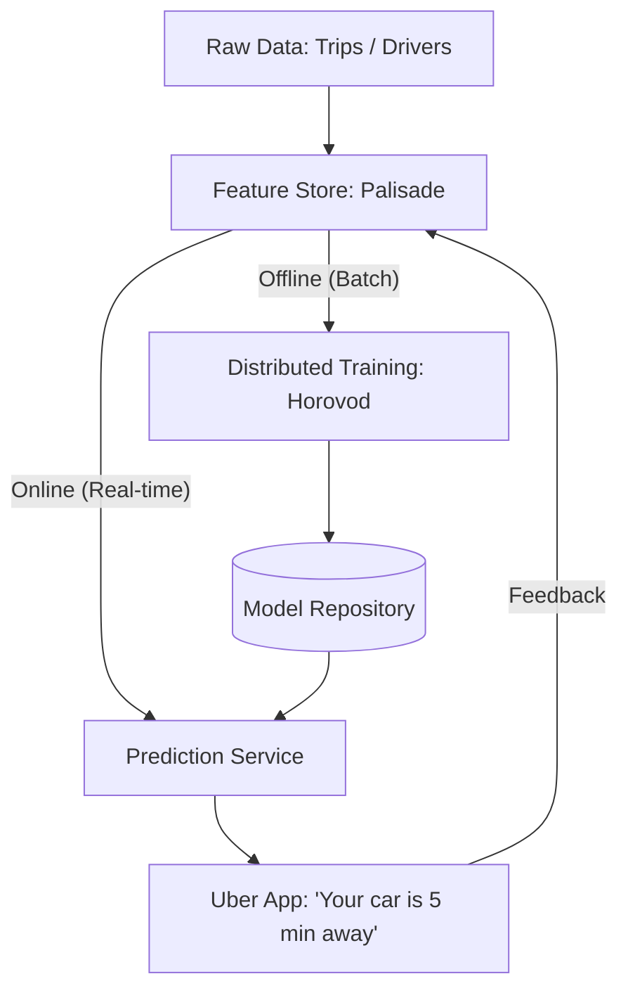

# 🏎️ Uber Michelangelo: The MLOps Gold Standard
> **Level:** Advanced | **Language:** Hinglish | **Goal:** Duniya ke sabse robust ML Platform ko analyze karein, Feature Stores, Model Lifecycle Management, Scale, aur 2026 mein "Zero-to-One" ML production ki strategies ko explore karein.

---

## 🧭 1. Beginner-Friendly Hinglish Explanation
Uber sirf ek "App" nahi hai, wo ek "Badi Prediction Machine" hai.

- **The Problem:** Jab aap Uber open karte hain, toh 100 cheezein AI handle karta hai:
  1. Gadi kitni der mein aayegi? (ETA)
  2. Trip ka "Price" kya hoga?
  3. Aapko kis "Driver" ke saath match karna hai?
- **Uber Michelangelo** wo "Karkhana" (Factory) hai jahan ye saare models banaye, deploy aur manage kiye jaate hain.

Pehle Uber ke har team apna alag AI banati thi (Bahut mehnat!). Michelangelo ne ek "Common System" bana diya jisme koi bhi engineer 2-3 clicks mein apna AI model deploy kar sakta hai.

2026 mein, har badi company (Zomato, Swiggy, Amazon) Michelangelo jaise hi system use karti hai taaki unka AI "Scale" ho sake.

---

## 🧠 2. Deep Technical Explanation
Michelangelo ek **End-to-End ML Platform** hai jo **"Pylon"** philosophy (Standardization) par built hai.

### 1. The Feature Store (Palisade):
- Michelangelo ka sabse critical part.
- **The Problem:** "Training" mein data alag hota hai aur "Production" mein alag. (Training-Serving Skew).
- **The Solution:** Features ka ek central "Bank". Ek engineer "Driver Rating" ko ek baar calculate karke store kar deta hai. Ab, koi bhi model (ETA ho ya Pricing) us *same* "Rating" vector ko pull (use) kar sakta hai.
- Ye **Batch features** (daily basis par calculated) aur **Streaming features** (Flink ka use karke real-time mein calculated) dono ko support karta hai.

### 2. Model Lifecycle:
- **Manage:** Models ko code ki tarah version karna.
- **Train:** Spark/TensorFlow par distributed training.
- **Evaluate:** Naye model ko current model ke sath automatically compare karna.
- **Deploy:** Ek high-scale prediction service par one-click deployment.

### 3. Horovod (Distributed Training):
- Uber ne **Horovod** ko build kiya, jo aapas mein extremely fast communication ke zariye ek single model ko 100s of GPUs par train karne ki permission deta hai. (2026 ke liye standard).

### 4. PyML:
- Ek aisi layer jo Python engineers (jo PyTorch/Scikit-learn pasand karte hain) ko apne models ko Uber ke high-performance **Java-based** infrastructure par seamlessly deploy karne ki permission deti hai.

---

## 🏗️ 3. Michelangelo Architecture Stack
| Layer | Technology | Role |
| :--- | :--- | :--- |
| **Data** | HDFS / Hive | Raw Data Storage |
| **Features** | **Palisade (Feature Store)** | Centralized, reusable data |
| **Training** | Spark / Horovod / GPU | High-scale model creation |
| **Serving** | Java / RPC / Docker | High-speed, low-latency API |
| **Monitoring** | Michelangelo Monitor | Production mein 'Drift' ko check karna |

---

## 📐 4. Mathematical Intuition
- **The ETA Correction:** 
  Raw physics-based ETA aksar galat hota hai (traffic/weather ki wajah se). Uber ek "Correction Model" ka use karta hai.
  $$\text{Final ETA} = \text{Physics ETA} + \text{AI Correction}(\text{Weather, Traffic, Driver History})$$
  Michelangelo engineers ko in models ko "Stack" karne ki permission deta hai—jahan ek AI doosre AI ke output ko fix karta hai.

---

## 📊 5. Michelangelo Workflow (Diagram)

```mermaid
graph TD
    Data[Raw Data: Trips / Drivers] --> FS[Feature Store: Palisade]
    FS -- "Offline (Batch)" --> Train[Distributed Training: Horovod]
    FS -- "Online (Real-time)" --> Serve[Prediction Service]
    
    Train --> Model[(Model Repository)]
    Model --> Serve
    
    Serve --> App[Uber App: 'Your car is 5 min away']
    App -- "Feedback" --> FS
```

---

## 💻 6. Production-Ready Examples (Conceptual: Accessing a Feature Store)
```python
# 2026 Pro-Tip: Never calculate features manually in your API. Use a Feature Store.

from uber_internal import palisade

def get_trip_price(user_id, destination):
    # 1. Fetch real-time features from the store
    # These are pre-calculated by a background 'Streaming' job
    user_features = palisade.get_online_features(
        entity_id=user_id, 
        features=["avg_spend_30d", "is_premium_user"]
    )
    
    # 2. Call the deployed Michelangelo model
    price = model_api.predict(user_features, destination)
    
    return price

# No more 'Join' queries on SQL databases during a request! 🚀
```

---

## ❌ 7. Failure Cases
- **Feature Drift:** Feature store mein "Driver Rating" ki logic change ho gayi thi, par "Pricing Model" abhi bhi purani logic par train ho raha tha. **Fix: 'Feature Versioning' ka use karein.**
- **Inference Latency:** Bahut sare "Real-time" features ko add karne se app slow ho jata hai. Users ko 10 seconds tak "Calculating price..." dikhta rehta hai.
- **Resource Contention:** Ek heavy training job (jaise Llama-3 training) ki wajah se Uber trips ki "Production Serving" slow ho jana. **Fix: Compute ki 'Strict Isolation' ka use karein.**

---

## 🛠️ 8. Debugging Guide
- **Symptom:** "Model ne 1km ki trip ke liye \$1000 predict kar diya."
- **Check:** **Feature Outliers**. Kya Feature Store ne distance ke liye "NULL" value provide ki thi? Michelangelo ke paas ek "Data Validation" layer hai jo in issues ko model tak pahunchne se pehle hi catch kar leti hai.
- **Symptom:** "Training 3 din le rahi hai."
- **Check:** **Horovod scaling**. Ensure karein ki aapka network "Congested" nahi hai. "InfiniBand" usage ko check karein.

---

## ⚖️ 9. Tradeoffs
- **Custom vs. Standard:** 
  - Uber ne Michelangelo (Custom) build kiya kyuki 2015 mein aisa kuch exist nahi karta tha.
  - Aaj startups apna khud ka platform banane ke bajaye **Tecton** ya **SageMaker** (Standard) ka use karte hain.
- **Python vs. Java:** Engineers training ke liye Python use karte hain, par Uber serving ke liye Java ka use karta hai kyuki ye "Millions of requests per second" par zyada stable hai.

---

## 🛡️ 10. Security Concerns
- **Feature Leakage:** Training ke dauran model ka accidentally "Future" ko dekh lena (jaise 'Trip Ended' data par train karna 'Trip Start' price ko predict karne ke liye). **Michelangelo ise prevent karne ke liye 'Time-travel' queries ka use karta hai.**

---

## 📈 11. Scaling Challenges
- **The 'Midnight' Peak:** Jab concert ke baad raat 12 baje hazaron log ek sath nikalte hain. Michelangelo ko minutes mein apne "Prediction Service" ko $10x$ scale karna padta hai.

---

## 💸 12. Cost Considerations
- **Storage of Historical Features:** Uber ki history mein har ek trip ke liye har ek "Feature" ko store karna. (Petabytes of data). **Strategy: Un features ko delete kar dein jinhe pichle 6 mahine se use nahi kiya gaya hai.**

---

## ✅ 13. Best Practices
- **Standardize the 'Model Interface':** Every model must accept a JSON and return a JSON. This makes it easy to "Swap" models without changing the app code.
- **Automated Retraining:** Agar accuracy $90\%$ se niche drop hoti hai, toh Michelangelo latest data par automatically ek naya training job start kar deta hai.
- **Feature Reusability:** Teams ko features share karne ke liye encourage karein (jaise 'Rain' feature ko 50 different models dwara use kiya ja sakta hai).

---

## ⚠️ 14. Common Mistakes
- **No Model Monitoring:** Model deploy karke uske baare mein "Forget" (bhool) jana. (Models time ke sath hamesha degrade hote hain).
- **Manual Data Cleaning:** Har ek engineer ka apna khud ka "Null handling" karna. (Ye Feature Store mein ek hi baar ho jana chahiye).

---

## 📝 15. Interview Questions
1. **"Feature Store kya hai aur ye Michelangelo ka 'Heart' kyun hai?"**
2. **"Uber 'Training-Serving Skew' ko kaise handle karta hai?"**
3. **"Horovod kya hai aur ye distributed training mein kaise help karta hai?"**

---

## 🚀 16. Latest 2026 Industry Patterns
- **Serverless MLOps:** Model ko ek "Function" ke roop mein deploy karna jo koi ride book na hone par zero tak scale ho jaye.
- **LLM-assisted Feature Engineering:** AI ka use karke raw data ko dekhna aur naye features ko "Invent" karna jo useful ho sakte hain (jaise *"Rukie, log tab ride zyada book karte hain jab temperature precisely 32 degrees Celsius hota hai"*).
- **Real-time Personalization:** Streaming features ka use karke user ki pichle 30 seconds ki activity ke basis par app ke pure UI ko change kar dena.
