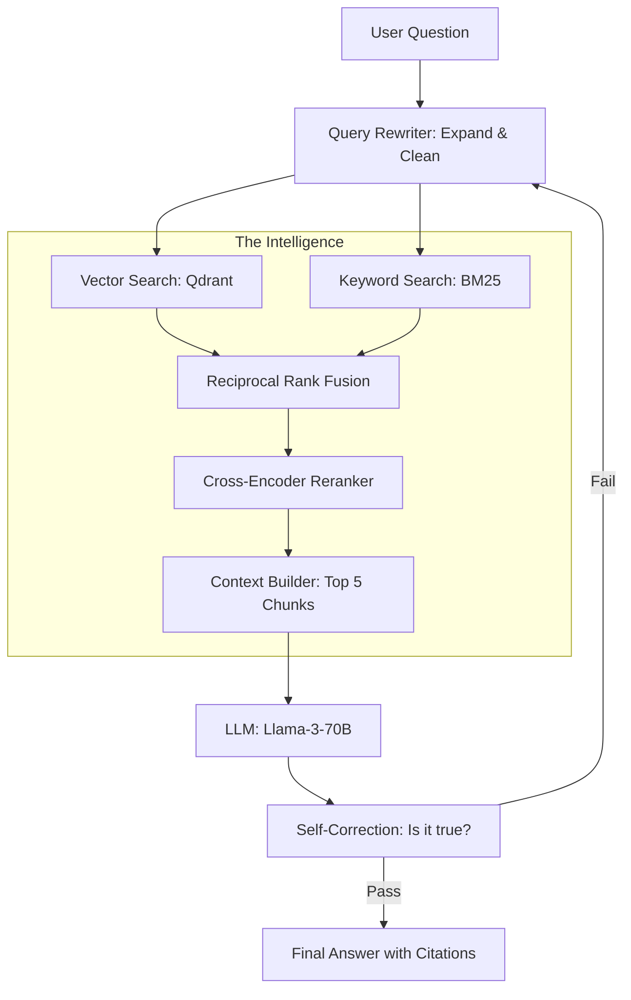

# 🏆 Capstone Project 1: Building a Global-Scale RAG System
> **Level:** Professional / Mastery | **Language:** Hinglish | **Goal:** Synthesize everything you've learned to design and build a production-grade Retrieval-Augmented Generation (RAG) system that can handle 1 Million+ documents with sub-second latency and high accuracy.

---

## 🧭 1. Project Overview
Aapka mission hai ek aisa AI system banana jo puri duniya ki "Legal Cases" ya "Medical Research" ko samajh sake. 

Ye sirf ek "Chatbot" nahi hai. Ye ek **"Enterprise Knowledge Engine"** hai.
- **Scale:** 10 Lakh (1M) documents.
- **Accuracy:** "Source Citation" mandatory hai (No hallucinations).
- **Speed:** Jawab 2 seconds ke andar milna chahiye.

Is project mein aap **Vector DBs**, **Rerankers**, **Quantized LLMs**, aur **Evaluation Frameworks** ko ek saath milayenge. 

---

## 🏗️ 2. The Architecture (The 'Gold Standard')
A modern, scalable RAG system isn't just `VectorSearch -> Prompt`. It's a pipeline:

1. **Ingestion Layer:**
   - **Parsing:** Use **LayoutLMv3** to extract tables and text from PDFs.
   - **Chunking:** **Semantic Chunking** (breaking text based on meaning, not character count).
   - **Embedding:** Use a **Multi-vector** approach (ColBERT or BGE-M3).

2. **Retrieval Layer:**
   - **Hybrid Search:** Combine **Vector Search** (Semantic) + **BM25** (Keyword search).
   - **GraphRAG:** Using a Knowledge Graph to find connections between documents.

3. **Post-Processing Layer:**
   - **Reranking:** Use **Cohere Rerank** or **BGE-Reranker** to pick the top 5 most relevant chunks out of 100.
   - **Context Compression:** Removing "noise" from the chunks to save tokens.

4. **Generation Layer:**
   - **Model:** Llama-3-70B (Quantized to 4-bit) running on **vLLM**.
   - **System Prompt:** Strict instructions for "Source Grounding."

---

## 📊 3. The Tech Stack
| Component | Choice | Why? |
| :--- | :--- | :--- |
| **LLM Engine** | vLLM / TensorRT-LLM | Fast, continuous batching |
| **Vector DB** | Qdrant / Pinecone | Scalable, supports Hybrid search |
| **Orchestration** | LangGraph | Complex loops and self-correction |
| **Embedding** | BGE-M3 | Multi-lingual and multi-vector |
| **Evaluation** | RAGAS / DeepEval | Automated accuracy metrics |
| **Monitoring** | LangSmith / Arize Phoenix | Tracking drift and hallucinations |

---

## 📐 4. Mathematical Benchmarks (SLA)
- **Retrieval Recall@10:** $> 0.90$ (Top 10 results should contain the answer).
- **Faithfulness Score:** $> 0.95$ (AI should not hallucinate).
- **Latency (P99):** $< 3$ seconds for the full response.
- **Cost per Query:** $< \$0.01$.

---

## 📊 5. System Diagram


---

## 💻 6. Implementation Steps (The Engineer's Path)

### Step 1: Data Ingestion (The Foundation)
Don't just use `PyPDF2`. Use a modern parser that understands tables.
```python
# Pro-Tip: Use 'Unstructured' or 'MarkItDown' for high-quality parsing.
from unstructured.partition.pdf import partition_pdf

elements = partition_pdf("medical_report.pdf", infer_table_structure=True)
# This gives you clean text + structured tables in JSON.
```

### Step 2: Advanced Retrieval (Hybrid Search)
```python
# Use Qdrant's Hybrid Search capability.
search_result = qdrant.search(
    collection_name="knowledge_base",
    query_vector=embedding_model.encode(query),
    query_filter=Filter(...), # Add metadata filtering (e.g., date > 2024)
    limit=10
)
```

### Step 3: The 'Self-RAG' Loop
Implement a loop where the AI checks its own work.
- "Does this answer actually answer the user's question?"
- "Is every sentence backed by a source?"
If NO, trigger another search with a refined query.

---

## ❌ 7. Common Pitfalls to Avoid
- **"Naive RAG":** Just dumping 500-word chunks into a DB. You will get "Middle-of-the-document" loss. Use **Small-to-Big Retrieval** (Search small chunks, feed the whole paragraph to the AI).
- **Ignoring Privacy:** Putting PII (Personal Identifiable Information) into the vector DB. **Redact data first.**
- **No Evaluation:** If you don't use **RAGAS**, you are just "guessing" that your RAG is good.

---

## ✅ 8. Evaluation Strategy (How to pass this project)
Run your system against a test set of 100 questions.
1. **Context Precision:** Are the retrieved chunks actually relevant?
2. **Faithfulness:** Is the answer based ONLY on the chunks?
3. **Answer Relevancy:** Does the answer satisfy the user?

---

## 🚀 9. 2026 Bonus: Agentic RAG
Make your system "Agentic" by allowing it to:
- **Web Search** if the internal database doesn't have the answer.
- **Ask Clarifying Questions** if the user's query is vague.
- **Critique** its own answer from the perspective of a "Skeptic."

---

## 📝 10. Submission Requirements
- **GitHub Repo:** Clean code with `docker-compose.yaml`.
- **Project Report:** Explaining your choice of Embedding, DB, and LLM.
- **Evaluation Dashboard:** A screenshot of your RAGAS scores.
- **Live Demo:** A URL where the instructor can test your system.
