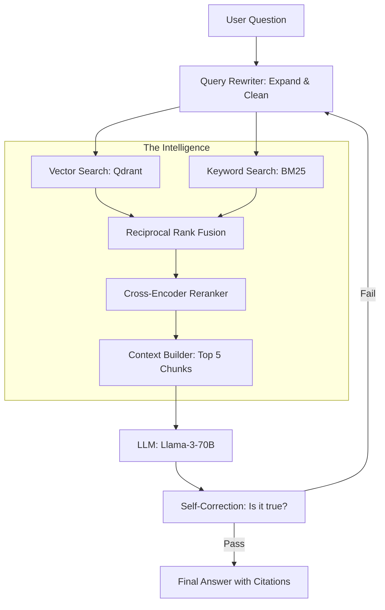

# 🏆 Capstone Project 1: Building a Global-Scale RAG System
> **Level:** Professional / Mastery | **Language:** Hinglish | **Goal:** Jo kuch bhi aapne seekha hai use synthesize karke ek production-grade Retrieval-Augmented Generation (RAG) system design aur build karein jo sub-second latency aur high accuracy ke sath 1 Million+ documents ko handle kar sake.

---

## 🧭 1. Project Overview
Aapka mission hai ek aisa AI system banana jo puri duniya ki "Legal Cases" ya "Medical Research" ko samajh sake. 

Ye sirf ek "Chatbot" nahi hai. Ye ek **"Enterprise Knowledge Engine"** hai.
- **Scale:** 10 Lakh (1M) documents.
- **Accuracy:** "Source Citation" mandatory hai (No hallucinations).
- **Speed:** Jawab 2 seconds ke andar milna chahiye.

Is project mein aap **Vector DBs**, **Rerankers**, **Quantized LLMs**, aur **Evaluation Frameworks** ko ek sath milayenge. 

---

## 🏗️ 2. The Architecture (The 'Gold Standard')
Ek modern aur scalable RAG system sirf `VectorSearch -> Prompt` nahi hota. Ye ek poora pipeline hota hai:

1. **Ingestion Layer:**
   - **Parsing:** PDFs se tables aur text ko extract karne ke liye **LayoutLMv3** ka use karein.
   - **Chunking:** **Semantic Chunking** (character count ke bajaye meaning ke basis par text ko break karna).
   - **Embedding:** Ek **Multi-vector** approach (ColBERT ya BGE-M3) ka use karein.

2. **Retrieval Layer:**
   - **Hybrid Search:** **Vector Search** (Semantic) + **BM25** (Keyword search) ko combine karein.
   - **GraphRAG:** Documents ke beech connections ko find karne ke liye ek Knowledge Graph ka use karna.

3. **Post-Processing Layer:**
   - **Reranking:** 100 mein se top 5 sabse relevant chunks ko pick karne ke liye **Cohere Rerank** ya **BGE-Reranker** ka use karein.
   - **Context Compression:** Tokens ko save karne ke liye chunks se "noise" ko remove karna.

4. **Generation Layer:**
   - **Model:** **vLLM** par chalne wala Llama-3-70B (Quantized to 4-bit).
   - **System Prompt:** "Source Grounding" (citations ensure karne) ke liye strict instructions.

---

## 📊 3. The Tech Stack
| Component | Choice | Why? |
| :--- | :--- | :--- |
| **LLM Engine** | vLLM / TensorRT-LLM | Fast, continuous batching |
| **Vector DB** | Qdrant / Pinecone | Scalable, supports Hybrid search |
| **Orchestration** | LangGraph | Complex loops aur self-correction |
| **Embedding** | BGE-M3 | Multi-lingual aur multi-vector |
| **Evaluation** | RAGAS / DeepEval | Automated accuracy metrics |
| **Monitoring** | LangSmith / Arize Phoenix | Drift aur hallucinations ko track karna |

---

## 📐 4. Mathematical Benchmarks (SLA)
- **Retrieval Recall@10:** $> 0.90$ (Top 10 results mein answer hona hi chahiye).
- **Faithfulness Score:** $> 0.95$ (AI ko bilkul hallucinate nahi karna chahiye).
- **Latency (P99):** Full response ke liye $< 3$ seconds.
- **Cost per Query:** $< \$0.01$.

---

## 📊 5. System Diagram

```mermaid
graph TD
    User[User Question] --> Query[Query Rewriter: Expand & Clean]
    Query --> Vector[Vector Search: Qdrant]
    Query --> Keyword[Keyword Search: BM25]
    
    subgraph "The Intelligence"
    Vector & Keyword --> Merge[Reciprocal Rank Fusion]
    Merge --> Rerank[Cross-Encoder Reranker]
    Rerank --> Context[Context Builder: Top 5 Chunks]
    end
    
    Context --> LLM[LLM: Llama-3-70B]
    LLM --> Eval[Self-Correction: Is it true?]
    Eval -- "Fail" --> Query
    Eval -- "Pass" --> Final[Final Answer with Citations]
```

---

## 💻 6. Implementation Steps (The Engineer's Path)

### Step 1: Data Ingestion (The Foundation)
Sirf `PyPDF2` ka use na karein. Ek modern parser use karein jo tables ko samajhta ho.
```python
# Pro-Tip: Use 'Unstructured' or 'MarkItDown' for high-quality parsing.
from unstructured.partition.pdf import partition_pdf

elements = partition_pdf("medical_report.pdf", infer_table_structure=True)
# This gives you clean text + structured tables in JSON.
```

### Step 2: Advanced Retrieval (Hybrid Search)
```python
# Use Qdrant's Hybrid Search capability.
search_result = qdrant.search(
    collection_name="knowledge_base",
    query_vector=embedding_model.encode(query),
    query_filter=Filter(...), # Add metadata filtering (e.g., date > 2024)
    limit=10
)
```

### Step 3: The 'Self-RAG' Loop
Ek aisa loop implement karein jahan AI khud apne kaam ko check kare.
- "Kya ye answer actual mein user ke sawaal ka jawaab deta hai?"
- "Kya har ek sentence ke peeche koi solid source hai?"
Agar jawaab NO hai, toh ek refined query ke sath dubara search trigger karein.

---

## ❌ 7. Failure Cases (Common Pitfalls to Avoid)
- **"Naive RAG":** Bas 500-word ke chunks ko DB mein dump kar dena. Isse aapko "Middle-of-the-document" loss milega. **Small-to-Big Retrieval** ka use karein (Chote chunks ko search karein, par AI ko poora paragraph bhein).
- **Ignoring Privacy:** Vector DB mein PII (Personal Identifiable Information) ko daal dena. **Pehle data ko redact (clean) karein.**
- **No Evaluation:** Agar aap **RAGAS** ka use nahi kar rahe hain, toh aap bas "guess" (tukka laga) rahe hain ki aapka RAG system acha hai.

---

## ✅ 8. Evaluation Strategy (How to pass this project)
Apne system ko 100 questions ke ek test set par run karein.
1. **Context Precision:** Kya retrieved chunks actual mein relevant hain?
2. **Faithfulness:** Kya answer ONLY retrieved chunks ke basis par hi diya gaya hai?
3. **Answer Relevancy:** Kya answer user ko satisfy karta hai?

---

## 🚀 9. 2026 Bonus: Agentic RAG
Apne system ko "Agentic" banayein in features ko allow karke:
- Agar internal database mein answer na ho, toh **Web Search** karna.
- Agar user ki query vague (aspat) hai, toh **Clarifying Questions puchna**.
- Ek "Skeptic" (shakki insaan) ke perspective se khud apne answer ko **Critique** (review) karna.

---

## 📝 10. Submission Requirements
- **GitHub Repo:** `docker-compose.yaml` ke sath ek clean code repo.
- **Project Report:** Embedding, DB, aur LLM ke selections ko explain karne wali report.
- **Evaluation Dashboard:** Apne RAGAS scores ka ek screenshot.
- **Live Demo:** Ek URL jahan instructor aapke system ko test kar sakein.
