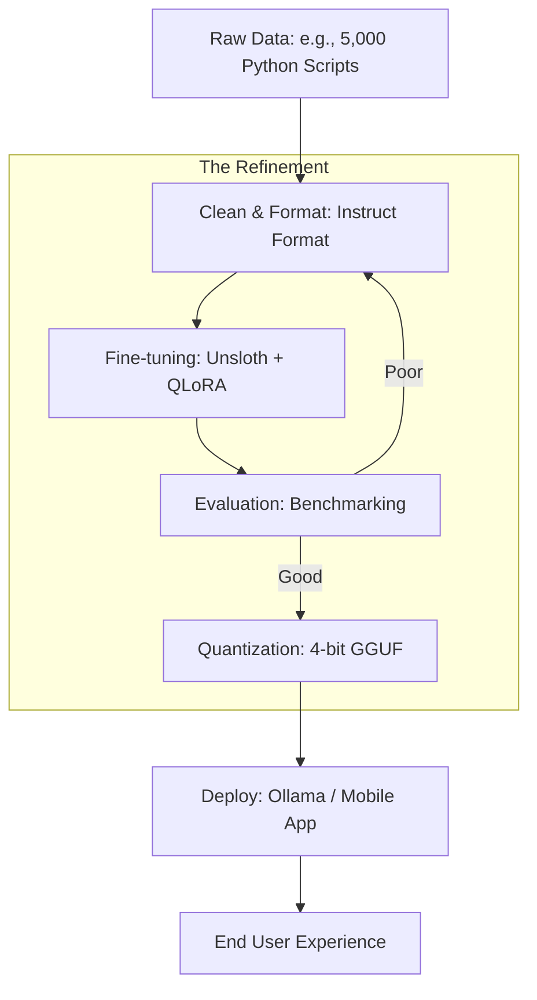

# 🏆 Capstone Project 2: Training & Deploying a Custom SLM
> **Level:** Mastery | **Language:** Hinglish | **Goal:** Master the end-to-end lifecycle of a Small Language Model (SLM), from data curation and fine-tuning using QLoRA to quantization and deployment on Edge devices or low-cost GPUs in 2026.

---

## 🧭 1. Project Overview
Bade models (70B+) mahange aur slow hote hain. Kaafi baar humein ek aisa model chahiye jo sirf "Ek Kaam" (jaise: Medical Coding, SQL generation, ya Customer Support) mein expert ho aur sasta ho. Inhe hum **SLMs (Small Language Models)** kehte hain.

Aapka mission hai:
1. Ek base model chunna (jaise **Llama-3-8B** ya **Phi-3-mini**).
2. Use ek specific domain ke liye "Fine-tune" karna.
3. Use **INT4** ya **FP8** mein compress karna.
4. Use ek "Consumer GPU" ya "Mobile" par deploy karna.

---

## 🏗️ 2. The Training Pipeline (The 'Scientist's' Path)

1. **Data Curation (The most important step):**
   - **Quality over Quantity:** 10,000 high-quality tokens are better than 1 million garbage tokens.
   - **Synthetic Data:** Use a larger model (GPT-4o) to generate training examples for your smaller model (**Self-Instruct**).

2. **Fine-Tuning (QLoRA):**
   - Use **Quantized Low-Rank Adaptation** to train the model on a single 24GB GPU.
   - **Target Modules:** Fine-tune the `q_proj`, `k_proj`, and `v_proj` layers for the best result.

3. **Preference Alignment:**
   - Use **DPO (Direct Preference Optimization)** to make the model's tone more human-like and safe.

4. **Quantization & Export:**
   - Convert the trained model to **GGUF** (for local CPU/GPU use) or **EXL2** (for ultra-fast GPU inference).

---

## 📊 3. The Tech Stack
| Stage | Tool / Library | Why? |
| :--- | :--- | :--- |
| **Base Model** | Phi-3 / Llama-3-8B / Gemma-2B | State-of-the-art small models |
| **Fine-tuning** | Unsloth / Axolotl | $2x$ faster training, $70\%$ less VRAM |
| **Quantization**| llama.cpp / AutoGPTQ | Standard for model compression |
| **Inference** | Ollama / vLLM / LM Studio | Easy deployment and API access |
| **Evaluation** | MMLU / GSM8K / Custom Eval | Measuring logic and domain knowledge |

---

## 📐 4. Project Goal (SLA)
- **Model Size:** $< 10$ GB.
- **Inference Speed:** $> 50$ tokens/sec on a single GPU.
- **Domain Accuracy:** Should beat the base model by at least $20\%$ on your specific task (e.g., Medical diagnosis).
- **VRAM Usage:** Should run on a GPU with $< 12$ GB memory.

---

## 📊 5. Training to Deployment Flow (Diagram)


---

## 💻 6. Implementation Steps (The Engineer's Path)

### Step 1: Accelerated Fine-tuning with Unsloth
Don't use standard HuggingFace training; it's too slow. Use **Unsloth** for 2026-level efficiency.
```python
# Pro-Tip: Unsloth makes training 2x faster.
from unsloth import FastLanguageModel
import torch

model, tokenizer = FastLanguageModel.from_pretrained(
    model_name = "unsloth/llama-3-8b-bnb-4bit",
    max_seq_length = 2048,
    load_in_4bit = True,
)

# Add LoRA adapters
model = FastLanguageModel.get_peft_model(
    model,
    r = 16, # Rank
    target_modules = ["q_proj", "k_proj", "v_proj", "o_proj"],
    lora_alpha = 16,
    lora_dropout = 0,
)
```

### Step 2: Training on your Dataset
Use a `SFTTrainer` (Supervised Fine-Tuning) to teach the model your specific data.

### Step 3: Quantization to GGUF
After training, export the model so it can run on anyone's laptop.
```python
model.save_pretrained_gguf("my_custom_model", tokenizer, quantization_method = "q4_k_m")
```

---

## ❌ 7. Common Pitfalls to Avoid
- **Catastrophic Forgetting:** Teaching the model "Medical facts" but it forgets how to "Speak English." **Fix:** Mix your data with some general conversation data (**Replay Buffer**).
- **Overfitting:** The model memorizes your training data instead of learning the logic. **Fix:** Use more diverse data and lower the number of `epochs`.
- **Wrong Prompt Template:** If you train on `### Instruction:` but test on `[INST]`, the model will fail. **Always use a consistent template.**

---

## ✅ 8. Evaluation Strategy (How to pass this project)
1. **Perplexity:** Is the model's "Confusion" decreasing during training?
2. **Domain Test:** Create a set of 50 "Hard questions" in your domain. How many does the base model get right vs. your fine-tuned model?
3. **Safety Check:** Ensure your fine-tuning hasn't made the model "rude" or "unstable."

---

## 🚀 9. 2026 Bonus: Distillation
Use a "Teacher-Student" approach.
- Run a 70B model on your dataset to get "Perfect" answers.
- Use those "Perfect" answers to train your 8B model. 
This is called **Knowledge Distillation** and it's how the best small models are built in 2026.

---

## 📝 10. Submission Requirements
- **Weights:** Link to your model on **HuggingFace** (or a private link).
- **Notebook/Script:** The full training code.
- **Evaluation Report:** Comparison graph showing the "Before" vs "After" accuracy.
- **Demo Video:** Showing the model running locally on a laptop or phone.
