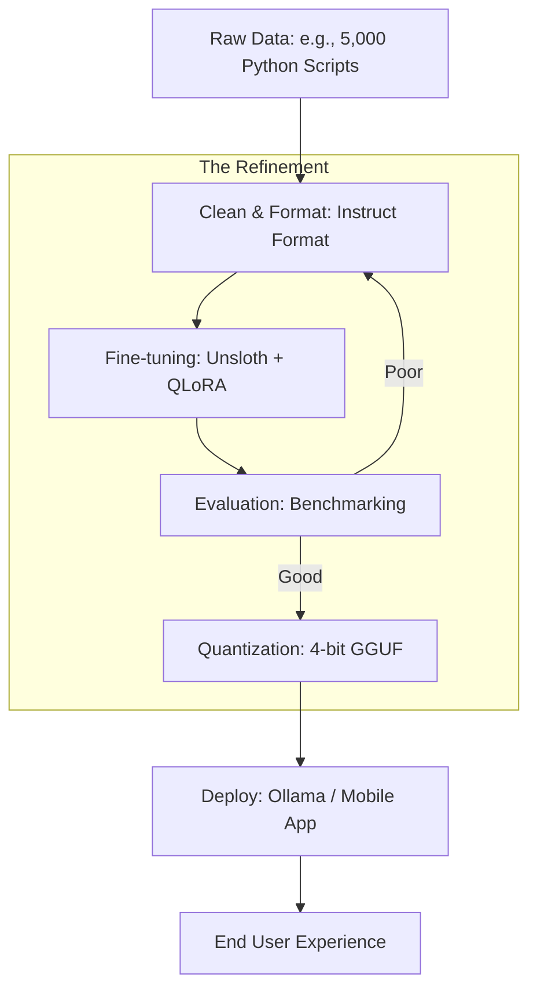

# 🏆 Capstone Project 2: Training & Deploying a Custom SLM
> **Level:** Mastery | **Language:** Hinglish | **Goal:** Small Language Model (SLM) ke end-to-end lifecycle ko master karein, data curation aur QLoRA ka use karke fine-tuning se lekar quantization aur 2026 ke according Edge devices ya low-cost GPUs par deployment tak.

---

## 🧭 1. Project Overview
Bade models (70B+) mahange aur slow hote hain. Kaafi baar humein ek aisa model chahiye jo sirf "Ek Kaam" (jaise: Medical Coding, SQL generation, ya Customer Support) mein expert ho aur sasta ho. Inhe hum **SLMs (Small Language Models)** kehte hain.

Aapka mission hai:
1. Ek base model chunna (jaise **Llama-3-8B** ya **Phi-3-mini**).
2. Use ek specific domain ke liye "Fine-tune" karna.
3. Use **INT4** ya **FP8** mein compress karna.
4. Use ek "Consumer GPU" ya "Mobile" par deploy karna.

---

## 🏗️ 2. The Training Pipeline (The 'Scientist's' Path)

1. **Data Curation (Sabse important step):**
   - **Quality over Quantity:** 10,000 high-quality tokens kisi 1 million garbage tokens se behtar hote hain.
   - **Synthetic Data:** Apne chote model ke liye training examples generate karne ke liye bade model (GPT-4o) ka use karein (**Self-Instruct**).

2. **Fine-Tuning (QLoRA):**
   - Model ko ek single 24GB GPU par train karne ke liye **Quantized Low-Rank Adaptation** (QLoRA) ka use karein.
   - **Target Modules:** Sabse best results ke liye model ke `q_proj`, `k_proj`, aur `v_proj` layers ko fine-tune karein.

3. **Preference Alignment:**
   - Model ke tone ko zyada human-like aur safe banane ke liye **DPO (Direct Preference Optimization)** ka use karein.

4. **Quantization & Export:**
   - Trained model ko **GGUF** (local CPU/GPU ke liye) ya **EXL2** (ultra-fast GPU inference ke liye) format mein convert karein.

---

## 📊 3. The Tech Stack
| Stage | Tool / Library | Why? |
| :--- | :--- | :--- |
| **Base Model** | Phi-3 / Llama-3-8B / Gemma-2B | State-of-the-art small models |
| **Fine-tuning** | Unsloth / Axolotl | 2x fast training, 70% kam VRAM |
| **Quantization**| llama.cpp / AutoGPTQ | Model compression ke liye standard |
| **Inference** | Ollama / vLLM / LM Studio | Easy deployment aur API access |
| **Evaluation** | MMLU / GSM8K / Custom Eval | Logic aur domain knowledge ko measure karna |

---

## 📐 4. Project Goal (SLA)
- **Model Size:** $< 10$ GB.
- **Inference Speed:** Single GPU par $> 50$ tokens/sec.
- **Domain Accuracy:** Kisi specific task (jaise Medical diagnosis) par base model ko kam se kam $20\%$ se beat karna chahiye.
- **VRAM Usage:** $< 12$ GB memory wale GPU par run hona chahiye.

---

## 📊 5. Training to Deployment Flow (Diagram)

```mermaid
graph TD
    Raw[Raw Data: e.g., 5,000 Python Scripts] --> Clean[Clean & Format: Instruct Format]
    Clean --> Train[Fine-tuning: Unsloth + QLoRA]
    
    subgraph "The Refinement"
    Train --> Check[Evaluation: Benchmarking]
    Check -- "Poor" --> Clean
    Check -- "Good" --> Quant[Quantization: 4-bit GGUF]
    end
    
    Quant --> Deploy[Deploy: Ollama / Mobile App]
    Deploy --> User[End User Experience]
```

---

## 💻 6. Implementation Steps (The Engineer's Path)

### Step 1: Accelerated Fine-tuning with Unsloth
Standard HuggingFace training use na karein; ye bahut slow hai. 2026-level efficiency ke liye **Unsloth** ka use karein.
```python
# Pro-Tip: Unsloth makes training 2x faster.
from unsloth import FastLanguageModel
import torch

model, tokenizer = FastLanguageModel.from_pretrained(
    model_name = "unsloth/llama-3-8b-bnb-4bit",
    max_seq_length = 2048,
    load_in_4bit = True,
)

# Add LoRA adapters
model = FastLanguageModel.get_peft_model(
    model,
    r = 16, # Rank
    target_modules = ["q_proj", "k_proj", "v_proj", "o_proj"],
    lora_alpha = 16,
    lora_dropout = 0,
)
```

### Step 2: Training on your Dataset
Model ko apna specific data sikhane ke liye `SFTTrainer` (Supervised Fine-Tuning) ka use karein.

### Step 3: Quantization to GGUF
Training ke baad, model ko export kar lein taaki wo kisi ke bhi laptop par run ho sake.
```python
model.save_pretrained_gguf("my_custom_model", tokenizer, quantization_method = "q4_k_m")
```

---

## ❌ 7. Failure Cases (Common Pitfalls to Avoid)
- **Catastrophic Forgetting:** Model ko "Medical facts" toh sikha diye par wo "Speak English" (English bolna) hi bhool gaya. **Fix:** Apne data ke sath-sath thoda general conversation data mix karein (**Replay Buffer**).
- **Overfitting:** Model logic seekhne ke bajaye training data ko hi "rataa" (memorize) maar leta hai. **Fix:** Zyada diverse data use karein aur `epochs` ke number ko kam karein.
- **Wrong Prompt Template:** Agar aap `### Instruction:` par train karte hain par `[INST]` par test karte hain, toh model fail ho jayega. **Hamesha ek consistent template use karein.**

---

## ✅ 8. Evaluation Strategy (How to pass this project)
1. **Perplexity:** Training ke dauran model ka "Confusion" (perplexity) decrease ho raha hai?
2. **Domain Test:** Apne domain mein 50 "Hard questions" ka ek set create karein. Base model ke mukable aapka fine-tuned model kitne questions ke sahi jawaab deta hai?
3. **Safety Check:** Ensure karein ki fine-tuning ki wajah se model "rude" ya "unstable" na ho gaya ho.

---

## 🚀 9. 2026 Bonus: Distillation
Ek "Teacher-Student" approach use karein:
- Apne dataset par ek 70B model ko run karke "Perfect" answers generate karein.
- Un "Perfect" answers ka use apne 8B model ko train karne ke liye karein.
Ise **Knowledge Distillation** kehte hain aur 2026 mein sabse best small models isi tareeke se banaye jate hain.

---

## 📝 10. Submission Requirements
- **Weights:** **HuggingFace** par aapke model ka link (ya koi private link).
- **Notebook/Script:** Poora training code.
- **Evaluation Report:** "Before" vs "After" accuracy dikhane wala comparison graph.
- **Demo Video:** Model ko locally laptop ya phone par run hote hue dikhane wala demo video.
