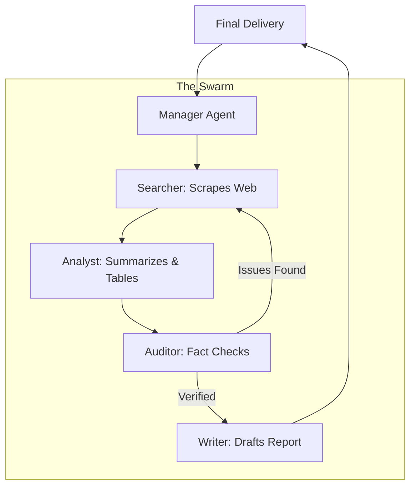

# 🏆 Capstone Project 3: Autonomous Agent Swarm for Business
> **Level:** Mastery / Visionary | **Language:** Hinglish | **Goal:** Master the art of multi-agent orchestration, building a "Swarm" of AI agents that can collaborate, reason, use tools, and solve complex, multi-step business problems (e.g., automated market research or code generation) autonomously in 2026.

---

## 🧭 1. Project Overview
Single agents (jaise "Writing Assistant") purani baat ho gayi hai. 2026 mein hum **"AI Swarms"** banate hain jahan alag-alag agents ek team ki tarah kaam karte hain.

Aapka mission hai ek aisa system banana jo:
- **Researcher Agent:** Internet se data dhoondhe.
- **Analyst Agent:** Data ko summarize kare aur "Trends" pehchane.
- **Writer Agent:** Ek professional report ya code likhe.
- **Manager Agent:** Poore process ko supervise kare aur galthiyan theek kare.

Ye system "End-to-End" autonomous hona chahiye. Aap sirf ek "Goal" denge, aur AI team pura kaam karke degi.

---

## 🏗️ 2. The Orchestration Pipeline (The 'Architect's' Path)

1. **Defining the Roles:**
   - Har agent ka ek specific "Persona" (System Prompt) hoga.
   - Example: *"You are a cynical auditor. Your job is to find flaws in the analyst's report."*

2. **Communication Protocol:**
   - Agents aapas mein kaise baat karenge? (Linear, Circular, or Hierarchical?)
   - Use **LangGraph** to define the state machine of the conversation.

3. **Tool Use (Function Calling):**
   - Agents ko "Hathiyar" (Tools) dena: Web Search API, Python Interpreter, SQL Database access, etc.

4. **Human-in-the-loop (HITL):**
   - Ek aisa point jahan AI rukk kar "Human approval" maange (e.g., before spending real money or sending an email).

---

## 📊 3. The Tech Stack
| Component | Choice | Why? |
| :--- | :--- | :--- |
| **Orchestration** | LangGraph / CrewAI | State management and cyclical logic |
| **LLMs** | Claude 3.5 Sonnet / GPT-4o | Best at reasoning and tool use |
| **Tools** | Tavily (Search) / E2B (Code) | Specialized for AI agents |
| **Memory** | Redis / Mem0 | Long-term memory across sessions |
| **Observability** | LangSmith / Arize | Tracking the "Agentic Loop" logs |

---

## 📐 4. Project Goal (SLA)
- **Autonomy Level:** $> 90\%$ (System should solve the task without human help in 9 out of 10 cases).
- **Execution Time:** Complex tasks should finish in $< 5$ minutes.
- **Tool Accuracy:** Agents should never hallucinate a function call.
- **Cost Efficiency:** Using smaller models (GPT-4o-mini) for simple tasks to save money.

---

## 📊 5. The Swarm Workflow (Diagram)


---

## 💻 6. Implementation Steps (The Engineer's Path)

### Step 1: Setting up the State with LangGraph
Don't just use a simple loop. Use a **Directed Acyclic Graph (DAG)**.
```python
# Pro-Tip: LangGraph allows for 'Cycles' (Loops).
from langgraph.graph import StateGraph, END

class AgentState(TypedDict):
    messages: List[BaseMessage]
    next_step: str

workflow = StateGraph(AgentState)

# Define nodes (Agents)
workflow.add_node("researcher", researcher_node)
workflow.add_node("analyst", analyst_node)

# Define edges (Flow)
workflow.add_edge("researcher", "analyst")
workflow.set_entry_point("researcher")
```

### Step 2: Tool Integration
Give your agents the ability to run code or search the web.
```python
from langchain_community.tools.tavily_search import TavilySearchResults

search_tool = TavilySearchResults(max_results=5)
# Bind this to your LLM
llm_with_tools = llm.bind_tools([search_tool])
```

### Step 3: Implementing 'Memory'
Use a vector DB to let agents "Remember" what they did in previous steps or previous projects.

---

## ❌ 7. Common Pitfalls to Avoid
- **"Infinite Loops":** Two agents keep arguing with each other forever. **Fix:** Set a `max_iterations` limit (e.g., 10 steps).
- **"Context Overload":** The conversation history becomes too long, making the AI slow and confused. **Fix:** Use **Summarized Memory** (condensing old messages).
- **Tool Failure:** The web search API returns no results, and the agent "panics." **Fix:** Add "Error Handling" prompts (e.g., *"If search fails, try a broader keyword"*).

---

## ✅ 8. Evaluation Strategy (How to pass this project)
1. **Task Completion:** Did the swarm actually solve the business problem?
2. **Reasoning Quality:** Read the logs—did the agents make logical decisions or just get lucky?
3. **Collaboration Efficiency:** Did the agents help each other or just repeat the same work?

---

## 🚀 9. 2026 Bonus: Self-Correction Swarm
Build a "Reflection" step where a dedicated **"Critic Agent"** tries to find 3 things wrong with the final output. The swarm then has to fix those 3 things before showing the result to the user. This is how you get $100\%$ professional quality.

---

## 📝 10. Submission Requirements
- **System Architecture Diagram:** Showing the flow between agents.
- **Execution Logs:** A full transcript of the swarm working on a complex task.
- **Source Code:** Link to your GitHub repo.
- **Productivity Report:** How much "Time" would a human take vs. your AI swarm for this task?
