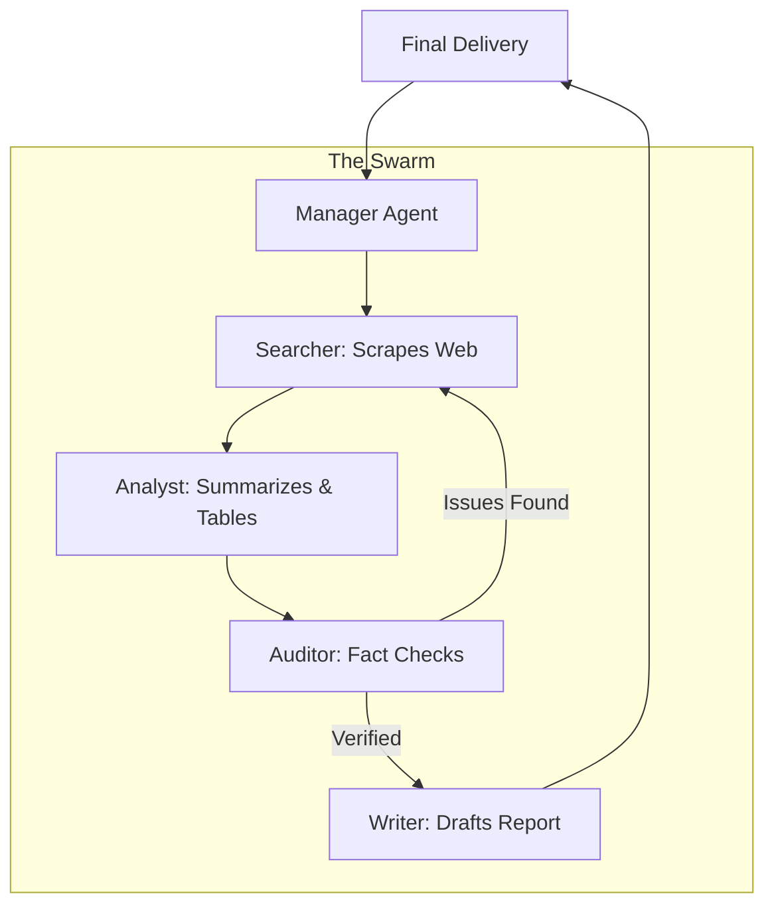

# 🏆 Capstone Project 3: Autonomous Agent Swarm for Business
> **Level:** Mastery / Visionary | **Language:** Hinglish | **Goal:** Multi-agent orchestration ki art ko master karein, AI agents ka ek "Swarm" build karein jo 2026 ke according aapas mein collaborate, reason, aur tools ka use kar sakein aur complex, multi-step business problems (jaise automated market research ya code generation) ko autonomously solve kar sakein.

---

## 🧭 1. Project Overview
Single agents (jaise "Writing Assistant") purani baat ho gayi hai. 2026 mein hum **"AI Swarms"** banate hain jahan alag-alag agents ek team ki tarah kaam karte hain.

Aapka mission hai ek aisa system banana jo:
- **Researcher Agent:** Internet se data dhoondhe.
- **Analyst Agent:** Data ko summarize kare aur "Trends" pehchane.
- **Writer Agent:** Ek professional report ya code likhe.
- **Manager Agent:** Poore process ko supervise kare aur galthiyan theek kare.

Ye system "End-to-End" autonomous hona chahiye. Aap sirf ek "Goal" denge, aur AI team pura kaam karke degi.

---

## 🏗️ 2. The Orchestration Pipeline (The 'Architect's' Path)

1. **Defining the Roles (Roles define karna):**
   - Har agent ka ek specific "Persona" (System Prompt) hoga.
   - Example: *"You are a cynical auditor. Your job is to find flaws in the analyst's report."*

2. **Communication Protocol:**
   - Agents aapas mein kaise baat karenge? (Linear, Circular, ya Hierarchical?)
   - Conversation ki state machine ko define karne ke liye **LangGraph** ka use karein.

3. **Tool Use (Function Calling):**
   - Agents ko "Hathiyar" (Tools) dena: Web Search API, Python Interpreter, SQL Database access, etc.

4. **Human-in-the-loop (HITL):**
   - Ek aisa checkpoint jahan AI rukk kar "Human approval" maange (e.g., real money spend karne se pehle ya email send karne se pehle).

---

## 📊 3. The Tech Stack
| Component | Choice | Why? |
| :--- | :--- | :--- |
| **Orchestration** | LangGraph / CrewAI | State management aur cyclical logic |
| **LLMs** | Claude 3.5 Sonnet / GPT-4o | Reasoning aur tool use mein best |
| **Tools** | Tavily (Search) / E2B (Code) | AI agents ke liye specialized |
| **Memory** | Redis / Mem0 | Sessions ke beech long-term memory |
| **Observability** | LangSmith / Arize | "Agentic Loop" ke logs ko track karna |

---

## 📐 4. Project Goal (SLA)
- **Autonomy Level:** $> 90\%$ (System 10 mein se 9 cases mein bina kisi human help ke task ko solve kare).
- **Execution Time:** Complex tasks $< 5$ minutes mein finish hone chahiye.
- **Tool Accuracy:** Agents ko function call kabhi bhi hallucinate nahi karna chahiye.
- **Cost Efficiency:** Paise bachane ke liye simple tasks ke liye chote models (GPT-4o-mini) ka use karna.

---

## 📊 5. The Swarm Workflow (Diagram)

```mermaid
graph TD
    User[Goal: 'Research 2026 AI Trends'] --> Manager[Manager Agent]
    
    subgraph "The Swarm"
    Manager --> Searcher[Searcher: Scrapes Web]
    Searcher --> Analyst[Analyst: Summarizes & Tables]
    Analyst --> Auditor[Auditor: Fact Checks]
    Auditor -- "Issues Found" --> Searcher
    Auditor -- "Verified" --> Writer[Writer: Drafts Report]
    end
    
    Writer --> User[Final Delivery]
```

---

## 💻 6. Implementation Steps (The Engineer's Path)

### Step 1: Setting up the State with LangGraph
Sirf ek simple loop ka use na karein. Ek **Directed Acyclic Graph (DAG)** ka use karein.
```python
# Pro-Tip: LangGraph allows for 'Cycles' (Loops).
from langgraph.graph import StateGraph, END

class AgentState(TypedDict):
    messages: List[BaseMessage]
    next_step: str

workflow = StateGraph(AgentState)

# Define nodes (Agents)
workflow.add_node("researcher", researcher_node)
workflow.add_node("analyst", analyst_node)

# Define edges (Flow)
workflow.add_edge("researcher", "analyst")
workflow.set_entry_point("researcher")
```

### Step 2: Tool Integration
Apne agents ko code run karne ya web search karne ki ability dein.
```python
from langchain_community.tools.tavily_search import TavilySearchResults

search_tool = TavilySearchResults(max_results=5)
# Bind this to your LLM
llm_with_tools = llm.bind_tools([search_tool])
```

### Step 3: Implementing 'Memory'
Agents ko ye yaad dilane ke liye ki unhone pichle steps ya pichle projects mein kya kiya tha, ek vector DB ("Memory") ka use karein.

---

## ❌ 7. Failure Cases (Common Pitfalls to Avoid)
- **"Infinite Loops":** Do agents hamesha ke liye aapas mein ladte/debate karte rehte hain. **Fix:** Ek `max_iterations` limit set karein (jaise 10 steps).
- **"Context Overload":** Conversation history bahut lambi ho jati hai, jisse AI slow aur confuse ho jata hai. **Fix:** **Summarized Memory** (purane messages ko condense/summarize karna) ka use karein.
- **Tool Failure:** Web search API koi results return nahi karta, aur agent "panic" kar jata hai. **Fix:** "Error Handling" prompts add karein (jaise *"If search fails, try a broader keyword"*).

---

## ✅ 8. Evaluation Strategy (How to pass this project)
1. **Task Completion:** Kya swarm ne actual mein business problem ko solve kiya?
2. **Reasoning Quality:** Logs ko padhein—kya agents ne logical decisions liye ya fir wo sirf lucky rahe?
3. **Collaboration Efficiency:** Kya agents ne aapas mein ek-doosre ki help ki ya fir same work ko repeat kiya?

---

## 🚀 9. 2026 Bonus: Self-Correction Swarm
Ek "Reflection" step build karein jahan ek dedicated **"Critic Agent"** final output mein 3 galtiyan nikalne ki koshish kare. Swarm ko fir un 3 galtiyon ko fix karna hoga isse pehle ki result user ko dikhaya jaye. $100\%$ professional quality paane ka yahi tareeka hai.

---

## 📝 10. Submission Requirements
- **System Architecture Diagram:** Agents ke beech flow ko dikhane wala diagram.
- **Execution Logs:** Complex task par work karte waqt swarm ke pure execution ka output transcript.
- **Source Code:** GitHub repo ka link.
- **Productivity Report:** Ek insaan is task ke liye kitna "Time" leta vs. aapke AI swarm ne kitna liya?
