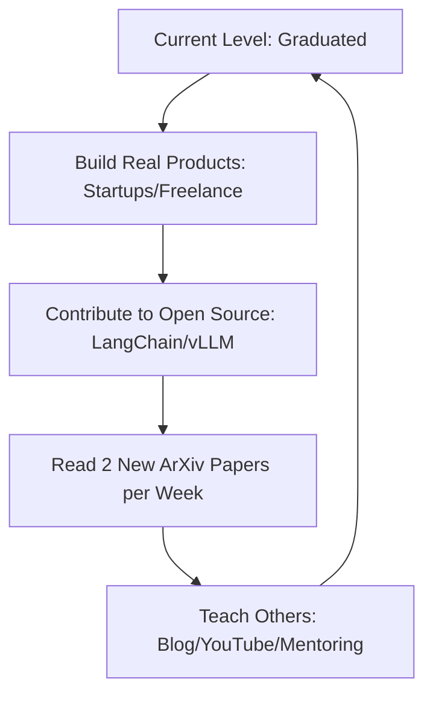

# 🎓 Final Review & Certification Path: Becoming a 2026 AI Engineer
> **Level:** Professional / Mastery | **Language:** Hinglish | **Goal:** Review the entire curriculum, identify your strengths, and map out your path to professional certification and a high-paying career in the 2026 AI industry.

---

## 🧭 1. The Journey Review
Congratulation! Aapne AI Engineering ka ek bahut bada aur mushkil rasta tay kiya hai. 

Ek baar piche mud kar dekhte hain:
1. **Foundations:** Mathematics, Python, aur ML basics.
2. **Deep Learning:** Transformers aur Neural Networks ki "Soul" ko samjha.
3. **LLMs & Agents:** RAG, Fine-tuning, aur Autonomous Agents banana seekha.
4. **Ops & Infra:** GPUs, Networking, aur Model Deployment ko master kiya.
5. **Security & Ethics:** AI ko "Safe" aur "Fair" banana seekha.

Ab aap sirf "Prompt likhne wale" nahi hain, aap ek **"AI Systems Architect"** hain.

---

## 🧠 2. Deep Technical Mastery Checklist
Are you truly ready? Check if you can answer these "Level 10" questions:
- [ ] **Mathematics:** Can you explain how "Backpropagation" works through a Transformer's Attention layer?
- [ ] **Infrastructure:** Can you design a network for an 8-GPU H100 cluster?
- [ ] **Optimization:** Do you understand the difference between **FP8** and **INT8** quantization?
- [ ] **RAG:** Can you implement a "Self-Correcting GraphRAG" from scratch?
- [ ] **Agents:** Can you prevent an "Infinite Loop" in a multi-agent swarm?

---

## 🏗️ 3. The Certification Roadmap (2026 Standards)
In 2026, these are the "Gold Standard" certifications that matter to recruiters:

1. **NVIDIA Certified Associate/Professional (Inference/Training):**
   - Proof that you know how to squeeze every drop of power from a GPU.
2. **HuggingFace 'Master of Transformers' (Community Badge):**
   - Based on your contributions and models on the Hub.
3. **Google Professional ML Engineer / AWS Certified AI Practitioner:**
   - Proof that you can deploy at "Cloud Scale."
4. **The 'Capstone' Certification:**
   - Your project (from Module 18) evaluated by industry experts.

---

## 📊 4. The Career Path (Choosing Your Niche)
Where do you go from here?

| Niche | Role | Focus |
| :--- | :--- | :--- |
| **The Researcher** | ML Scientist | Naye algorithms aur papers likhna |
| **The Architect** | AI System Engineer | Scaling, RAG, aur Production pipelines |
| **The Infrastructure** | MLOps Engineer | GPU clusters, K8s, aur Hardware optimization |
| **The Security Expert**| AI Red-Teamer | Jailbreaking, Bias auditing, aur Safety |
| **The Product Lead** | AI Product Manager | "What to build" and "Why it matters" |

---

## 📊 5. Learning Never Stops (The Infinite Loop)


---

## 💻 6. Production-Ready Examples (The 'Final Boss' Interview Pitch)
```markdown
# 2026 Pro-Tip: How to pitch yourself in 30 seconds.

"Hi, I'm an AI Systems Engineer specializing in **Distributed Inference** and **Agentic RAG**. 
In my last project, I built a medical knowledge engine using **Llama-3-70B** quantized to **FP8**, 
achieving **120 tokens/sec** with **98% faithfulness** via **GraphRAG**. 
I'm passionate about building AI that is not just smart, but **Sustainable** and **Secure**."
```

---

## ❌ 7. Common Post-Curriculum Failures
- **"The Knowledge Trap":** Thinking you know everything and stopping your learning. AI changes $10\%$ every month.
- **"Code Only" Mindset:** Forgetting that AI is a business tool. Always ask: *"How does this make/save money?"*
- **Ignoring the "Non-AI" Tech:** Forgetting that a great AI needs a great **Backend**, a fast **Database**, and a clean **UI**.

---

## 🛠️ 8. Final Debugging Guide (Job Search)
- **Symptom:** "No one is hiring me."
- **Check:** **Your GitHub**. Does it show "Activity" in the last 7 days? Recruiters love "Consistency."
- **Symptom:** "I feel like a fraud (Imposter Syndrome)."
- **Check:** **Your Capstone**. Look at what you built. It's real. It works. You are in the top $1\%$ of developers worldwide.

---

## ⚖️ 9. The Ethical Pledge (2026 Edition)
As a 2026 AI Engineer, you have the power to create systems that can manipulate, spy, or replace people. **Use this power wisely.**
- I will build for **Human Benefit**.
- I will prioritize **Transparency**.
- I will never hide **Bias** or **Risks**.

---

## 🛡️ 10. Stay Connected
- Join the **SusaLabs Alumni Discord**.
- Follow the top $50$ AI researchers on X/Twitter.
- Attend **NeurIPS** or **ICML** (even virtually).

---

## ✅ 11. Final Checklist Before Moving to 'Backend/DBMS/Frontend'
- [x] All 18 modules read and understood.
- [x] At least 2 Capstone projects completed.
- [x] GitHub portfolio updated with latest 2026 tech stack.
- [x] Resume updated with "Production-grade" keywords.

---

## ⚠️ 12. Final Message
AI "Engineering" is not a job; it's a **Superpower**. You now have the ability to solve problems that were impossible 2 years ago. 

Go out and **Build the Future**. 

---

## 🚀 THE END OF 'AI FOUNDATIONS & OPS'
**Next Destination:** `backend/` → Building the robust engines that power AI.
**See you there!**
