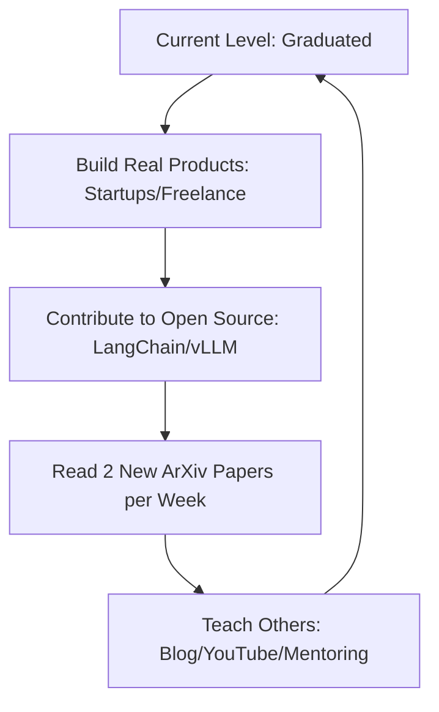

# 🎓 Final Review & Certification Path: Becoming a 2026 AI Engineer
> **Level:** Professional / Mastery | **Language:** Hinglish | **Goal:** Poore curriculum ko review karein, apni strengths ko identify karein, aur 2026 AI industry mein professional certification aur ek high-paying career ke liye apna path map out karein.

---

## 🧭 1. The Journey Review
Congratulation! Aapne AI Engineering ka ek bahut bada aur mushkil rasta tay kiya hai. 

Ek baar piche mud kar dekhte hain:
1. **Foundations:** Mathematics, Python, aur ML basics.
2. **Deep Learning:** Transformers aur Neural Networks ki "Soul" ko samjha.
3. **LLMs & Agents:** RAG, Fine-tuning, aur Autonomous Agents banana seekha.
4. **Ops & Infra:** GPUs, Networking, aur Model Deployment ko master kiya.
5. **Security & Ethics:** AI ko "Safe" aur "Fair" banana seekha.

Ab aap sirf "Prompt likhne wale" nahi hain, aap ek **"AI Systems Architect"** hain.

---

## 🧠 2. Deep Technical Mastery Checklist
Kya aap sach mein ready hain? Check karein ki kya aap in "Level 10" questions ke answers de sakte hain:
- [ ] **Mathematics:** Kya aap explain kar sakte hain ki Transformer ke Attention layer ke through "Backpropagation" kaise work karta hai?
- [ ] **Infrastructure:** Kya aap ek 8-GPU H100 cluster ke liye network design kar sakte hain?
- [ ] **Optimization:** Kya aap **FP8** aur **INT8** quantization ke beech ka difference samajhte hain?
- [ ] **RAG:** Kya aap zero se ek "Self-Correcting GraphRAG" implement kar sakte hain?
- [ ] **Agents:** Kya aap ek multi-agent swarm mein "Infinite Loop" ko prevent kar sakte hain?

---

## 🏗️ 3. The Certification Roadmap (2026 Standards)
2026 mein, recruiters ke liye ye "Gold Standard" certifications sabse zyada matter karte hain:

1. **NVIDIA Certified Associate/Professional (Inference/Training):**
   - Is baat ka proof ki aapko pata hai ki GPU se power ki aakhri boond tak (every drop of power) kaise nikalni hai.
2. **HuggingFace 'Master of Transformers' (Community Badge):**
   - Hub par aapke contributions aur models ke basis par.
3. **Google Professional ML Engineer / AWS Certified AI Practitioner:**
   - Is baat ka proof ki aap "Cloud Scale" par deploy kar sakte hain.
4. **The 'Capstone' Certification:**
   - Industry experts dwara aapke project (Module 18 se) ka evaluation.

---

## 📊 4. The Career Path (Choosing Your Niche)
Where do you go from here?

| Niche | Role | Focus |
| :--- | :--- | :--- |
| **The Researcher** | ML Scientist | Naye algorithms aur papers likhna |
| **The Architect** | AI System Engineer | Scaling, RAG, aur Production pipelines |
| **The Infrastructure** | MLOps Engineer | GPU clusters, K8s, aur Hardware optimization |
| **The Security Expert**| AI Red-Teamer | Jailbreaking, Bias auditing, aur Safety |
| **The Product Lead** | AI Product Manager | "Kya build karna hai" aur "Ye kyun matter karta hai" |

---

## 📊 5. Learning Never Stops (The Infinite Loop)

```mermaid
graph TD
    Mastery[Current Level: Graduated] --> Build[Build Real Products: Startups/Freelance]
    Build --> Contribute[Contribute to Open Source: LangChain/vLLM]
    Contribute --> Research[Read 2 New ArXiv Papers per Week]
    Research --> Teach[Teach Others: Blog/YouTube/Mentoring]
    Teach --> Mastery
```

---

## 💻 6. Production-Ready Examples (The 'Final Boss' Interview Pitch)
```markdown
# 2026 Pro-Tip: How to pitch yourself in 30 seconds.

"Hi, I'm an AI Systems Engineer specializing in **Distributed Inference** and **Agentic RAG**. 
In my last project, I built a medical knowledge engine using **Llama-3-70B** quantized to **FP8**, 
achieving **120 tokens/sec** with **98% faithfulness** via **GraphRAG**. 
I'm passionate about building AI that is not just smart, but **Sustainable** and **Secure**."
```

---

## ❌ 7. Failure Cases (Common Post-Curriculum Failures)
- **"The Knowledge Trap":** Ye sochna ki aap sab kuch jaante hain aur seekhna band kar dena. AI har mahine $10\%$ change hota hai.
- **"Code Only" Mindset:** Ye bhool jana ki AI ek business tool hai. Hamesha khud se puchein: *"Isse paise kaise banenge ya kaise bachenge?"*
- **Ignoring the "Non-AI" Tech:** Ye bhool jana ki ek great AI ke liye ek great **Backend**, ek fast **Database**, aur ek clean **UI** ki zaroorat hoti hai.

---

## 🛠️ 8. Final Debugging Guide (Job Search)
- **Symptom:** "Mujhe koi hire nahi kar raha hai."
- **Check:** **Aapka GitHub**. Kya ye pichle 7 dino mein "Activity" show karta hai? Recruiters ko "Consistency" (lagatar kaam karna) pasand hai.
- **Symptom:** "Mujhe fraud jaisa feel ho raha hai (Imposter Syndrome)."
- **Check:** **Aapka Capstone**. Dekhein aapne kya build kiya hai. Ye real hai. Ye kaam karta hai. Aap worldwide top $1\%$ developers mein aate hain.

---

## ⚖️ 9. The Ethical Pledge (2026 Edition)
Ek 2026 AI Engineer ke roop mein, aapke paas aise systems banane ki power hai jo logo ko manipulate, spy ya replace kar sakte hain. **Is power ka use samajhdaari se karein.**
- Main **Human Benefit** (manav kalyan) ke liye build karunga.
- Main **Transparency** ko priority dunga.
- Main kabhi bhi **Bias** ya **Risks** ko chupaunga nahi.

---

## 🛡️ 10. Stay Connected
- Join the **SusaLabs Alumni Discord**.
- Follow the top $50$ AI researchers on X/Twitter.
- Attend **NeurIPS** or **ICML** (even virtually).

---

## ✅ 11. Final Checklist Before Moving to 'Backend/DBMS/Frontend'
- [x] Sabhi modules ko padh aur samajh liya gaya ho.
- [x] Kam se kam 2 Capstone projects complete ho chuke hon.
- [x] GitHub portfolio latest 2026 tech stack ke sath update ho chuka ho.
- [x] Resume "Production-grade" keywords ke sath update ho chuka ho.

---

## ⚠️ 12. Final Message
AI "Engineering" koi aam naukri nahi hai; ye ek **Superpower** hai. Aapke paas ab aise problems solve karne ki ability hai jo 2 saal pehle tak impossible the. 

Jayein aur **Future ko Build karein**. 

---

## 🚀 THE END OF 'AI FOUNDATIONS & OPS'
**Next Destination:** `backend/` → AI ko power karne wale robust engines ko build karna.
**Wahan milte hain!**
