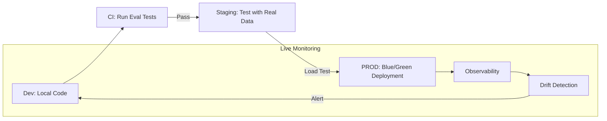

# 🚀 Production Deployment Checklist: The 2026 Gold Standard
> **Level:** Professional | **Language:** Hinglish | **Goal:** Master the final steps of launching an AI application, ensuring security, scalability, cost-efficiency, and reliability before the first "Real User" clicks the button in 2026.

---

## 🧭 1. Overview
AI model "Laptop par chalna" aur "Production mein chalna" do alag duniya hain. 

Production ka matlab hai:
- Agar 10,000 log ek saath aayein toh system crash na ho (**Scalability**).
- Agar koi "Hacking" ki koshish kare toh model chup rahe (**Security**).
- Aapka bill aapke profit se zyada na ho (**Cost**).

Ye checklist ek "Safety Manual" ki tarah hai. Iske bina "Go Live" mat kariyega.

---

## 🏗️ 2. The Multi-Layer Checklist

### Layer 1: Accuracy & Reliability (Quality Control)
- [ ] **RAGAS/Evaluation Run:** Did the model pass the accuracy threshold on the test set?
- [ ] **Hallucination Guardrails:** Are you using **NeMo Guardrails** or **Llama Guard** to filter bad outputs?
- [ ] **Source Verification:** Does every claim have a valid citation?
- [ ] **Fallback Logic:** If the LLM is down, do you have a "Sorry, I'm busy" message or a backup model?

### Layer 2: Performance & Scalability (The Engine)
- [ ] **Token Budgeting:** Is there a `max_tokens` limit on every request?
- [ ] **Continuous Batching:** Is your inference engine (vLLM/TGI) optimized for concurrent users?
- [ ] **Quantization Check:** Are you using **FP8** or **AWQ** to save VRAM without losing quality?
- [ ] **Cold Start Test:** How long does it take for a new GPU instance to start?

### Layer 3: Security & Compliance (The Shield)
- [ ] **Prompt Injection Defense:** Have you tested the system against "Jailbreaks"?
- [ ] **PII Redaction:** Is the system automatically removing "Names" or "Credit Card numbers" before sending data to the LLM?
- [ ] **Data Residency:** Is the data stored in the correct country (e.g., GDPR in Europe, DPDP in India)?
- [ ] **Rate Limiting:** Have you limited users to X requests per minute to prevent "DDoS" or "Cost attacks"?

### Layer 4: Monitoring & Observability (The Dashboard)
- [ ] **Semantic Tracking:** Are you logging NOT JUST the text, but the "Embeddings" to detect drift?
- [ ] **Cost Monitoring:** Do you have an alert if the daily bill exceeds $\$500$?
- [ ] **User Feedback Loop:** Is there a "Thumbs Up/Down" button on every AI response?
- [ ] **Latency P99:** Are you measuring the slowest $1\%$ of responses?

---

## 📊 3. Deployment Tier Comparison
| Feature | MVP (Minimum Viable) | Scale (Production) | Global (Enterprise) |
| :--- | :--- | :--- | :--- |
| **Inference** | OpenAI API | vLLM on single GPU | vLLM Cluster (K8s) |
| **Vector DB** | ChromaDB (Local) | Qdrant (Cloud) | Pinecone (Serverless) |
| **Security** | Basic System Prompt | Guardrails + PII Filter | Full Red-Teaming |
| **Monitoring** | Console Logs | LangSmith / WandB | Datadog + Custom Dash |
| **Cost** | Fixed Subscription | Pay-per-token | Reserved GPU Instances |

---

## 📐 4. The "Go-Live" Equation
- **Launch Readiness ($R$):** 
  $$R = \text{Accuracy} \times \text{Security} \times \text{Cost Margin}$$
  If any of these is $0$, the launch will be a failure.

---

## 📊 5. Deployment Pipeline (Diagram)


---

## 💻 6. Production-Ready Examples (Implementing a Simple Rate Limiter)
```python
# 2026 Pro-Tip: Never expose your LLM API without a rate limiter.
from fastapi import FastAPI, HTTPException
from limits import strategies, parse
from limits.storage import MemoryStorage

app = FastAPI()
storage = MemoryStorage()
limiter = strategies.MovingWindowRateLimiter(storage)

@app.post("/chat")
async def chat_endpoint(user_id: str):
    if not limiter.hit(parse("10 per minute"), user_id):
        raise HTTPException(status_code=429, detail="Too many requests!")
    # Proceed to AI logic...
```

---

## ❌ 7. Common "Day 1" Failures
- **The "Bill Shock":** One user writes a script to call your API 1 million times in a loop. **Fix:** Set hard quotas per user.
- **The "Model Drift":** The AI was smart on Monday, but by Friday it's giving weird answers because the "Real World Data" is different from your "Test Data." **Fix:** **Weekly re-evaluation**.
- **Context Window Blowup:** Users pasting 100-page documents into a 4k context window model. **Fix:** Use **RAG** or **Long-context models (128k+)**.

---

## 🛠️ 8. Debugging Guide (Post-Launch)
- **Symptom:** Users are complaining about "Slow responses."
- **Check:** **TTFT (Time to First Token)**. If TTFT is $> 2s$, the user will think it's broken. Use **Streaming** to show words as they are generated.
- **Symptom:** AI is giving "Forbidden" advice.
- **Check:** **Negative Prompting**. Update your system prompt to explicitly list what the AI should NOT do.

---

## ⚖️ 9. Tradeoffs
- **Latency vs. Accuracy:** A larger model (70B) is smarter but slower. Use **Speculative Decoding** to get the best of both.
- **Self-Hosting vs. API:** Self-hosting gives you $100\%$ privacy but is $10x$ harder to manage than OpenAI/Anthropic APIs.

---

## 🛡️ 10. Security Concerns
- **Model Inversion:** A clever hacker asking the AI "What were your training instructions?" to steal your proprietary prompts. **Solution:** Use **Input/Output Sanitization**.

---

## 📈 11. Scaling Challenges
- **The "Cold Boot" Problem:** When traffic spikes, starting a new GPU pod can take 5-10 minutes. **Solution:** Keep a **"Warm Pool"** of GPUs always running.

---

## 💸 12. Cost Considerations
- **Semantic Caching:** If 100 users ask "What is the capital of France?", don't call the LLM 100 times. Cache the answer in a Vector DB (using **GPTCache**) to save $90\%$ of costs.

---

## ✅ 13. Best Practices
- **Implement a "Kill Switch":** A single button that disables the AI if it starts doing something dangerous.
- **Versioning:** Never "Overwrite" your model. Use `v1.0`, `v1.1`, so you can roll back if there's a problem.
- **Dogfooding:** Use your own AI tool for 1 week before giving it to any customer.

---

## ⚠️ 14. Common Mistakes
- **Testing on "Clean" Data only:** Real users write with typos, bad grammar, and "Slang." Test your AI with "Messy" data.
- **Ignoring the UI/UX:** A fast AI on a slow, ugly website is still a bad experience.

---

## 📝 15. Final "Go-No Go" Questions
1. **"Can we afford a 100x traffic spike tomorrow?"**
2. **"Does our AI follow all privacy laws (GDPR/DPDP)?"**
3. **"Is there a human who can fix this at 3 AM if it breaks?"**
