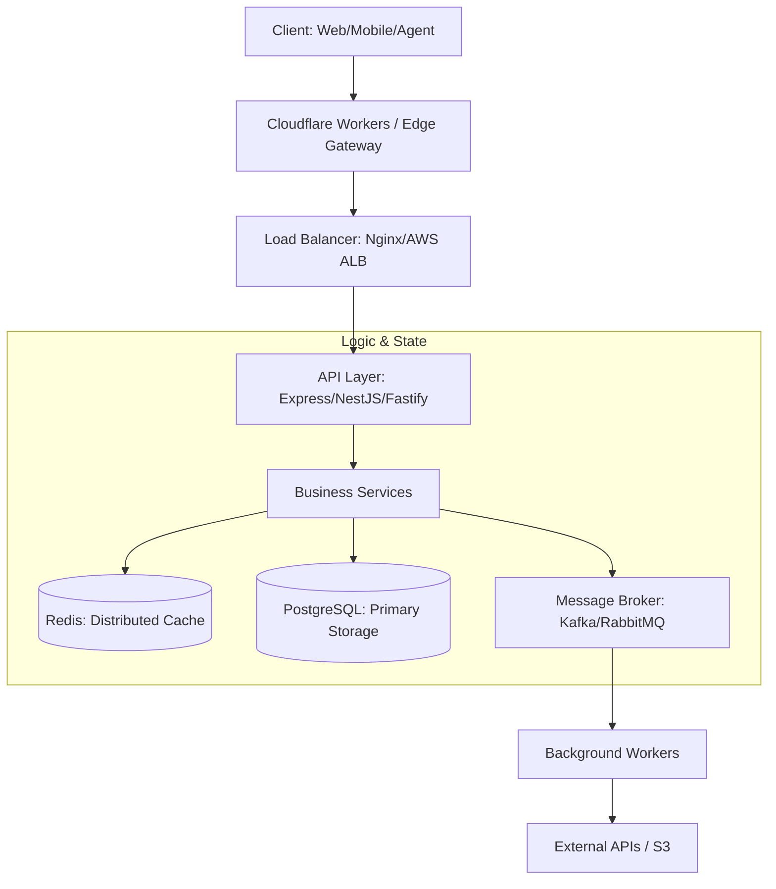

# 🗺️ Backend Roadmap 2026: From Zero to Senior Architect
> **Objective:** 100% Industry Ready | **Language:** Hinglish | **Standard:** 2026 Expert Framework

---

## 🧭 1. Beginner-Friendly Hinglish Explanation
Backend Engineering ka matlab hai "Parde ke peeche ka dimaag". 

- **The Roadmap:** 2026 mein backend sirf APIs likhna nahi hai. Ye **Distributed Systems**, **Serverless**, aur **AI-Native logic** ka mishran hai.
- **The Path:** Shuruat Node.js aur TypeScript se karein, databases ke depth mein jayein (Postgres/Redis), aur phir architecture (Microservices/Event-driven) seekhein.
- **The Goal:** Aapko sirf code likhna nahi, balki **Scalability** aur **Reliability** ke bare mein sochna hai.

Think of the backend as the engine of a car—user ko engine dikhta nahi hai, par engine ke bina car chal nahi sakti.

---

## 🧠 2. Deep Technical Explanation
The 2026 Backend Landscape is defined by **Edge Computing**, **Type-Safety**, and **Observability**.

### The Learning Tiers:
1.  **Level 1: Language & Runtime:** Mastering Node.js Event Loop, Worker Threads, and TypeScript's advanced type system.
2.  **Level 2: API & Logic:** Beyond REST. Mastery of GraphQL, gRPC, and WebSockets.
3.  **Level 3: Data Persistence:** Understanding ACID, CAP Theorem, Indexing strategies, and Vector Databases for AI.
4.  **Level 4: Architecture:** Distributed systems, CQRS, Event Sourcing, and Hexagonal Design.
5.  **Level 5: Infrastructure & Ops:** Kubernetes, CI/CD, and Serverless orchestration.

---

## 🏗️ 3. Architecture Diagrams (The 2026 Stack)


---

## 💻 4. Production-Ready Examples (Roadmap Milestones)
```typescript
// 2026 Standard: Every project must be Type-Safe and Observable
import { z } from 'zod';
import { logger } from './utils/logger';

// Milestone: Implementing a Production-Grade Schema
const UserSchema = z.object({
  id: z.string().uuid(),
  email: z.string().email(),
  role: z.enum(['ADMIN', 'USER', 'AGENT']),
  metadata: z.record(z.unknown()).optional(),
});

type User = z.infer<typeof UserSchema>;

export const validateUser = (data: unknown): User => {
  try {
    return UserSchema.parse(data);
  } catch (error) {
    logger.error("User Validation Failed", { error });
    throw new Error("Invalid User Data");
  }
};
```

---

## 🌍 5. Real-World Use Cases
- **Fintech Swarms:** Multi-agent systems handling high-frequency transactions.
- **Real-time Collaboration:** Building systems like Figma or Notion where backend state must be synced across thousands of users in ms.
- **AI Pipelines:** Backends that manage asynchronous GPU workloads and vector embeddings.

---

## ❌ 6. Failure Cases
- **The "Context Wall":** Designing a system that works for 100 users but crashes at 10,000 due to blocking I/O or unoptimized DB queries.
- **The "Black Box":** Deploying without logging or tracing, making it impossible to find "Silent Bugs".
- **Security Afterthought:** Building a system and trying to "Add Security" later—leading to massive data leaks.

---

## 🛠️ 7. Debugging Section
| Symptom | Probable Cause | Diagnostic Tool |
| :--- | :--- | :--- |
| **High Latency** | Unindexed DB Query / Network Bloat | `EXPLAIN ANALYZE` / OpenTelemetry |
| **Memory Leaks** | Globals / Unclosed Streams | Node.js `--inspect` / Clinic.js |
| **504 Gateway Timeout** | Service hangs / Heavy Task on Main Thread | APM Logs / Flamegraphs |

---

## ⚖️ 8. Tradeoffs
- **Monolith vs. Microservices:** Speed of development vs. Scalability and independent deployment.
- **SQL vs. NoSQL:** Strict consistency vs. Schema flexibility and horizontal scaling.
- **REST vs. gRPC:** Ease of browser use vs. High-performance internal communication.

---

## 🛡️ 9. Security Concerns
- **Identity:** Moving beyond simple passwords to Passkeys and JWT with Short TTL.
- **Injection:** It's not just SQL injection; 2026 faces **Prompt Injection** if backend interacts with LLMs.
- **Zero Trust:** Treating every internal service call as potentially hostile.

---

## 📈 10. Scaling Challenges
- **The C10k Problem:** Handling 10,000+ concurrent connections.
- **Data Sharding:** When a single Postgres instance can't hold all your data.
- **State management:** Keeping microservices in sync without creating a "Distributed Monolith".

---

## 💸 11. Cost Considerations
- **Egress Costs:** Cloud providers charge for data moving out.
- **Serverless vs. Provisioned:** Paying for "Execution Time" vs. "Idle Server Time".
- **Storage Tiering:** Moving old data to S3 Glacier to save costs.

---

## ✅ 12. Best Practices
- **Idempotency:** Ensuring that repeating a request doesn't cause duplicate actions (Critical for payments).
- **Graceful Degradation:** If the cache is down, the system should still work (even if slower).
- **Automated Everything:** Tests, Linting, Deployment, and Monitoring.

---

## ⚠️ 13. Common Mistakes
- **Premature Optimization:** Building for a million users before you have ten.
- **Ignoring Logs:** "It works on my machine" syndrome.
- **Hardcoding Configs:** Putting API keys and DB URLs in the code instead of `.env` files.

---

## 📝 14. Interview Questions
1. "Explain the Node.js Event Loop to a 5-year-old."
2. "How would you design a rate-limiter for a public API?"
3. "What is the difference between Optimistic and Pessimistic locking?"

---

## 🚀 15. Latest 2026 Production Patterns
- **Database-per-Service:** Ensuring microservice isolation.
- **Shadow Deployments:** Testing new features with live traffic without users knowing.
- **AI-Augmented Backend:** Using agents for real-time log analysis and automatic scaling triggers.
