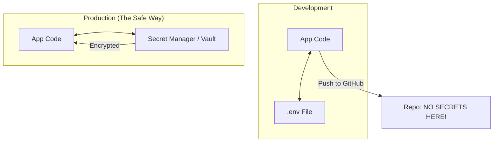

# 🔐 Environment Variables & Configuration: The Secret Sauce
> **Level:** Beginner | **Language:** Hinglish | **Goal:** Master the art of managing app settings and secrets, moving beyond hard-coding to understand .env files, Secret Managers, and the 12-Factor App methodology for a secure 2026 backend.

---

## 🧭 1. Beginner-Friendly Hinglish Explanation
Aapki app mein kuch cheezein "Badalti" rehti hain:
- Database ka password.
- API keys (jaise OpenAI key).
- Kya app "Test" mode mein hai ya "Live" mode mein?

Agar aap ye sab kuch "Code" mein likhenge:
1. Koi bhi aapka code padh kar password chura lega.
2. Jab aap "Test" se "Live" jayenge, aapko code badalna padega.

**Environment Variables** (Env Vars) iska solution hain. Hum ek choti file banate hain (`.env`) jo humari "Secret Notebook" hoti hai. Code sirf is notebook se values "Maangta" hai. 

2026 mein, ek senior backend engineer kabhi bhi code mein password nahi likhta. Wo **"Configuration Management"** ka expert hota hai.

---

## 🧠 2. Deep Technical Explanation
Configuration should be strictly separated from code (**12-Factor App principle #3**).

### 1. What are Environment Variables?
- They are key-value pairs stored in the Operating System's memory where the app is running.
- Example: `PORT=3000`.

### 2. The `.env` File:
- A local file for development. It should **NEVER** be committed to Git (add it to `.gitignore`).
- We use libraries like `dotenv` to load these into our app's process (`process.env` in Node.js).

### 3. Production Configuration:
- In production (AWS/GCP), we don't use `.env` files. We use **Secret Managers** (like AWS Secrets Manager or HashiCorp Vault) or inject variables directly into the CI/CD pipeline or Docker container.

### 4. Dynamic vs. Static Config:
- **Static:** Doesn't change (e.g., App Name).
- **Dynamic:** Changes per environment (e.g., Database URL).

---

## 🏗️ 3. Configuration Management Stack
| Tool / Method | Best For | Security Level |
| :--- | :--- | :--- |
| **.env Files** | Local Development | Low (Easy to leak) |
| **OS Export** | Simple Linux Scripts | Medium |
| **Docker ENV** | Containerized Apps | High |
| **AWS Secrets Mgr**| Enterprise / Production | **Extreme** (Encrypted) |
| **Vault (HashiCorp)**| Multi-Cloud Systems | **Extreme** |

---

## 📐 4. Mathematical Intuition
- **The "Cost of a Leak":** 
  If you leak your OpenAI key on GitHub, bots will find it in **~12 seconds**. If your key has no limit, it can cost you **$\$10,000$** in an hour. This is why "Config Safety" is a financial skill.

---

## 📊 5. The Secret Flow (Diagram)


---

## 💻 6. Production-Ready Examples (Using 'dotenv' in TypeScript)
```typescript
// 1. Install: npm install dotenv
// 2. Create a .env file:
// PORT=3000
// DB_URL=mongodb://localhost:27017

import dotenv from 'dotenv';
dotenv.config();

// 2026 Pro-Tip: Always use a 'Config Object' to validate variables.
const config = {
    port: process.env.PORT || 3000,
    dbUrl: process.env.DB_URL,
};

if (!config.dbUrl) {
    throw new Error("CRITICAL: DB_URL is missing in environment variables! ❌");
}

console.log(`Server starting on port ${config.port}`);
```

---

## ❌ 7. Failure Cases
- **"Accidental Push":** Forgetting to add `.env` to `.gitignore` and pushing it to public GitHub. **Fix: Use 'trufflehog' to scan for secrets.**
- **Typo in Key:** Writing `PORT=3000` in `.env` but calling `process.env.Port` in code (Notice the small 'p').
- **Production Overlap:** Using the "Production DB" URL in your "Local Test" environment and accidentally deleting real user data. **DANGER!**

---

## 🛠️ 8. Debugging Guide
- **Symptom:** "Values are undefined."
- **Check:** **File Path**. Is `dotenv.config()` being called at the VERY TOP of your `index.ts`? If you call it too late, the variables won't be ready.
- **Symptom:** "Changes in .env are not reflecting."
- **Check:** **Restart the Server**. Environment variables are loaded only once when the app starts.

---

## ⚖️ 9. Tradeoffs
- **One Large Config vs. Multiple Files:** 
  - One large file is easy to manage. 
  - Multiple files (`.env.test`, `.env.prod`) are safer for large teams.
- **Client-Side Secrets:** **NEVER** put secrets in a React/Frontend app. Anything in the browser is visible to everyone. **Backend only!**

---

## 🛡️ 10. Security Concerns
- **Environment Dumping:** A hacker gaining access to your server and running the `printenv` command to see all your secrets. **Fix: Use 'Runtime Secrets' that are fetched and deleted instantly.**

---

## 📈 11. Scaling Challenges
- **Consistency:** When you have 100 microservices, managing 100 `.env` files is impossible. **Solution: Centralized Config Service.**

---

## 💸 12. Cost Considerations
- **Managed Secrets:** AWS/Azure charge a small fee per secret per month. It's much cheaper than paying for a data breach.

---

## ✅ 13. Best Practices
- **Use `.env.example`:** Commit a file with dummy values (e.g., `DB_URL=placeholder`) so other developers know which variables they need to set.
- **Type Safety:** Use a library like `zod` or `envalid` to ensure your variables are the right type (e.g., `PORT` must be a number).
- **Rotate Secrets:** Change your passwords and API keys every 90 days automatically.

---

## ⚠️ 14. Common Mistakes
- **Hard-coding default values:** `const url = process.env.URL || "localhost:3000"`. If someone forgets to set `URL` in production, it will try to connect to localhost and fail!
- **Committing secrets in Git history:** Even if you delete the secret later, it stays in the "Git History." You must "Purge" the history.

---

## 📝 15. Interview Questions
1. **"Why should you never commit .env files to Git?"**
2. **"Difference between process.env and shell environment variables?"**
3. **"How do you handle secrets in a Dockerized environment?"**

---

## 🚀 15. Latest 2026 Industry Patterns
- **Secret Zero:** A 2026 technology where the app doesn't even need a password to get passwords. It uses its **"Identity"** (via IAM roles) to prove it's the real app.
- **Dynamic Secrets:** Generating a "Temporary Password" for the database that only lasts for 1 hour and then auto-expires.
- **Config-as-Code (GitOps):** Using a separate, highly secure Git repo just for configurations.
