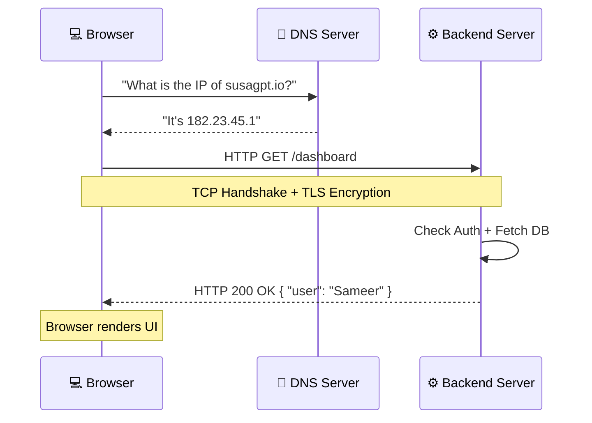

# 🌐 How the Web Works: The Request-Response Cycle
> **Level:** Beginner | **Language:** Hinglish | **Goal:** Master the fundamental communication loop of the internet, understanding DNS, HTTP, Headers, Status Codes, and the step-by-step journey of a data packet in 2026.

---

## 🧭 1. Beginner-Friendly Hinglish Explanation
Internet par kuch bhi hota hai toh wo ek "Conversation" (Batch-cheet) hoti hai. Isse hum **Request-Response Cycle** kehte hain.

Sochiye aapne browser mein likha: `google.com`.
1. **The Address Book (DNS):** Computer ko `google.com` nahi samajh aata. Wo ek phonebook (DNS) ko call karta hai aur "IP Address" (Phone number) maangta hai (e.g., `142.250.190.46`).
2. **The Letter (Request):** Browser ek chithi (HTTP Request) likhta hai: *"Hey Google, mujhe apna Home Page bhej do."*
3. **The Postman (TCP/IP):** Ye chithi "Packets" mein tutkar wires aur satellites ke zariye server tak pahunchti hai.
4. **The Response:** Server chithi padhta hai aur reply bhejta hai: *"Ok! Ye lo HTML file (Status: 200 OK)."*
5. **The Rendering:** Browser us file ko "Sajaakar" (Render) aapko dikhata hai.

Ye sab kuch $1$ second ke andar hota hai. Agar aap backend engineer hain, toh aapko is "Conversation" ka har word (Header/Body) samajhna zaroori hai.

---

## 🧠 2. Deep Technical Explanation
The web works on the **OSI Model**, specifically the Application layer (HTTP) and Transport layer (TCP).

### 1. The Anatomy of a Request:
- **Method (Verb):** What do you want to do?
  - `GET`: Read data.
  - `POST`: Create new data.
  - `PUT`: Update data.
  - `DELETE`: Remove data.
- **URL/Path:** Where is the data? (e.g., `/api/users/101`).
- **Headers:** Metadata about the request (e.g., `Content-Type: application/json`).
- **Body:** The actual data (usually JSON).

### 2. The Anatomy of a Response:
- **Status Code:** Was it successful?
  - `2xx`: Success (e.g., 200 OK).
  - `3xx`: Redirect (e.g., 301 Moved Permanently).
  - `4xx`: Client Error (e.g., 404 Not Found - Aapki galti).
  - `5xx`: Server Error (e.g., 500 Internal Error - Meri galti).
- **Headers:** Metadata about the server response.
- **Body:** The data (HTML, JSON, Image).

### 3. HTTPS (The 'S' for Secure):
- Use of **TLS (Transport Layer Security)** to encrypt the conversation so a "Man-in-the-middle" can't read your password.

---

## 🏗️ 3. HTTP Methods Cheat Sheet
| Method | Idempotent? | Body? | Purpose |
| :--- | :--- | :--- | :--- |
| **GET** | Yes | No | Fetching data (Safe) |
| **POST** | No | Yes | Submitting forms / Creating records |
| **PUT** | Yes | Yes | Replacing a resource entirely |
| **PATCH** | No | Yes | Partially updating a resource |
| **DELETE** | Yes | No | Removing a resource |

---

## 📐 4. Mathematical Intuition
- **RTT (Round Trip Time):** The time it takes for a signal to go to the server and back.
- **Bandwidth vs. Latency:** 
  - Bandwidth is "How much water" flows through the pipe. 
  - Latency is "How fast" the first drop reaches you. 
  - For small API calls, **Latency** is the only thing that matters.

---

## 📊 5. The Full Journey (Diagram)


---

## 💻 6. Production-Ready Examples (Inspecting a Request in Node.js)
```typescript
// 2026 Pro-Tip: Always log your request headers to debug Auth issues.
import express from 'express';

const app = express();

app.use((req, res, next) => {
    console.log(`[${new Date().toISOString()}] ${req.method} ${req.url}`);
    console.log("User Agent:", req.headers['user-agent']);
    next(); // Pass to the next handler
});

app.get('/api/v1/ping', (req, res) => {
    res.send({ status: "alive" });
});

app.listen(3000);
```

---

## ❌ 7. Failure Cases
- **DNS Spying:** Using a public DNS that tracks your history. **Fix: Use Encrypted DNS (DoH).**
- **CORS Errors:** Browser blocking your backend because they are on different domains. **Fix: Configure CORS headers in the backend.**
- **Timeout:** The server is taking too long to reply, and the browser gives up. **Fix: Optimize DB queries or use Background Tasks.**

---

## 🛠️ 8. Debugging Guide
- **Symptom:** "It works on my machine but not on the server."
- **Check:** **Environment Variables**. Is the server trying to connect to `localhost` instead of the production DB?
- **Symptom:** "403 Forbidden."
- **Check:** **Authorization Header**. Did you forget to send the `Bearer token`? Use the **Network Tab (F12)** in Chrome to see the raw request.

---

## ⚖️ 9. Tradeoffs
- **HTTP/1.1 vs HTTP/2 vs HTTP/3:** 
  - HTTP/1.1 is simple but slow. 
  - HTTP/2 allows many requests over one connection. 
  - **HTTP/3 (QUIC)** uses UDP to handle unstable networks (like mobile 5G) much better.

---

## 🛡️ 10. Security Concerns
- **XSS (Cross-Site Scripting):** Hacker injecting a script into a response. **Fix: Sanitize HTML and use CSP headers.**
- **CSRF (Cross-Site Request Forgery):** Tricking a user's browser into sending a request they didn't intend. **Fix: Use CSRF tokens.**

---

## 📈 11. Scaling Challenges
- **Load Balancing:** When one server can't handle the "Request-Response" volume, we put a **Load Balancer** (Nginx/HAProxy) in front to distribute the work.

---

## 💸 12. Cost Considerations
- **Egress Costs:** Cloud providers charge for "Data sent OUT" of the data center. If your JSON responses are too large, your bill will explode. **Fix: Use Compression (Gzip/Brotli).**

---

## ✅ 13. Best Practices
- **Use Meaningful Status Codes:** Don't send `200 OK` if there was an error. Send `400` or `500`.
- **Stateless Requests:** Every request should contain all the info needed to process it (e.g., Auth token).
- **Versioning:** Always use `/api/v1/` in your URLs so you don't break old apps when you update the code.

---

## ⚠️ 14. Common Mistakes
- **Using GET for sensitive data:** Don't put passwords in the URL (`GET /login?pw=123`). URLs are logged; use **POST Body**.
- **Forgetting to close connections:** If your backend doesn't finish the response, the browser will hang forever.

---

## 📝 15. Interview Questions
1. **"What is the difference between 401 and 403 status codes?"** (Unauthenticated vs. Unauthorized).
2. **"Explain the TCP 3-Way Handshake."**
3. **"How does a browser handle a 301 Redirect?"**

---

## 🚀 15. Latest 2026 Industry Patterns
- **Edge Computing (Serverless):** Logic running at the network edge so the "Request-Response" journey is physically shorter ($5ms$ vs $100ms$).
- **Web-Transport API:** A new alternative to WebSockets and HTTP for ultra-low latency game-like interactions.
- **Privacy-Preserving Headers:** Browsers automatically stripping tracking headers to protect user identity by default.
