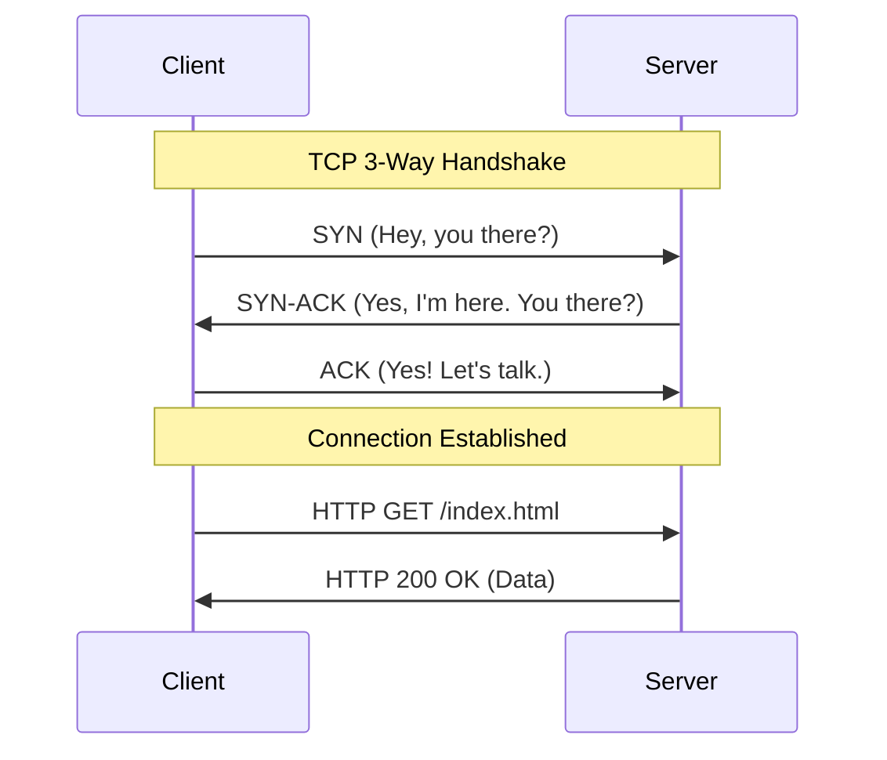

# 🌐 Internet and HTTP Fundamentals: The Language of the Web
> **Objective:** Master the networking protocols that power the web | **Language:** Hinglish | **Standard:** 2026 Expert Framework

---

## 🧭 1. Beginner-Friendly Hinglish Explanation
Internet aur HTTP backend ka "Base" hain. Agar internet ek highway hai, toh HTTP wo "Rules" hain jo decide karte hain ki gaadi (Data) kaise chalegi.

- **Internet:** Ye ek global network hai. Aapka computer ek address (IP Address) ke saath is network se juda hai.
- **HTTP (HyperText Transfer Protocol):** Ye ek sawal-jawab ka system hai.
  - **Client (Aap):** "Mera profile dikhao" (Request).
  - **Server (Backend):** "Ye lo aapka profile" (Response).
- **Statelessness:** HTTP ek "Gajni" hai—ise purani baatein yaad nahi rehti. Isliye hum **Cookies** aur **Sessions** use karte hain "Memory" ke liye.

---

## 🧠 2. Deep Technical Explanation
The internet operates on the **OSI Model**, but as a backend engineer, you primarily deal with the **Application Layer (HTTP)** and the **Transport Layer (TCP/UDP)**.

### The Anatomy of an HTTP Request:
1.  **Method:** GET (Fetch), POST (Create), PUT (Update), DELETE (Remove).
2.  **Headers:** Metadata like `Content-Type`, `Authorization`, and `User-Agent`.
3.  **Body:** The actual data being sent (usually in JSON).

### The Anatomy of an HTTP Response:
1.  **Status Code:** 2xx (Success), 4xx (Client Error), 5xx (Server Error).
2.  **Headers:** Metadata like `Set-Cookie` or `Cache-Control`.
3.  **Payload:** The data returned to the client.

### DNS (Domain Name System):
The "Phonebook" of the internet. It translates `google.com` into an IP like `142.250.190.46`.

---

## 🏗️ 3. Architecture Diagrams (The TCP Handshake)


---

## 💻 4. Production-Ready Examples (Handling Requests)
```typescript
// 2026 Standard: Understanding HTTP status codes and headers

import express from 'express';
const app = express();

app.get('/api/resource', (req, res) => {
  // Accessing Request Headers
  const authToken = req.headers['authorization'];
  
  if (!authToken) {
    // 401: Unauthorized (Client forgot to login)
    return res.status(401).json({ error: "Missing Token" });
  }

  // 200: OK (Success)
  res.status(200).set('X-Custom-Header', 'Value').json({
    message: "Resource fetched successfully",
    timestamp: new Date().toISOString()
  });
});
```

---

## 🌍 5. Real-World Use Cases
- **Blogging Platforms:** Using `GET` to read a post and `POST` to publish a comment.
- **Authentication:** Using `HTTPOnly Cookies` to store session tokens securely.
- **CDNs:** Using `Cache-Control` headers to tell the internet how long to store your images.

---

## ❌ 6. Failure Cases
- **Mixed Content:** Trying to load HTTP resources on an HTTPS site (Browser will block it).
- **Infinite Redirects:** Setting up a 301 redirect that points back to itself.
- **Large Headers:** Sending too much metadata in headers, causing the server to reject the request (431 Header Fields Too Large).

---

## 🛠️ 7. Debugging Section
| Tool | Use Case | Tip |
| :--- | :--- | :--- |
| **cURL** | CLI request testing | `curl -v http://site.com` for full headers. |
| **Postman/Insomnia** | API testing | Use Environments for easy switching. |
| **Wireshark** | Deep packet analysis | Only use if you're debugging low-level TCP issues. |

---

## ⚖️ 8. Tradeoffs
- **HTTP/1.1 vs HTTP/2:** Simplicity vs Performance (Multiplexing).
- **Cookies vs LocalStorage:** Automatic browser handling (Safe for Auth) vs Manual handling (Good for UI state).

---

## 🛡️ 9. Security Concerns
- **HTTPS:** Always encrypt data in transit. In 2026, HTTP is considered obsolete for anything other than local dev.
- **Strict-Transport-Security (HSTS):** Forcing browsers to only use HTTPS.
- **CSRF (Cross-Site Request Forgery):** Using tokens to ensure requests come from your real frontend.

---

## 📈 10. Scaling Challenges
- **Head-of-Line Blocking:** In HTTP/1.1, one slow request blocks others (Solved by HTTP/2).
- **Latency:** The physical distance between the server and the client (Solved by CDNs).

---

## 💸 11. Cost Considerations
- **Data Transfer Out:** Large JSON payloads cost more money in cloud bills. Use compression (Gzip/Brotli).
- **API Call Volume:** Every request costs CPU and RAM. Use caching headers.

---

## ✅ 12. Best Practices
- **Use Semantic Status Codes:** 201 for Created, 404 for Not Found.
- **Idempotent GETs:** A GET request should never change data on the server.
- **Keep Payloads Small:** Only send the data the client actually needs.

---

## ⚠️ 13. Common Mistakes
- **Storing Secrets in Headers:** Sending API keys in URL parameters (They get logged in DNS/Proxy logs).
- **Ignoring 404s:** Letting broken links consume server resources.
- **No Timeouts:** Letting a request hang forever if the DB is slow.

---

## 📝 14. Interview Questions
1. "What is the difference between Symmetric and Asymmetric encryption in HTTPS?"
2. "Explain the difference between a Permanent (301) and Temporary (302) redirect."
3. "What are 'Preflight Requests' in CORS?"

---

## 🚀 15. Latest 2026 Production Patterns
- **HTTP/3 (QUIC):** Using UDP-based protocols for even faster web performance.
- **Early Hints (103):** Telling the browser which assets to pre-load before the full HTML is ready.
- **Signed HTTP Exchanges (SXG):** Allowing third parties (like Google Search) to serve your content while proving it's authentic.
