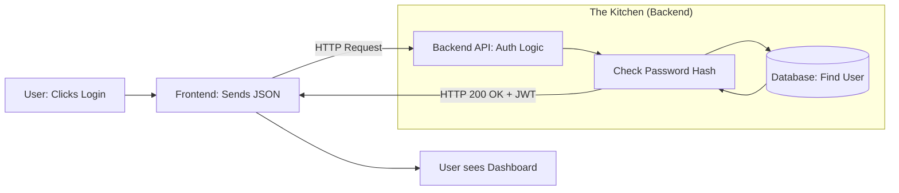

# 🏗️ Introduction to Backend Engineering: The Invisible Engine
> **Level:** Beginner | **Language:** Hinglish | **Goal:** Understand the fundamental role of backend engineering, moving beyond "APIs" to understand how data flows, systems scale, and the invisible logic that powers the modern web in 2026.

---

## 🧭 1. Beginner-Friendly Hinglish Explanation
Backend engineering wo "Invisible Engine" hai jo duniya ki har badi app ko chalata hai. 

Sochiye aap ek "Restaurant" mein gaye hain:
- **Frontend:** Wo "Dining Area" hai jahan aap baithte hain, menu dekhte hain, aur decoration dekhte hain. Ye sundar hota hai.
- **Backend:** Wo "Kitchen" hai jahan khana banta hai. Aapko kitchen dikhta nahi, par agar kitchen na ho toh restaurant bekar hai.
- **Database:** Wo "Store Room" hai jahan saara rashan (ingredients) rakha hota hai.

Backend engineer ka kaam hai ye "Kitchen" chalana. 
- Jab aap "Order" (Request) dete hain, backend usse handle karta hai. 
- Wo rashan dhoondhta hai (Database query). 
- Khana banata hai (Logic). 
- Aur aapko "Plate" (Response) par serve karta hai.

2026 mein backend sirf "Code likhna" nahi hai, ye "Systems" ko design karna hai jo millions of requests ko handle kar sakein bina crash hue.

---

## 🧠 2. Deep Technical Explanation
Backend Engineering is the art of **Resource Management**, **Data Persistence**, and **Communication Protocols.**

### 1. The Core Components:
- **The Server:** A process (Node.js, Go, Python) that listens for incoming requests on a specific port.
- **The API (Application Programming Interface):** The "Menu" of the backend. It defines what data can be requested and how.
- **The Database:** Where data lives long-term. (SQL like PostgreSQL or NoSQL like MongoDB).
- **The Logic Layer:** Where business rules live (e.g., "If user is not logged in, don't show the dashboard").

### 2. The 2026 Backend Stack:
- **Runtime:** Moving from pure JavaScript to **TypeScript** for safety.
- **Architecture:** Moving from Monoliths (One big app) to **Microservices** or **Serverless** (Many small apps).
- **Communication:** Beyond REST to **GraphQL**, **gRPC**, and **WebSockets**.

### 3. The 3 Pillars of a Great Backend:
1. **Scalability:** Can it handle 1 user and 1 million users with the same speed?
2. **Security:** Is the data safe from hackers?
3. **Maintainability:** Can another engineer read your code and fix a bug in 5 minutes?

---

## 🏗️ 3. Backend vs. Frontend Comparison
| Feature | Frontend (UI) | Backend (Logic) |
| :--- | :--- | :--- |
| **Visible to User** | Yes | No (Invisible) |
| **Main Tech** | React, CSS, HTML | Node.js, Go, Python, SQL |
| **Main Concern** | User Experience / Speed | Data Safety / Scalability |
| **State** | Temporary (Browser) | Persistent (Database) |
| **Environment** | User's Browser/Mobile | Remote Cloud Servers |

---

## 📐 4. Mathematical Intuition
- **The Latency Formula:** 
  $$\text{Total Latency} = \text{Network Latency} + \text{Server Processing Time} + \text{Database Query Time}$$
  If any of these is slow, the user feels it. A backend engineer's job is to minimize each part of this equation.
- **Availability ($A$):** 
  $$A = \frac{\text{Uptime}}{\text{Uptime} + \text{Downtime}}$$
  "Five Nines" (99.999%) is the gold standard for high-end backends.

---

## 📊 5. The Data Flow (Diagram)


---

## 💻 6. Production-Ready Examples (A Simple Express Server in 2026)
```typescript
// 2026 Pro-Tip: Use TypeScript for everything.
import express, { Request, Response } from 'express';

const app = express();
app.use(express.json());

// A simple 'Hello World' API Endpoint
app.get('/api/v1/greet', (req: Request, res: Response) => {
    // 200 OK: Everything is fine
    res.status(200).json({
        message: "Welcome to the Backend of 2026!",
        timestamp: new Date().toISOString()
    });
});

app.listen(3000, () => {
    console.log("Server is purring on port 3000 🚀");
});
```

---

## ❌ 7. Failure Cases
- **The "N+1" Query Problem:** Asking the database for a user, then asking for their orders, then for each order asking for the delivery address... 100 queries instead of 1. **Fix: Use SQL Joins.**
- **Hard-coding Secrets:** Putting your database password in the code. **Fix: Use Environment Variables (.env).**
- **Ignoring Errors:** Not using `try-catch` blocks, causing the entire server to crash when one user sends bad data.

---

## 🛠️ 8. Debugging Guide
- **Symptom:** "The app is slow."
- **Check:** **Logs**. Look at the "Request Time." Is the database query taking 5 seconds? Add an **Index** to the database table.
- **Symptom:** "The server is down."
- **Check:** **Process Manager (PM2)**. Did the server run out of memory? Use **Monitoring** tools to see CPU/RAM usage.

---

## ⚖️ 9. Tradeoffs
- **Speed vs. Safety:** TypeScript takes longer to write but prevents $90\%$ of production bugs.
- **SQL vs. NoSQL:** SQL is better for "Complex relationships" (e.g., Banking). NoSQL is better for "Rapidly changing data" (e.g., Social media feeds).

---

## 🛡️ 10. Security Concerns
- **SQL Injection:** A hacker writing `'; DROP TABLE users; --` in the login box. **Fix: Use Parameterized Queries (ORMs).**
- **DDoS Attacks:** Millions of bots hitting your API to crash it. **Fix: Use Rate Limiting and Cloudflare.**

---

## 📈 11. Scaling Challenges
- **Vertical Scaling:** Buying a bigger server (Limit: There is only so much RAM in one box).
- **Horizontal Scaling:** Buying 100 small servers and a **Load Balancer**. This is how Google/Amazon work.

---

## 💸 12. Cost Considerations
- **Compute Costs:** Every millisecond of CPU time costs money on AWS/Azure. Optimized code = Lower monthly bills.

---

## ✅ 13. Best Practices
- **Statelessness:** Your server shouldn't "Remember" the user in its RAM. Use **Tokens (JWT)** instead.
- **Idempotency:** If a user clicks "Pay" twice, the backend should only charge them once.
- **Documentation:** Use **Swagger/OpenAPI** so frontend developers know how to use your API.

---

## ⚠️ 14. Common Mistakes
- **Doing too much in the Controller:** Putting all your business logic in one file. **Fix: Use Services and Repositories.**
- **Ignoring the Client:** Sending a 10MB JSON response when the client only needs the user's name.

---

## 📝 15. Interview Questions
1. **"What happens when you type google.com in your browser?"** (The classic).
2. **"Difference between a Monolith and Microservices?"**
3. **"How do you handle a database crash in a production environment?"**

---

## 🚀 15. Latest 2026 Industry Patterns
- **AI-Augmented Backends:** LLMs that automatically "Refactor" slow SQL queries or write unit tests.
- **BFF Pattern (Backend-for-Frontend):** Creating specific APIs for Mobile and Web to minimize data transfer.
- **Edge Functions:** Running backend logic in the "City" closest to the user (via Cloudflare Workers) to reach $10ms$ latency.
