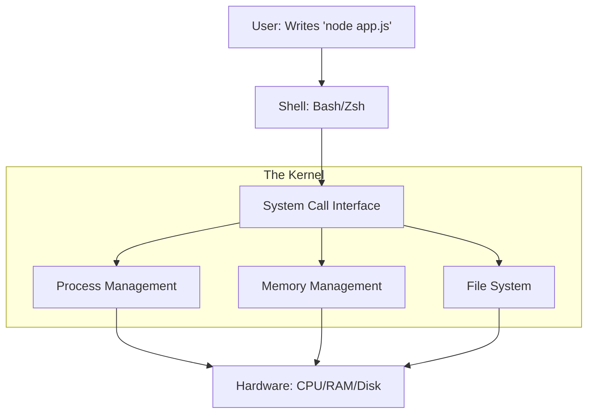

# 🐧 Operating Systems & Linux: The Backend's Home
> **Level:** Beginner | **Language:** Hinglish | **Goal:** Master the essential Linux skills required for backend engineering, moving beyond the GUI to understand Kernel, Shell, File Systems, and Permissions in a production environment.

---

## 🧭 1. Beginner-Friendly Hinglish Explanation
Windows aur Mac "Insaanon" ke liye bane hain, par **Linux** "Servers" ke liye bana hai.

Backend engineering mein hum kabhi bhi mouse ya buttons use nahi karte. Hum "Black Screen" (Terminal) mein "Commands" likhte hain. 
- **The Shell:** Ye aapka "Translator" hai. Aap likhte hain `ls`, aur Shell kernel ko bolta hai: *"Bhai, saari files ki list dikha do."*
- **File System:** Linux mein "Sab kuch ek file hai." Aapki hard drive, aapka mouse, aur aapka internet connection bhi ek file ki tarah treat hota hai.

Agar aapko Linux nahi aata, toh aap "Production" mein kabhi kaam nahi kar payenge. Kyun? Kyunki duniya ke $96\%$ servers Linux par chalte hain.

---

## 🧠 2. Deep Technical Explanation
Linux is a **Unix-like** operating system centered around the **Kernel.**

### 1. The Kernel:
- The heart of the OS. It manages memory, CPU, and hardware.
- It ensures that `App A` cannot read the memory of `App B`.

### 2. The User Space (The Shell):
- Where we live. We use **Bash** or **Zsh**.
- We use "Pipes" (`|`) to send the output of one command to another (e.g., `cat logs.txt | grep "Error"`).

### 3. Permissions (The 'Security' Layer):
- Every file has 3 types of permissions: **Read (r)**, **Write (w)**, and **Execute (x)**.
- These are set for 3 types of people: **Owner**, **Group**, and **Others**.
- **Chmod 777:** The "Danger" command that gives everyone full access. Never use it in production!

---

## 🏗️ 3. Essential Linux Commands for Backend
| Command | Purpose | Example |
| :--- | :--- | :--- |
| `ls -la` | List all files (even hidden) | `ls -la /var/www` |
| `cd` | Change directory | `cd /home/user/app` |
| `mkdir` | Create a folder | `mkdir project_v1` |
| `cat` / `tail` | Read a file | `tail -f logs.txt` (Live view) |
| `grep` | Find text | `grep "404" access.log` |
| `chmod` | Change permissions | `chmod 400 key.pem` |
| `sudo` | Run as Admin (Root) | `sudo apt update` |
| `ps aux` | See running processes | `ps aux | grep node` |

---

## 📐 4. Mathematical Intuition
- **Memory Addressing:** 64-bit Linux can theoretically address $16$ Exabytes of RAM. (Your server probably has 16GB).
- **Inodes:** Every file in Linux has an "Inode number." If you run out of Inodes (even if you have GBs of space left), you cannot create new files.

---

## 📊 5. Linux System Layers (Diagram)


---

## 💻 6. Production-Ready Examples (Writing a Basic Shell Script)
```bash
# 2026 Pro-Tip: Automate your life with .sh scripts.

#!/bin/bash
echo "Starting Backup for Backend App..."

# 1. Create a timestamp
DATE=$(date +%Y-%m-%d)

# 2. Archive the logs
tar -czf backup_$DATE.tar.gz /var/www/logs/

# 3. Move to safe storage
mv backup_$DATE.tar.gz /mnt/backups/

echo "Backup Complete! ✅"
```

---

## ❌ 7. Failure Cases
- **Root Login:** Logging in as the "Root" user every time. If you make one mistake (`rm -rf /`), you destroy the ENTIRE server. **Fix: Use a 'Sudo' user.**
- **Zombies:** Processes that are dead but still taking up space in the "Process Table." **Fix: Use `kill -9` to clean up.**
- **Log Bloat:** A 50GB log file making the server crawl. **Fix: Use `logrotate`.**

---

## 🛠️ 8. Debugging Guide
- **Symptom:** "Permission Denied."
- **Check:** `ls -l`. Who owns the file? Use `chown` to change the owner or `chmod` to add 'Execute' rights.
- **Symptom:** "Command not found."
- **Check:** **PATH variable**. Type `echo $PATH`. Is your binary folder listed there?

---

## ⚖️ 9. Tradeoffs
- **Ubuntu vs. Alpine:** 
  - Ubuntu is friendly and has everything (Heavy: 200MB+). 
  - **Alpine Linux** is tiny and secure (Light: 5MB). Used for $90\%$ of Docker containers.
- **Vim vs. Nano:** 
  - Nano is easy. 
  - **Vim** is a superpower once you learn the shortcuts (mandatory for 2026 engineers).

---

## 🛡️ 10. Security Concerns
- **World-writable files:** Files that anyone can edit. A hacker can change your code. **Always keep permissions at '644' or '400' for secrets.**
- **SSH Port:** Everyone knows SSH is on Port 22. **Fix: Change it to something random like 2222.**

---

## 📈 11. Scaling Challenges
- **File Descriptors:** Every user connection is a "File" in Linux. If you have 100,000 users, you need to increase the `ulimit` (the max number of open files) or the OS will block new users.

---

## 💸 12. Cost Considerations
- **Linux is FREE.** Unlike Windows Server, you don't pay any license fees for Linux, which is why it's the foundation of the modern internet's economy.

---

## ✅ 13. Best Practices
- **Never edit files on production directly.** Use **Git** and **CI/CD**.
- **Use 'Screen' or 'Tmux':** If your internet disconnects, your command will keep running.
- **Learn 'Sed' and 'Awk':** The magic tools for editing text files instantly from the command line.

---

## ⚠️ 14. Common Mistakes
- **Running `rm -rf /`**: (Even as a joke). It will delete everything.
- **Forgeting `sudo`**: Spending 10 minutes debugging why a command failed, only to realize you weren't Admin.

---

## 📝 15. Interview Questions
1. **"What is the difference between a Hard Link and a Soft Link?"**
2. **"Explain the 'Linux Boot Process'."**
3. **"How do you find which process is using the most RAM?"** (`top` or `ps`).

---

## 🚀 15. Latest 2026 Industry Patterns
- **eBPF:** A new technology that allows you to run tiny programs inside the Linux Kernel to monitor performance and security without slowing anything down.
- **Immutable OS:** Operating systems like **Talos Linux** where you CANNOT change any files; you must replace the whole OS image to update code.
- **AI-Shells:** Terminals with built-in AI that can explain why a command failed and suggest the fix instantly.
