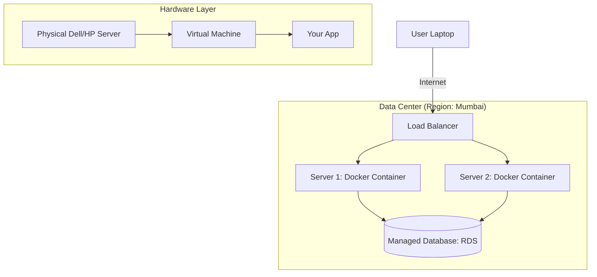

# 🏢 Servers & Data Centers: The Physical Layer
> **Level:** Beginner | **Language:** Hinglish | **Goal:** Master the physical reality of backend engineering, exploring the transition from local "Servers" to global "Cloud" infrastructure, and understanding the 2026 hardware landscape.

---

## 🧭 1. Beginner-Friendly Hinglish Explanation
Backend code "Hawa" mein nahi chalta. Use ek physical "Machine" chahiye. 

- **The Server:** Ye ek computer hi hota hai, par bina screen ke aur bahut powerful. Iska kaam hai 24/7 chalte rehna aur "Requests" ka intezar karna.
- **The Data Center:** Ek bahut badi building (Warehouse) jahan hazaron servers rakhe hote hain. Wahan par extra cooling (AC), high-speed internet, aur backup bijli (Generators) hoti hai.
- **The Cloud:** "Cloud" ka matlab kisi aur ka computer rent par lena. Jab aap AWS ya Google Cloud use karte hain, toh aap unke data centers mein ek "Virtual Machine" chala rahe hote hain.

2026 mein, hum shayad hi kabhi physical server khud kharidte hain. Hum "Cloud" aur "Serverless" par depend karte hain, par unka "Internal mechanism" samajhna ek senior engineer ke liye zaroori hai.

---

## 🧠 2. Deep Technical Explanation
Modern backend infrastructure is built on **Virtualization** and **Containerization.**

### 1. Bare Metal vs. Virtual Machines (VMs):
- **Bare Metal:** Running your code directly on the hardware. (Fastest, but hard to manage).
- **VM (Hypervisor):** Splitting one big physical server into 10 small "Virtual" servers. Each VM has its own OS. (Industry standard for 15 years).

### 2. Containers (The 2026 Standard):
- **Docker:** Instead of a whole OS, we package only our app and its dependencies. Containers share the same "Host Kernel," making them $10x$ lighter and faster than VMs.

### 3. Server Architecture:
- **CPU:** The "Brain" (Intel Xeon / AMD EPYC / ARM).
- **RAM:** The "Workspace." Backend apps live in RAM.
- **Storage:** SSD (NVMe) for fast data access.
- **NIC (Network Interface Card):** The "Mouth and Ears" of the server.

---

## 🏗️ 3. Infrastructure Evolution
| Phase | Model | Who manages hardware? | Speed to Deploy |
| :--- | :--- | :--- | :--- |
| **Traditional** | On-Premise (Own Server) | You | Months |
| **IaaS** | VMs (AWS EC2) | Amazon | Minutes |
| **PaaS** | Heroku / Render | Provider | Seconds |
| **Serverless** | AWS Lambda / Vercel | Provider (Automatic) | Milliseconds |

---

## 📐 4. Mathematical Intuition
- **Capacity Planning:** If your app uses 500MB of RAM per user, and you have a 16GB server, how many users can you handle?
  $$\text{Users} = \frac{\text{Total RAM} - \text{OS RAM}}{\text{RAM per user}}$$
  (Answer: $\sim 30$ users. Beyond that, you need another server).
- **Availability Calculations:** If a server has $99\%$ uptime, it can be down for **$3.6$ days per year**. Is that acceptable for a bank? No.

---

## 📊 5. The Cloud Stack (Diagram)


---

## 💻 6. Production-Ready Examples (Checking Server Stats via Terminal)
```bash
# 2026 Pro-Tip: A backend engineer must be comfortable with the Linux CLI.

# 1. See 'Top' processes using CPU/RAM
htop

# 2. Check Disk space
df -h

# 3. Check if the server is listening on Port 3000
netstat -tuln | grep 3000

# 4. Check free RAM
free -m
```

---

## ❌ 7. Failure Cases
- **The "Noisy Neighbor":** Another company's VM on the same physical server is using all the CPU, making your app slow. **Fix: Use 'Dedicated' instances.**
- **Disk Full:** Logs taking up all the SSD space, causing the database to stop. **Fix: Log Rotation.**
- **Network Latency:** Your server is in the USA but your users are in India. **Fix: Use 'Regions' closer to the user.**

---

## 🛠️ 8. Debugging Guide
- **Symptom:** "Connection Refused."
- **Check:** **Security Groups / Firewalls**. Did you open Port 80/443 for the public?
- **Symptom:** "504 Gateway Timeout."
- **Check:** **Load Balancer**. Is the backend server actually running, or did it crash?

---

## ⚖️ 9. Tradeoffs
- **ARM vs x86:** 
  - ARM (AWS Graviton) is $40\%$ cheaper and uses less power. 
  - x86 (Intel/AMD) is more compatible with older libraries.
- **Serverless vs Always-on:** 
  - Serverless is cheaper for low traffic. 
  - Always-on is cheaper for high, steady traffic.

---

## 🛡️ 10. Security Concerns
- **SSH Access:** Leaving your server open with a weak password. **Fix: Use SSH Keys and disable Password login.**
- **Unpatched OS:** Not updating Linux for 2 years, leaving "Zero-day" vulnerabilities open.

---

## 📈 11. Scaling Challenges
- **Vertical Scaling (Up):** Adding more RAM/CPU to one machine.
- **Horizontal Scaling (Out):** Adding MORE machines. In 2026, **Horizontal is the only way** to reach billions.

---

## 💸 12. Cost Considerations
- **Egress Fees:** Cloud providers make it "Free" to put data in, but very "Expensive" to take data out. **Watch your bandwidth!**

---

## ✅ 13. Best Practices
- **Treat Servers as 'Cattle', not 'Pets':** If a server is acting weird, don't try to "Fix" it for 5 hours. Just "Kill" it and start a new one automatically (Auto-scaling).
- **Use Multi-AZ (Availability Zones):** Put servers in 2 different buildings so if one building catches fire, your app stays up.
- **Infrastructure as Code (IaC):** Never click buttons in a dashboard. Use **Terraform** or **Pulumi** to define your servers in code.

---

## ⚠️ 14. Common Mistakes
- **Running DB on the same server as Web:** If the web app uses all the RAM, the DB will crash. **Keep them separate.**
- **Storing files on the server's disk:** If the server restarts, your files might be gone. **Use S3 for file storage.**

---

## 📝 15. Interview Questions
1. **"What is the difference between a Container and a VM?"**
2. **"How do you handle a server that is running out of disk space?"**
3. **"Explain 'High Availability' in the context of data centers."**

---

## 🚀 15. Latest 2026 Industry Patterns
- **Sustainability (Green AI):** Data centers moving to "Nuclear" or "Deep Sea Cooling" to reduce carbon footprint.
- **WebGPU for Backend:** Using the server's GPU via WebGPU to perform massive data transforms directly in Node.js.
- **Sovereign Clouds:** Governments requiring data centers to be physically located within their borders for national security.
