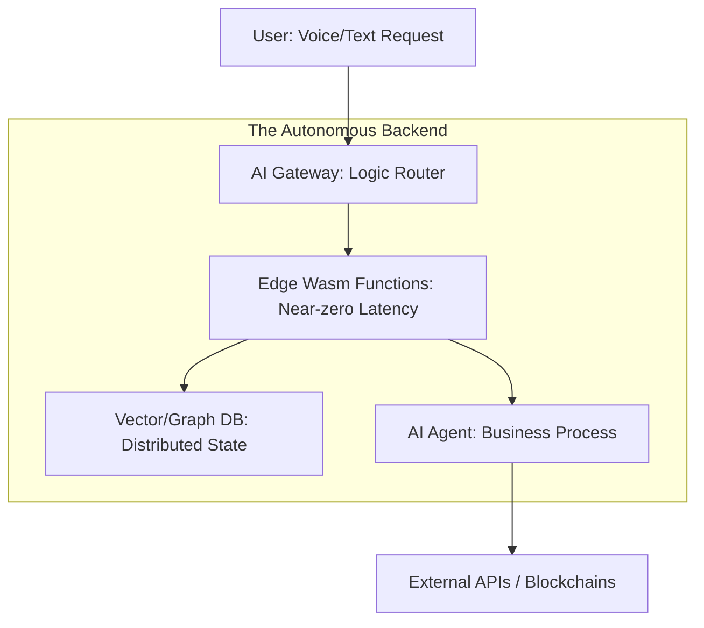

# 🚀 The Future of Backend Development: Beyond 2026
> **Level:** Beginner | **Language:** Hinglish | **Goal:** Master the long-term vision of backend engineering, exploring the transition from manual coding to AI-driven architecture, decentralized systems, and the new role of a "Backend Architect" in 2027-2030.

---

## 🧭 1. Beginner-Friendly Hinglish Explanation
Backend development 2026 ke baad "Coding" se zyada "Orchestration" banne wala hai. 

Pehle backend engineer ka kaam tha "Baithkar lines of code likhna." Par ab:
- **AI-Driven Code:** AI khud $80\%$ boiler-plate code likh deta hai. 
- **Serverless Evolution:** Aapko "Server" ki tension lene ki zaroorat hi nahi hai. Aap sirf "Logic" likhte hain, aur wo puri duniya mein apne aap scale ho jata hai.
- **Autonomous DBs:** Database khud apna "Index" banate hain aur khud "Optimize" hote hain.

2030 tak, ek "Backend Engineer" shayad wo insaan hoga jo "System Design" aur "Security" ki strategic planning karega, jabki AI usse execute karega. 

---

## 🧠 2. Deep Technical Explanation
The next era of backend is defined by **Abstracted Infrastructure** and **AI-Native Middleware.**

### 1. From Cloud-Native to AI-Native:
- In 2024, we built apps *on* the cloud. In 2026, we build apps *with* AI agents in the backend.
- **Autonomous Backends:** Systems that can detect a "Spike in traffic" and rewrite their own logic to be more efficient in real-time.

### 2. The Rise of 'Edge-Only' Architectures:
- Moving away from "Centralized Servers" in Virginia or Mumbai to thousands of "Edge Nodes" running **WebAssembly (Wasm).**
- Wasm allows backend code to run at near-native speeds with absolute security, almost anywhere.

### 3. Distributed State (The End of the DB Bottleneck):
- New database architectures that don't need a "Primary" server. Data exists everywhere simultaneously using **CRDTs (Conflict-free Replicated Data Types).**

---

## 🏗️ 3. Backend Evolution Timeline
| Era | Focus | Primary Tool |
| :--- | :--- | :--- |
| **2010-2020** | Monoliths / VMs | Java / PHP / EC2 |
| **2020-2025** | Microservices / K8s | Node.js / Go / Docker |
| **2026-2028** | Serverless / AI Agents | Wasm / Supabase / LangChain |
| **2029-2030** | Autonomous / AGI Systems | Natural Language Backend |

---

## 📐 4. The "Backend Efficiency" Metric
- **System Value ($SV$):** 
  $$SV = \frac{\text{Logic Complexity}}{\text{Manual Maintenance}}$$
  As maintenance goes to zero (thanks to AI/Serverless), the value of the engineer shifts entirely to **Logic Complexity (Problem Solving).**

---

## 📊 5. The 2030 Backend Stack (Diagram)


---

## 💻 6. Production-Ready Examples (Conceptual: A 'Serverless-First' API)
```typescript
// 2026 Pro-Tip: The 'Server' is dead. Long live the 'Function'.

// Imagine a backend where you don't even manage 'Node.js' versions.
// You just export a 'Pure Function'.

export const handleRequest = async (request: Request) => {
    // 1. AI automatically handles Auth & Validation
    const user = await getAuthenticatedUser(request);
    
    // 2. Logic runs on the Edge (closest to user)
    return Response.json({
        message: "Hello from the Edge!",
        recommendations: await getAIInsights(user)
    });
};
```

---

## ❌ 7. Failure Cases (The 'Obsolescence' Risk)
- **The "CRUD-only" Engineer:** If you only know how to build "Create, Read, Update, Delete" APIs, AI will replace you completely. **Fix: Learn System Design and Complex Logic.**
- **The "Cloud Lock-in":** Being so dependent on one provider (like AWS) that you can't move when they increase prices. **Fix: Use Open-Source alternatives.**
- **Ignoring Security:** AI can write code, but it often writes "Insecure" code. A human is still needed to audit security.

---

## 🛠️ 8. Debugging Guide (Future-Proofing)
- **Symptom:** You are spending $80\%$ of your time writing boilerplate code.
- **Check:** **AI Integration**. You should be using **GitHub Copilot** or **Cursor** to handle $90\%$ of the syntax so you can focus on the "Architecture."
- **Symptom:** Your app's latency is $>200ms$.
- **Check:** **Edge Migration**. Move your logic out of a central server to the network edge.

---

## ⚖️ 9. Tradeoffs
- **Control vs. Convenience:** 
  - Serverless is convenient but you lose control over the low-level hardware. 
  - Bare Metal gives control but is a nightmare to scale.
- **Speed vs. Safety:** Moving too fast with AI-generated code might lead to "Hidden Bugs" that only appear months later.

---

## 🛡️ 10. Security Concerns
- **AI-generated Exploits:** In 2027, hackers will use AI to find "Zero-day" bugs in your backend in seconds. **Defense: You must use AI to defend your AI.**

---

## 📈 11. Scaling Challenges
- **The "Context" Problem:** Moving massive "AI State" (Memory) between different edge nodes instantly is the biggest engineering challenge of the next 5 years.

---

## 💸 12. Cost Considerations
- **Outcome-based Pricing:** In the future, you won't pay for "CPU hours." You will pay for "Successful API Responses."

---

## ✅ 13. Best Practices
- **Master TypeScript and Go:** These are the languages of the 2026+ infrastructure.
- **Understand 'Stateful vs Stateless':** This fundamental concept will never change, regardless of AI.
- **Focus on the 'Human' factor:** Empathy, ethics, and business strategy are the only skills AI can't replace by 2030.

---

## ⚠️ 14. Common Mistakes
- **Learning "Tools" instead of "Principles":** Tools like LangChain might be gone in 2 years. The principle of "Retrieval" is eternal.
- **Ignoring the Data Layer:** The backend is just a wrapper for data. If your data is messy, your backend will always be bad.

---

## 📝 15. Interview Questions (The 'Forward-Thinking' Candidate)
1. **"How would you design a backend that handles its own database indexing autonomously?"**
2. **"What is the role of WebAssembly in modern backend scaling?"**
3. **"How do you ensure security when $50\%$ of your code is written by AI?"**

---

## 🚀 15. Latest 2026 Industry Patterns
- **Database-less Apps:** Using "Client-side Sync" (like **Replicache**) where the backend is only a "Sync Engine" for the local browser database.
- **Natural Language APIs:** Instead of JSON, APIs that accept "English commands" and return structured results.
- **Decentralized Backend (DePIN):** Running your backend on a peer-to-peer network of 1000s of different people's computers instead of one company like Amazon.
