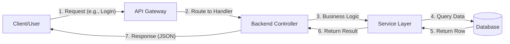

# 🏗️ What is Backend Engineering: The Core of the Stack
> **Objective:** Understand the role, responsibility, and impact of the Backend | **Language:** Hinglish | **Standard:** 2026 Expert Framework

---

## 🧭 1. Beginner-Friendly Hinglish Explanation
Backend Engineering ka matlab hai "Application ka engine room". 

- **The Front vs Back:** Sochiye ek Restaurant hai.
  - **Frontend:** Wo Dining Area hai jahan table, decor, aur menu card hai (UI/UX).
  - **Backend:** Wo Kitchen hai jahan asli khana banta hai, raw materials (Data) store hote hain, aur chef (Logic) decide karta hai ki order kaise poora hoga.
- **The Core Duty:** Backend ka kaam hai data ko **Secure** rakhna, **Logic** apply karna (e.g., login success ya fail), aur data ko **Fast** tarike se user tak pahunchana.

Simple words mein: Agar user button dabata hai, toh wo "Frontend" hai. Par button dabane ke baad jo piche "Magic" hota hai, wo **Backend** hai.

---

## 🧠 2. Deep Technical Explanation
Backend Engineering is the management of the **Application Life Cycle** beyond the user interface. It is the orchestration of servers, databases, and third-party integrations.

### Key Pillars of Backend:
1.  **Server-Side Logic:** Executing code that shouldn't be exposed to the client (e.g., sensitive calculations, proprietary algorithms).
2.  **Data Persistence:** Managing how data is saved, retrieved, and updated using Relational (SQL) or Document (NoSQL) stores.
3.  **API Layer:** Building the "Bridge" (REST, GraphQL, gRPC) through which the Frontend communicates with the Backend.
4.  **Integrations:** Connecting with external services like Payment Gateways (Stripe), Email (SendGrid), or AI Models (OpenAI).

---

## 🏗️ 3. Architecture Diagrams (The Logic Flow)


---

## 💻 4. Production-Ready Examples (A Real Logic Snippet)
```typescript
// 2026 Standard: Separating Concerns (Controller vs Service)

// 1. Controller Layer: Handles HTTP/Request details
export const handleOrderPlacement = async (req: Request, res: Response) => {
  const { userId, items } = req.body;
  try {
    // Calling the Service Layer (The pure logic)
    const order = await OrderService.placeOrder(userId, items);
    res.status(201).json({ success: true, data: order });
  } catch (error) {
    res.status(400).json({ success: false, message: error.message });
  }
};

// 2. Service Layer: Pure Business Logic
class OrderService {
  static async placeOrder(userId: string, items: any[]) {
    // Logic: Check inventory -> Calculate price -> Save to DB -> Trigger email
    const total = items.reduce((acc, item) => acc + item.price, 0);
    const order = await db.order.create({ data: { userId, total, status: 'PENDING' } });
    return order;
  }
}
```

---

## 🌍 5. Real-World Use Cases
- **E-commerce:** Checking stock levels in real-time and applying coupons.
- **Social Media:** Algorithmic feeds where the backend decides which posts you should see.
- **SaaS:** Managing user subscriptions, multi-tenancy, and data isolation.

---

## ❌ 6. Failure Cases
- **Fat Controllers:** Writing all the logic (DB calls, validation, auth) inside the API route. This makes code impossible to test or reuse.
- **Unprotected Endpoints:** Forgetting to check if a user is authorized to delete a record.
- **Blocking the Event Loop:** Running a heavy 10-second calculation directly in the request handler, freezing the server for everyone else.

---

## 🛠️ 7. Debugging Section
| Problem | How to find it? | Solution |
| :--- | :--- | :--- |
| **Zombies/Hangs** | `top` or `htop` | Use **Worker Threads** for CPU intensive tasks. |
| **Data Inconsistency** | SQL Logs | Use **Transactions (ACID)** to ensure "All or Nothing" updates. |
| **CORS Errors** | Browser Console | Configure **CORS Middleware** with allowed origins. |

---

## ⚖️ 8. Tradeoffs
- **Speed vs. Correctness:** Using an in-memory cache (Fast but risky) vs. a persistent DB (Slower but safe).
- **Flexibility vs. Type Safety:** Pure JS (Fast prototyping) vs. TypeScript (Reliable production code).

---

## 🛡️ 9. Security Concerns
- **Sensitive Data:** Never return passwords or internal IDs in JSON responses.
- **Encryption:** Encrypting data at rest (DB) and in transit (HTTPS).
- **Sanitization:** Preventing SQL Injection and XSS by sanitizing all user inputs.

---

## 📈 10. Scaling Challenges
- **Statefulness:** How do you handle user sessions when you have 10 servers? (Solution: Use a distributed store like Redis).
- **Database Bottlenecks:** When the DB becomes slower than the code.

---

## 💸 11. Cost Considerations
- **Compute Efficiency:** Using optimized runtimes (Bun/Rust) to reduce CPU usage.
- **Database Reads:** Implementing caching to avoid expensive DB queries.

---

## ✅ 12. Best Practices
- **Follow SOLID Principles:** Keep code modular and single-purpose.
- **API First Design:** Design the API spec before writing any code.
- **Comprehensive Logging:** Log the "What, When, and Why" of every error.

---

## ⚠️ 13. Common Mistakes
- **Ignoring Status Codes:** Returning `200 OK` for an error response.
- **Manual Tasks:** Manually updating databases instead of using **Migrations**.
- **Lack of Tests:** "Testing in production" is the fastest way to get fired.

---

## 📝 14. Interview Questions
1. "What happens when you type a URL in the browser and hit enter? (Backend perspective)"
2. "What is the difference between a stateful and a stateless backend?"
3. "How do you handle a scenario where two users try to book the same seat simultaneously?"

---

## 🚀 15. Latest 2026 Production Patterns
- **BFF Pattern (Backend for Frontend):** Specific backends for mobile vs web.
- **Event Sourcing:** Recording every change as an immutable event.
- **Polyglot Persistence:** Using different databases for different features (e.g., Postgres for users, ElasticSearch for searching).
