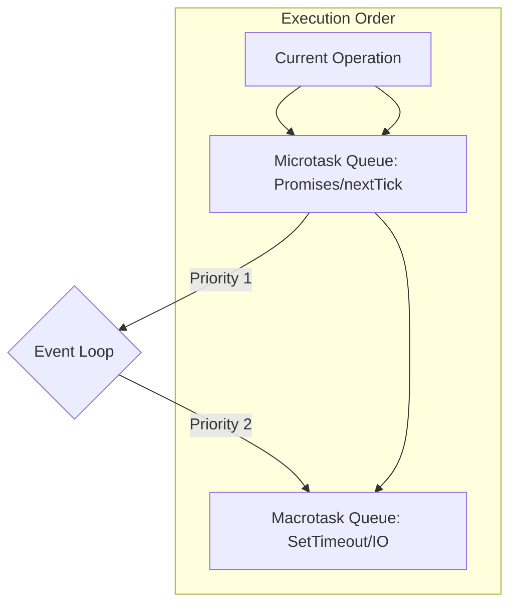

# ⏳ Async Programming: The Heart of Node.js
> **Objective:** Master non-blocking control flow and concurrency | **Language:** Hinglish | **Standard:** 2026 Expert Framework

---

## 🧭 1. Beginner-Friendly Hinglish Explanation
Async Programming ka matlab hai "Wait na karna". 

- **The Sync Way:** Aap line mein khade hain bank mein. Jab tak teller aapka kaam nahi karta, aap hill nahi sakte. Ye **Blocking** hai.
- **The Async Way:** Aapne coffee shop mein order diya. Unhone aapko ek "Token" (Promise) diya. Aap jaakar baith gaye ya phone chalane lage. Jab coffee ready hui, buzzer baja (Callback/Resolve) aur aapne coffee le li.
- **Why it matters:** Node.js ek hi thread par chalta hai. Agar ek request 5 second ka wait karegi (DB call), aur server sync hua, toh baaki saare users block ho jayenge.

---

## 🧠 2. Deep Technical Explanation
### 1. The Promise Lifecycle:
A Promise is an object representing the eventual completion (or failure) of an asynchronous operation.
- **Pending:** Initial state.
- **Fulfilled:** Operation completed successfully.
- **Rejected:** Operation failed.

### 2. Microtasks vs Macrotasks:
- **Microtasks:** `process.nextTick`, `Promise.then/catch/finally`. These run immediately after the current operation, before the event loop moves to the next phase.
- **Macrotasks:** `setTimeout`, `setInterval`, I/O tasks. These are scheduled in the next phases of the event loop.

### 3. Async/Await:
Syntactic sugar over Promises. It allows writing asynchronous code that *looks* synchronous, making it much easier to read and maintain.

---

## 🏗️ 3. Architecture Diagrams (Task Prioritization)


---

## 💻 4. Production-Ready Examples (Parallel vs Sequential)
```javascript
// 2026 Standard: Handling Multiple Async Tasks Efficiently

const fetchUser = (id) => Promise.resolve({ id, name: 'User' + id });
const fetchOrders = (id) => Promise.resolve(['Order1', 'Order2']);

async function getUserData(userId) {
  console.time('Sequential');
  // ❌ BAD: Sequential (Wait for user, THEN wait for orders)
  const user = await fetchUser(userId);
  const orders = await fetchOrders(userId);
  console.timeEnd('Sequential');

  console.time('Parallel');
  // ✅ GOOD: Parallel (Fetch both at the same time)
  const [userP, ordersP] = await Promise.all([
    fetchUser(userId),
    fetchOrders(userId)
  ]);
  console.timeEnd('Parallel');
  
  // 💡 Pro Tip: Use Promise.allSettled if you don't want 
  // one failure to crash the whole batch.
}

getUserData(1);
```

---

## 🌍 5. Real-World Use Cases
- **Data Aggregation:** Fetching profile data, notifications, and settings from 3 different microservices simultaneously.
- **Batch Processing:** Updating 1000 records in a database in parallel (with concurrency limits).
- **Graceful Timeouts:** Giving an API call 2 seconds to respond before returning a default value.

---

## ❌ 6. Failure Cases
- **The "Missing Await":** Forgetting to `await` a promise, causing the code to move on with a `Promise { <pending> }` object instead of data.
- **Uncaught Rejections:** Promises that fail without a `.catch()` or `try-catch` can crash modern Node.js processes.
- **Parallel Overload:** Trying to run 50,000 promises in `Promise.all()` and exhausting memory or DB connections.

---

## 🛠️ 7. Debugging Section
| Problem | Diagnostic | Solution |
| :--- | :--- | :--- |
| **Silent Failures** | Check for empty `catch` blocks | Always log or throw in your catch. |
| **Race Conditions** | Variable changes unexpectedly | Use immutable patterns or better locking. |
| **Deadlocks** | Tasks waiting for each other | Audit your `await` chains. |

---

## ⚖️ 8. Tradeoffs
- **Promise.all vs Promise.allSettled:** Fail fast vs. Complete all and handle individual errors.
- **Async/Await vs Raw Promises:** Clean syntax vs. Slightly more control over chain timing.

---

## 🛡️ 9. Security Concerns
- **Timing Attacks:** If async tasks take different amounts of time based on secret data (like a password), attackers might guess the data. Use **Constant-time** algorithms.
- **DoS via Concurrency:** An attacker triggering thousands of parallel async tasks to overwhelm your DB. Use **Rate Limiting**.

---

## 📈 10. Scaling Challenges
- **Context Loss:** In deep async chains, tracking the original request ID (Trace ID) is hard. Use `AsyncLocalStorage`.

---

## 💸 11. Cost Considerations
- **Compute Efficiency:** Efficient parallelization reduces the time your server is "Busy", allowing it to handle more requests per minute.

---

## ✅ 12. Best Practices
- **Never use `await` inside a loop.** Use `Promise.all()` or a queue with a concurrency limit.
- **Always handle errors.** Use global `unhandledRejection` handlers as a safety net.
- **Keep it shallow.** If your async logic is 10 levels deep, refactor it.

---

## ⚠️ 13. Common Mistakes
- **Thinking `await` makes code synchronous.** It only pauses the *function execution*, not the whole server.
- **Creating Promises manually unnecessarily.** Most APIs are already promisified.
- **Ignoring the Return:** Returning a promise from an async function without `await` is fine, but be careful with `try-catch` scope.

---

## 📝 14. Interview Questions
1. "What is the difference between `Promise.all`, `Promise.any`, `Promise.race`, and `Promise.allSettled`?"
2. "How would you implement a simple 'Sleep' function in JavaScript?"
3. "Explain how the microtask queue interacts with the event loop."

---

## 🚀 15. Latest 2026 Production Patterns
- **AsyncLocalStorage:** Passing data (like Auth user) through async calls without passing variables explicitly.
- **AbortController:** Cancelling async tasks (like fetch or DB queries) when the user cancels the request.
- **Top-level Await in ESM:** Simplifying module initialization.
