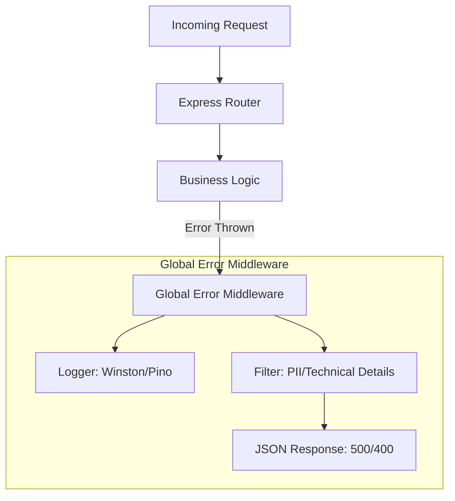

# 🛡️ Error Handling in Node.js: Production Strategies
> **Objective:** Build resilient backends that never crash silently | **Language:** Hinglish | **Standard:** 2026 Expert Framework

---

## 🧭 1. Beginner-Friendly Hinglish Explanation
Error Handling ka matlab hai "Galtiyon ko sambhalna". 

- **The Philosophy:** Software mein errors aayenge hi (DB down ho sakta hai, API fail ho sakti hai). Ek "Junior" dev sochta hai "Error na aaye". Ek "Senior" dev sochta hai "Jab error aaye, toh system crash na ho aur user ko sahi message mile".
- **The Catch:** Node.js mein agar aapne error handle nahi kiya, toh poora server crash ho sakta hai (Single process problem).
- **The Goal:** 
  1. Error ko **Catch** karna.
  2. Use **Log** karna (Tracing ke liye).
  3. User ko **Friendly Message** dena (Technical details hide karke).
  4. Server ko **Stabilize** karna.

---

## 🧠 2. Deep Technical Explanation
### 1. Types of Errors:
- **Operational Errors:** Expected errors (e.g., File not found, API timeout, 404). These should be handled gracefully.
- **Programmer Errors:** Bugs (e.g., `undefined is not a function`, syntax errors). These should be fixed, and if they happen in production, the process should often be restarted.

### 2. The Error Object:
Always extend the built-in `Error` class to create custom application errors. This allows you to add `statusCode`, `isOperational` flags, and more.

### 3. Asynchronous Error Handling:
Errors in `setTimeout` or `Promise.then` will NOT be caught by a wrapper `try-catch` unless you `await` them.

---

## 🏗️ 3. Architecture Diagrams (The Error Middleware)


---

## 💻 4. Production-Ready Examples (Custom Error Class)
```typescript
// 2026 Standard: Centralized Error Handling

// 1. Base Custom Error Class
class AppError extends Error {
  public readonly statusCode: number;
  public readonly isOperational: boolean;

  constructor(message: string, statusCode: number, isOperational = true) {
    super(message);
    this.statusCode = statusCode;
    this.isOperational = isOperational;
    Error.captureStackTrace(this, this.constructor);
  }
}

// 2. Usage in Service
const getUser = async (id: string) => {
  const user = await db.user.findUnique({ where: { id } });
  if (!user) {
    throw new AppError("User not found", 404);
  }
  return user;
};

// 3. Global Middleware (Express Example)
app.use((err: any, req: Request, res: Response, next: NextFunction) => {
  const status = err.statusCode || 500;
  const message = err.message || "Internal Server Error";
  
  // Log the error for developers
  logger.error(err);
  
  res.status(status).json({
    status: 'error',
    message: err.isOperational ? message : "Something went wrong!"
  });
});
```

---

## 🌍 5. Real-World Use Cases
- **Validation Errors:** Returning a `400 Bad Request` with a list of invalid fields.
- **Circuit Breaker:** Detecting when an external API is down and throwing a "Service Unavailable" error instead of waiting for a timeout.
- **Audit Logging:** Recording every 401/403 error to detect potential hacking attempts.

---

## ❌ 6. Failure Cases
- **Swallowing Errors:** `catch(e) { }` — The silent killer. You'll never know why things are failing.
- **Stack Trace Leakage:** Sending the full error stack to the client in production (Security risk!).
- **Process Exit on Error:** Letting the server crash on a simple 404.

---

## 🛠️ 7. Debugging Section
| Event | Purpose | Action |
| :--- | :--- | :--- |
| **uncaughtException** | Synchronous bugs | Log and **Process.exit(1)** (Restart). |
| **unhandledRejection** | Async promise failures | Log and fix the missing `.catch()`. |

---

## ⚖️ 8. Tradeoffs
- **Throwing vs. Returning Errors:** Throwing is cleaner but harder to track in complex flows. Returning (Go-style) is explicit but verbose.
- **Fail-Fast vs. Retry:** Crashing immediately vs. trying 3 times before giving up.

---

## 🛡️ 9. Security Concerns
- **Error Information Leak:** Attackers use error messages to find out your database type, table names, or file structure.
- **Sensitive Context:** Ensure your logs don't include user passwords or credit card numbers when an error occurs.

---

## 📈 10. Scaling Challenges
- **Distributed Error Tracking:** In microservices, an error in Service A might be caused by Service B. Use **Request IDs / Correlation IDs** to track errors across the network.

---

## 💸 11. Cost Considerations
- **Log Volume:** Logging everything can lead to massive cloud bills (CloudWatch/Datadog). Use **Sampling** for success logs and log everything only for errors.

---

## ✅ 12. Best Practices
- **Never use strings to throw errors.** Always use `throw new Error()`.
- **Distinguish between Operational and Programmer errors.**
- **Use a logging library like Pino/Winston** (never just `console.log` in production).

---

## ⚠️ 13. Common Mistakes
- **Nested Try-Catch:** Makes code hard to read. Use a global error handler instead.
- **Not Cleanup Resources:** Forgetting to close DB connections or file streams in the `finally` block.
- **Generic 500 Errors:** Not providing enough context in the logs to fix the issue.

---

## 📝 14. Interview Questions
1. "How do you handle errors in a Node.js process to ensure it doesn't crash?"
2. "What is the difference between an operational error and a programmer error?"
3. "How would you handle errors in a multi-step asynchronous transaction?"

---

## 🚀 15. Latest 2026 Production Patterns
- **OpenTelemetry Error Exporting:** Automatically sending errors to a centralized dashboard with full trace context.
- **AI-Powered Log Analysis:** Using agents to categorize errors and suggest fixes based on previous incidents.
- **Graceful Shutdown:** Closing all connections before the process exits on a fatal error.
