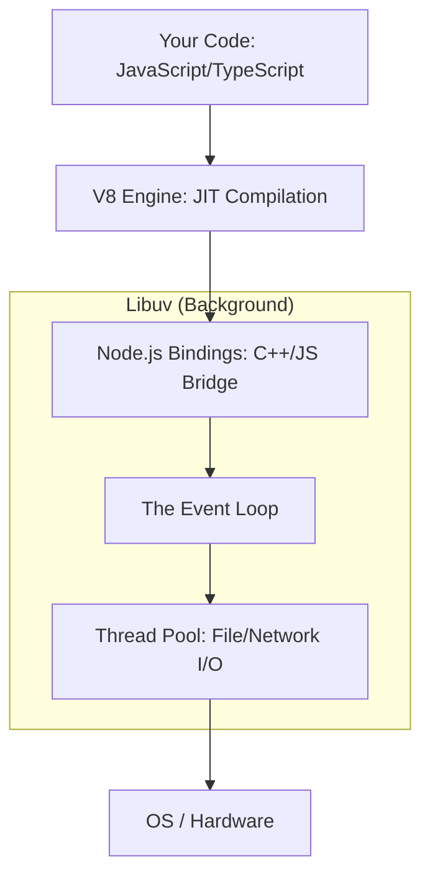

# 🚀 Mastering Node.js Runtime & Event Loop
> **Level:** Advanced | **Language:** Hinglish | **Goal:** Master the internal mechanics of the Node.js runtime, exploring the V8 engine, Libuv, and the legendary Event Loop to understand how Node.js achieves high performance with a single thread in 2026.

---

## 🧭 1. Beginner-Friendly Hinglish Explanation
Node.js ke baare mein sabse bada "Misconception" (galat fehmi) ye hai ki wo "Slow" hai kyunki wo "Single-threaded" hai. 

Sochiye ek "Waiter" (Node.js) hai jo ek restaurant mein kaam kar raha hai:
- **Normal Waiter (Multithreaded):** Ek waiter ek table par jata hai, order leta hai, aur wahan khada rehta hai jab tak khana nahi aata. Dusra waiter dusri table par jata hai.
- **Node.js Waiter (Event Loop):** Waiter table par jata hai, order leta hai, aur kitchen mein de deta hai. Phir wo wahan "Wait" nahi karta. Wo turant dusri table par jata hai. Jab khana (Response) taiyar ho jata hai, "Kitchen" (Libuv) ek bell bajata hai, aur waiter khana serve kar deta hai.

Iska matlab hai ki ek akela waiter 100 tables handle kar sakta hai. Node.js isi "Waiter" (Event Loop) logic par chalta hai. Is module mein hum seekhenge ki ye "Bell" (Callback) kaise kaam karti hai.

---

## 🧠 2. Deep Technical Explanation
Node.js is built on three main pillars: **V8 Engine**, **Libuv**, and **Core APIs.**

### 1. The V8 Engine (Google):
- It converts JavaScript into **Machine Code** (Binary) so the CPU can understand it.
- **JIT (Just-In-Time) Compilation:** It optimizes your code while it's running.

### 2. Libuv (The Magic Library):
- Since Node.js is single-threaded, it uses **Libuv** (written in C++) to handle heavy tasks like "Reading files" or "Database calls." 
- Libuv uses a **Thread Pool** (usually 4 threads) to do the heavy lifting in the background.

### 3. The Event Loop (The Heart):
The Event Loop has 6 main phases:
1. **Timers:** Handles `setTimeout` and `setInterval`.
2. **Pending Callbacks:** Handles system errors (like TCP errors).
3. **Idle, Prepare:** Internal Node.js stuff.
4. **Poll:** Where the magic happens. Node.js waits for new I/O events (New users, Database data).
5. **Check:** Handles `setImmediate`.
6. **Close Callbacks:** Handles `socket.on('close')`.

---

## 🏗️ 4. Synchronous vs. Asynchronous
| Type | Behavior | Example | Impact |
| :--- | :--- | :--- | :--- |
| **Sync (Blocking)** | Stop and wait | `fs.readFileSync` | Blocks the Event Loop (Bad!) |
| **Async (Non-blocking)**| Do and notify | `fs.readFile` | Keeps the Event Loop free (Good!) |

---

## 📐 4. Mathematical Intuition
- **Context Switching Cost:** 
  In multithreaded systems (like Java), switching between 1000 threads takes a lot of CPU time.
  In Node.js, there is **Zero Context Switching** for the main thread. This is why Node.js can handle more concurrent users with less RAM than Java.

---

## 📊 5. The Node.js Internal Architecture (Diagram)


---

## 💻 6. Production-Ready Examples (Why you should NEVER block the Event Loop)
```typescript
// 2026 Pro-Tip: A single slow loop can freeze your ENTIRE backend.

import express from 'express';
const app = express();

// ❌ THE DANGER: Synchronous Loop
app.get('/slow', (req, res) => {
    // This loop takes 5 seconds. 
    // NO OTHER USER can access the server while this is running!
    for (let i = 0; i < 10000000000; i++) {} 
    res.send("Finished slow task");
});

// ✅ THE RIGHT WAY: Worker Threads or Async
app.get('/fast', (req, res) => {
    res.send("I am still alive! 🚀");
});

app.listen(3000);
```

---

## ❌ 7. Failure Cases
- **The "Blocking" Disaster:** Calling a heavy function like `bcrypt.hashSync` or `JSON.parse` on a 100MB file inside the main thread.
- **Thread Pool Starvation:** Running too many file-read operations at once, filling up Libuv's 4 threads. **Fix: Increase `UV_THREADPOOL_SIZE`.**
- **Memory Leaks:** Forgetting to clear a `setInterval`, causing the RAM to fill up over 24 hours until the server crashes.

---

## 🛠️ 8. Debugging Guide
- **Symptom:** "Server is unresponsive but CPU is at 100%."
- **Check:** **Flame Graphs**. Use a tool like `clinic.js` to see which function is "Hot" (taking the most time).
- **Symptom:** "Latency is spiky."
- **Check:** **Garbage Collection (GC)**. If V8 is cleaning up memory too often, it pauses your code. Optimize your object creation.

---

## ⚖️ 9. Tradeoffs
- **Node.js vs. Go:** 
  - Node.js is better for "I/O Heavy" apps (Chat, Real-time feeds). 
  - Go is better for "CPU Heavy" apps (Image processing, Cryptography).
- **ES Modules vs. CommonJS:** In 2026, always use **ESM** (`import/export`) as it's the future and allows for "Top-level await."

---

## 🛡️ 10. Security Concerns
- **ReDoS (Regular Expression Denial of Service):** A hacker sending a specifically crafted string that makes a simple `regex.test()` take 10 years to finish, freezing the Event Loop. **Always use safe regex libraries.**

---

## 📈 11. Scaling Challenges
- **Cluster Module:** Since Node.js uses only 1 CPU core, to use a 16-core server, you must run 16 "Instances" of your app using the **Cluster** module or **PM2**.

---

## 💸 12. Cost Considerations
- **Memory Usage:** Node.js is very memory-efficient. You can run a small Node.js app on a **$\$5/month** server and handle 1000s of users.

---

## ✅ 13. Best Practices
- **Use `setImmediate` for long tasks** to allow the Event Loop to "Breathe" between steps.
- **Avoid `process.nextTick`** unless absolutely necessary; it can starve the Event Loop if called in a loop.
- **Monitoring:** Always track your **"Event Loop Lag"** metric. If lag is $> 100ms$, your server is struggling.

---

## ⚠️ 14. Common Mistakes
- **Thinking `async/await` makes code parallel:** It doesn't. It only makes code "Non-blocking." The code still runs on one thread.
- **Using `try-catch` with callbacks:** It doesn't work. Use **Promises** or handle errors in the callback.

---

## 📝 15. Interview Questions
1. **"What is the difference between `setImmediate` and `setTimeout(0)`?"**
2. **"How does Libuv handle file operations?"**
3. **"What is the purpose of the Thread Pool in Node.js?"**

---

## 🚀 15. Latest 2026 Industry Patterns
- **Bun & Deno:** New runtimes that are even faster than Node.js but share the same "Event Loop" philosophy.
- **Native Fetch:** No more `axios`. Node.js now has a built-in, highly optimized `fetch` API.
- **Worker Threads for AI:** Using Node.js **Worker Threads** to handle small AI model inference (like ONNX) directly in the backend without blocking users.
