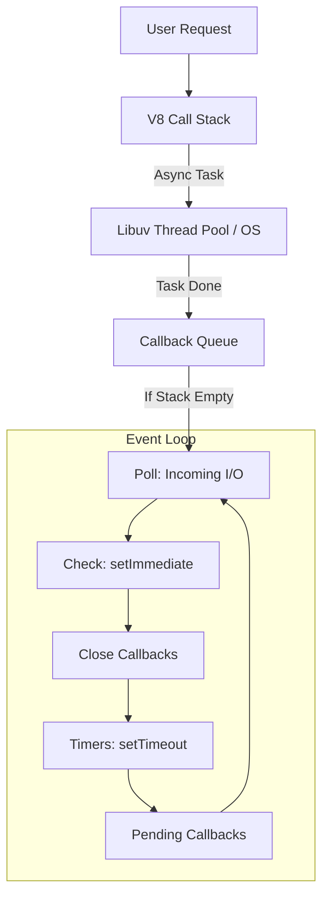

# ⚙️ How Node.js Works: Under the Hood
> **Objective:** Master the Event Loop and Non-blocking I/O | **Language:** Hinglish | **Standard:** 2026 Expert Framework

---

## 🧭 1. Beginner-Friendly Hinglish Explanation
Node.js "Single Threaded" hai—matlab isme ek hi "Chef" (Thread) hai. Toh ye itni saari requests kaise handle karta hai?

- **The Kitchen Analogy:**
  - **Traditional Server (e.g., PHP):** Har customer ke liye ek naya waiter/chef hire hota hai (Multi-threaded). Zyada customers = Zyada kharcha aur management.
  - **Node.js Chef:** Chef order leta hai, khana banne ke liye oven mein daalta hai, aur ruka nahi rehta! Wo turant agla order leta hai. Jab oven "Ting!" bolta hai, chef wapis jaakar wo order serve kar deta hai.
- **The Core Secret:** Node.js **Non-blocking** hai. Ye "Wait" nahi karta, ye "Callback" ka wait karta hai.

---

## 🧠 2. Deep Technical Explanation
Node.js runtime is built on **Chrome's V8 Engine** and **libuv**.

### 1. The V8 Engine:
Compiles JavaScript into machine code. It handles memory allocation and garbage collection.

### 2. Libuv (The Magic Library):
Written in C++, it provides the **Event Loop** and **Thread Pool**. 
- **The Event Loop:** Manages the execution of async tasks on the main thread.
- **The Thread Pool (Worker Pool):** For heavy tasks like file I/O, cryptography, and DNS lookups, Node uses a pool of 4 (default) background threads.

### 3. Non-blocking I/O:
When Node calls a database or a file, it doesn't pause. It registers a task with the OS or Libuv and moves to the next line of code.

---

## 🏗️ 3. Architecture Diagrams (The Event Loop Phases)


---

## 💻 4. Production-Ready Examples (Blocking vs Non-blocking)
```javascript
// ❌ BAD: Blocking the Main Thread
const fs = require('fs');
const data = fs.readFileSync('/large-file.txt'); // Server hangs here!
console.log(data);

// ✅ GOOD: Non-blocking (Production Standard)
const fsPromises = require('fs').promises;

async function readFile() {
  try {
    console.log("Starting read...");
    const data = await fsPromises.readFile('/large-file.txt'); // Chef moves to next task
    console.log("Read complete!");
  } catch (err) {
    console.error(err);
  }
}

readFile();
console.log("I run BEFORE the file read finishes!");
```

---

## 🌍 5. Real-World Use Cases
- **Streaming Services:** Handling thousands of active video streams without a separate thread for each.
- **Real-time Chat:** Managing thousands of open WebSocket connections efficiently.
- **Microservices Gateways:** Routing requests between services with minimal latency.

---

## ❌ 6. Failure Cases
- **CPU Intensive Tasks:** Doing heavy math or image processing on the main thread will "Freeze" the server for all users.
- **Callback Hell:** Deeply nested async functions (Solved by Promises/Async-Await).
- **Uncaught Exceptions:** A single unhandled error in a callback can crash the entire process.

---

## 🛠️ 7. Debugging Section
| Tool | Use Case | Command |
| :--- | :--- | :--- |
| **Node --inspect** | Chrome DevTools debugging | `node --inspect index.js` |
| **Clinic.js Bubbleprof** | Visualizing async bottlenecks | `clinic bubbleprof -- node server.js` |
| **ndb** | Enhanced debugger | `ndb index.js` |

---

## ⚖️ 8. Tradeoffs
- **Single Threaded vs Multi-threaded:** Simplicity and low memory vs. Difficulty with CPU-bound work.
- **Scalability:** Node scales horizontally (multiple processes) easier than vertically.

---

## 🛡️ 9. Security Concerns
- **Event Loop Starvation:** Attackers can send requests that trigger heavy loops, effectively performing a DoS attack.
- **Memory Leaks:** If you don't clean up your event listeners or large arrays, the server will eventually run out of RAM and crash.

---

## 📈 10. Scaling Challenges
- **Utilizing Multiple Cores:** By default, Node uses 1 CPU core. You must use the **Cluster Module** or **PM2** to use all cores.
- **Shared State:** Since each process is isolated, you need Redis to share session data.

---

## 💸 11. Cost Considerations
- **RAM vs CPU:** Node is lightweight on memory but can be CPU sensitive. Optimize your loops to save on cloud costs.

---

## ✅ 12. Best Practices
- **Never block the Event Loop.**
- **Use Async/Await for readability.**
- **Monitor Event Loop Lag:** Use `perf_hooks` to track how long your loop is taking.

---

## ⚠️ 13. Common Mistakes
- **Mixing Sync and Async:** Using `fs.readFileSync` inside an async function.
- **Not Handling Errors:** Thinking async code won't throw errors.
- **Overusing `setImmediate` vs `process.nextTick`:** Understanding that `nextTick` runs *before* the next event loop phase.

---

## 📝 14. Interview Questions
1. "Explain the difference between `process.nextTick()` and `setImmediate()`."
2. "How does Node.js handle thousands of concurrent connections with one thread?"
3. "When should you NOT use Node.js?"

---

## 🚀 15. Latest 2026 Production Patterns
- **Worker Threads for CPU Tasks:** Offloading heavy logic to separate threads while keeping the main loop fast.
- **Top-level Await:** Using `await` directly in the entry file for cleaner initialization logic.
- **Native Fetch API:** Using the built-in `fetch` instead of third-party libraries like `axios` or `node-fetch`.
