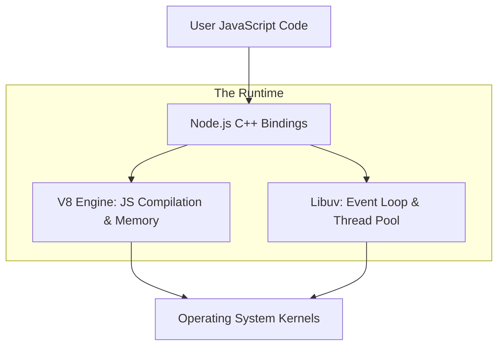

# 🔬 Node.js Runtime Internals: V8, Libuv, and Beyond
> **Objective:** Deep dive into the engine and library that power Node.js | **Language:** Hinglish | **Standard:** 2026 Expert Framework

---

## 🧭 1. Beginner-Friendly Hinglish Explanation
Agar Node.js ek car hai, toh **V8 Engine** uska engine hai aur **Libuv** uska chassis aur wheels hain.

- **V8 Engine:** Ye wahi engine hai jo Google Chrome mein JS chalta hai. Iska kaam hai JS code ko computer ki bhasha (Machine Code) mein badalna.
- **Libuv:** Node.js akela kuch nahi kar sakta. Use computer ke files, network, aur hardware se baat karni hoti hai. Libuv wo library hai jo C++ mein likhi gayi hai aur Node ko ye saari "Shaktiyan" (Powers) deti hai.
- **The Bridge:** JS code "V8" ke paas jata hai, aur V8 Libuv ki help se OS (Operating System) se kaam karwata hai.

---

## 🧠 2. Deep Technical Explanation
Node.js is a **C++ Application** that embeds the V8 JavaScript Engine.

### 1. V8 Internals:
- **JIT (Just-In-Time) Compilation:** V8 doesn't just interpret; it compiles JS to optimized machine code. It uses the **Ignition** interpreter and **TurboFan** compiler.
- **Garbage Collection:** V8 uses a Generational GC. It divides memory into "Young Generation" (fast cleanup) and "Old Generation" (deep cleanup).
- **Hidden Classes:** V8 optimizes property access in objects by creating internal hidden classes.

### 2. Libuv Internals:
- **Thread Pool:** By default, it has 4 threads (`UV_THREADPOOL_SIZE`). It handles disk I/O, DNS, and Crypto.
- **Event Loop Management:** Libuv maintains the loop and handles the interaction between the system's asynchronous I/O and JS.

### 3. Bindings:
The `internal` folder in Node.js source code contains the C++ implementations that wrap system calls and expose them to JS via **V8 Bindings**.

---

## 🏗️ 3. Architecture Diagrams (The Internal Layers)


---

## 💻 4. Production-Ready Examples (Tuning the Runtime)
```javascript
// 2026 Standard: Optimizing Runtime Performance

// 1. Increasing the Thread Pool size for heavy I/O
process.env.UV_THREADPOOL_SIZE = 8; 

const crypto = require('crypto');
const start = Date.now();

// Running multiple heavy crypto tasks
for (let i = 0; i < 8; i++) {
  crypto.pbkdf2('pass', 'salt', 100000, 512, 'sha512', () => {
    console.log(`Task ${i+1}:`, Date.now() - start, 'ms');
  });
}

// Insight: Without increasing UV_THREADPOOL_SIZE, 
// tasks 5-8 would wait for 1-4 to finish.
```

---

## 🌍 5. Real-World Use Cases
- **High-Performance Crypto:** Scaling hashing and encryption tasks in auth services.
- **Large File Processing:** Tuning the runtime to handle multi-gigabyte logs.
- **Custom Addons:** Writing C++ addons for Node.js to perform tasks that JS is too slow for (e.g., Video transcoding).

---

## ❌ 6. Failure Cases
- **V8 Out of Memory:** Running a script that consumes more than 1.5GB of RAM (default limit). **Fix:** Use `--max-old-space-size=4096`.
- **Thread Pool Starvation:** Running too many file reads simultaneously, blocking DNS lookups or Crypto.
- **GC Thrashing:** Creating too many short-lived objects, forcing the GC to run constantly and eat up CPU.

---

## 🛠️ 7. Debugging Section
| Problem | Diagnostic Command | Fix |
| :--- | :--- | :--- |
| **Memory Leak** | `node --expose-gc index.js` | Manual GC check or Heap Snapshot. |
| **CPU Spike** | `node --prof index.js` | Analyze the `isolate-0x...-v8.log`. |
| **Event Loop Lag** | `node --trace-event-categories node.async_hooks` | Identify slow async tasks. |

---

## ⚖️ 8. Tradeoffs
- **Internal C++ Logic vs JS Logic:** C++ is faster but harder to maintain and cross-compile.
- **Pre-allocating Memory vs Dynamic Growth:** Setting high initial memory reduces GC pressure but wastes RAM.

---

## 🛡️ 9. Security Concerns
- **Buffer Overflows:** Historically a C++ issue, but custom addons must be careful with memory management.
- **Resource Exhaustion:** Not limiting the memory or thread pool can allow a single user to crash the whole server.

---

## 📈 10. Scaling Challenges
- **Context Switching:** Too many threads in the pool can cause the OS to spend more time switching threads than doing actual work.
- **Garbage Collection Pauses:** "Stop-the-world" pauses in V8 can cause temporary latency spikes (p99 latency issues).

---

## 💸 11. Cost Considerations
- **Memory Optimization:** Reducing your memory footprint allows you to run on smaller, cheaper AWS/GCP instances (e.g., t3.micro).

---

## ✅ 12. Best Practices
- **Avoid Global Variables:** They prevent objects from being garbage collected.
- **Pool your Resources:** Use database connection pools instead of opening new ones every time.
- **Use Streams:** Never load large files entirely into V8 memory.

---

## ⚠️ 13. Common Mistakes
- **Ignoring GC Logs:** Not knowing why your server randomly slows down every 10 minutes.
- **Manually calling GC:** `global.gc()` is almost always a bad idea in production.
- **Not knowing your model:** Treating Node.js as a "Magical" black box without understanding V8.

---

## 📝 14. Interview Questions
1. "How does the V8 engine optimize JavaScript code using JIT?"
2. "What tasks are handled by the Libuv thread pool vs the OS kernel?"
3. "How would you diagnose a memory leak in a production Node.js application?"

---

## 🚀 15. Latest 2026 Production Patterns
- **Wasm (WebAssembly) Integration:** Using Rust or C++ code inside Node.js via Wasm for near-native performance.
- **V8 Snapshots:** Using startup snapshots to reduce cold-start times for serverless functions.
- **Quic/HTTP3 support in Libuv:** Native high-performance networking at the runtime level.
