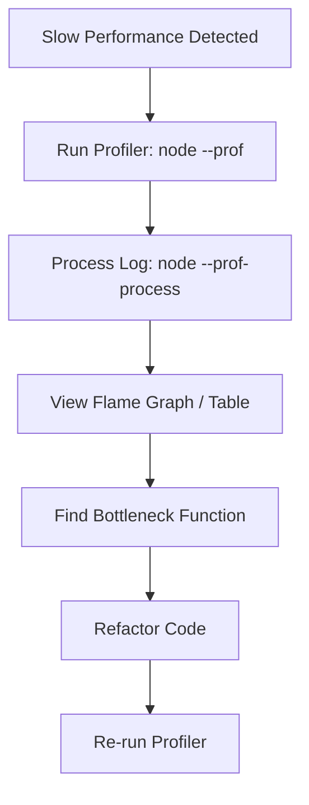

# 🔍 Profiling Node.js Apps: Finding the Bottlenecks
> **Objective:** Use scientific tools to identify CPU and Memory performance issues | **Language:** Hinglish | **Standard:** 2026 Expert Framework

---

## 🧭 1. Beginner-Friendly Hinglish Explanation
Profiling ka matlab hai "Apne code ka X-ray karna".

- **The Problem:** Aapka server slow hai ya memory zyada kha raha hai, par aapko pata nahi kaunsi line responsible hai.
- **The Solution:** Profiling tools check karte hain ki:
  1. Kaunsa function sabse zyada CPU time le raha hai?
  2. Kahan "Memory Leak" ho raha hai (data jo delete hona chahiye tha par abhi bhi RAM mein hai)?
- **The Process:** Pehle "Profile" record karo, phir uska "Flame Graph" (Chart) dekho, aur culprit ko pakdo.
- **Intuition:** Ye ek detective ki tarah kaam karta hai jo har function ki "Attendance" aur "Working Hours" track karta hai.

---

## 🧠 2. Deep Technical Explanation
### 1. CPU Profiling:
Sampling the stack trace multiple times per second to see which functions are currently executing.
- **Hot Path:** A function that is executed very frequently or takes a long time.

### 2. Heap Profiling (Memory):
Taking a "Snapshot" of all objects currently in RAM. 
- **Garbage Collection (GC):** Node.js's automatic cleaning process.
- **Memory Leak:** When objects stay in the heap because they are still being referenced (e.g., a global array that keeps growing).

### 3. Event Loop Profiling:
Checking if a function is "Blocking" the event loop, preventing other requests from being handled.

---

## 🏗️ 3. Architecture Diagrams (The Profiling Journey)


---

## 💻 4. Production-Ready Examples (Built-in Profiler)
```bash
# 2026 Standard: Basic Node.js Profiling Workflow

# 1. Run your app with the profiler enabled
node --prof index.js

# 2. Generate some load (using 'autocannon' or just browsing)
# Wait for 1 minute...

# 3. Stop the app. You will see an 'isolate-0x...' file.

# 4. Process the log into a readable text file
node --prof-process isolate-0x000000000-v8.log > profile.txt

# 5. Open profile.txt and look for the [Summary] section:
# [Summary]:
#   ticks  total  nonlib   name
#   1200   60.0%   70.0%   JavaScript
#   ...
#   [JavaScript]:
#   ticks  total  nonlib   name
#   800    40.0%   50.0%   LazyCompile: *calculatePrime number.js:10
```

---

## 🌍 5. Real-World Use Cases
- **Memory Leaks:** Finding out why a server's RAM grows from 200MB to 2GB in one day.
- **Crypto Latency:** Discovering that `bcrypt` or `argon2` is taking up 90% of CPU time.
- **Serialization Issues:** Finding that `JSON.stringify` on a 10MB object is blocking the entire server for 100ms.

---

## ❌ 6. Failure Cases
- **Profiling in Production:** Running a profiler adds significant overhead (slows down the site). **Fix: Use sampling or only profile a small percentage of requests.**
- **Ignoring the GC:** Blaming the code when the real issue is the Garbage Collector running too often.
- **Heisenbugs:** Bugs that disappear when you turn on the profiler because the timing changes.

---

## 🛠️ 7. Debugging Section
| Tool | Feature | Best For |
| :--- | :--- | :--- |
| **`node --inspect`** | Chrome DevTools | Visualizing heap snapshots and CPU flame graphs. |
| **`0x` (npm package)** | Flame Graphs | One-command tool to generate beautiful flame graphs. |
| **Clinic.js** | Suite of tools | Automatically diagnoses if the issue is I/O, Event Loop, or CPU. |

---

## ⚖️ 8. Tradeoffs
- **Deep Profiling vs System Performance:** More detailed logs = slower execution during profiling.

---

## 🛡️ 9. Security Concerns
- **Sensitive Data in Snapshots:** Heap snapshots contain actual data (passwords, keys). **Never share a raw heap snapshot file publicly.**

---

## 📈 10. Scaling Challenges
- **Distributed Profiling:** Profiling 100 microservices at once. Use **Distributed Tracing (OpenTelemetry)** to see which service is the bottleneck.

---

## 💸 11. Cost Considerations
- **Compute Overhead:** Profiling uses extra CPU. Don't leave it on 24/7 in production.

---

## ✅ 12. Best Practices
- **Measure first, optimize later.**
- **Profile on a machine similar to production.**
- **Look for 'High Ticks'** in your profile log.
- **Reset the state** before taking a heap snapshot.

---

## ⚠️ 13. Common Mistakes
- **Optimizing before profiling.**
- **Not looking at the 'External' calls** (The bottleneck might be the Database, not Node).

---

## 📝 14. Interview Questions
1. "How do you detect a memory leak in a Node.js application?"
2. "What is a Flame Graph and what does a 'wide' bar represent?"
3. "What is the difference between CPU profiling and Heap snapshots?"

---

## 🚀 15. Latest 2026 Production Patterns
- **Continuous Profiling (Pyroscope):** Modern tools that profile 24/7 with very low overhead ($<1\%$).
- **V8 Ignition/TurboFan analysis:** Deep diving into how the V8 engine compiles your code to optimize for the JIT (Just-In-Time) compiler.
漫
