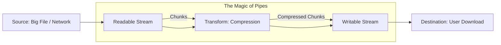

# 🌊 Streams & Buffer Manipulation: Handling Data like a Pro
> **Level:** Advanced | **Language:** Hinglish | **Goal:** Master the art of efficient data handling in Node.js, moving beyond simple "File Reads" to understand Buffers, Readable/Writable Streams, and Pipes for processing massive datasets in 2026.

---

## 🧭 1. Beginner-Friendly Hinglish Explanation
Backend mein jab hum data handle karte hain, toh do tareeke hote hain:

1. **The "Bucket" Method (Buffer):**
   - Maan lo aapko 1GB ki movie download karni hai. Aap pura 1GB pehle RAM mein load karte hain aur phir use dekhte hain. 
   - **Problem:** Agar aapke paas 500MB RAM hai, toh server crash ho jayega!

2. **The "Water Pipe" Method (Stream):**
   - Aap data ko "Chote-chote tukdon" (Chunks) mein receive karte hain. Jaise hi thoda data aata hai, aap use aage bhej dete hain. 
   - Ye bilkul "YouTube Streaming" ki tarah hai. Aapko puri video download hone ka intezar nahi karna padta.

**Streams** ka fayda ye hai ki aap 10GB ki file bhi sirf 10MB RAM use karke process kar sakte hain. Is module mein hum seekhenge ki kaise is "Paani ki dhaar" (Data flow) ko control karein.

---

## 🧠 2. Deep Technical Explanation
Node.js data handling is centered around **Buffers** and **Streams.**

### 1. The Buffer (Temporary Storage):
- A Buffer is a raw memory allocation (outside the V8 heap). 
- It stores binary data (0s and 1s). 
- **Use case:** When you need to manipulate binary data like image pixels or encrypted keys.

### 2. The 4 Types of Streams:
- **Readable:** Data comes out (e.g., `fs.createReadStream`).
- **Writable:** Data goes in (e.g., `fs.createWriteStream`).
- **Duplex:** Data can go in AND out (e.g., a TCP socket).
- **Transform:** Data is modified as it passes through (e.g., Compressing a file).

### 3. Piping (`.pipe()`):
- Connecting the output of one stream directly to the input of another. It handles **Backpressure** automatically.
- **Backpressure:** When the "Consumer" (Writable) is slower than the "Producer" (Readable), Node.js automatically pauses the producer so the buffer doesn't overflow.

---

## 🏗️ 3. Buffer vs. Stream Comparison
| Feature | Buffer (The Bucket) | Stream (The Pipe) |
| :--- | :--- | :--- |
| **Memory Usage** | High (Size of file) | **Low (Fixed size chunk)** |
| **Start Time** | Slow (Wait for full load) | **Instant (Start as data flows)** |
| **Max Data Size** | Limited by RAM | **Infinite** |
| **Complexity** | Simple | Advanced |

---

## 📐 4. Mathematical Intuition
- **The "Chunk" Equation:** 
  If you process a 10GB file in 64KB chunks:
  $$\text{Chunks} = \frac{10,000,000,000}{64,000} \approx 156,250 \text{ steps}$$
  Each step only uses **64KB** of RAM, meaning the total RAM usage is constant regardless of file size.

---

## 📊 5. The Streaming Pipeline (Diagram)


---

## 💻 6. Production-Ready Examples (Streaming a Large File to a User)
```typescript
// 2026 Pro-Tip: Never use fs.readFile for user downloads. Use Streams.

import fs from 'fs';
import express from 'express';
import zlib from 'zlib'; // For compression

const app = express();

app.get('/download-huge-log', (req, res) => {
    const fileName = './large-access-log.txt';
    
    // 1. Create a readable stream
    const readStream = fs.createReadStream(fileName);
    
    // 2. Set headers for file download
    res.setHeader('Content-Disposition', 'attachment; filename="log.txt.gz"');
    
    // 3. Pipe: Read -> Compress -> Send to Response
    readStream
        .pipe(zlib.createGzip()) // Transform Stream: Compressing on-the-fly
        .pipe(res);              // Writable Stream: The HTTP response
        
    readStream.on('error', (err) => {
        console.error("Stream Error! ❌", err);
        res.status(500).send("Internal Server Error");
    });
});

app.listen(3000);
```

---

## ❌ 7. Failure Cases
- **Memory Leak (Buffer):** Reading a 2GB user-uploaded file into a Buffer without checking the size. The server will crash instantly with "JavaScript heap out of memory."
- **Broken Pipes:** If the user cancels the download, the stream might keep "Producing" data, wasting CPU. **Fix: Listen for the 'close' event.**
- **Ignoring Backpressure:** Manually pushing data into a stream too fast. Node.js's `.pipe()` solves this, but if you do it manually, you must check the `return value` of `.write()`.

---

## 🛠️ 8. Debugging Guide
- **Symptom:** "The data is corrupted."
- **Check:** **Encoding**. Are you reading a binary file as 'utf8'? Use `null` encoding for binary data.
- **Symptom:** "The process is hanging."
- **Check:** **Stream Closing**. Did you forget to call `.end()` on your writable stream?

---

## ⚖️ 9. Tradeoffs
- **Complexity vs. Efficiency:** For a small 1KB config file, `fs.readFileSync` is fine and easier. For anything $>1$MB, use Streams.
- **Node.js Streams vs. Web Streams:** In 2026, Node.js supports both. Web Streams are better if you want to share code with the Frontend.

---

## 🛡️ 10. Security Concerns
- **Zip Bombs:** A hacker uploading a tiny file that "Explodes" into 100GB when unzipped via a Transform stream. **Fix: Limit the total bytes processed by the stream.**

---

## 📈 11. Scaling Challenges
- **Network Saturation:** If you stream 1000 files at once, you might hit the limit of your server's network card. Use **Cloudfront** or a **CDN** for streaming large assets.

---

## 💸 12. Cost Considerations
- **Egress Optimization:** Streaming and compressing data on-the-fly reduces the "Bandwidth" you pay for on AWS.

---

## ✅ 13. Best Practices
- **Always use `.pipe()` or `pipeline()` utility.** The `pipeline()` utility in the `stream` module is better as it handles errors automatically for all streams in the chain.
- **Buffer.alloc() vs Buffer.allocUnsafe():** Use `alloc()` as it's safer (it clears the memory). `allocUnsafe()` is faster but might contain "old data" from other processes (Security Risk!).

---

## ⚠️ 14. Common Mistakes
- **Using `+` to combine Buffers:** `buffer1 + buffer2` converts them to strings, which breaks binary data. Use **`Buffer.concat([b1, b2])`**.
- **Forgetting to handle errors on EACH stream** in a pipe.

---

## 📝 15. Interview Questions
1. **"What is 'Backpressure' and how does Node.js handle it?"**
2. **"Why are Streams better for memory management than Buffers?"**
3. **"Explain the difference between a Duplex and a Transform stream."**

---

## 🚀 15. Latest 2026 Industry Patterns
- **Async Iterators:** Using `for await (const chunk of stream)`—the modern 2026 way to read streams that is much cleaner than `.on('data')`.
- **Node.js Built-in Compression:** No more external libraries; Node.js now has ultra-fast native zlib and compression hooks.
- **Streaming AI Responses:** Using Streams to send "Partial" AI answers to the user (like ChatGPT) so they don't wait for the full paragraph.
